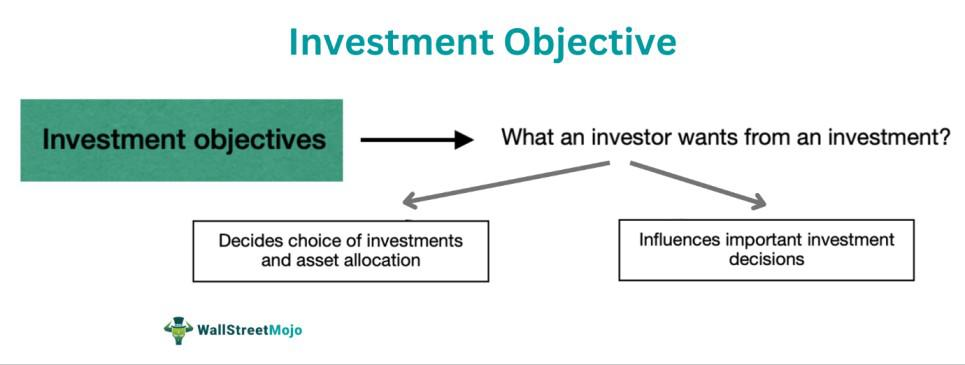

Investing and financial planning are essential components of personal and institutional wealth management. They serve as foundational pillars for achieving long-term financial security and growth. By systematically allocating resources and planning for future financial needs, individuals and organizations can enhance their ability to meet both immediate and long-term objectives. Effective investing enables wealth accumulation, while financial planning provides a structured framework to navigate the complexities of various economic scenarios. 

Investment objectives are specific, measurable goals that guide decision-making in the investment process. They define what an investor aims to achieve, such as capital preservation, income generation, or capital appreciation. Clear investment objectives provide direction and assist in selecting appropriate financial instruments that align with the investor's risk tolerance, time horizon, and financial aspirations.

Algorithmic trading, a dominant force in modern finance, involves using computer algorithms to execute trades at speeds and volumes that far surpass human capabilities. Its influence on financial markets has expanded significantly, offering new layers of efficiency and precision. Algorithmic trading leverages patterns and data-driven insights to optimize trade execution, thus playing an increasingly pivotal role in contemporary investing strategies.

The objectives of this article are to explore key investing strategies, understand the role of financial planning in setting and achieving investment objectives, and examine the impacts of algorithmic trading. By doing so, the article aims to provide insights into how these elements contribute collectively to successful wealth building.

Understanding these concepts is not only relevant for practical investment but also crucial from an SEO perspective. Knowledge of investing, financial planning, and algorithmic trading facilitates long-term engagement with financial content, thereby enhancing adaptability and awareness in the rapidly evolving financial landscape. This continuous interaction with financial knowledge contributes to informed decision-making, ultimately leading to strategic alignment and financial success.

## Table of Contents

## Understanding Investment Strategies

Investment strategies are essential frameworks or plans crafted to guide individuals or organizations towards achieving their financial goals. These strategies encompass decisions on asset selection, investment horizon, risk tolerance, and expected returns. The primary goal of developing an investment strategy is to optimize the balance between risk and reward in line with an individual’s or institution’s financial objectives.

### Types of Investment Strategies

Investment strategies can be broadly categorized into several types, each with distinct goals and methodologies:

1. **Value Investing**: This approach involves identifying and purchasing securities that are undervalued relative to their intrinsic value. Value investors seek out stocks with strong fundamentals, such as a low price-to-earnings (P/E) ratio or high dividend yield, believing that the market will eventually recognize the true worth of these assets. This strategy relies heavily on thorough financial analysis and patience, as correction in market valuation may not be immediate. 

2. **Growth Investing**: Focused on capital appreciation, growth investing targets companies expected to demonstrate above-average growth, often in terms of revenue or earnings. These firms typically reinvest profits to fuel further growth, meaning they usually do not offer high dividends. Growth investors prioritize companies with strong potential for future expansion, even if their current valuations are high relative to past performance.

3. **Income Investing**: Aimed at generating a steady stream of income, this strategy often includes investments in dividend-paying stocks, bonds, and real estate investment trusts (REITs). Income investors focus on assets that provide regular cash flows, favoring stability and predictability over significant capital gains. This strategy is particularly popular among retirees and those seeking financial security.

### Role of Diversification

Diversification is a fundamental principle in investment strategy that involves spreading investments across various asset classes, sectors, or geographic locations to reduce overall risk. By allocating resources among different types of investments, the negative performance of one asset may be counterbalanced by the positive performance of another. A well-diversified portfolio seeks to enhance returns while minimizing risks, following the modern portfolio theory, which suggests that risk can be mitigated through proper diversification.

### Selecting an Investment Strategy 

Selecting an appropriate investment strategy requires a thorough understanding of an individual's financial situation, goals, and risk tolerance. Here are key consideration factors:

- **Financial Goals**: Define whether the priority is capital growth, income generation, or capital preservation. This directly influences the type of strategy to adopt.
- **Time Horizon**: Longer investment periods typically allow for higher risk-taking, while shorter horizons might require a focus on preservation and liquidity.
- **Risk Tolerance**: Understanding one's comfort with market fluctuations is vital. Risk-averse investors might prefer income and value strategies, while risk-tolerant individuals may lean towards growth investing.

### Aligning Strategies with Market Conditions and Personal Risk Tolerance

Investment strategies must be adaptable to current market conditions and align with personal risk profiles. Market trends, economic indicators, and global financial conditions can significantly impact investment performance. Investors should continuously evaluate their strategies to ensure consistency with prevailing market dynamics and any personal changes in risk tolerance or financial objectives.

In conclusion, understanding and implementing the right investment strategies are pivotal for achieving one's financial goals. It involves careful consideration of various strategies like value, growth, and income investing, ensuring diversification, and aligning investments with individual goals and broader market conditions. With these foundations, investors can aspire to build robust portfolios capable of weathering market [volatility](/wiki/volatility-trading-strategies) while pursuing long-term financial success.

## The Role of Financial Planning

Financial planning serves as an essential tool in achieving investment objectives and securing one's financial future. It involves a comprehensive evaluation of an individual's current financial situation, goals, and strategies to achieve those goals. This process integrates aspects of budgeting, saving, and investment allocation to create a roadmap that guides financial decisions and actions.

**Components of Financial Planning**

A robust financial plan comprises several key components:

1. **Budgeting**: This forms the foundation of financial planning, encompassing the detailed structuring of income and expenses. A budget helps individuals live within their means and allocate funds for savings and investments. Effective budgeting ensures that spending aligns with financial goals, thus preventing debt accumulation and preparing for unforeseen expenses.

2. **Savings**: Establishing a savings plan is crucial for both short-term needs and long-term financial security. Savings can be categorized into emergency funds, which cover unexpected expenses, and investment funds, which involve setting aside money for future growth. An emergency fund typically ranges from 3 to 6 months’ worth of living expenses.

3. **Investment Allocation**: This involves distributing resources among various asset classes, such as stocks, bonds, and real estate, based on individual risk tolerance and financial objectives. Strategic allocation helps in optimizing returns while managing risk.

**Creating an Effective Financial Plan**

To formulate a successful financial plan, individuals can follow these steps:

- **Assess Financial Situation**: Evaluate current assets, liabilities, income, and expenses to understand the starting point.

- **Define Financial Goals**: Establish clear, measurable, and time-bound financial goals, such as retirement savings, buying a home, or funding education.

- **Develop a Budget**: Design a budget that balances income with expenses, prioritizing savings and debt repayment.

- **Build an Emergency Fund**: Save sufficient funds to cover unexpected expenses, ensuring financial stability.

- **Plan Investment Strategy**: Based on risk tolerance and time horizon, select appropriate investments to achieve growth objectives.

- **Monitor and Adjust**: Regularly review the financial plan and make adjustments as personal circumstances and financial markets evolve.

**Case Studies of Successful Financial Planning**

Successful financial planning often results in significant positive impacts on investment outcomes. For instance, a young professional who begins investing early and consistently, following a well-defined plan, can accumulate substantial wealth over time due to the power of compound interest. Another example is a retiree who utilizes diversified investment strategies to manage risk and ensure a steady income stream, thereby maintaining their lifestyle without depleting savings.

**Challenges in Financial Planning and Overcoming Them**

Financial planning is not without hurdles. Common challenges include:

- **Inflation**: Erodes purchasing power over time. To combat this, financial plans should incorporate investments that potentially outpace inflation.

- **Market Volatility**: Can impact investment values. Diversification and a long-term perspective are key strategies to manage volatility.

- **Changing Personal Circumstances**: Life events like job changes, health issues, or family needs can alter financial priorities. Regular plan reviews and flexibility allow for adjustments as needed.

- **Behavioral Biases**: Emotional decisions often derail financial plans. Discipline and adherence to a well-devised plan help in maintaining focus on long-term goals.

By integrating these components and strategies into financial planning, individuals can effectively navigate their financial trajectories, ensuring security and success in meeting future objectives.

## Setting Investment Objectives

Investment objectives serve as the cornerstone of any investment strategy, guiding financial decisions and ensuring alignment with broader financial goals. Clear investment objectives provide direction and purpose, establishing a framework for evaluating investment performance and progress.

**Definition and Importance**

Investment objectives are specific, measurable goals that an investor aims to achieve over a defined period. These objectives help define the purpose of investing and are crucial for selecting the appropriate assets and strategies. Clear objectives facilitate decision-making and provide a benchmark for assessing financial performance. Without explicit objectives, investors risk making impulsive decisions that could jeopardize their financial future.

**Common Types of Investment Objectives**

1. **Capital Preservation**: The primary goal is to safeguard the investment's principal amount and avoid losses. This objective is typically suited for risk-averse investors, such as retirees, who prioritize security over high returns.

2. **Income Generation**: Here, the focus is on generating a steady stream of income, typically through dividends, interest payments, or rental income. This objective is ideal for those seeking regular cash flow, like retirees or individuals supplementing their salary.

3. **Growth**: This objective aims for capital appreciation over time, prioritizing the increase of the investment's value. It is suitable for investors with a longer time horizon and a higher risk tolerance, as growth-oriented investments can be more volatile.

**Aligning Investment Objectives with Personal Goals and Timelines**

To align investment objectives with personal financial goals, investors should consider their risk tolerance, time horizon, and financial needs. For instance, a young professional with a high risk tolerance and a thirty-year time horizon may prioritize growth, while a retiree may focus on income generation and capital preservation. The alignment ensures that the chosen objectives support the desired financial outcomes and long-term life plans.

**Strategies for Regularly Reviewing and Adjusting Investment Objectives**

Regularly reviewing investment objectives is essential to ensure they remain relevant and aligned with any personal or market changes. Investors should:

- **Conduct Periodic Reviews**: Schedule regular evaluations of investment performance relative to objectives, considering any life changes that may impact financial needs or risk tolerance.

- **Adjust Objectives as Needed**: If there are significant shifts in personal circumstances or market conditions, adjust the objectives to stay aligned with new realities. This may involve rebalancing portfolios or revising the target return expectations.

**Tools and Resources for Tracking and Measuring Performance**

Several tools and resources help investors track and measure the performance of their investment objectives:

- **Portfolio Management Software**: These platforms offer insights into asset allocation, performance metrics, and risk assessment, allowing investors to monitor and adjust their strategies effectively.

- **Financial Advisors**: Engaging a financial advisor can provide personalized guidance on maintaining or revising investment objectives based on expert analysis and market trends.

- **Performance Benchmarks**: Using benchmarks such as stock indices or bond yields provides a reference point to evaluate investment performance. Regular comparison with these benchmarks facilitates objective assessment of progress toward stated goals.

In conclusion, setting clear investment objectives is a critical step in the financial planning process, helping to define an investor's path towards future financial security. By regularly reviewing and adjusting these objectives, and by using available tools for performance tracking, investors can foster a disciplined approach to achieving their financial aspirations.

## Exploring Algo Trading

Algorithmic trading, commonly known as algo trading, refers to the use of computer programs to execute trading strategies at speeds and frequencies that far surpass those of human traders. The concept of [algorithmic trading](/wiki/algorithmic-trading) began to take shape in the 1970s with the advent of electronic trading systems. However, it gained substantial traction in the late 1990s and early 2000s with the rise of high-frequency trading firms that utilized complex algorithms to execute a multitude of trades in fractions of a second.

The primary benefits of algorithmic trading include speed, accuracy, and reduced transaction costs. Algorithmic trading systems can scan multiple markets at lightning speeds, enabling them to seize [arbitrage](/wiki/arbitrage) opportunities and react to market events almost instantaneously. For instance, if a stock price briefly diverges from its actual value due to market inefficiencies, an algorithm can exploit this discrepancy before it self-corrects. The accuracy aspect stems from the reduction of human error—algorithms execute predetermined strategies without being influenced by emotion or fatigue, leading to more consistent execution.

There are several common algorithms used in trading, each designed to fulfill different objectives. The most popular include:

1. **Trend-following algorithms**: These capitalize on upward or downward market trends by using indicators such as moving averages to make buy or sell decisions. 

2. **Mean-reversion algorithms**: Based on the statistical premise that prices and returns eventually return to their historical average levels, these algorithms identify stocks that have deviated significantly from historical norms.

3. **Arbitrage algorithms**: These exploit price differentials in different markets or products. For example, if the same asset is priced differently on two exchanges, the algorithm can buy on the cheaper market and sell on the more expensive one simultaneously.

4. **Market-making algorithms**: These provide liquidity to the market by continuously buying and selling, earning a spread on the bid-ask price.

Despite its advantages, algorithmic trading presents several risks and challenges. Algorithms can amplify market volatility, as witnessed during the 2010 Flash Crash, when a massive sell algorithm significantly disrupted US stock markets. Technical failures or poorly designed algorithms can result in substantial financial losses. Moreover, algorithmic trading can exacerbate market fragmentation, making it difficult for regulators to monitor.

To mitigate these risks, traders often implement rigorous [backtesting](/wiki/backtesting) to ensure that algorithms perform well under various market conditions. Risk management strategies, like dynamic hedging and circuit breakers, are designed to contain potential losses. Furthermore, the continued evolution of compliance technology aims to detect and prevent unethical trading behavior.

Looking ahead, the future of algorithmic trading is intertwined with advancements in [artificial intelligence](/wiki/ai-artificial-intelligence) (AI) and [machine learning](/wiki/machine-learning) (ML). These technologies promise to enhance the sophistication of trading algorithms, enabling them to incorporate unstructured data from social media and news sources into their decision-making processes. Institutional and individual investors could see a shift towards more personalized trading strategies developed by AI, tailoring investment decisions to specific risk appetites and financial goals. As these technologies evolve, the lines between human discretion and machine autonomy will continue to blur, reshaping the landscape of financial markets.

## Integrating Strategies, Planning, Objectives, and Algo Trading

Integrating investment strategies, financial planning, objectives, and algorithmic trading involves leveraging the strengths of each component to create a comprehensive approach to investing. This synergy is essential for optimizing investment outcomes and adapting to the evolving financial landscape.

Effective integration requires understanding how each component can complement the others. Investment strategies provide the overarching framework for making asset allocation decisions, while financial planning ensures these strategies align with personal financial goals and timelines. Algorithmic trading introduces precision and efficiency in executing trades, reducing human error and taking advantage of market opportunities.

**Ways to Synergize Investment Strategies, Financial Planning, and Algorithmic Trading**

1. **Coherent Framework Development**: Start by ensuring that investment strategies and financial plans are aligned. This means setting clear investment objectives that are both ambitious and realistic. Algorithmic trading models can then be designed to execute strategies that adhere to these objectives, utilizing market data to make informed decisions.

2. **Risk Management through Diversification**: Use diversification strategies in conjunction with algorithmic trading to manage risk effectively. Algorithms can be programmed to carry out diversified investment strategies across various asset classes, thereby minimizing specific risks while optimizing returns.

3. **Optimization of Investment Portfolios**: Algorithms can continuously assess and rebalance portfolios based on market conditions and investment objectives. This dynamic rebalancing helps maintain alignment with financial goals while intelligently responding to market changes.

**Case Studies of Successful Integration**

Some notable investors have successfully integrated these elements to enhance their investment outcomes. For instance, quantitative hedge funds such as Renaissance Technologies have effectively combined investment strategies, meticulous financial planning, and algorithmic trading to achieve consistently high returns. Their success lies in their ability to implement complex algorithms that execute predefined strategies flawlessly, backed by robust financial planning and goal setting.

**Balancing Automation and Human Oversight**

While automation through algorithmic trading offers speed and precision, human oversight remains crucial. A balanced approach involves using algorithms for analytical and execution purposes but relying on human judgment for strategy formulation, risk assessment, and adaptive decision-making. Regular reviews and adjustments, informed by human insights, ensure the system remains aligned with changing objectives and market conditions.

**Potential Pitfalls and How to Avoid Them**

1. **Over-Reliance on Algorithms**: Sole reliance on algorithms can lead to systemic risks, especially if the underlying data or models are flawed. Ensure robust validation and testing of models, while maintaining human oversight.

2. **Lack of Flexibility**: Rigid adherence to a predefined strategy may limit the ability to adapt to market changes. Periodic review of strategies and objectives can provide the necessary flexibility.

3. **Ignoring Market Fundamentals**: Algorithms may focus solely on technical indicators without considering macroeconomic factors. Combining quantitative models with qualitative insights can provide a more comprehensive view.

**Continuous Learning and Adaptation**

The financial landscape is ever-changing, requiring investors to continuously learn and adapt. This involves staying updated on market trends, technological advancements, and new financial products. Engaging with a community of like-minded individuals and professionals can provide insights and foster the development of innovative strategies. Continuous education and adaptability ensure that the synergy between investment strategies, financial planning, objectives, and algorithmic trading remains effective over time.

## Conclusion

In closing, strategic investing, sound financial planning, and clear investment objectives are fundamental pillars in achieving financial success. They not only provide direction and purpose but also serve as a shield against market volatilities. Leveraging algorithmic trading further enhances this framework by adding precision and speed to investment executions, optimizing portfolios, and elevating the potential for returns.

Continuous education in financial trends and tools is crucial. The financial landscape is ever-evolving, driven by technology, regulatory changes, and global economic shifts. Being informed enables investors to adapt their strategies effectively and make decisions that are grounded in the latest market realities. This adaptive approach is essential for maintaining and growing wealth over time.

Achieving financial success lies in the alignment of informed decision-making and strategic frameworks. This involves setting clear objectives, executing well-thought-out plans, and using advanced trading algorithms wisely. By reassessing and fine-tuning investment strategies and plans, investors can ensure they remain aligned with their long-term financial goals.

As a call to action, readers are encouraged to evaluate their current investment strategies and financial planning efforts. By doing so, they can identify areas of improvement and alignment with evolving financial landscapes, reinforcing their wealth-building journey.

In terms of SEO, continuous engagement with financial content is vital for enhancing awareness and adaptability. By regularly interacting with informative and up-to-date financial material, readers can maintain a proactive approach to investing, ultimately fostering resilience and success in the dynamic world of finance.

## References & Further Reading

[1]: ["Quantitative Trading: How to Build Your Own Algorithmic Trading Business"](https://www.amazon.com/Quantitative-Trading-Build-Algorithmic-Business/dp/0470284889) by Ernest P. Chan

[2]: ["Advances in Financial Machine Learning"](https://www.amazon.com/Advances-Financial-Machine-Learning-Marcos/dp/1119482089) by Marcos Lopez de Prado

[3]: ["Evidence-Based Technical Analysis: Applying the Scientific Method and Statistical Inference to Trading Signals"](https://www.amazon.com/Evidence-Based-Technical-Analysis-Scientific-Statistical/dp/0470008741) by David Aronson

[4]: ["Machine Learning for Algorithmic Trading"](https://github.com/stefan-jansen/machine-learning-for-trading) by Stefan Jansen

[5]: Bergstra, J., Bardenet, R., Bengio, Y., & Kégl, B. (2011). ["Algorithms for Hyper-Parameter Optimization."](https://dl.acm.org/doi/10.5555/2986459.2986743) Advances in Neural Information Processing Systems 24.