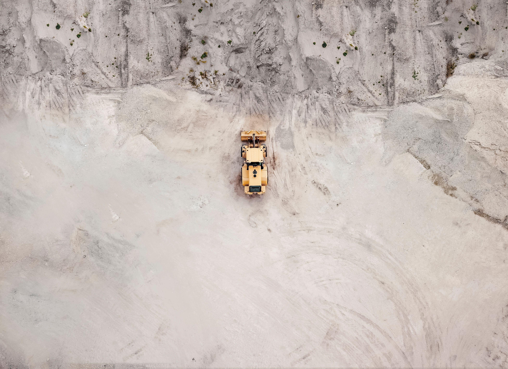

## Table of Contents

## What is the basic materials sector?

The basic materials sector includes companies that find, develop, and process raw materials. These raw materials are used to make many things we use every day. This sector is very important because it provides the building blocks for products in other industries like manufacturing and construction.

Some examples of basic materials are metals like iron and copper, chemicals, and natural resources like oil and gas. Companies in this sector might mine for minerals, drill for oil, or produce chemicals. The work they do is essential for making things like cars, buildings, and plastics.

The basic materials sector can be affected by many things, like the economy and new technology. When the economy is doing well, there is more demand for these materials. But when the economy is not doing well, the demand can go down. Also, new technology can change how these materials are found and used, which can impact the sector.

## What are the main categories within the basic materials sector?

The basic materials sector is divided into three main categories: metals and mining, chemicals, and forestry and paper. Metals and mining companies focus on finding and extracting metals like gold, silver, copper, and iron from the earth. These metals are important for making things like cars, buildings, and electronics. Mining companies also look for other minerals that are used in different industries.

The chemicals category includes companies that make chemicals used in many products. These chemicals can be used in things like cleaning supplies, plastics, and medicines. Companies in this category work on creating new chemicals and improving how they are made. The forestry and paper category involves companies that manage forests and produce paper products. They cut down trees, process the wood, and turn it into paper and other wood products like furniture and building materials.

## Why is the basic materials sector important to the economy?

The basic materials sector is very important to the economy because it provides the raw materials that are needed to make many things. Without metals, chemicals, and other basic materials, we wouldn't be able to build cars, make medicines, or construct buildings. This sector helps other industries grow by giving them the materials they need. When the basic materials sector does well, it can help the whole economy do well because it supports so many other businesses.

The basic materials sector also creates a lot of jobs. People work in mines, chemical plants, and forests to find and process these materials. This means that a strong basic materials sector can help lower unemployment and give people good jobs. Plus, when these companies make money, they pay taxes, which helps the government fund important things like schools and roads. So, the basic materials sector is a key part of keeping the economy strong and healthy.

## What are some common products derived from the basic materials sector?

Many things we use every day come from the basic materials sector. For example, metals like iron and copper are used to make cars, appliances, and electronics. Iron is important for building things like bridges and skyscrapers. Copper is used in wires that [carry](/wiki/carry-trading) electricity. Without these metals, we wouldn't have many of the things that make our lives easier and more comfortable.

Chemicals from this sector are also very important. They are used to make cleaning products that keep our homes and workplaces clean. Chemicals are also used to make plastics, which are in everything from toys to bottles. Another big use of chemicals is in medicines, which help us stay healthy. Without chemicals, we wouldn't have many of the products that we rely on every day.

Lastly, the forestry and paper part of the basic materials sector gives us paper and wood products. Paper is used for [books](/wiki/algo-trading-books), newspapers, and packaging. Wood is used to make furniture, houses, and other buildings. These products are important for our daily lives and help us live, work, and learn.

## How does the basic materials sector impact the environment?

The basic materials sector can have a big impact on the environment. When companies mine for metals or drill for oil, they can harm the land and water. Mining can create big holes in the ground and leave waste that can pollute rivers and lakes. Drilling for oil can lead to spills that hurt wildlife and make it hard for plants to grow. Also, when trees are cut down for paper and wood, it can harm forests and the animals that live there.

But, the basic materials sector is also working to be more friendly to the environment. Many companies are trying to find new ways to mine and drill that cause less harm. They are also looking for ways to use less energy and make less pollution. Some companies are even trying to use more recycled materials instead of always using new ones. By doing these things, the basic materials sector can help protect the environment while still giving us the materials we need.

## What are the major companies involved in the basic materials sector?

Some big companies in the metals and mining part of the basic materials sector are BHP Group and Rio Tinto. BHP Group is a huge company that mines for things like iron, copper, and coal all over the world. Rio Tinto is also very big and mines for metals like aluminum and copper. These companies help give us the metals we need for cars, buildings, and electronics.

In the chemicals part, companies like Dow Inc. and BASF SE are very important. Dow Inc. makes a lot of different chemicals that are used in things like plastics, cleaning products, and medicines. BASF SE is another big company that makes chemicals for many industries, including farming and building. These companies help make many of the products we use every day.

For the forestry and paper part, companies like International Paper and Weyerhaeuser are major players. International Paper makes a lot of paper products that we use for packaging and printing. Weyerhaeuser manages forests and makes wood products like lumber for building houses and furniture. These companies help us have paper and wood for many things we need.

## How do global economic conditions affect the basic materials sector?

Global economic conditions can really change how the basic materials sector does. When the world economy is doing well, people and companies want to buy more things. This means they need more metals, chemicals, and other materials to make those things. So, the basic materials sector can grow and make more money. But, if the economy is not doing well, people and companies might not want to buy as much. This can make the demand for basic materials go down, and the sector might not do as well.

Another thing that affects the basic materials sector is the price of things like oil and metals. When the economy is strong, the prices for these materials can go up because more people want them. This can be good for companies in the basic materials sector because they can make more money. But, if the economy is weak, the prices can go down, and it can be harder for these companies to make a profit. So, the basic materials sector is always watching what is happening with the global economy to know how to plan and do business.

## What are the key trends influencing the basic materials sector today?

One big trend in the basic materials sector today is a focus on being more friendly to the environment. Companies are trying to find new ways to mine, drill, and make chemicals that cause less harm to the earth. They are using more recycled materials and trying to use less energy. This is important because people and governments want businesses to be more responsible about the environment. By doing these things, companies in the basic materials sector can help protect the planet while still giving us the materials we need.

Another trend is the use of new technology. Technology is helping companies find and use basic materials in better ways. For example, new machines and computers can help miners find minerals more easily and safely. Also, technology is helping to make chemicals in new ways that can be better for the environment. This can help the basic materials sector grow and be more efficient. As technology keeps getting better, it will keep changing how this sector works.

Lastly, global trade and economic conditions are always important for the basic materials sector. When the world economy is doing well, there is more demand for metals, chemicals, and other materials. But if the economy is not doing well, the demand can go down. Also, things like trade agreements and tariffs can change how easy it is for companies to sell their materials in different countries. So, companies in the basic materials sector need to keep an eye on what is happening around the world to know how to plan and do business.

## How does technology impact operations within the basic materials sector?

Technology is changing how the basic materials sector works. It helps companies find and get basic materials like metals and minerals more easily and safely. For example, new machines and computers can look deep into the earth to find where the materials are. This means companies can mine in a smarter way and waste less time and money. Technology also helps with making chemicals. New ways of making chemicals can be better for the environment and use less energy. This is important because people want companies to be more careful about the earth.

Also, technology helps companies in the basic materials sector keep track of their work and make better decisions. They can use computers to see how much they are making and selling, and figure out the best ways to do things. This can help them make more money and be more efficient. As technology keeps getting better, it will keep changing how the basic materials sector works. Companies need to keep up with these changes to stay strong and do well.

## What are the challenges faced by companies in the basic materials sector?

Companies in the basic materials sector face many challenges. One big challenge is the cost of getting the materials. It can be expensive to mine for metals or drill for oil because they need a lot of machines and workers. Also, the prices of these materials can go up and down a lot. When prices are low, it can be hard for companies to make money. Another challenge is the rules and laws they have to follow. Governments make rules to protect the environment and workers, and these rules can make it harder and more expensive for companies to do their work.

Another challenge is the competition. There are many companies trying to find and sell the same materials, so they have to work hard to be the best. They need to find new ways to do things better and cheaper than other companies. Also, technology is always changing, and companies need to keep up with these changes to stay strong. If they don't use new technology, they might not be able to find materials as easily or make chemicals as well as other companies.

Lastly, the basic materials sector can be affected by what is happening in the world. If the economy is not doing well, people might not want to buy as many things made from these materials. Also, things like trade agreements and tariffs can change how easy it is for companies to sell their materials in different countries. So, companies need to watch what is happening around the world and be ready to change how they do business.

## How can investors analyze the performance of companies in the basic materials sector?

Investors can analyze the performance of companies in the basic materials sector by looking at their financial statements. They should check the company's income statement to see how much money it is making and spending. The balance sheet will show how much the company owns and owes, which can tell investors if the company is in good financial health. Also, the cash flow statement can show how well the company is managing its money. By looking at these financial reports, investors can see if the company is making a profit and if it has enough money to keep growing.

Another way to analyze the performance of these companies is by looking at key performance indicators (KPIs). For example, investors can look at the company's production levels to see if it is making more or less of its products over time. They can also check the cost of production to see if the company is getting better at making things cheaper. Another important KPI is the price of the materials the company sells. If the prices are going up, it can be good for the company, but if they are going down, it might be harder to make a profit. By watching these KPIs, investors can get a good idea of how well the company is doing and make smarter choices about where to put their money.

## What future developments are anticipated in the basic materials sector?

In the future, the basic materials sector is expected to focus more on being friendly to the environment. Companies will likely use more recycled materials and try to make less pollution. They might use new ways to mine and drill that cause less harm to the earth. This is important because people and governments want businesses to be more careful about the environment. By doing these things, companies in the basic materials sector can help protect the planet while still giving us the materials we need.

Technology will also play a big role in the future of the basic materials sector. New machines and computers will help companies find and use materials in better ways. For example, they might use robots to mine minerals more safely and efficiently. Also, new technology can help make chemicals in ways that use less energy and are better for the environment. As technology keeps getting better, it will keep changing how this sector works. Companies that use these new technologies will be able to stay strong and do well.

Global economic conditions will continue to affect the basic materials sector. When the world economy is doing well, there will be more demand for metals, chemicals, and other materials. But if the economy is not doing well, the demand might go down. Also, things like trade agreements and tariffs can change how easy it is for companies to sell their materials in different countries. So, companies in the basic materials sector need to keep an eye on what is happening around the world and be ready to change how they do business to stay successful.

## References & Further Reading

[1]: Bergstra, J., Bardenet, R., Bengio, Y., & Kégl, B. (2011). ["Algorithms for Hyper-Parameter Optimization."](https://dl.acm.org/doi/10.5555/2986459.2986743) Advances in Neural Information Processing Systems 24.

[2]: ["Advances in Financial Machine Learning"](https://www.amazon.com/Advances-Financial-Machine-Learning-Marcos/dp/1119482089) by Marcos Lopez de Prado

[3]: ["Evidence-Based Technical Analysis: Applying the Scientific Method and Statistical Inference to Trading Signals"](https://www.amazon.com/Evidence-Based-Technical-Analysis-Scientific-Statistical/dp/0470008741) by David Aronson

[4]: ["Machine Learning for Algorithmic Trading"](https://github.com/stefan-jansen/machine-learning-for-trading) by Stefan Jansen

[5]: ["Quantitative Trading: How to Build Your Own Algorithmic Trading Business"](https://www.amazon.com/Quantitative-Trading-Build-Algorithmic-Business/dp/1119800064) by Ernest P. Chan