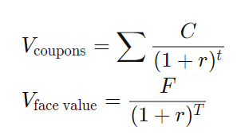

## Table of Contents

## What is a fixed-coupon corporate bond?

A fixed-coupon corporate bond is a type of bond issued by a company where the interest rate, or coupon, stays the same throughout the life of the bond. When you buy this bond, you know exactly how much interest you will earn each year until the bond matures. This makes it easier for you to plan your finances because the payments are predictable.

For example, if you buy a bond with a face value of $1,000 and a fixed coupon rate of 5%, you will receive $50 every year until the bond reaches its maturity date. At that point, you will get your $1,000 back. Companies issue these bonds to raise money for their business, and investors buy them as a way to earn a steady income.

## How does the coupon rate affect the bond's value?

The coupon rate of a bond is like the interest rate you get for lending your money to the company. If the coupon rate is higher than what other similar bonds are offering, then your bond becomes more valuable. People will want to buy it because they can earn more money from the interest payments. On the other hand, if the coupon rate is lower than what other bonds are offering, your bond might not be as valuable because people can find better deals elsewhere.

When interest rates in the economy change, the value of your bond can also change. If interest rates go up, new bonds will be issued with higher coupon rates, making your bond with a lower coupon rate less attractive. So, the price of your bond might go down because people would rather buy the new bonds with higher interest payments. But if interest rates go down, your bond with a higher coupon rate becomes more attractive, and its price might go up because people want to lock in that higher [interest rate](/wiki/interest-rate-trading-strategies).

## What is the face value of a bond and how is it related to its coupon payments?

The face value of a bond is the amount of money you get back when the bond reaches its maturity date. It's also called the par value or the nominal value. If you buy a bond with a face value of $1,000, you will receive $1,000 when the bond matures. The face value is important because it helps you understand how much money you will get back at the end.

The coupon payments of a bond are the interest payments you receive periodically, usually every year or every six months. The amount of these payments is based on the coupon rate and the face value of the bond. For example, if a bond has a face value of $1,000 and a coupon rate of 5%, you will receive $50 every year ($1,000 x 0.05 = $50). So, the face value is directly related to the coupon payments because it's used to calculate how much interest you get.

## How do you calculate the yield to maturity of a fixed-coupon bond?

The yield to maturity (YTM) of a fixed-coupon bond is the total interest rate you earn if you hold the bond until it matures. It takes into account the bond's current market price, its face value, the coupon payments you receive, and how long you have to wait until the bond matures. To calculate it, you need to find the interest rate that makes the present value of all future cash flows from the bond equal to its current market price.

You can use a financial calculator or a spreadsheet to find the YTM. If you want to do it by hand, you can use a trial-and-error method. Start with a guess for the YTM, then calculate the present value of the bond's cash flows using that rate. If the present value is higher than the bond's current market price, your guess is too low, so try a higher rate. If the present value is lower than the market price, your guess is too high, so try a lower rate. Keep adjusting until the present value matches the market price. This process can be a bit tricky, but it helps you understand how the bond's price, coupon payments, and time to maturity all work together to determine the yield you earn.

## What is the difference between the coupon rate and the yield to maturity?

The coupon rate of a bond is the interest rate that the bond pays each year based on its face value. For example, if a bond has a face value of $1,000 and a coupon rate of 5%, you will get $50 every year. This rate stays the same for the life of the bond. It tells you how much money you will earn from the bond's interest payments.

The yield to maturity (YTM) is different because it's the total return you can expect if you hold the bond until it matures. It takes into account not just the coupon payments but also the bond's current market price and how long you have to wait until you get your money back. If you buy a bond at a price different from its face value, the YTM will be different from the coupon rate. For example, if you buy the same $1,000 bond for $900, the YTM will be higher than the 5% coupon rate because you are getting the same $50 payments but for a lower price.

## How does the bond's duration impact its sensitivity to interest rate changes?

The duration of a bond tells you how sensitive it is to changes in interest rates. It's like a measure of how long it takes for you to get back the money you put into the bond, taking into account the interest payments you get along the way. If a bond has a longer duration, it means it will be more affected by changes in interest rates. When interest rates go up, the price of a bond with a longer duration will drop more than a bond with a shorter duration. On the other hand, if interest rates go down, the price of a long-duration bond will go up more.

This happens because when interest rates change, new bonds come out with different coupon rates. If rates go up, new bonds will have higher coupons, making your old bond with a lower coupon less attractive. People will want to buy the new bonds instead, so the price of your bond goes down. But if rates go down, your bond with a higher coupon looks better compared to the new bonds with lower coupons, so its price goes up. The longer the duration of your bond, the more time there is for these changes to affect its value, making it more sensitive to interest rate changes.

## What is the role of credit ratings in assessing the risk of fixed-coupon corporate bonds?

Credit ratings play a big role in helping you understand how risky a fixed-coupon corporate bond is. They are like a report card for the company that issued the bond. Agencies like Moody's, Standard & Poor's, and Fitch give these ratings based on how likely they think the company is to pay back the money it borrowed. A high credit rating means the company is seen as safe and likely to make all its payments on time. A low credit rating means there's a bigger chance the company might struggle to pay back what it owes.

When you're thinking about buying a bond, the credit rating helps you decide if it's worth the risk. Bonds with higher credit ratings usually offer lower interest rates because they're safer. On the other hand, bonds with lower credit ratings have to offer higher interest rates to attract investors, because people want more reward for taking on more risk. So, by looking at the credit rating, you can get a good idea of how safe your investment might be and what kind of return you can expect.

## How do you calculate the present value of future cash flows from a fixed-coupon bond?

To calculate the present value of future cash flows from a fixed-coupon bond, you need to figure out how much all the money you will get in the future is worth right now. This involves using a discount rate, which is like the interest rate you could earn if you put your money somewhere else. You take each of the bond's future coupon payments and the final payment you get when the bond matures, and you discount them back to today's value using this rate. The formula for the present value of a single cash flow is: Present Value = Future Cash Flow / (1 + Discount Rate)^Number of Periods. You do this for each payment and then add them all up to get the total present value of the bond.

For example, if you have a bond with a face value of $1,000, a coupon rate of 5%, and it matures in 3 years, you would get $50 every year for 3 years and then $1,000 at the end. If the discount rate is 4%, you would calculate the present value of each $50 payment and the $1,000 payment. The present value of the first $50 payment would be $50 / (1 + 0.04)^1 = $48.08. The second $50 payment would be $50 / (1 + 0.04)^2 = $46.23. The third $50 payment would be $50 / (1 + 0.04)^3 = $44.45. The present value of the $1,000 payment at the end would be $1,000 / (1 + 0.04)^3 = $873.44. Adding these up gives you a total present value of $48.08 + $46.23 + $44.45 + $873.44 = $1,012.20. This means that if you could buy this bond for less than $1,012.20, it would be a good deal based on a 4% discount rate.

## What are the tax implications of investing in fixed-coupon corporate bonds?

When you invest in fixed-coupon corporate bonds, you need to think about how taxes will affect your earnings. The interest you get from these bonds is usually taxed as regular income. This means you'll pay taxes on the interest every year at your normal income tax rate. If you're in a high tax bracket, this could mean a big part of your interest goes to taxes. But if you're in a lower tax bracket, the tax impact might not be as big.

Sometimes, you can buy the bond at a price lower than its face value, which is called buying at a discount. When the bond matures and you get the full face value, the difference between what you paid and the face value is also taxed. This part is usually taxed as capital gains, which might be at a different rate than your income tax. So, it's good to know about these different tax rules when you're thinking about investing in fixed-coupon corporate bonds.

## How do market interest rates influence the price of fixed-coupon bonds?

Market interest rates have a big impact on the price of fixed-coupon bonds. When market interest rates go up, new bonds come out with higher coupon rates. This makes your old bond with a lower coupon rate less attractive to buyers because they can get better deals with the new bonds. So, the price of your bond goes down because people are not willing to pay as much for it. On the other hand, when market interest rates go down, new bonds have lower coupon rates. Your bond with a higher coupon rate looks better compared to these new bonds, so its price goes up because more people want to buy it.

The reason this happens is because bond prices and interest rates move in opposite directions. When interest rates rise, the value of existing bonds falls because their fixed coupon payments are less competitive. When interest rates fall, the value of existing bonds rises because their fixed coupon payments are more attractive. This relationship is important for investors to understand because it affects how much they might be able to sell their bonds for if they need to get their money out before the bond matures.

## What are the key considerations when comparing fixed-coupon bonds from different issuers?

When comparing fixed-coupon bonds from different issuers, one of the first things to look at is the credit rating of the issuers. The credit rating tells you how likely the company is to pay back the money it borrowed. A high credit rating means the bond is safer, but it might offer a lower interest rate. A lower credit rating means the bond is riskier, but it might offer a higher interest rate to make up for that risk. So, you have to decide how much risk you're willing to take and what kind of return you want.

Another important thing to consider is the bond's yield to maturity (YTM). The YTM is the total return you can expect if you hold the bond until it matures. It takes into account the bond's current market price, the coupon payments, and how long you have to wait until you get your money back. If you're comparing two bonds with the same coupon rate but different prices, the one with the lower price will have a higher YTM. This means you could earn more money from it, but you also need to think about the credit rating and how long you're willing to wait for your money.

Lastly, think about the bond's duration and how it might be affected by changes in market interest rates. Bonds with longer durations are more sensitive to interest rate changes. If you think interest rates might go up, you might want to avoid bonds with longer durations because their prices could drop more. But if you think rates will stay the same or go down, a bond with a longer duration might be a good choice because it could offer a higher return. So, understanding these factors can help you pick the best bond for your needs.

## How can advanced valuation models, like the binomial model, be applied to price fixed-coupon corporate bonds?

The binomial model is a way to figure out how much a fixed-coupon corporate bond might be worth. It works by breaking down the time until the bond matures into smaller steps, kind of like a ladder. At each step, the model says the interest rate can go up or down. By looking at all the possible paths the interest rate might take, the model can calculate the value of the bond at the end of each step. Then, it works backward to find out what the bond is worth right now. This method is good because it can handle things like changes in interest rates and the risk that the company might not pay back the bond, which is called credit risk.

Using the binomial model, you start by guessing where interest rates might go in the future. You make a tree that shows all the possible ways interest rates could change, with each branch representing a different path. For each path, you figure out the bond's value at the end by adding up all the coupon payments and the face value you get when the bond matures. Then, you work your way back to the start of the tree, figuring out what the bond is worth at each step by looking at the values of the next steps. By the time you get back to the beginning, you have a good idea of what the bond is worth right now, taking into account all the possible changes in interest rates and the risk of the company not paying back the bond.

## What is the Mathematics Behind Fixed-Coupon Corporate Bonds?

Understanding the mathematics of fixed-coupon corporate bonds is crucial for investors aiming to assess bond value and associated risks accurately. Several key metrics are used to evaluate these securities, including current yield, yield to maturity, and duration.

**Current Yield** is a measure that reflects the return on a bond as a percentage of the current market price, rather than its face value. This metric provides a snapshot of the income generated relative to the bond's price, offering a basis for comparisons of different bonds in terms of income generation. The formula for current yield is:

$$
\text{Current Yield} = \frac{\text{Annual Coupon Payment}}{\text{Current Market Price}}
$$

This metric helps investors understand the income they can expect relative to the market's valuation of the bond at any given time.

**Yield to Maturity (YTM)** offers a more comprehensive view of a bond's potential profitability, accounting for price fluctuations throughout the bond's lifecycle. It considers the total expected return if the bond is held until maturity, integrating all future coupon payments along with the difference between the bond's current market price and its face value. The formula is more complex and typically solved using iterative methods, as it equates the present value of future cash flows to the bond's price:

$$
\text{Price} = \sum_{t=1}^{n} \frac{C}{(1+\text{YTM})^t} + \frac{F}{(1+\text{YTM})^n}
$$

where $C$ is the annual coupon payment, $F$ is the face value, $n$ is the number of years to maturity, and $t$ is the time period.

**Duration** measures a bond's sensitivity to changes in interest rates, indicating how the bond's price is expected to move with rate fluctuations. The concept of duration goes beyond the simple calculation of the weighted average time of cash flows, providing insights into interest rate risk. Macaulay Duration is a common measure expressed as:

$$
\text{Duration} = \frac{\sum_{t=1}^{n} \frac{t \cdot CF_{t}}{(1 + y)^t}}{\text{Price}}
$$

where $CF_{t}$ is the cash flow in period $t$, and $y$ is the yield to maturity. Duration helps investors understand the potential volatility of a bond in response to interest rate changes, enabling better risk management.

These tools and metrics are essential for investors and analysts seeking to navigate the fixed income market efficiently, allowing for the valuation and risk assessment necessary to make informed investment decisions.

## References & Further Reading

- Bank for International Settlements. (2016). "Electronic trading in fixed income markets." Retrieved from [bis.org](https://www.bis.org) - This document discusses how electronic trading platforms have transformed the landscape of fixed income markets, offering insights into the implications for market structure and dynamics.

- Cartea, Á., Jaimungal, S., & Penalva, J. (2015). "Algorithmic and High-Frequency Trading." Cambridge University Press. This book provides an in-depth analysis of algorithmic trading strategies, including mathematical models used to optimize trading decisions in high-frequency environments.

- Tuckman, B., & Serrat, A. (2011). "Fixed Income Securities: Tools for Today's Markets." Wiley. A comprehensive guide to fixed income securities, this resource covers the fundamental principles of pricing, valuing, and managing risks associated with corporate bonds.

- Litterman, R., & Scheinkman, J. (1991). "Common Factors Affecting Bond Returns." The Journal of Fixed Income. This paper explores the various factors that influence bond returns, providing a framework for understanding market behavior and risk assessment in fixed-income investing.

- Guéant, O. (2016). "The Financial Mathematics of Market Liquidity: From Optimal Execution to Market Making." CRC Press. Focused on the mathematical underpinnings of market liquidity, this book highlights algorithms for optimal trading execution and market-making strategies, pertinent to understanding algorithmic trading's role in enhancing bond market efficiencies.

