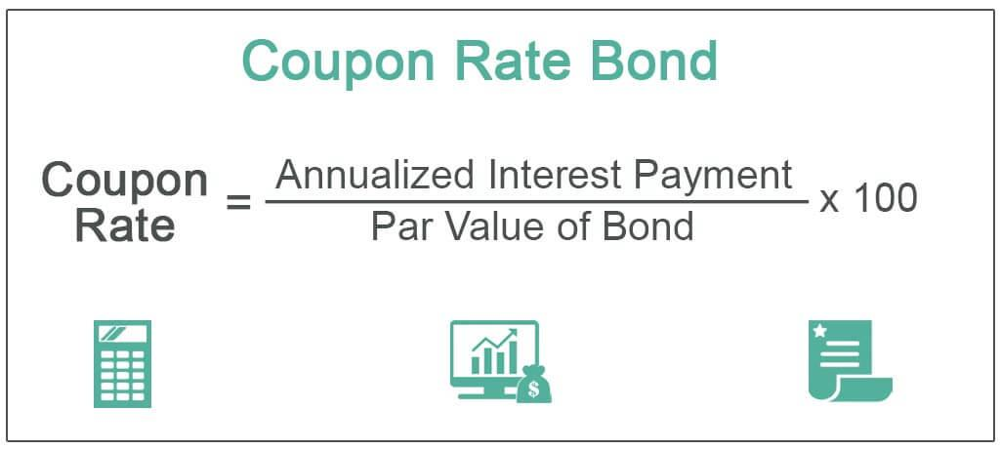

Corporate bonds have established themselves as integral components of diversified investment portfolios, offering fixed-coupon returns that provide investors with predictable income streams. These debt obligations are issued by corporations seeking to raise capital for a variety of purposes, including expansion, operational funding, or refinancing existing debts. By purchasing these bonds, investors effectively lend money to the corporation, receiving interest payments at stipulated intervals, typically semi-annually, until the bond reaches maturity. At that point, the principal amount is returned to the investor.

The landscape of corporate bond trading has been notably transformed by the emergence of algorithmic trading. This approach utilizes sophisticated algorithms to analyze market data and execute trades at speeds and volumes beyond human capacity. By integrating algorithmic trading into fixed-income markets, traditional methodologies have been significantly altered, leading to enhancements in efficiency, transparency, and execution accuracy. This technological integration has not only revolutionized trading practices but has also facilitated access to global bond markets, enabling real-time analysis and seamless transactions across diverse platforms.



In the following sections, this article will explore the essential features and mathematical underpinnings of corporate bonds, followed by an examination of how algorithmic trading is reshaping bond markets. Understanding these dynamics is crucial for appreciating the strategic advantages and challenges that this technological advancement brings to the world of fixed-income investments.

## Table of Contents

## Understanding Fixed Income Corporate Bonds

Fixed income corporate bonds are financial instruments through which corporations raise capital by issuing debt to investors. These securities provide fixed interest payments, known as coupons, at predetermined intervals, typically semi-annually or annually. Upon reaching the bond's maturity date, the corporation promises to return the bond's face value, or principal, to the bondholder. This predictable income stream and the assurance of principal repayment render corporate bonds an integral part of a diversified investment portfolio.

A critical aspect of understanding corporate bonds is their credit ratings, which are essential in assessing the risk associated with the investment. These ratings are provided by established credit rating agencies, such as Moody's Investors Service and S&P Global Ratings. Agencies evaluate a corporation's financial health and ability to fulfill its debt obligations, assigning grades that range from high-grade, low-risk categories (such as AAA or AA) to higher-risk categories (such as BB or below). Consequently, a bond's credit rating significantly influences its interest rates; lower-rated bonds yield higher interest to compensate for the increased risk perceived by investors.

In addition to credit ratings, corporate bonds exhibit additional key characteristics such as maturity date, yield, and price, which together determine the bond’s total return. The maturity date defines the length of time the bondholder will receive interest payments before the principal is repaid. Yield, which may take the form of current yield or yield to maturity, represents the return on investment. Furthermore, a bond's price fluctuates over its life, affected by interest rate changes and shifts in the issuing corporation's creditworthiness.

Understanding the mechanics of fixed income corporate bonds requires considering both market and issuer-specific factors that impact the bond's performance and risk profile. This includes the macroeconomic environment, [interest rate](/wiki/interest-rate-trading-strategies) movements, and fiscal policies that influence the broader bond market, all of which should be weighed by potential investors when allocating corporate bonds in their portfolios.

## The Mathematics Behind Fixed-Coupon Corporate Bonds

Understanding the mathematics of fixed-coupon corporate bonds is crucial for investors aiming to assess bond value and associated risks accurately. Several key metrics are used to evaluate these securities, including current yield, yield to maturity, and duration.

**Current Yield** is a measure that reflects the return on a bond as a percentage of the current market price, rather than its face value. This metric provides a snapshot of the income generated relative to the bond's price, offering a basis for comparisons of different bonds in terms of income generation. The formula for current yield is:

$$
\text{Current Yield} = \frac{\text{Annual Coupon Payment}}{\text{Current Market Price}}
$$

This metric helps investors understand the income they can expect relative to the market's valuation of the bond at any given time.

**Yield to Maturity (YTM)** offers a more comprehensive view of a bond's potential profitability, accounting for price fluctuations throughout the bond's lifecycle. It considers the total expected return if the bond is held until maturity, integrating all future coupon payments along with the difference between the bond's current market price and its face value. The formula is more complex and typically solved using iterative methods, as it equates the present value of future cash flows to the bond's price:

$$
\text{Price} = \sum_{t=1}^{n} \frac{C}{(1+\text{YTM})^t} + \frac{F}{(1+\text{YTM})^n}
$$

where $C$ is the annual coupon payment, $F$ is the face value, $n$ is the number of years to maturity, and $t$ is the time period.

**Duration** measures a bond's sensitivity to changes in interest rates, indicating how the bond's price is expected to move with rate fluctuations. The concept of duration goes beyond the simple calculation of the weighted average time of cash flows, providing insights into interest rate risk. Macaulay Duration is a common measure expressed as:

$$
\text{Duration} = \frac{\sum_{t=1}^{n} \frac{t \cdot CF_{t}}{(1 + y)^t}}{\text{Price}}
$$

where $CF_{t}$ is the cash flow in period $t$, and $y$ is the yield to maturity. Duration helps investors understand the potential volatility of a bond in response to interest rate changes, enabling better risk management.

These tools and metrics are essential for investors and analysts seeking to navigate the fixed income market efficiently, allowing for the valuation and risk assessment necessary to make informed investment decisions.

## The Role of Algorithmic Trading in Fixed Income Investments

Algorithmic trading in fixed-income investments leverages technology to enhance the efficiency and speed of executed trades. This approach relies on sophisticated algorithms that follow predetermined criteria, which can include factors such as market trends, historical data, and statistical models. By automating these trading decisions, investors can process large volumes of transactions more quickly than manual trading allows, reducing latency and improving market responsiveness.

One of the primary benefits of [algorithmic trading](/wiki/algorithmic-trading) is its ability to improve [liquidity](/wiki/liquidity-risk-premium) within the fixed-income markets. As these algorithms can execute trades rapidly, they also react swiftly to changing market conditions. This rapid execution reduces the time it takes to match buyers and sellers, ultimately lowering the bid-ask spread. By narrowing this spread, algorithmic trading effectively reduces transaction costs for participants, making the market more attractive and accessible.

High-frequency trading ([HFT](/wiki/high-frequency-trading-strategies)), a subset of algorithmic trading, takes this concept further by facilitating even faster trade execution and targeting minimal profits on frequent trades. HFT algorithms contribute to tighter price discovery by continually updating market prices with new information, leading to greater market transparency. This continuous adjustment enables the fixed-income market to reflect the most current valuations, enhancing the accuracy and reliability of market prices.

Python is a commonly used language for developing algorithmic trading models due to its ease of use and comprehensive libraries. For instance, the use of the `pandas` library allows traders to handle time-series data efficiently, while the `numpy` library provides array support for performing mathematical operations. An example snippet to calculate the moving average, which might be a simple strategy deployed by algorithmic traders, could look like this:

```python
import pandas as pd

# Load time series data into a pandas DataFrame
data = pd.read_csv('bond_prices.csv')

# Calculate the 20-day moving average for the bond prices
data['20_day_MA'] = data['Close'].rolling(window=20).mean()
```

The integration of algorithmic trading into the fixed-income markets signifies a shift towards more technologically advanced methods, streamlining processes and optimizing investment outcomes. As these algorithms continue to evolve with further technological advancements, their impact on the efficiency and transparency of fixed-income investments is likely to grow.

## Benefits of Combining Algorithmic Trading with Corporate Bonds

Algorithmic trading has revolutionized the corporate bond market, offering several notable benefits that significantly enhance trading efficiency and decision-making accuracy. One of the primary advantages is the enhancement of trade execution speed. Algorithms, driven by data and analytical models, execute trades in fractions of a second, far surpassing the capabilities of human traders. This speed is crucial in fast-paced markets where prices can fluctuate rapidly, allowing investors to capitalize on fleeting opportunities and refine their trading strategies with precision.

A critical benefit of algorithmic trading is its ability to minimize transaction costs. By leveraging advanced algorithms, trading systems can conduct comprehensive price comparisons across various platforms, identifying the most cost-effective execution paths. This efficiency reduces the bid-ask spread— the difference between the purchase and selling price of a bond— ensuring better pricing for investors. By optimizing the sequence and timing of trades, algorithms effectively decrease market impact, which is the adverse price movement experienced by large transactions.

Scalability and flexibility are additional advantages of combining algorithmic trading with corporate bonds. Algorithmic systems can seamlessly handle and adapt to large volumes of trades, scaling operations without a proportional increase in cost or delay. They are also highly adaptable, capable of modifying portfolio strategies in response to evolving market conditions or specific investor requirements. For instance, [machine learning](/wiki/machine-learning) models can be integrated into these systems to dynamically adjust trading parameters based on historical data and predictive analytics. Here's a simple Python snippet that illustrates how an algorithm might adjust its trading strategy based on market conditions:

```python
import numpy as np
from sklearn.linear_model import LinearRegression

# Historical bond price data
prices = np.array([100, 102, 104, 103, 105, 107, 106])
# Simple moving average
moving_average = np.convolve(prices, np.ones(3)/3, mode='valid')

# Linear regression for trend prediction
model = LinearRegression()
x = np.arange(len(moving_average)).reshape(-1, 1)
model.fit(x, moving_average)
predicted_trend = model.predict(x)

# Determine strategy based on predicted trend
strategy = "buy" if predicted_trend[-1] > moving_average[-1] else "sell"
print(f"Current strategy based on predicted trend: {strategy}")
```

In conclusion, the integration of algorithmic trading within the corporate bond market provides investors with enhanced precision, cost-efficiency, and adaptability. These benefits collectively facilitate more consistent and informed investment decisions, optimizing outcomes in a complex and competitive market environment.

## Challenges and Risks of Algorithmic Trading in Bonds

Algorithmic trading in the corporate bond market comes with an array of challenges and risks that require careful consideration. One of the primary challenges arises from the intrinsic liquidity characteristics of corporate bonds compared to government bonds. Corporate bonds naturally exhibit lower liquidity due to smaller issuance sizes, less frequent trading activities, and diverse structural features. This liquidity constraint complicates the development of efficient trading algorithms that depend on frequent and numerous trades to manage risks and lock in profits. 

Another crucial risk of algorithmic trading manifests through systemic market influences. Algorithms operate at high speeds and volumes, which can amplify market [volatility](/wiki/volatility-trading-strategies) during periods of stress. The rapid order execution, while beneficial under normal market conditions, can lead to rapid price swings and increased volatility when numerous algorithms react simultaneously to market events. This phenomenon, occasionally referred to as a "flash crash," underscores the potential for algorithms to exacerbate existing market pressures.

Integrating traditional trading practices with algorithmic systems introduces an additional layer of complexity, particularly when capturing the historical nuances of dealer-client relationships. These relationships have been pivotal in corporate bond markets, traditionally characterized by negotiated trades and significant human interaction. Algorithms must adapt to these nuanced dynamics to ensure they do not erode the value that such personalized interactions previously brought to the market.

Moreover, the calibration of algorithms to respond appropriately across different market conditions and bonds with varying liquidity profiles calls for sophisticated machine learning techniques. Algorithms need to adapt dynamically, which can be implemented using Python programming as shown in the following simplified example:

```python
import numpy as np
from sklearn.linear_model import LinearRegression

# Example bond trade data: prices and corresponding liquidity measures
trade_data = np.array([[100, 0.8], [102, 0.6], [101, 0.9]])

# Extract prices and liquidity measures
prices = trade_data[:, 0]
liquidity = trade_data[:, 1].reshape(-1, 1)

# Train a simple model to predict price influence by liquidity
model = LinearRegression().fit(liquidity, prices)
predicted_prices = model.predict(liquidity)

# Output predicted prices
print(predicted_prices)
```

This example demonstrates the role of data-driven approaches in creating algorithms that respect liquidity constraints and adjust pricing strategies accordingly. As algorithmic techniques continue to expand within the corporate bond market, striking a balance between innovation and risk management remains essential. Understanding these challenges and risks is vital for ensuring stability and optimizing the benefits algorithmic trading promises.

## Future Trends in Fixed Income Algorithmic Trading

Technologies such as Artificial Intelligence (AI) and Machine Learning (ML) are poised to significantly enhance algorithmic strategies in fixed income trading. These technologies enable the analysis and processing of large volumes of data at unprecedented scales, thereby supporting the development of advanced trading models. By harnessing AI and ML, trading algorithms can be refined to predict market trends with greater accuracy, optimize trading decisions, and identify profitable opportunities more efficiently than traditional methods. The implementation of these technologies facilitates the construction of highly adaptive models that can adjust to changing market conditions in real-time.

The ongoing advancement in computational infrastructure, particularly through cloud technologies, is another critical trend expected to optimize algorithm execution efficiencies. Cloud-based platforms offer scalable and flexible resources that support the vast computational requirements of sophisticated trading algorithms. They enable traders to leverage powerful computational tools without the constraints of physical hardware limitations. This setup ensures that trading algorithms have the capacity to process and analyze data streams in real-time, enhancing the speed and accuracy of trade execution.

Equally important is the evolution of regulatory frameworks, which is anticipated to continue in response to the rapid technological advancements within fixed income markets. As algorithmic trading becomes more prevalent, regulators face the challenge of maintaining market stability while allowing for technological innovation. Compliance strategies must be developed to strike a balance between these objectives. These strategies are likely to focus on increasing transparency, mitigating systemic risks, and protecting against potential market manipulation. Thus, firms engaged in algorithmic trading will need to ensure their algorithms are compliant with evolving regulations, which may include comprehensive testing and monitoring regimes.

In summary, the future of fixed income algorithmic trading is set to be shaped by the integration of AI and ML, the optimization of trading processes through advances in cloud computing, and the need for adaptive compliance strategies in response to shifting regulatory landscapes. These trends will enhance the efficiency and capabilities of trading algorithms, making them pivotal tools in the rapidly evolving financial markets.

## Conclusion

Algorithmic trading signifies a pivotal advancement in the corporate bond market, enhancing both the efficiency and precision of trading processes. Through the integration of sophisticated algorithms, technology has enabled the automation of complex trading strategies, allowing for faster decision-making and execution capabilities. These technological enhancements translate into lower transaction costs and more competitive pricing, ultimately benefiting both institutional and retail investors by improving market liquidity and reducing the bid-ask spread.

However, the adoption of algorithmic trading in the corporate bond market is not without its challenges. The complexity of these systems necessitates robust risk management frameworks to mitigate potential issues such as algorithmic errors and systemic risks. The rapid pace at which trades are executed can occasionally lead to increased market volatility, especially during periods of financial stress. Furthermore, adherence to evolving regulatory standards is crucial to ensure that automated trading systems contribute positively to market stability and fairness.

Despite these challenges, the future of fixed income investing remains promising, with algorithmic trading poised to significantly enhance investor experiences. As technology continues to evolve, incorporating advanced data analytics and machine learning capabilities, investment strategies will become even more refined and adaptive to market conditions. This not only streamlines trading processes but also optimizes investment outcomes by minimizing risk and maximizing returns.

In conclusion, while the integration of algorithmic trading into corporate bond markets involves navigating complexities and regulatory compliance, its adoption promises a transformative impact on market efficiency and investment accuracy. The evolution of these technologies is set to offer scalable and flexible solutions that cater to diverse investor needs, heralding a new era in fixed income investing.

## References & Further Reading

- Bank for International Settlements. (2016). "Electronic trading in fixed income markets." Retrieved from [bis.org](https://www.bis.org) - This document discusses how electronic trading platforms have transformed the landscape of fixed income markets, offering insights into the implications for market structure and dynamics.

- Cartea, Á., Jaimungal, S., & Penalva, J. (2015). "Algorithmic and High-Frequency Trading." Cambridge University Press. This book provides an in-depth analysis of algorithmic trading strategies, including mathematical models used to optimize trading decisions in high-frequency environments.

- Tuckman, B., & Serrat, A. (2011). "Fixed Income Securities: Tools for Today's Markets." Wiley. A comprehensive guide to fixed income securities, this resource covers the fundamental principles of pricing, valuing, and managing risks associated with corporate bonds.

- Litterman, R., & Scheinkman, J. (1991). "Common Factors Affecting Bond Returns." The Journal of Fixed Income. This paper explores the various factors that influence bond returns, providing a framework for understanding market behavior and risk assessment in fixed-income investing.

- Guéant, O. (2016). "The Financial Mathematics of Market Liquidity: From Optimal Execution to Market Making." CRC Press. Focused on the mathematical underpinnings of market liquidity, this book highlights algorithms for optimal trading execution and market-making strategies, pertinent to understanding algorithmic trading's role in enhancing bond market efficiencies.

