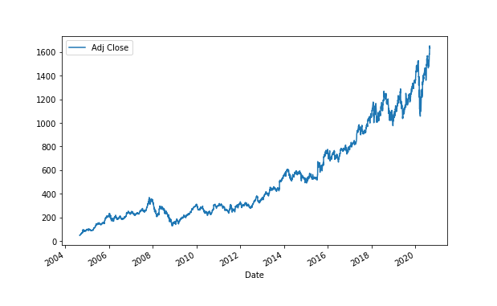

Algorithmic trading refers to the use of computer algorithms to automate trading decisions in financial markets. By utilizing mathematical models and complex algorithms, traders can execute orders at high speeds and with precision, minimizing human intervention and the potential for errors. This automation has become increasingly significant in financial markets, as it enhances liquidity, reduces transaction costs, and allows for the execution of sophisticated trading strategies that were previously infeasible.

Mean reversion is one such strategy, based on the premise that asset prices and returns eventually revert to their historical mean or average level. It is grounded in the statistical tendency for extreme values to move back towards a central value over time. In the context of trading, mean reversion assumes that if the price of a security diverges significantly from its historical average, it is likely to return to that average, presenting an opportunity to profit.



Understanding mean reverting strategies is crucial within algorithmic trading, as they offer distinct advantages in certain market conditions, particularly those characterized by volatility and short-term fluctuations. The identification of mean reversion opportunities can be automated through algorithmic systems that analyze historical price data and apply statistical measures to detect deviations from the norm.

The purpose of this article is to provide an in-depth exploration of mean reverting strategies in the context of algorithmic trading. It is aimed at traders, investors, and technology enthusiasts who are interested in the intricate dynamics of modern trading strategies. By uncovering the mechanisms and real-world applications of mean reversion strategies, the article sets the stage for a deeper understanding of their potential impact and utility in financial markets.

## Table of Contents

## Understanding Mean Reversion

Mean reversion in finance and trading is a statistical concept suggesting that asset prices and returns eventually revert to their long-term mean or average level. This concept is based on the idea that high and low prices are temporary phenomena that return to an average value over time. The principle of mean reversion is deeply rooted in the statistical behavior of time series, where variables fluctuate around a steady mean and are characterized by some intrinsic noise.

The mathematical foundation of mean reversion includes several statistical concepts, the most notable being time series analysis and the application of stochastic processes. For example, the Ornstein-Uhlenbeck process is a popular mathematical model to describe mean-reverting behavior. It is a type of continuous-time stochastic process used to model the velocity of a Brownian particle under the influence of friction and can be articulated as:

$$
dX_t = \theta (\mu - X_t) dt + \sigma dW_t
$$

where $X_t$ is the process at time $t$, $\theta$ is the rate of reversion to the mean $\mu$, $\sigma$ is the volatility, and $dW_t$ is a Wiener process or Brownian motion. This model captures the tendency of $X_t$ to drift towards a long-term average $\mu$ with variability introduced by random shocks.

Historically, the concept of mean reversion dates back to studies in the 19th century, such as the work of Sir Francis Galton on regression towards the mean in hereditary traits. In the context of financial markets, this principle can be traced back to the early 20th century when analysts began to observe that stock prices and commodities frequently oscillated around average levels rather than moving in steady unidirectional trends.

Mean-reverting strategies assume that deviations from a historical mean are temporary and correct themselves over time. These strategies involve identifying when an asset has diverged significantly from its mean, taking a position (buy or sell), and profiting from the expected correction toward the mean. Key assumptions of mean reversion include:

1. Prices fluctuate around a constant mean.
2. Shocks to the system are temporary.
3. The mean or average level can be statistically measured over a relevant period.

In contrast, trend-following strategies are designed to capitalize on [momentum](/wiki/momentum), assuming that an asset's propensity to continue moving in its current direction. Trend-following relies on the idea that assets in motion (upwards or downwards) tend to continue in that direction until external forces, such as changes in market sentiment or new information, cause a reversal.

The dichotomy between mean reversion and [trend following](/wiki/trend-following) represents different philosophies on market behavior. While mean reversion suggests that markets are cyclical and self-correcting, trend following assumes markets can exhibit prolonged directional movements driven by persistent investor sentiment or fundamentals.

Understanding these differences and the underlying statistical principles is crucial for traders, investors, and tech enthusiasts seeking to employ mean-reverting strategies within their [algorithmic trading](/wiki/algorithmic-trading) frameworks.

## Implementing Mean Reversion in Algorithmic Trading

Algorithmic trading requires a precise technical setup to execute mean-reverting strategies effectively. At its core, the system involves selecting the right programming languages and platforms to develop and implement trading algorithms. Python is particularly favored for its rich ecosystem of libraries such as NumPy, pandas, and statsmodels, which provide comprehensive tools for statistical analysis and [backtesting](/wiki/backtesting). Other languages like C++ or R may be used depending on the specific requirements of speed and statistical computation respectively.

To successfully implement a mean-reverting strategy, an algorithmic trading system must include robust data analysis capabilities. This involves sourcing historical market data to identify mean-reverting patterns. Platforms like QuantConnect, [Interactive Brokers](/wiki/interactive-brokers-api), and MetaTrader provide historical and real-time data feeds essential for analyzing securities.

Implementing mean reversion strategies involves backtesting and optimizing algorithms to evaluate their performance under historical market conditions. Backtesting processes utilize historical data to simulate trades that would have been executed during that period. This process helps in assessing the effectiveness of the strategy by providing insights into metrics like Sharpe ratio, maximum drawdown, and cumulative returns. Developers often use Python libraries like Backtrader or zipline for backtesting due to their versatility and extensive documentation.

To optimize a strategy, traders adjust algorithm parameters to enhance performance metrics while avoiding overfitting. Overfitting is a common pitfall where a model performs excellently on historical data but poorly in real-time trading due to its excessive customization to past events.

Data sources are critical to both backtesting and live trading. Reliable providers such as Bloomberg, Reuters, and Quandl offer extensive datasets that traders use to feed their algorithms. Additionally, accessing high-frequency trading markets requires robust computational resources and low-latency networking to execute trades swiftly.

However, implementing mean reversion strategies through algorithmic trading presents several challenges. One challenge is maintaining a balance between complexity and interpretability of models. Complex models that use advanced statistical techniques can yield higher accuracy but might reduce transparency, making them difficult to troubleshoot and interpret.

Another consideration is the transaction cost, which can significantly impact profitability, especially in high-frequency setups. High-frequency trading may require algorithms to be executed multiple times within fractions of a second, necessitating sophisticated infrastructure and optimization to minimize costs. 

Risk management is also a vital aspect of execution, requiring efficient handling of execution risks like slippage and [liquidity](/wiki/liquidity-risk-premium). Slippage occurs when there is a difference between expected and actual trade prices, while liquidity refers to the ease of entering or exiting positions without impacting the market price.

Ultimately, implementing mean reversion in algorithmic trading demands careful planning, comprehensive testing, and continuous refinement to ensure strategies remain viable in diverse market conditions.

## Mathematical Models and Indicators

Mean-reverting strategies in algorithmic trading often rely on mathematical models and indicators to identify and act on potential trading opportunities. A widely used mathematical model for mean reversion is the Ornstein-Uhlenbeck process. This continuous-time stochastic process is defined by the equation:

$$
dX_t = \theta (\mu - X_t) dt + \sigma dW_t
$$

where $X_t$ represents the price level at time $t$, $\theta$ denotes the speed of reversion to the mean $\mu$, $\sigma$ is the volatility, and $W_t$ is a Wiener process (or Brownian motion). The parameters of this model are adjusted to fit historical data, offering a framework for predicting when a security's price might revert towards its mean.

Common indicators used to identify mean reversion opportunities include Bollinger Bands and the Relative Strength Index (RSI). Bollinger Bands create bands around a moving average with a set number of standard deviations. Prices approaching or breaching these bands suggest potential mean-reverting conditions. The RSI, on the other hand, measures the speed and change of price movements to identify overbought or oversold conditions. Values over 70 typically indicate an overbought market, while those below 30 suggest oversold, both potential points of reversion.

Integration of these models and indicators into algorithmic trading systems is achieved through programming languages like Python, which supports libraries such as NumPy, pandas, and SciPy for mathematical computations, and specific trading libraries like TA-Lib for technical analysis:

```python
import pandas as pd
import talib

# Example of calculating RSI
data = pd.read_csv("price_data.csv")  # Load historical price data
rsi = talib.RSI(data['Close'], timeperiod=14)

# Example of calculating Bollinger Bands
upper_band, middle_band, lower_band = talib.BBANDS(data['Close'], timeperiod=20)
```

These systems automatically analyze real-time data, apply the chosen models or indicators, and execute trades based on pre-defined criteria.

The statistical significance of these models is crucial to ensure their reliability and robustness. Statistical significance tests help in determining whether observed patterns in historical data are likely to hold in the future or are mere coincidences. This minimizes the risk of overfitting, where a model is excessively tailored to historical data but performs poorly with new data.

Machine learning plays a pivotal role in enhancing mean-reverting strategies. Techniques such as regression analysis and clustering can detect subtle patterns and relationships within data that traditional statistical models might overlook. Machine learning models can dynamically adjust parameters based on evolving market conditions, improving the adaptability of mean-reverting strategies. For instance, [reinforcement learning](/wiki/reinforcement-learning) algorithms can be employed to optimize trading strategies continuously by learning from past trades and market responses.

In summary, mathematical models like the Ornstein-Uhlenbeck process and indicators such as Bollinger Bands and RSI are fundamental to developing mean-reverting strategies in algorithmic trading. Their integration, supported by programming and statistical analysis, forms a robust framework for identifying trading opportunities. Machine learning further augments these strategies by enhancing their adaptability and precision in ever-changing market environments.

## Benefits and Risks of Mean Reverting Strategies

Mean reversion strategies present several advantages when applied to algorithmic trading. One potential benefit is the identification of overvalued or undervalued financial instruments, which can be leveraged to execute profitable trades as prices revert to their mean. This approach is particularly effective in markets characterized by high [volatility](/wiki/volatility-trading-strategies) and cyclical patterns, where prices frequently oscillate around a stable average.

Mean reversion strategies generally perform well in range-bound markets, where prices frequently revert to the mean after reaching certain thresholds. These strategies can capitalize on temporary price distortions driven by short-term market inefficiencies, offering profit opportunities during price corrections. However, these strategies might be less effective during strong trending markets, where prices continue in one direction without reverting, leading to potential losses if the mean reversion assumption does not hold.

Despite their advantages, mean reversion strategies [carry](/wiki/carry-trading) several risks. One significant risk is the possibility of a structural market change, where the historical mean may no longer be relevant due to new market dynamics, leading to sustained trends. Moreover, during periods of extreme volatility, prices may diverge significantly from their mean, resulting in substantial losses if risk management protocols are inadequate.

Several historical examples illustrate the mixed outcomes of mean reversion strategies. A successful case was the utilization of statistical [arbitrage](/wiki/arbitrage) by hedge funds in the 1990s, which exploited mean reversion across different asset classes. Conversely, Long-Term Capital Management's downfall in 1998 showcased the risks, where assumptions of mean reversion across global bond markets failed under extreme conditions, leading to massive losses.

Effective risk management is vital in implementing mean reversion strategies. One approach is to set stop-loss limits to contain losses during adverse market movements. Additionally, diversification across different assets or time frames can help mitigate systemic risks. Continuous monitoring and model recalibration based on evolving market data are crucial to maintaining a robust mean reversion strategy. Integrating [machine learning](/wiki/machine-learning) techniques can enhance predictive accuracy, identifying subtle patterns and optimizing strategy parameters.

In conclusion, while mean reversion strategies can offer significant trading opportunities, understanding their benefits and limitations is crucial. Proper implementation requires comprehensive risk assessments, effective risk management strategies, and the flexibility to adapt to changing market conditions.

## Real-World Applications and Case Studies

Mean reverting strategies have been employed by various trading firms to generate consistent returns across different market conditions. One notable example is the [statistical arbitrage](/wiki/statistical-arbitrage) strategies used by Renaissance Technologies, a highly successful [hedge fund](/wiki/hedge-fund-trading-strategies) known for its quantitative approach to trading. These strategies often exploit mean reversion patterns in equity markets by identifying temporary price deviations from their historical averages and making trades expecting a reversal to the mean. This approach allows firms to capitalize on short-term market inefficiencies.

In another instance, JP Morgan's Quantitative Research team has applied mean reversion strategies in the commodities market. By analyzing historical prices and developing models to predict future price movements, they have been able to make informed trading decisions. These strategies typically involve trading futures contracts on commodities like [crude oil](/wiki/crude-oil) or gold, where price deviations from the mean are identified, and positions are taken to profit from expected corrections.

Mean reverting strategies can also be applied in the [forex](/wiki/forex-system) market, where currency pairs often exhibit reversion to a long-term mean due to macroeconomic factors and central bank interventions. For example, a forex trader might use Moving Average Convergence Divergence (MACD) indicators to identify overbought or oversold conditions, taking positions when currency prices are expected to revert to their historical averages.

Technological advancements have significantly enhanced the execution of mean reverting strategies. High-frequency trading ([HFT](/wiki/high-frequency-trading-strategies)) technology allows firms to process vast amounts of data and execute trades at lightning speed. The use of machine learning algorithms further refines these strategies by enabling the analysis of complex datasets to identify subtle patterns and potential mean reversion opportunities.

A critical lesson from real-world applications of mean reverting strategies is the importance of adapting to various market conditions. The parameters and thresholds used to identify mean reversion opportunities must be dynamically adjusted to account for changing market volatility and liquidity conditions. Additionally, risk management practices such as setting tight stop-loss orders are crucial to mitigate potential losses from unforeseen market movements.

Insights gained from these practical applications emphasize the importance of continuous research and innovation in developing robust mean reverting models. Trading firms must remain vigilant in incorporating new data sources and refining their algorithms to maintain a competitive edge. Furthermore, the integration of [artificial intelligence](/wiki/ai-artificial-intelligence) and machine learning presents exciting prospects for future improvements in identifying and exploiting mean reversion opportunities, promising enhanced precision and adaptability in trading strategies.

## Future Trends in Mean Reverting Algo Trading

Algorithmic trading, particularly mean reverting strategies, continues to evolve with advancements in technology and data analytics. Several trends and innovations are shaping the future of these strategies, focusing on enhancing their precision, scalability, and adaptability.

Artificial intelligence (AI) and machine learning have a profound influence on mean reverting strategies. AI algorithms, especially those based on supervised and unsupervised learning, can identify patterns and make predictions about future price movements more accurately than traditional statistical methods. Machine learning models can automatically adjust and refine themselves as they process new data, potentially increasing the profitability of mean reversion strategies. Techniques such as reinforcement learning and ensemble methods further enhance the decision-making process within algorithmic systems, assisting traders in dynamically adjusting their strategies in real-time.

The role of data analytics tools in refining mean reverting strategies cannot be understated. The increasing availability of large datasets from various markets enables more comprehensive backtesting and scenario analysis. Advanced analytics tools allow traders to measure statistical properties of time series data, identify factors that might affect price movements, and fine-tune parameter settings in their models. The integration of cloud-based data platforms also facilitates faster processing and scalability, providing traders with a strategic advantage in speed and efficiency.

Regulatory changes are another critical [factor](/wiki/factor-investing) affecting the deployment of algorithmic trading strategies. As global financial systems become more interconnected, regulatory bodies emphasize transparency and risk management in algorithmic trading. Traders must stay informed about evolving regulations that could impact market access and trading behaviors, ensuring their strategies remain compliant while maintaining competitive edge.

Experts suggest that the future scalability and adaptability of mean reverting strategies will heavily rely on the harmonization of AI technologies and robust data analytics infrastructure. The integration of these technologies can enable traders to address various liquidity environments and market conditions, adapting their strategies accordingly. As market dynamics shift, the adaptability of AI-driven models provides the necessary resilience and flexibility.

In summary, the future of mean reverting strategies in algorithmic trading is poised for transformation, driven by innovations in AI, enhanced data analytics, and evolving regulatory landscapes. These advancements will dictate the precision, adaptability, and success of strategies deployed in increasingly complex financial markets. It is imperative for traders and investors to leverage these tools responsibly, maintaining a focus on continual refinement and risk management.

## Conclusion

Mean reverting strategies in algorithmic trading offer a compelling approach by capitalizing on the statistical tendency of asset prices to revert to their historical means over time. This approach is rooted in the principle that deviations from an asset's average price are eventually corrected, providing trading opportunities. An essential insight from the exploration of mean reversion is the distinction it offers from other strategies, such as trend following, which assumes that trends persist over time.

Ongoing research and development in mean reversion are critical, given the rapid advancements in technology and data analytics. As these fields grow, so too do the opportunities to refine and optimize mean reverting algorithms. This ongoing evolution is necessary to adapt to changing market dynamics, ensuring that strategies remain effective and competitive.

Traders and investors are urged to apply these strategies with a lens of responsibility and caution, particularly in risk management. While mean reversion can be advantageous, it is not without risks, especially in volatile or rapidly changing markets where historical patterns may not hold. Effective risk management is essential to mitigate potential losses and increase the probability of success.

In conclusion, mean reversion plays a significant role in achieving trading success for those who understand and effectively implement it. Its effectiveness hinges on a detailed understanding of market behaviors and statistical models, as well as the integration of advanced technologies like machine learning to enhance precision. 

Readers are encouraged to further their understanding by engaging with learning resources and participating in discussions around advanced trading strategies. This continuous learning and dialogue contribute to the broader conversation on the evolution of algorithmic trading and its future trajectory.

## References & Further Reading

[1]: Bergstra, J., Bardenet, R., Bengio, Y., & Kégl, B. (2011). ["Algorithms for Hyper-Parameter Optimization."](https://papers.nips.cc/paper/4443-algorithms-for-hyper-parameter-optimization) Advances in Neural Information Processing Systems 24.

[2]: ["Advances in Financial Machine Learning"](https://www.amazon.com/Advances-Financial-Machine-Learning-Marcos/dp/1119482089) by Marcos Lopez de Prado

[3]: ["Evidence-Based Technical Analysis: Applying the Scientific Method and Statistical Inference to Trading Signals"](https://www.amazon.com/Evidence-Based-Technical-Analysis-Scientific-Statistical/dp/0470008741) by David Aronson

[4]: ["Machine Learning for Algorithmic Trading"](https://github.com/PacktPublishing/Machine-Learning-for-Algorithmic-Trading-Second-Edition) by Stefan Jansen

[5]: ["Quantitative Trading: How to Build Your Own Algorithmic Trading Business"](https://books.google.com/books/about/Quantitative_Trading.html?id=j70yEAAAQBAJ) by Ernest P. Chan