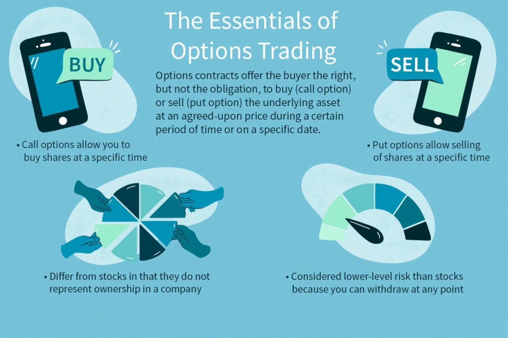

## Table of Contents

## What is options trading?

Options trading is a way to buy or sell financial assets at a certain price within a specific time. It's like making a bet on whether a stock's price will go up or down. When you trade options, you're not buying the actual stock, but a contract that gives you the right to buy or sell it later. This can be useful if you think the stock price will change a lot, but you don't want to spend a lot of money right away.

There are two main types of options: calls and puts. A call option gives you the right to buy a stock at a set price before the option expires. If you think the stock price will go up, you might buy a call option. On the other hand, a put option gives you the right to sell a stock at a set price before it expires. If you think the stock price will go down, you might buy a put option. Options can be risky because if the stock price doesn't move the way you expected, you could lose the money you spent on the option.

## What are the different types of options?

There are two main types of options: call options and put options. A call option gives you the right to buy a stock at a certain price before the option expires. If you think a stock's price will go up, you might buy a call option. It's like reserving the right to buy the stock later at today's price. If the stock price goes up, you can buy it at the lower price you set with the call option and then sell it at the higher market price to make a profit.

A put option gives you the right to sell a stock at a certain price before the option expires. If you think a stock's price will go down, you might buy a put option. It's like reserving the right to sell the stock later at today's price. If the stock price goes down, you can buy the stock at the lower market price and then use the put option to sell it at the higher price you set, making a profit.

Besides call and put options, there are also other types like American options and European options. American options can be used at any time before they expire, while European options can only be used on the expiration date. These options give you different ways to bet on stock prices, depending on when you think the price will change.

## How does an option contract work?

An option contract is like a ticket that gives you the right, but not the obligation, to buy or sell a stock at a certain price before a specific date. When you buy an option, you're not buying the actual stock. Instead, you're buying the chance to buy or sell it later. The price you agree on is called the strike price, and the date when the option ends is called the expiration date. If you think the stock's price will go up, you can buy a call option. If you think it will go down, you can buy a put option.

When you buy an option, you pay a fee called the premium. This is the cost of the option, and it's what you risk losing if the stock doesn't move the way you expected. If you bought a call option and the stock price goes above the strike price before the expiration date, you can use your option to buy the stock at the lower strike price and then sell it at the higher market price for a profit. If you bought a put option and the stock price goes below the strike price, you can buy the stock at the lower market price and then use your option to sell it at the higher strike price for a profit. If the stock price doesn't move in your favor, you can let the option expire and only lose the premium you paid.

## What are the key terms in options trading such as strike price, expiration date, and premium?

In options trading, the strike price is the price at which you can buy or sell the stock if you decide to use your option. It's like setting a target price for the stock. If you buy a call option, the strike price is the price you'll pay for the stock if you choose to buy it. If you buy a put option, the strike price is the price you'll get for the stock if you choose to sell it. The strike price is important because it helps you decide if using the option will make you money.

The expiration date is the last day you can use your option. It's like a deadline for making your move. If you don't use your option by this date, it becomes worthless, and you lose the money you paid for it. The expiration date is important because it gives you a time limit to see if the stock price will move in the direction you hoped.

The premium is the price you pay to buy the option. It's like the cost of a ticket to play the options game. The premium is influenced by things like how much time is left until the expiration date, how far the current stock price is from the strike price, and how much the stock price might move. If the stock price doesn't move in your favor by the expiration date, you'll lose the premium you paid.

## What are the basic strategies for trading options?

One basic strategy for trading options is called buying calls. If you think a stock's price will go up, you can buy a call option. This gives you the right to buy the stock at a set price before the option expires. If the stock price goes above that set price, you can use your option to buy the stock at the lower price and then sell it at the higher market price to make a profit. If the stock price doesn't go up, you only lose the money you paid for the option, which is called the premium.

Another basic strategy is buying puts. If you think a stock's price will go down, you can buy a put option. This gives you the right to sell the stock at a set price before the option expires. If the stock price goes below that set price, you can buy the stock at the lower market price and then use your option to sell it at the higher set price to make a profit. Again, if the stock price doesn't go down, you only lose the premium you paid for the option.

A third strategy is called covered calls. If you already own a stock and think its price will stay the same or go up a little, you can sell a call option on that stock. Someone else will pay you a premium for the right to buy your stock at a set price. If the stock price stays below that set price, you keep the premium and the stock. If the stock price goes above the set price, the buyer can use the option to buy your stock, but you still keep the premium. This can help you earn extra money from a stock you already own.

## How can options be used for hedging?

Options can be used for hedging to protect against losses in other investments. If you own a stock and you're worried its price might go down, you can buy a put option. This gives you the right to sell the stock at a set price, even if the market price drops lower. For example, if you bought a stock for $50 and you're worried it might fall, you could buy a put option with a strike price of $45. If the stock price drops to $40, you can use the put option to sell it at $45, limiting your loss to $5 per share instead of $10. The cost of the put option is like an insurance premium, but it can save you money if the stock price falls.

Another way to use options for hedging is with index options. If you have a portfolio of stocks and you're worried about the whole market going down, you can buy put options on a stock index like the S&P 500. This can help protect your entire portfolio from a market downturn. For example, if you think the market might drop, you could buy a put option on the S&P 500 with a strike price that matches your portfolio's value. If the market does go down, the put option will increase in value, helping to offset the losses in your portfolio. This way, you're not betting on one stock but on the overall market, which can be a safer way to hedge.

## What are the risks involved in options trading?

Options trading can be risky because you might lose the money you paid for the option if the stock price doesn't move the way you expected. This money is called the premium, and it's like the price of a ticket to play the options game. If you buy a call option and the stock price doesn't go up above the strike price before the expiration date, you lose the premium. The same thing happens if you buy a put option and the stock price doesn't go down below the strike price. This risk is higher when you're new to options trading because it can be hard to guess how stock prices will change.

Another risk in options trading is that it can be complicated and hard to understand. There are many different types of options and strategies, and if you don't know what you're doing, you might make bad choices. Also, options can be affected by things like time decay, where the value of your option goes down as it gets closer to the expiration date, even if the stock price stays the same. This can make it harder to make a profit. Because of these risks, it's important to learn as much as you can about options trading and maybe even talk to a financial advisor before you start.

## How do market conditions affect options trading?

Market conditions can have a big impact on options trading. If the market is going up, people might buy more call options because they think stock prices will keep rising. This can make the price of call options go up too. On the other hand, if the market is going down, people might buy more put options because they think stock prices will keep falling. This can make the price of put options go up. Market conditions can also affect how much people are willing to pay for options, which is called the premium. If the market is very uncertain, with lots of ups and downs, the premium might be higher because people are willing to pay more for the chance to make money or protect their investments.

Another way market conditions affect options trading is through [volatility](/wiki/volatility-trading-strategies). Volatility is how much a stock's price moves up and down. When the market is volatile, the price of options can go up because there's a bigger chance the stock price will move a lot. This is good for people who buy options because they can make more money if the stock price moves in their favor. But it's bad for people who sell options because they might lose more money if the stock price moves against them. So, understanding market conditions and how they might change can help you make better decisions when trading options.

## What are advanced options strategies like straddles and strangles?

A straddle is an options strategy where you buy both a call option and a put option at the same time, with the same strike price and expiration date. You do this when you think a stock's price will move a lot, but you're not sure which way it will go. If the stock price goes up a lot, you can use the call option to buy the stock at the lower strike price and then sell it at the higher market price for a profit. If the stock price goes down a lot, you can use the put option to sell the stock at the higher strike price after buying it at the lower market price, also making a profit. The risk with a straddle is that if the stock price doesn't move much, you could lose the money you paid for both options.

A strangle is similar to a straddle, but you buy a call option with a higher strike price and a put option with a lower strike price. Both options still have the same expiration date. You use a strangle when you think a stock's price will move a lot, but you want to spend less money than you would on a straddle. If the stock price goes up a lot, the call option becomes valuable, and if it goes down a lot, the put option becomes valuable. Like with a straddle, the risk is that if the stock price doesn't move enough, you could lose the money you paid for both options. Strangles are a bit riskier than straddles because the stock price has to move more to make money, but they can also be cheaper to set up.

## How does the Greeks (Delta, Gamma, Theta, Vega) impact options pricing?

The Greeks are important measures that help traders understand how different factors affect the price of an option. Delta tells you how much the option's price will change if the stock price changes by $1. If you have a call option with a Delta of 0.5, the option's price will go up by $0.50 if the stock price goes up by $1. Gamma shows how Delta changes when the stock price changes. If Gamma is high, Delta can change a lot, making the option's price more sensitive to the stock price. Theta measures how much the option's price goes down as time passes. This is called time decay, and it means that the closer you get to the expiration date, the less valuable the option becomes if the stock price stays the same. Vega shows how much the option's price changes with changes in the stock's volatility. If Vega is high, the option's price will go up a lot if the stock's volatility increases.

Understanding the Greeks can help traders make better decisions about which options to buy or sell. For example, if you think a stock's price will move a lot soon, you might look for options with high Vega because they will benefit more from the increased volatility. If you're worried about time decay, you might choose options with a lower Theta or options that expire further in the future. And if you want to make money from small changes in the stock price, you might pick options with a high Delta. By paying attention to the Greeks, traders can manage their risks and try to make more money from their options trades.

## What are the tax implications of trading options?

When you make money from trading options, you have to pay taxes on your profits. If you hold an option for less than a year before you sell it, any profit you make is considered a short-term capital gain. Short-term capital gains are taxed at the same rate as your regular income, which can be as high as 37% depending on how much money you make. If you hold an option for more than a year before you sell it, any profit you make is considered a long-term capital gain. Long-term capital gains are taxed at a lower rate, which can be 0%, 15%, or 20%, depending on your income.

If you lose money trading options, you can use those losses to reduce your taxes. You can subtract your losses from your gains to figure out your net gain or loss. If your losses are more than your gains, you can use up to $3,000 of those losses to lower your taxable income for the year. If you have more than $3,000 in losses, you can [carry](/wiki/carry-trading) the extra over to future years to use against future gains or income. It's a good idea to keep good records of all your options trades so you can report your gains and losses correctly on your tax return.

## How can one start trading options, including choosing a broker and understanding regulatory requirements?

To start trading options, you first need to choose a broker. A broker is a company that lets you buy and sell options. Look for a broker that offers options trading and has good tools and resources to help you learn. Some popular brokers for options trading are Robinhood, E*TRADE, and Charles Schwab. Once you've picked a broker, you'll need to open an account. This usually involves filling out an application, providing some personal information, and maybe even answering some questions about your trading experience and financial situation. After your account is set up, you'll need to fund it with money to start trading.

Before you can trade options, you also need to understand the regulatory requirements. In the United States, the Financial Industry Regulatory Authority (FINRA) and the Securities and Exchange Commission (SEC) set the rules for options trading. To trade options, you'll need to get approval from your broker. This usually involves filling out an options trading agreement and maybe even taking a test to show you understand the risks. The broker will look at your experience and financial situation to decide what level of options trading you're allowed to do. It's important to learn as much as you can about options and the rules before you start trading, so you can make smart choices and avoid big losses.

## References & Further Reading

[1]: Bergstra, J., Bardenet, R., Bengio, Y., & Kégl, B. (2011). ["Algorithms for Hyper-Parameter Optimization."](https://papers.nips.cc/paper/4443-algorithms-for-hyper-parameter-optimization) Advances in Neural Information Processing Systems 24.

[2]: ["Advances in Financial Machine Learning"](https://www.amazon.com/Advances-Financial-Machine-Learning-Marcos/dp/1119482089) by Marcos Lopez de Prado

[3]: ["Evidence-Based Technical Analysis: Applying the Scientific Method and Statistical Inference to Trading Signals"](https://www.amazon.com/Evidence-Based-Technical-Analysis-Scientific-Statistical/dp/0470008741) by David Aronson

[4]: ["Machine Learning for Algorithmic Trading"](https://github.com/stefan-jansen/machine-learning-for-trading) by Stefan Jansen

[5]: ["Quantitative Trading: How to Build Your Own Algorithmic Trading Business"](https://books.google.com/books/about/Quantitative_Trading.html?id=j70yEAAAQBAJ) by Ernest P. Chan