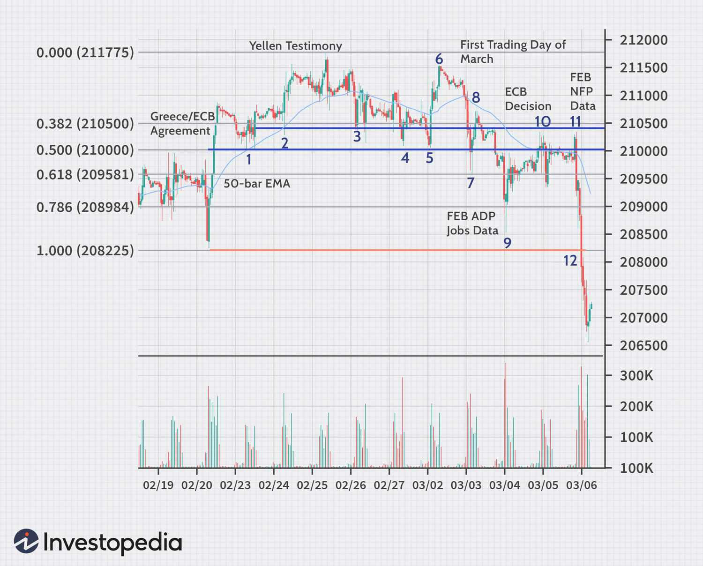

## Table of Contents

## What is the S&P 500 and why is it important for traders?

The S&P 500 is a stock market index that measures the performance of 500 large companies in the United States. It includes companies from different industries like technology, healthcare, and finance. The index is maintained by Standard & Poor's, a financial services company. When people talk about "the market" in the U.S., they often mean the S&P 500 because it represents a big part of the total value of all U.S. stocks.

The S&P 500 is important for traders because it gives them a quick way to see how the overall stock market is doing. Traders can use the index to make decisions about buying or selling stocks. If the S&P 500 goes up, it might mean that the economy is doing well, and traders might want to buy more stocks. If it goes down, it could be a sign that the economy is struggling, and traders might sell their stocks to avoid losing money. Many traders also use the S&P 500 as a benchmark to compare their own investment performance.

## How does the S&P 500 price progress over time?

The S&P 500 price changes over time because it is affected by many things like how well companies are doing, what's happening in the economy, and even world events. When people think the economy will do well, they buy more stocks, and the S&P 500 price goes up. But if they think the economy might have problems, they might sell their stocks, and the price goes down. Over long periods, the S&P 500 usually goes up because the economy grows over time, but there can be big ups and downs along the way.

Sometimes, the S&P 500 can have big jumps or drops in a short time. This can happen because of news like a company doing really well or really badly, or because of big events like a financial crisis or a global health emergency. These quick changes can make the S&P 500 go up or down a lot in just a few days or weeks. But over many years, the S&P 500 tends to go up because companies keep growing and making more money.

## What are the key factors that influence S&P 500 price movements?

The S&P 500 price moves because of many things. One big thing is how well the companies in the index are doing. If these companies make more money, their stock prices go up, and so does the S&P 500. Another important thing is the economy. If people think the economy will grow, they buy more stocks, which pushes the S&P 500 up. But if they think the economy might shrink, they might sell their stocks, and the S&P 500 goes down.

Interest rates also play a big role. When interest rates are low, borrowing money is cheaper, and companies can grow more easily, which can make their stock prices and the S&P 500 go up. But if interest rates go up, borrowing becomes more expensive, and it can slow down company growth, which might make the S&P 500 go down. World events like wars, natural disasters, or health crises can also cause big changes in the S&P 500 because they can affect the economy and how people feel about the future.

Lastly, what people think and feel can move the S&P 500 a lot. If investors are feeling hopeful and confident, they might buy more stocks, pushing the index up. But if they're worried or scared, they might sell their stocks, which can make the S&P 500 go down. This feeling can spread quickly and cause big swings in the index, even if the actual company news hasn't changed much.

## What are the basic trading strategies for the S&P 500?

One basic trading strategy for the S&P 500 is called "buy and hold." This means you buy stocks or an S&P 500 index fund and keep them for a long time, like many years. You do this because over a long time, the S&P 500 usually goes up. This strategy is good if you believe the economy will keep growing and you don't want to spend a lot of time watching the market every day.

Another strategy is "[day trading](/wiki/day-trading-spy)." Day traders buy and sell stocks or S&P 500 futures within the same day. They try to make money from small changes in the price of the S&P 500. This strategy needs a lot of time and attention because you have to watch the market all day and make quick decisions. It can be risky, but some people like it because they think they can make money from the ups and downs of the market.

A third strategy is "trend following." This means you look at charts and try to see if the S&P 500 is going up or down over time. If you think it's going up, you buy and hold until you think the trend might change. If you think it's going down, you might sell or even "short" the market, which means you make money if the price goes down. This strategy can help you make money in both good and bad markets, but you need to be good at reading charts and understanding trends.

## How can one use technical analysis to predict S&P 500 price movements?

Technical analysis is a way to look at past price movements of the S&P 500 to try and guess where the price might go next. People who use technical analysis look at charts and use different tools, like moving averages and support and resistance levels. Moving averages smooth out the price over time and can help show if the S&P 500 is trending up or down. Support and resistance levels are like invisible lines on the chart where the price often stops going down or up. If the price hits these levels, it might bounce back the other way.

Another tool in technical analysis is the Relative Strength Index (RSI), which helps figure out if the S&P 500 is overbought or oversold. If the RSI is high, it might mean the price has gone up too fast and could go down soon. If it's low, it might mean the price has gone down too fast and could go up soon. By using these tools together, people try to find patterns that can help them decide when to buy or sell. But remember, technical analysis is not perfect and it's just one way to try and predict the market.

## What role does fundamental analysis play in S&P 500 trading?

Fundamental analysis is another way to look at the S&P 500 to decide if it's a good time to buy or sell. It involves looking at the actual health and performance of the companies in the index. Traders using [fundamental analysis](/wiki/fundamental-analysis) might look at things like how much money the companies are making, their debts, and how fast they're growing. They might also look at bigger things like the overall economy, interest rates, and even world events that could affect the companies' future earnings. By understanding these details, traders can guess if the S&P 500 is priced right or if it's too high or too low.

Using fundamental analysis can help traders make long-term decisions. If they think the companies in the S&P 500 will keep making more money and growing, they might decide to buy and hold for a long time. On the other hand, if they see signs that the companies might struggle, they might sell their investments. Fundamental analysis is different from technical analysis because it focuses on the real value of the companies instead of just looking at price charts. By combining both types of analysis, traders can get a fuller picture of what might happen with the S&P 500.

## How can traders manage risk when trading the S&P 500?

Managing risk when trading the S&P 500 is important to keep your money safe. One way to do this is by setting stop-loss orders. This means you tell your trading platform to sell your investment if the price drops to a certain level. This can help you limit how much money you lose if the S&P 500 goes down a lot. Another way is to not put all your money into the S&P 500 at once. You can spread out your investments over time, which is called dollar-cost averaging. This can help you buy at different prices and not lose too much if the market goes down right after you buy.

Another way to manage risk is to diversify your investments. Instead of just trading the S&P 500, you can also invest in other things like bonds, real estate, or even different stock markets around the world. This way, if the S&P 500 goes down, your other investments might help balance out the loss. It's also a good idea to only invest money that you can afford to lose. This means you won't be in big trouble if your trades don't go well. By being careful and using these strategies, you can help protect yourself from losing too much money when trading the S&P 500.

## What are the common mistakes beginners make when trading the S&P 500?

One common mistake beginners make when trading the S&P 500 is not having a clear plan. They might buy and sell based on feelings or what they hear from others, instead of following a strategy. This can lead to bad decisions and losing money. Another mistake is not understanding the risks. Beginners might think they can make a lot of money quickly without realizing that they can also lose a lot. They might not use stop-loss orders or other ways to protect their money, which can lead to big losses if the market goes down.

Another mistake is overtrading. Beginners might trade too often, trying to make money from small changes in the S&P 500. This can lead to high fees and taxes, which can eat into their profits. They might also not do enough research. Trading the S&P 500 without understanding the companies in the index or the bigger economic picture can lead to bad choices. By taking the time to learn and plan, beginners can avoid these common mistakes and trade more successfully.

## How does macroeconomic news impact S&P 500 price progression?

Macroeconomic news, like reports on jobs, inflation, or interest rates, can have a big impact on the S&P 500. When the news is good, like more people getting jobs or the economy growing faster, people feel more confident about the future. They might buy more stocks, which can push the S&P 500 price up. But if the news is bad, like high inflation or the economy shrinking, people might worry about the future. They might sell their stocks, which can make the S&P 500 price go down.

Sometimes, the impact of macroeconomic news can be quick and big. For example, if the Federal Reserve raises interest rates, borrowing money becomes more expensive, and companies might grow slower. This can make investors sell their stocks, leading to a drop in the S&P 500. On the other hand, if there's news about a new trade deal that could help the economy, the S&P 500 might go up as people buy more stocks hoping for better times ahead. Macroeconomic news helps traders understand the bigger picture and make better decisions about when to buy or sell.

## What advanced trading techniques can be applied to the S&P 500?

One advanced trading technique for the S&P 500 is using options. Options are like contracts that give you the right to buy or sell the S&P 500 at a certain price by a certain date. Traders can use options to make money if they think the S&P 500 will go up or down. They can also use options to protect their other investments from big losses. This is called hedging. Options can be complicated, but they give traders more ways to make money and manage risk.

Another advanced technique is algorithmic trading. This means using computer programs to buy and sell the S&P 500 based on certain rules. The computer can look at a lot of data very quickly and make trades faster than a person could. Some traders use algorithms to find small price differences in the market and make money from them. This is called arbitrage. Other traders use algorithms to follow trends or to trade based on news and events. Algorithmic trading can be very powerful, but it also needs a lot of knowledge and technology to do well.

## How can algorithmic trading be used in S&P 500 price progression?

Algorithmic trading can be used to trade the S&P 500 by using computer programs that follow certain rules to buy and sell. These rules can be based on things like past price movements, how much the S&P 500 is going up or down right now, or even news and events happening around the world. The computer can look at a lot of information very quickly and make trades faster than a person could. This can help traders find small price differences in the market and make money from them, which is called arbitrage. They can also use algorithms to follow trends, buying when the S&P 500 is going up and selling when it's going down.

Another way algorithmic trading can be used is to help traders make decisions based on news and events. For example, if there's good economic news, the algorithm can quickly buy S&P 500 stocks before the price goes up too much. If there's bad news, the algorithm can sell the stocks to avoid losing money. This can be very helpful because the computer can react much faster than a person. But algorithmic trading needs a lot of knowledge and technology to work well, so it's something that more experienced traders might use.

## What are the long-term trends and how do they affect S&P 500 trading strategies?

Long-term trends in the S&P 500 are like big waves that move the market over many years. One big trend is that the S&P 500 usually goes up over time because the economy grows. This means that if you hold onto your investments for a long time, you might make money. Another trend is that there are times when the S&P 500 goes up a lot and times when it goes down a lot. These big ups and downs can be caused by things like economic cycles, changes in technology, or big world events. Knowing about these trends can help traders decide what to do with their money.

Because of these long-term trends, traders might use different strategies. If they believe in the trend of the S&P 500 going up over time, they might use a "buy and hold" strategy. This means they buy S&P 500 stocks or funds and keep them for many years, hoping to make money as the market grows. But if they see that the market is in a big up or down cycle, they might try to buy low and sell high. This can be riskier, but it can also make more money if they guess the cycles right. By understanding long-term trends, traders can make better plans and maybe make more money over time.

## What is the S&P 500 Index and how can it be understood?

The S&P 500 index is a prominent indicator within the financial markets, representing 500 of the largest publicly traded companies in the United States. It operates on a market capitalization-weighted basis, meaning that companies with higher market capitalizations exert a greater influence on the index’s performance. The formula for calculating the market capitalization of a company is given by:

$$
\text{Market Capitalization} = \text{Share Price} \times \text{Number of Outstanding Shares}
$$

By aggregating the market capitalizations of its constituent companies, the S&P 500 provides a comprehensive snapshot of the market's overall health and trends. This index is widely regarded as one of the most accurate representations of the U.S. stock market, primarily because it includes a diverse array of companies from various sectors including technology, healthcare, financials, and consumer goods.

Investors and traders look to the S&P 500 for insights not only because of its broad coverage but also due to its role as a benchmark for other investments. It is often used as a standard against which the performance of mutual funds, exchange-traded funds (ETFs), and other investment vehicles can be measured. The index's performance is believed to correlate closely with the health of the U.S. economy given its inclusion of industry leaders.

In addition to its function as a market bellwether, the S&P 500 is also used in financial products such as index funds and derivatives, including options and futures contracts. These products allow investors to speculate on or hedge against the movements of the index, thereby amplifying its central role in financial markets.

For economic analysis, the S&P 500 serves as a leading indicator of U.S. economic strength. Fluctuations in the index can signal shifts in investor sentiment and impending economic changes. As such, it is a critical component for economic forecasting and strategic portfolio management.

While the PDF you provided is not accessible in this format, it is crucial to understand that the S&P 500 remains pivotal both for direct investment decisions and as an economic barometer, continually reflecting changes within the U.S. corporate landscape and investor perceptions.

 to Algorithmic Trading

Algorithmic trading entails the employment of advanced algorithms to perform trades with exceptional speed and frequency, transforming the financial markets by utilizing computational power to assess large datasets. The primary advantage of [algorithmic trading](/wiki/algorithmic-trading) lies in its ability to execute trades based on predefined criteria consistently, minimizing human errors and removing emotional biases from trading decisions. This approach allows traders to exploit market inefficiencies by evaluating intricate market signals and executing trades in fractions of a second.

The algorithms, often designed using programming languages like Python and C++, can process historical price data, market indicators, and real-time feeds to pinpoint opportunities that align with specific trading strategies. For instance, algorithms can be programmed to detect patterns such as moving averages, [momentum](/wiki/momentum) indicators, or other technical signals that often precede profitable trades.

To optimize trading performance, these algorithms leverage high-frequency trading ([HFT](/wiki/high-frequency-trading-strategies)) techniques, which involve executing a large number of orders at extremely low profit margins per trade. The success of these micro-trades accumulates over time, benefiting from economies of scale and market [volatility](/wiki/volatility-trading-strategies). Additionally, algorithms can adapt to changing market conditions, employing [machine learning](/wiki/machine-learning) and statistical analysis to refine their strategies continuously.

Algorithmic trading also reduces transaction costs and latency by automatically executing trades across various markets according to pre-set rules, thereby ensuring optimal execution without manual intervention. For traders and financial institutions, this translates into improved trading efficiency and the capability to harness complex data, making informed decisions swiftly.

In summary, algorithmic trading streamlines the trading process by combining data analysis, speed, and automation. This integration enables traders to maintain a competitive edge in fast-paced financial environments where timing and precision are crucial for success.

## What are some Algorithmic Trading Strategies for the S&P 500?

Many traders employ algorithmic strategies to trade the S&P 500 due to its [liquidity](/wiki/liquidity-risk-premium) and volatility, which present numerous trading opportunities. Common algorithmic trading strategies include [trend following](/wiki/trend-following), mean reversion, and statistical [arbitrage](/wiki/arbitrage), each of which relies on mathematical models to predict price movements and generate trading signals.

Trend following strategies are predicated on the idea that prices usually move in persistent trends. Traders use algorithms to identify the direction of the trend and execute trades in the same direction, allowing them to capitalize on continued price movement. A simple moving average (SMA) or exponential moving average (EMA) crossover model is often utilized to signal trend changes. In Python, an EMA crossover could be implemented as follows:

```python
import pandas as pd

# Example data
data = pd.DataFrame({
    'close': [100, 102, 104, 103, 105, 107, 109, 110]
})

# Calculating EMA
data['ema_short'] = data['close'].ewm(span=5, adjust=False).mean()
data['ema_long'] = data['close'].ewm(span=10, adjust=False).mean()

# Generating signals
data['signal'] = 0
data['signal'][1:] = np.where(data['ema_short'][1:] > data['ema_long'][1:], 1, 0)
data['position'] = data['signal'].diff()

print(data)
```

Mean reversion strategies operate on the principle that asset prices will eventually revert to their historical mean or average level. This approach is suitable for markets with significant random fluctuations, such as the S&P 500. The strategy involves computing the asset's moving average and standard deviation to identify buy or sell triggers when prices deviate from the norm. The formula for the z-score can be employed to quantify deviations:

$$
Z = \frac{X - \mu}{\sigma}
$$

where $Z$ is the z-score, $X$ is the current price, $\mu$ is the moving average, and $\sigma$ is the standard deviation. Buy and sell signals are generated when the z-score surpasses a predefined threshold.

Statistical arbitrage strategies involve exploiting price discrepancies of correlated instruments in the S&P 500, such as pairs trading. Traders look for temporary divergences in prices with the expectation that they will converge, hence generating returns. This requires complex statistical models and computational power for accurate analysis.

In summary, algorithmic strategies for trading the S&P 500 leverage mathematical models and historical market data to predict future price movements, enhancing the trader's ability to make informed decisions. The efficacy of these strategies depends significantly on the algorithms' capacity to interpret real-time data and execute trades promptly and efficiently.

## References & Further Reading

[1]: Bergstra, J., Bardenet, R., Bengio, Y., & Kégl, B. (2011). ["Algorithms for Hyper-Parameter Optimization."](https://dl.acm.org/doi/10.5555/2986459.2986743) Advances in Neural Information Processing Systems 24.

[2]: ["Advances in Financial Machine Learning"](https://www.amazon.com/Advances-Financial-Machine-Learning-Marcos/dp/1119482089) by Marcos Lopez de Prado

[3]: ["Evidence-Based Technical Analysis: Applying the Scientific Method and Statistical Inference to Trading Signals"](https://www.amazon.com/Evidence-Based-Technical-Analysis-Scientific-Statistical/dp/0470008741) by David Aronson

[4]: ["Machine Learning for Algorithmic Trading"](https://github.com/stefan-jansen/machine-learning-for-trading) by Stefan Jansen

[5]: ["Quantitative Trading: How to Build Your Own Algorithmic Trading Business"](https://github.com/LucindaYa/quant-resources/blob/master/Quantitative%20Trading%20How%20to%20Build%20Your%20Own%20Algorithmic%20Trading%20Business.pdf) by Ernest P. Chan