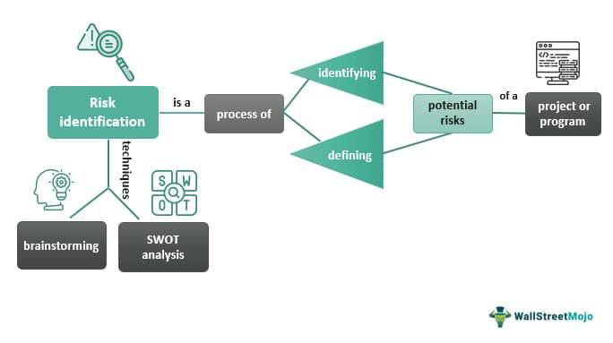

Algorithmic trading, commonly referred to as algo trading, has fundamentally altered the landscape of financial markets by allowing traders to implement complex trading strategies with unprecedented speed and precision. By utilizing advanced algorithms, traders can make data-driven decisions that are executed at a pace impossible for humans to achieve manually. This capability is particularly vital in fast-paced markets such as stocks, commodities, and cryptocurrencies, where swift execution can capture fleeting opportunities and manage risks effectively.

This article examines an array of algorithmic trading strategies, shedding light on their operational mechanics and the benefits they bring to both individual and institutional traders. Understanding these strategies enables market participants to refine their decision-making processes, optimize portfolio performance, and gain a competitive edge in trading activities. By leveraging algorithmic approaches, traders can systematically assess market conditions, forecast price movements, and execute trades with minimal delay, thereby enhancing the overall efficiency and profitability of their trading practices.



Throughout this exploration, we will cover various types of algorithmic trading strategies, analyzing their implementation and identifying best practices for effective use. Such strategies include trend-following algorithms, which capitalize on market momentum by initiating trades aligned with prevailing price directions, and mean reversion tactics, which anticipate a return to average pricing levels after deviation. By dissecting these methods, traders can harness the power of algorithmic systems to meet their financial objectives in a dynamic market environment.

## Table of Contents

## Understanding Algo Trading

Algorithmic trading, commonly referred to as algo trading, is a method of executing orders using pre-programmed directives that account for variables such as timing, price, and volume. These predetermined rules, or algorithms, are designed to automate and optimize the trading process by minimizing human intervention. This approach leverages complex mathematical models to analyze vast datasets, aiming to pinpoint market conditions that meet specific criteria. Once these criteria are met, the algorithm executes the trade, often within milliseconds, allowing for rapid response to market fluctuations.

The primary advantage of algo trading lies in its capacity to process large quantities of data and make decisions at lightning speed. This speed is especially beneficial in volatile markets such as stocks and cryptocurrencies, where prices can change rapidly. By utilizing algorithmic strategies, traders can execute numerous transactions in the time it would take a human trader to complete a single one, significantly increasing the efficiency and potential profitability of trading operations.

Algorithms used in trading consider various market data points, including historical price movements, market volume, and even signals from external economic indicators. They can process this data to identify otherwise imperceptible trading opportunities. For example, a simple moving average (SMA) strategy might look for a crossover between a short-term SMA and a long-term SMA as a buy or sell signal. In code, this can be represented in Python as:

```python
import numpy as np
import pandas as pd

def simple_moving_average_strategy(prices, short_window, long_window):
    signals = pd.DataFrame(index=prices.index)
    signals['price'] = prices
    signals['short_mavg'] = prices.rolling(window=short_window, min_periods=1).mean()
    signals['long_mavg'] = prices.rolling(window=long_window, min_periods=1).mean()
    signals['signal'] = 0.0
    signals['signal'][short_window:] = np.where(signals['short_mavg'][short_window:] > signals['long_mavg'][short_window:], 1.0, 0.0)
    signals['positions'] = signals['signal'].diff()

    return signals

# Example usage:
# prices = pd.Series([...])
# signals = simple_moving_average_strategy(prices, 40, 100)
```

Using such strategies, traders can not only identify potential entry and [exit](/wiki/exit-strategy) points based on statistical analysis but also manage risks by setting stop-loss or take-profit levels preemptively.

The ultimate goal of algo trading is to leverage computational power and advanced algorithms to gain a competitive edge in the financial markets. This technological approach empowers traders by removing emotional bias from trading decisions, providing a rational and data-driven foundation for executing trades. Thus, [algorithmic trading](/wiki/algorithmic-trading) continues to transform financial markets by enabling more precise and efficient trading strategies.

## Types of Algo Trading Strategies

Algorithmic trading strategies leverage established mathematical models and computational techniques to achieve specific trading objectives. These strategies have transformed modern trading by executing orders at speeds and efficiencies unattainable by human traders. Among the most prevalent strategies are trend-following, mean reversion, statistical [arbitrage](/wiki/arbitrage), market-making, and high-frequency trading ([HFT](/wiki/high-frequency-trading-strategies)).

**Trend-following Strategies**

Trend-following algorithms are designed to capitalize on the [momentum](/wiki/momentum) of market prices. These algorithms operate on the principle that prices, influenced by the collective actions of market participants, often follow a discernible trend over time. By analyzing historical price data, trend-following algorithms identify and exploit enduring upward or downward trajectories. For instance, a moving average crossover system, a common trend-following strategy, will signal a buy when a short-term moving average crosses above a long-term moving average and sell when the opposite occurs. 

**Mean Reversion Strategies**

Mean reversion strategies are predicated on the assumption that asset prices will revert to their historical mean over time. These strategies identify assets whose prices have deviated significantly from their average value, anticipating a correction. For example, if an asset’s price (P) deviates from its mean (μ) by several standard deviations (σ), a mean reversion strategy might suggest a buying or selling opportunity, depending on whether the price is below or above the mean. Such strategies rely on statistical models and can be further refined using Bollinger Bands or z-score calculations.

**Statistical Arbitrage**

Statistical arbitrage involves identifying and exploiting pricing inefficiencies between related securities, typically through pairs trading. The goal is to generate profit by concurrently buying undervalued assets and selling overvalued ones. A pairs trading algorithm might be structured as follows in Python:

```python
import numpy as np
import statsmodels.api as sm

def pairs_trading(data1, data2):
    model = sm.OLS(data1, sm.add_constant(data2)).fit()
    spread = data1 - model.predict(sm.add_constant(data2))
    z_score = (spread - np.mean(spread)) / np.std(spread)
    return z_score

```

Here, a Linear Regression model estimates the relationship between two correlated assets, and the spread’s z-score is used to identify potential entry and exit points based on mean reversion.

**Market-making Strategies**

Market-making algorithms serve to enhance market [liquidity](/wiki/liquidity-risk-premium). These strategies involve continuously placing both buy and sell orders to profit from the bid-ask spread—the difference between the highest price a buyer is willing to pay and the lowest price a seller is willing to accept. Market-making algorithms systematically adjust these orders based on real-time market data and inventory management rules to capture profits while maintaining a balanced position. 

**High-Frequency Trading (HFT)**

High-frequency trading represents the pinnacle of speed in algo trading, with algorithms executing numerous trades in fractions of a second. HFT strategies exploit minuscule price discrepancies across different markets or securities. The success of HFT relies on advanced computational infrastructure and latency optimization to execute trades marginally faster than competitors. A typical HFT setup involves co-locating servers near exchange datacenters to minimize the time it takes for trading instructions to reach the market.

In conclusion, the diverse range of algorithmic trading strategies allows traders to tailor their approaches to specific market views and conditions. Understanding these strategies equips market participants with powerful tools to enhance their trading performance amidst the complexities of modern financial markets.

## Selecting the Right Trading Platform

To effectively engage in algorithmic trading, selecting the appropriate trading platform is crucial, as it provides the essential infrastructure, tools, and real-time market data necessary for executing strategies. Several platforms cater to traders with varying needs, each offering unique features and capabilities.

MetaTrader 4 and MetaTrader 5 are widely popular among retail traders due to their user-friendly interface, comprehensive charting tools, and support for automated trading through Expert Advisors (EAs). These platforms facilitate scripting and indicators that help in developing and [backtesting](/wiki/backtesting) trading strategies. MetaTrader's vast community also provides access to an array of third-party tools and resources.

QuantConnect stands out for quantitative analysis, offering traders access to extensive datasets and flexible backtesting capabilities. It provides support for multiple programming languages such as Python and C#, enabling traders to create and test sophisticated trading algorithms. QuantConnect also allows integration with various brokerage services for seamless execution.

TradeStation is favored by traders seeking advanced tools for trading across multiple asset classes, including stocks, futures, and options. It offers a robust suite of analytical tools, custom indicators, and a powerful scripting language known as EasyLanguage to develop and automate complex strategies. TradeStation's platform also supports comprehensive backtesting and optimization features.

[Interactive Brokers](/wiki/interactive-brokers-api) caters to users requiring sophisticated algorithmic systems. It provides a wide range of assets, robust execution capabilities, and an API for custom application development. Interactive Brokers' platform is known for its high reliability, extensive market data coverage, and support for automated trading through various programming languages, providing a versatile solution for both retail and institutional traders.

Ultimately, the choice of platform will depend on the trader's specific needs, technical expertise, and the complexity of the trading strategies intended for implementation. Users should consider factors such as user interface, programming language compatibility, backtesting capabilities, and integration with brokerage services when selecting a trading platform.

## Key Components of Algo Trading Systems

An algorithmic trading system is an integration of various components that function collectively to facilitate the automation of trading activities. The primary components of an algo trading system include hardware, software, and infrastructure essential for executing trades efficiently.

### Hardware

The hardware setup is fundamental for algo trading systems, ensuring robust performance and minimizing latency. Dedicated servers with high processing power and low latency networking capabilities are crucial for executing trades swiftly, especially in high-frequency trading (HFT) environments. For instance, co-location services, wherein trading systems are directly placed within the exchange's data centers, offer significant reductions in latency, providing a competitive edge.

### Software

The software in algo trading systems includes various tools and platforms for strategy execution, data analysis, and performance monitoring:

1. **Data Sources**: Access to real-time and historical market data is paramount for informed decision-making. Data providers offer various feeds, including price quotes, volume data, and financial news, which are integral for backtesting and live trading.

2. **Backtesting Engines**: These engines are employed to test the viability of trading strategies using historical data. Python, with libraries like `Pandas` and `Backtrader`, is commonly used for building backtesting modules. An effective backtesting framework helps refine strategies by providing insights into their performance under different market conditions.

   ```python
   import backtrader as bt

   class MyStrategy(bt.Strategy):
       def __init__(self):
           self.sma = bt.indicators.SimpleMovingAverage(self.data.close, period=15)

       def next(self):
           if self.data.close > self.sma:
               self.buy()
           elif self.data.close < self.sma:
               self.sell()

   # Backtesting with historical data
   cerebro = bt.Cerebro()
   cerebro.addstrategy(MyStrategy)
   data = bt.feeds.YahooFinanceData(dataname='AAPL', fromdate=datetime(2021, 1, 1), todate=datetime(2022, 1, 1))
   cerebro.adddata(data)
   cerebro.run()
   ```

3. **Execution Engines**: These components are responsible for order management and execution. They translate algorithmic signals into executable orders, interface with brokerage APIs, and ensure that trades are executed according to the strategy’s parameters, managing aspects like order types, timing, and size.

4. **Risk Management Systems**: To safeguard against substantial losses, risk management mechanisms are integrated into trading systems. These systems include stop-loss orders, position sizing algorithms, and diversification rules to mitigate exposure and potential downturns.

### Infrastructure

A reliable infrastructure underpins the successful operation of algo trading systems. This encompasses stable internet connectivity, redundant systems for risk mitigation, and secure environments to protect against cyber threats. Additionally, cloud-based platforms offer scalability and flexibility, accommodating the dynamic needs of trading operations.

Incorporating these components into an algorithmic trading system not only enhances execution efficiency but also contributes to the overall robustness and reliability of trading operations. By leveraging state-of-the-art technology, traders can ensure that their strategies are executed with precision and minimal delay, aiding in the pursuit of optimal trading outcomes.

## Advantages of Algo Trading

Algorithmic trading, often referred to as algo trading, brings several advantages to the trading landscape that enhance both execution and strategic management. One of the most pronounced benefits of algo trading is its speed and efficiency. Algorithms can process and execute trades within milliseconds, allowing traders to capitalize on opportunistic market conditions that might elude human traders. This speed is crucial in markets characterized by high [volatility](/wiki/volatility-trading-strategies) or low liquidity, where swift decision-making can lead to substantial profits or prevent significant losses.

Another significant advantage of algo trading is the facilitation of backtesting and optimization. Algo trading systems enable traders to test their strategies against historical data, providing vital insights into the potential effectiveness of a strategy before it is implemented in live markets. This process includes analyzing past performance, identifying patterns or anomalies, and adjusting parameters to improve outcomes. For instance, traders can automate the backtesting process using Python with libraries such as Pandas for data manipulation and TA-Lib for technical analysis. This helps traders refine strategies and adjust them according to historical findings, leading to more informed decision-making.

Algo trading also plays a pivotal role in reducing trading costs. By automating the trading process, it minimizes the need for human intervention, thereby reducing the costs associated with manual trading, such as transaction costs and slippage. Furthermore, the automation inherent in algo trading effectively eliminates emotional biases that can impair trading judgments. Traders driven by fear or greed may make suboptimal decisions, whereas algorithms operate based on predetermined criteria devoid of emotional interference, leading to more consistent and rational trading decisions.

Additionally, algo trading enhances diversification, allowing traders to simultaneously manage multiple strategies across various markets and asset classes. This multifaceted approach helps in spreading risk and improving the potential for returns. For instance, a trader using algo trading might employ trend-following strategies on commodities while exploiting [statistical arbitrage](/wiki/statistical-arbitrage) opportunities in equities. The algorithmic frameworks enable seamless execution and monitoring across these diverse approaches, balancing the portfolio’s risk and return profile.

Finally, algo trading improves precision by leveraging extensive data processing capabilities. Algorithms can analyze large volumes of data, identify complex patterns, and execute trades based on specific quantitative models. This precise data analysis enables the design of robust trading strategies that are responsive to fleeting market signals and complex interdependencies within different markets.

Overall, the adoption of algorithmic trading systems lends traders a competitive edge with its high-speed execution, rigorous data analysis, cost efficiency, and the ability to manage diversified, bias-free portfolios, significantly contributing to more effective trading strategies.

## Challenges and Considerations

Algorithmic trading, while advantageous, presents several challenges that traders must carefully consider. One of the primary issues is the potential for technical failures. Algorithmic trading systems are complex and rely heavily on technology, including hardware, software, and network infrastructure. Any malfunction in these components can lead to unintended consequences, such as erroneous trades or significant financial losses. For instance, a minor bug in the trading software could execute trades at an inopportune moment, causing financial harm.

Overfitting is another concern when developing algorithmic trading strategies. This occurs when a strategy is excessively tailored to historical data, performing well on past market conditions but failing in real-time scenarios. Overfitting can lead to poor predictive performance as the model might capture noise rather than underlying market patterns. To mitigate this, traders must ensure their models maintain generalizability by testing strategies across diverse datasets and applying regularization techniques.

The impact of algorithmic trading on market dynamics is also noteworthy. High-frequency trading and other algorithmic strategies can lead to market volatility, as rapid trades can amplify price movements and impact liquidity. This market impact is not always predictable and can lead to destabilization during turbulent times, as witnessed during events like the 2010 Flash Crash. Traders need to be aware of these potential disruptions and develop strategies to minimize their market footprint.

Infrastructure costs further complicate algorithmic trading. The need for cutting-edge technology and real-time data feeds demands substantial financial investment. Building and maintaining a robust trading system requires significant resources and expertise, which can be a barrier for many traders. Selecting cost-effective solutions and scaling systems efficiently is critical to managing these expenses.

Regulatory compliance is crucial in algorithmic trading. Financial markets across the globe are governed by regulations designed to protect market integrity and investors. Algo traders must ensure adherence to these regulations, which vary by jurisdiction, to avoid legal repercussions. Keeping abreast of evolving regulatory landscapes is necessary to remain compliant.

Finally, the need for continual strategy optimization cannot be overlooked. Markets are dynamic, and a strategy that performs well today may not yield the same results tomorrow. Regular evaluation and recalibration of trading algorithms are essential to align with changing market conditions. Machine learning techniques can assist in the ongoing refinement of strategies, but require vigilant oversight to ensure they adapt effectively without introducing new errors.

## Conclusion

Algorithmic trading has transformed the landscape of financial markets by significantly enhancing the speed, accuracy, and efficiency with which trades are executed. This technology-driven approach allows traders to automate strategies that were previously unachievable through manual processes. With algorithmic trading, millions of transactions can occur in milliseconds, capturing fleeting opportunities and responding to market movements with precision.

For traders, mastering the intricacies of algorithmic trading presents the possibility of reaching their financial goals more effectively. By utilizing algorithms, traders can deploy complex strategies that capitalize on market inefficiencies and trends, thus enhancing their ability to generate profits. Moreover, algorithmic trading provides a framework for systematic decision-making, reducing the emotional biases that often influence human traders.

To maintain a competitive edge in today’s fast-paced financial markets, continuous learning and strategy refinement are indispensable. As technology and market conditions evolve, traders must adapt by refining their algorithms and integrating new tools and methodologies. This iterative process not only helps in optimizing existing strategies but also inspires the development of innovative approaches to trading.

In summary, algorithmic trading offers a compelling advantage in navigating dynamic market environments. Its transformative potential lies in its ability to empower traders with the tools necessary to execute strategic decisions with unparalleled speed and precision. As the financial sector continues to evolve, those who embrace and refine algorithmic strategies will likely remain at the forefront of trading innovation.

## Frequently Asked Questions (FAQ)

### Frequently Asked Questions (FAQ)

**1. What is algorithmic trading?**

Algorithmic trading, or algo trading, refers to using computer algorithms to automate the execution of trades. These algorithms rely on a predefined set of instructions based on time, price, [volume](/wiki/volume-trading-strategy), or other mathematical models. By utilizing these algorithms, traders can capitalize on market opportunities rapidly and with precision.

**2. Is algorithmic trading profitable?**

Algorithmic trading can be profitable, but success depends on various factors, including the strategy's robustness, market conditions, and effective risk management. Historical data analysis through backtesting helps in identifying potentially profitable strategies. However, profitability involves constant adjustments as markets evolve.

**3. What skills are necessary for algorithmic trading?**

Key skills required for algorithmic trading include:

- **Programming Proficiency**: Knowledge of programming languages such as Python or C++ is critical for developing and modifying trading algorithms.

- **Statistical Analysis**: Ability to analyze large datasets and identify statistical patterns.

- **Financial Acumen**: Understanding market dynamics and financial instruments is crucial.

- **Risk Management**: Skills in managing and mitigating potential losses are essential.

**4. What is the future of algorithmic trading?**

The future of algorithmic trading is influenced by advancements in technology, including [artificial intelligence](/wiki/ai-artificial-intelligence) and [machine learning](/wiki/machine-learning), which enhance the accuracy of predictions and decision-making processes. Additionally, the growing availability of big data and improvements in processing power are expected to further refine algorithmic strategies and execution.

**5. Is algorithmic trading legal?**

Yes, algorithmic trading is legal. However, it is subject to regulatory scrutiny to prevent market manipulation and ensure fair trading practices. Regulations vary by country; for instance, in the United States, the Securities and Exchange Commission (SEC) and the Commodity Futures Trading Commission (CFTC) oversee trading practices to maintain market integrity.

**6. Who typically uses algorithmic trading strategies?**

Algorithmic trading strategies are used by a variety of market participants, including:

- **Institutional Investors**: Such as hedge funds, investment banks, and pension funds, using algorithms to manage large volumes and achieve optimal execution.

- **Retail Traders**: Individuals using algorithmic platforms to automate trading based on specific strategies.

- **Proprietary Trading Firms**: Firms that use sophisticated algorithms to exploit market inefficiencies for profit.

Algorithmic trading remains a dynamic and evolving field, offering opportunities for those equipped with the right skills and understanding of market conditions.

## References & Further Reading

[1]: Bergstra, J., Bardenet, R., Bengio, Y., & Kégl, B. (2011). ["Algorithms for Hyper-Parameter Optimization."](https://dl.acm.org/doi/10.5555/2986459.2986743) Advances in Neural Information Processing Systems 24.

[2]: ["Advances in Financial Machine Learning"](https://www.amazon.com/Advances-Financial-Machine-Learning-Marcos/dp/1119482089) by Marcos Lopez de Prado

[3]: ["Evidence-Based Technical Analysis: Applying the Scientific Method and Statistical Inference to Trading Signals"](https://www.amazon.com/Evidence-Based-Technical-Analysis-Scientific-Statistical/dp/0470008741) by David Aronson

[4]: ["Machine Learning for Algorithmic Trading"](https://github.com/stefan-jansen/machine-learning-for-trading) by Stefan Jansen

[5]: ["Quantitative Trading: How to Build Your Own Algorithmic Trading Business"](https://www.amazon.com/Quantitative-Trading-Build-Algorithmic-Business/dp/1119800064) by Ernest P. Chan