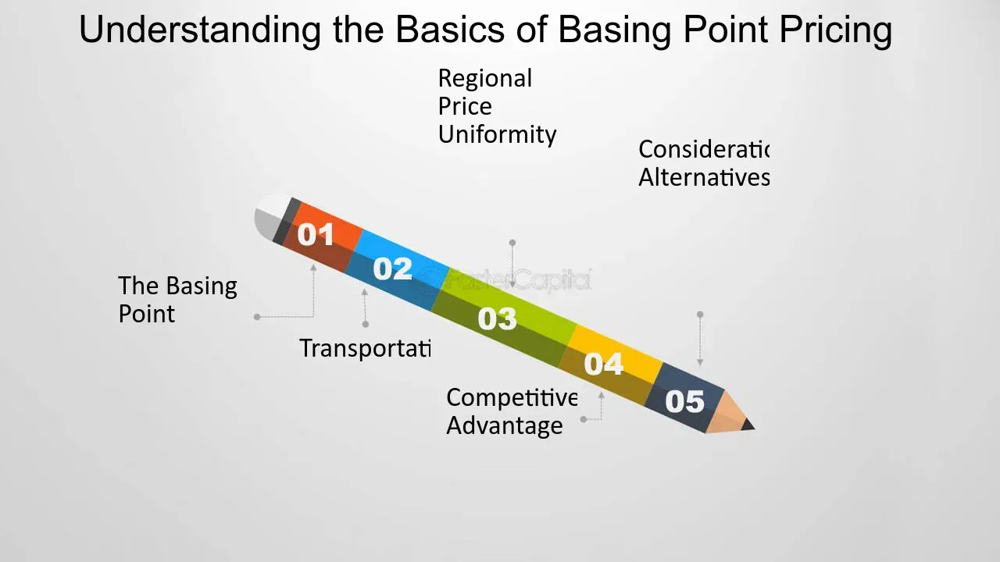

## Table of Contents

## What is the Basing Point Pricing System?

The Basing Point Pricing System is a way that companies set prices for their products. Instead of charging based on how far the product has to travel, they use a set location, called a basing point, to decide the price. For example, if a company in New York uses Chicago as their basing point, they will charge the same price to customers in New York as they would to customers in Los Angeles, as if the product started its journey from Chicago.

This system can make pricing simpler for companies because they don't have to calculate different prices for different distances. However, it can sometimes lead to unfair pricing. Customers closer to the basing point might end up paying more than they should, while those further away might pay less. Because of these issues, the Basing Point Pricing System is not used as much today, and many places have laws against it.

## How does the Basing Point Pricing System work?

The Basing Point Pricing System works by setting a fixed location, called a basing point, to determine the price of a product. Instead of charging customers based on how far the product needs to travel from where it's made, companies use this single location to calculate prices. For example, if a company chooses Chicago as its basing point, it will charge the same price to customers in New York as it would to customers in Los Angeles, as if the product started its journey from Chicago.

This system makes pricing easier for companies because they don't need to figure out different prices for different distances. However, it can lead to unfair pricing. Customers who are closer to the basing point might end up paying more than they should, while those further away might pay less. Because of these problems, the Basing Point Pricing System is not used as much anymore, and many places have laws against it.

## What are the origins of the Basing Point Pricing System?

The Basing Point Pricing System started in the United States during the late 1800s and early 1900s. It was mainly used by industries like steel, cement, and chemicals. Companies in these industries found it hard to set prices for their products because the cost of shipping could change a lot depending on where the product was going. So, they came up with the idea of using a single location, or basing point, to set prices. This made it easier for them to figure out what to charge everyone.

Over time, the system became popular because it made pricing simpler. However, it also caused problems. Some companies started to use the system to control prices and keep competition away. This led to unfair prices for customers. Because of these issues, the Basing Point Pricing System was challenged in court. In 1948, the U.S. Supreme Court ruled against it in a case called FTC v. Cement Institute, saying it was against antitrust laws. After that, the use of the system went down a lot.

## What industries commonly use the Basing Point Pricing System?

The Basing Point Pricing System was mainly used by industries like steel, cement, and chemicals. These industries found it hard to set prices because the cost of shipping could be different depending on where the product was going. So, they started using a single location, or basing point, to set prices. This made it easier for them to figure out what to charge everyone, no matter where they were.

Over time, the system became popular in these industries because it made pricing simpler. But it also caused problems. Some companies used it to control prices and keep competition away, which led to unfair prices for customers. Because of these issues, the system was challenged in court. In 1948, the U.S. Supreme Court ruled against it in a case called FTC v. Cement Institute, saying it was against antitrust laws. After that, the use of the Basing Point Pricing System went down a lot in these industries.

## What are the advantages of using the Basing Point Pricing System?

The Basing Point Pricing System makes pricing easier for companies. Instead of figuring out different prices for different places, companies can use one location, called a basing point, to set prices. This means they don't have to spend a lot of time and money working out how much it costs to ship things to different places. It's like having a simple rule that everyone follows, which can save a lot of work and make things more predictable.

Another advantage is that it can help companies stay competitive. When everyone uses the same basing point, it's easier for companies to know what other companies are charging. This can lead to more stable prices in the market. Customers might also like it because they know what to expect when buying from different companies, no matter where they are.

## What are the disadvantages of using the Basing Point Pricing System?

The Basing Point Pricing System can lead to unfair prices. When companies use a single location to set prices, customers who are close to that location might end up paying more than they should. For example, if the basing point is in Chicago, someone in Chicago might pay the same as someone in Los Angeles, even though it costs less to ship to Chicago. This means people near the basing point are not getting a fair deal. It can also hurt smaller companies that can't use the basing point system to their advantage, making it harder for them to compete.

Another problem is that the system can be used to control prices and keep competition away. Big companies might agree to use the same basing point to keep prices high and stop new companies from coming into the market. This can lead to a situation where customers have fewer choices and have to pay more. Because of these issues, the Basing Point Pricing System has been challenged in court and is not used as much anymore. Many places have laws against it to protect customers and keep the market fair.

## How does the Basing Point Pricing System affect competition?

The Basing Point Pricing System can make it hard for companies to compete fairly. When big companies agree to use the same basing point, they can keep prices high and stop new companies from coming into the market. This is because new companies might find it hard to match the prices set by the big companies, especially if they are far from the basing point. It's like the big companies are making a secret deal to control the market and keep competition away.

This system can also hurt smaller companies that can't use the basing point to their advantage. Smaller companies might have to charge different prices based on how far they have to ship their products, which can be more complicated and expensive. When big companies use the basing point system, they can set prices in a way that makes it hard for smaller companies to compete. This can lead to fewer choices for customers and higher prices, which is not good for the market.

## What are the legal implications of using the Basing Point Pricing System?

Using the Basing Point Pricing System can get companies into legal trouble. In the United States, the system was challenged in court and found to be against antitrust laws. In 1948, the U.S. Supreme Court ruled in the case FTC v. Cement Institute that using the basing point system was illegal because it could lead to price fixing and hurt competition. This means that companies using this system could be sued and face big fines.

Because of this ruling, many places have laws against using the Basing Point Pricing System. These laws are there to protect customers and make sure the market stays fair. Companies that try to use the system now could face legal action from the government or from other companies that feel they are being treated unfairly. So, it's important for companies to find other ways to set their prices that don't break the law.

## How has the Basing Point Pricing System evolved over time?

The Basing Point Pricing System started in the late 1800s and early 1900s in the United States. It was used a lot by industries like steel, cement, and chemicals. These industries found it hard to set prices because shipping costs could change a lot depending on where the product was going. So, they decided to use one location, called a basing point, to set prices for everyone. This made pricing simpler and helped companies know what other companies were charging. But over time, some companies started using the system to control prices and keep competition away, which caused problems.

In 1948, the U.S. Supreme Court ruled against the Basing Point Pricing System in the case FTC v. Cement Institute. The court said it was against antitrust laws because it could lead to unfair prices and hurt competition. After this ruling, many places made laws against using the system. Companies had to find other ways to set their prices that were fair and legal. Today, the Basing Point Pricing System is not used as much, but it's still important to understand its history and why it's not allowed anymore.

## Can you provide a case study where the Basing Point Pricing System was effectively implemented?

In the early 1900s, the U.S. Steel Corporation effectively used the Basing Point Pricing System. They chose Pittsburgh as their basing point. This meant they charged the same price to customers in New York as they did to customers in Los Angeles, as if the steel started its journey from Pittsburgh. This made pricing simpler for U.S. Steel because they didn't have to figure out different prices for different distances. It also helped them know what other steel companies were charging, which kept prices stable in the market.

However, this system caused problems too. Customers closer to Pittsburgh were paying more than they should, while those further away were getting a better deal. This led to unfair prices. Other steel companies started using the same basing point to control prices and keep new companies out of the market. Because of these issues, the Basing Point Pricing System was challenged in court. In 1948, the U.S. Supreme Court ruled against it in the case FTC v. Cement Institute, saying it was against antitrust laws. After that, U.S. Steel and other companies had to stop using the system and find other ways to set their prices.

## What are the alternatives to the Basing Point Pricing System?

One alternative to the Basing Point Pricing System is the FOB (Free on Board) pricing method. With FOB, the price of the product includes the cost to get it to a certain place, like a port or a factory. After that, the buyer pays for the rest of the shipping. This can be fairer because the price changes based on how far the product has to go. It also makes it easier for smaller companies to compete because they can set prices that match their shipping costs.

Another alternative is the zone pricing system. In this system, the country or area is divided into different zones. Each zone has its own price based on how far it is from where the product is made. This way, customers in different places pay different prices that are more fair. It's a bit more complicated than the basing point system, but it helps make sure that everyone pays a price that matches the real cost of shipping.

A third option is the uniform delivered pricing system. Here, the company charges the same price to all customers, no matter where they are. The company pays for all the shipping costs. This can be good for customers because they know exactly what they will pay, but it can be hard for the company because they have to cover the shipping costs themselves. It's simpler than the basing point system and can help keep prices stable, but it might not be the best choice for every company.

## How can businesses optimize their use of the Basing Point Pricing System?

Businesses can optimize their use of the Basing Point Pricing System by carefully choosing the right basing point. They should pick a location that is close to where most of their customers are. This way, the prices will be more fair for more people. For example, if a lot of customers are in the Midwest, choosing a basing point in Chicago could work well. It's also important for businesses to keep an eye on how other companies in their industry are setting prices. By doing this, they can make sure their prices are competitive and not too high or too low.

Another way to optimize the system is to be clear with customers about how prices are set. If customers understand that prices are based on a single location, they might be more okay with it. Businesses can also think about offering discounts or special deals for customers who are far from the basing point. This can help make the prices fairer for everyone. But businesses need to remember that using the Basing Point Pricing System can get them into legal trouble. They should always check the laws in their area and be ready to switch to a different pricing system if they need to.

## What is Basing Point Pricing and how does it work?

The basing point pricing system is a strategic method utilized predominantly in industries characterized by the distribution of heavy and bulky goods, such as cement and steel. This system establishes the price of a product by combining a base price with a shipping charge that is calculated from a predetermined geographic location known as the "basing point." 

In this pricing framework, the base price represents the cost of the product at the basing point, while the shipping charge is determined based on the distance from the basing point to the destination, irrespective of the actual point of manufacture or dispatch. This approach allows producers to unify the pricing structure by using a single source location as a reference point for transportation costs, regardless of where the goods are actually produced or stored.

For example, if the basing point is Chicago, Illinois, and the base price of a product is set at $100 with a predetermined shipping rate, every customer within a specified radius pays the same total cost, which includes the base price plus the calculated shipping fee from Chicago, even if the product is shipped from a different city. This standardization helps simplify logistical and financial planning by offering a consistent pricing model across different regions.

Mathematically, the total price (P) of a product under the basing point pricing system can be expressed as:

$$
P = P_{\text{base}} + C_{\text{shipping}}(D)
$$

where $P_{\text{base}}$ is the base price, and $C_{\text{shipping}}(D)$ represents the variable shipping cost, which is a function of the distance (D) from the basing point to the delivery location.

The primary advantage of the basing point system is the clarity and predictability it offers to customers, as it establishes a stable pricing structure that accounts for shipping costs determined from a fixed location. This can be critical for products like steel and cement, where transportation costs constitute a significant portion of the overall expense, thereby facilitating smoother transactions and planning for both suppliers and consumers. However, it is crucial to recognize that while this system streamlines pricing across different geographic locations, it inherently assumes uniformity in transportation logistics and cost, which might not always reflect actual market conditions.

## References & Further Reading

[1]: United States v. United States Gypsum Co., 333 U.S. 364 (1948). This case provides historical context on the legal scrutiny of basing point pricing in the cement industry.

[2]: Hay, G. A. (1982). "Basing Point Pricing and Public Policy." Western Economic Journal, 10(1), 1-14. This paper discusses the economic and legal implications of basing point pricing.

[3]: Clarkson, K. W., & Miller, R. L. (1982). "Industrial Organization: Theory, Evidence, and Public Policy." McGraw-Hill Book Company. This book covers various industrial pricing strategies, including basing point pricing.

[4]: ["Price Theory and Applications"](https://www.cambridge.org/core/books/price-theory-and-applications/93E760FED17D1D9BA30EC69AB325EF54) by Steven E. Landsburg. This book includes sections discussing basing point pricing within broader price theory contexts.

[5]: ["The Wealth of Nations"](https://en.wikipedia.org/wiki/The_Wealth_of_Nations) by Adam Smith. Although not directly about basing point pricing, this seminal work offers foundational insights into pricing and market behaviors that underpin modern pricing strategies.