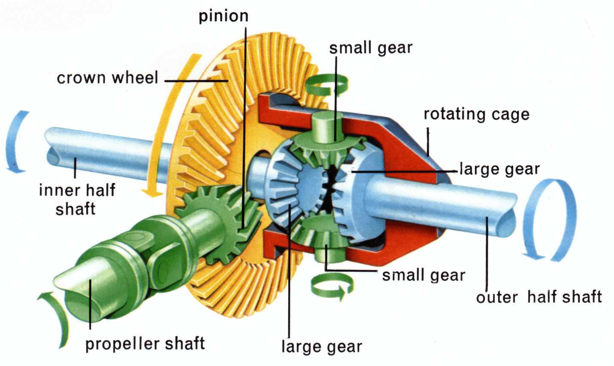

## Table of Contents

## What is basis differential?

Basis differential is a term used in finance and commodity trading. It refers to the difference between the price of a commodity in one market and the price of the same commodity in another market. For example, if wheat is trading at $5 per bushel in Chicago and $5.10 per bushel in Kansas City, the basis differential between these two markets is $0.10 per bushel.

This concept is important because it helps traders and businesses understand and manage the risks associated with buying and selling commodities in different locations. By knowing the basis differential, they can make better decisions about when and where to buy or sell their products. For instance, if a farmer in Kansas City knows the basis differential with Chicago, they can decide whether it's more profitable to sell their wheat locally or transport it to Chicago.

## How is basis differential calculated?

Basis differential is calculated by finding the difference between the price of a commodity in two different markets. For example, if corn is selling for $4 per bushel in one market and $4.20 per bushel in another market, the basis differential is $0.20 per bushel. This calculation helps people see how much more or less they would get for their commodity in different places.

People use basis differential to make smart choices about where to buy or sell their goods. If a farmer knows the basis differential between their local market and a bigger market like Chicago, they can decide if it's worth the cost to transport their product to the bigger market. Understanding this difference helps them plan better and possibly make more money.

## Why is basis differential important in trading and finance?

Basis differential is really important in trading and finance because it helps people understand the price differences of the same thing in different places. This is useful for traders and businesses who buy and sell things like wheat, corn, or oil. By knowing the basis differential, they can figure out where to buy something cheaper and where to sell it for more money. This can help them make more profit and manage their risks better.

For example, if a farmer knows that wheat is cheaper in their local market than in a bigger city, they might decide to buy wheat locally and sell it in the city for a higher price. This knowledge can also help them decide if it's worth the cost to transport their goods to a different market. Understanding basis differential can make a big difference in how much money they can make and how well they can plan their business.

## Can you explain the relationship between basis differential and futures contracts?

Basis differential and futures contracts are closely related in the world of trading. A futures contract is an agreement to buy or sell a commodity at a set price on a future date. The basis differential comes into play because it shows the difference between the local cash price of a commodity and the price of that commodity in the futures market. For example, if the local price of corn is $4 per bushel and the futures price in Chicago is $4.20 per bushel, the basis differential is $0.20 per bushel.

Traders and farmers use the basis differential to make smart decisions about their futures contracts. If a farmer expects the basis differential to get smaller, they might sell their corn at the local price and then buy a futures contract to lock in a higher price later. On the other hand, if they think the basis differential will get bigger, they might hold onto their corn and wait for a better local price. Understanding how the basis differential works with futures contracts helps them plan better and possibly make more money.

## What factors influence the basis differential?

Several things can change the basis differential. One big thing is how much of a commodity is available in a certain place. If there's a lot of corn in one area, the price might go down, making the basis differential bigger compared to a place where corn is scarce. Another thing is how easy or hard it is to move the commodity from one place to another. If it's expensive or difficult to transport corn from Kansas City to Chicago, this can make the basis differential bigger too.

Other factors include the time of year and what people expect to happen in the future. For example, if everyone thinks there will be a lot of wheat next season, the basis differential might get bigger now because people are less willing to pay high prices. Also, things like weather, government rules, and what's happening in the economy can change the basis differential. If a storm makes it hard to grow crops in one area, the basis differential could change a lot because the supply and demand in different places will be different.

## How does basis differential impact hedging strategies?

Basis differential is really important when people use hedging strategies to protect themselves from price changes. Hedging is like buying insurance for the price of a commodity. If a farmer wants to make sure they get a good price for their corn, they might use a futures contract to lock in a price. The basis differential helps them figure out if this is a good idea. If the basis differential is small, it might be a good time to hedge because the local price and the futures price are close together. But if the basis differential is big, they might wait because the local price could go up and make hedging less useful.

Understanding the basis differential also helps people decide when to buy or sell their futures contracts. If a farmer thinks the basis differential will get smaller, they might sell their corn now and buy a futures contract to lock in a higher price later. But if they think the basis differential will get bigger, they might hold onto their corn and wait for a better local price. By keeping an eye on the basis differential, farmers and traders can make better choices about when to hedge and how to manage their risks.

## What are the common methods to analyze basis differential?

People use different ways to look at basis differential. One common way is to keep track of the basis over time. They do this by making charts and graphs that show how the basis differential changes from day to day or month to month. By looking at these charts, people can see patterns and guess what might happen next. For example, if the basis differential usually gets smaller in the fall, a farmer might decide to sell their corn then.

Another way to analyze basis differential is to compare it with other things that might affect it. This could be things like the weather, how much of a commodity is available, or what's happening in the economy. By looking at these other factors, people can understand why the basis differential is changing and make better guesses about the future. For instance, if there's a drought in one area, people might expect the basis differential to get bigger because there will be less of the commodity available there.

A third method is to use math and computer models to predict the basis differential. These models take in a lot of information and use it to make guesses about what the basis differential will be in the future. Traders and businesses use these models to help them make decisions about buying and selling commodities. While these models aren't perfect, they can give people a good idea of what might happen and help them plan their strategies.

## How does basis differential vary across different commodities?

Basis differential can be different for each type of commodity because each one has its own way of being produced, moved, and used. For example, wheat might have a smaller basis differential between two places if it's easy to move and there's a lot of it. But oil might have a bigger basis differential because it's harder to move and the price can change a lot depending on where it's coming from and going to. So, the kind of commodity matters a lot when looking at basis differential.

Also, the time of year can affect the basis differential differently for different commodities. For wheat, the basis differential might change a lot around harvest time because there's suddenly a lot more wheat available. But for something like natural gas, the basis differential might change more in the winter when people use more of it to heat their homes. So, understanding how the basis differential works for each commodity can help people make better decisions about when and where to buy or sell.

## What role does seasonality play in basis differential?

Seasonality can really change the basis differential because it affects how much of a commodity is available and how much people want it. For example, during harvest time, there might be a lot more corn available in one place, which can make the local price go down. This can make the basis differential bigger compared to a place where there isn't as much corn. On the other hand, if it's winter and people need more natural gas to heat their homes, the demand goes up, and this can make the basis differential change too.

Understanding how seasonality affects the basis differential is important for people who buy and sell commodities. If a farmer knows that the basis differential for wheat usually gets smaller after the harvest, they might decide to sell their wheat then to get a better price. Or if someone who trades natural gas knows that the basis differential gets bigger in the winter, they might buy gas in the summer when it's cheaper and sell it in the winter when it's more expensive. By keeping an eye on the seasons, people can make smarter choices about when to buy or sell their goods.

## Can you discuss the impact of storage costs on basis differential?

Storage costs can really change the basis differential. If it costs a lot to store a commodity like corn or oil, it can make the price in one place go up compared to another place where storage is cheaper. For example, if it's expensive to store wheat in a warehouse in one city, the price of wheat there might be higher than in another city where storage is cheaper. This difference in price because of storage costs can make the basis differential bigger.

People who buy and sell commodities need to think about storage costs when they look at the basis differential. If they know that storage costs are going to go up in one place, they might decide to move their commodity to a place where it's cheaper to store. This can help them save money and maybe even make more profit. Understanding how storage costs affect the basis differential can help them make better choices about where to keep their goods.

## How do market participants use basis differential to make trading decisions?

Market participants use basis differential to make smart trading decisions. They look at the difference between the local price of a commodity and the price in the futures market. For example, if corn is cheaper in their local market than in the futures market, they might decide to buy corn locally and sell it later at the higher futures price. This can help them make more money. By understanding the basis differential, traders and farmers can figure out the best time and place to buy or sell their goods.

The basis differential also helps people decide when to use futures contracts to hedge their risks. If they think the basis differential will get smaller, they might sell their commodity now and buy a futures contract to lock in a higher price later. But if they expect the basis differential to get bigger, they might wait to sell their commodity, hoping for a better local price. By keeping an eye on the basis differential, market participants can plan better and manage their risks more effectively.

## What advanced statistical models are used to predict changes in basis differential?

People use fancy math models to guess how the basis differential might change. One common model is called time series analysis. This model looks at how the basis differential has changed in the past and uses that information to make guesses about the future. Another model is called regression analysis. This one looks at how other things, like the weather or how much of a commodity is available, affect the basis differential. By putting all this information into the model, people can get a better idea of what might happen next.

Another advanced model is called the autoregressive integrated moving average (ARIMA) model. This model is really good at figuring out patterns in data over time. It can help people see if the basis differential is going up or down and by how much. Some people also use [machine learning](/wiki/machine-learning) models, which can look at a lot of different information at once and find patterns that might be hard for people to see. These models can help traders and farmers make better guesses about the basis differential and plan their buying and selling more carefully.

## What is Understanding Price Spread?

Price spread refers to the difference between the buying price (bid) and the selling price (ask) of a financial instrument. This spread is a pivotal element in assessing market [liquidity](/wiki/liquidity-risk-premium), influencing both the cost of trading and the income streams for brokers. A narrower spread typically indicates a more liquid market, suggesting that there are sufficient buyers and sellers and that transactions can be completed quickly and efficiently. Conversely, a wider spread often reflects less liquidity, which can lead to higher trading costs and slower transaction speeds.

The bid-ask spread can be formally expressed as:

$$
\text{Spread} = \text{Ask Price} - \text{Bid Price}
$$

In financial markets, spread trading involves capitalizing on these price differentials between related financial instruments. The objectives of spread trading can vary, from hedging against market [volatility](/wiki/volatility-trading-strategies) to exploiting inefficiencies and diversifying investments. Traders utilize various strategies to benefit from price spreads, with many focusing on changes in the relative values of instruments rather than their absolute price movements.

One common type of spread trading is the calendar spread, which involves taking simultaneously long and short positions in futures or options of the same underlying asset but with different expiration dates. This strategy allows traders to profit from temporal price movements linked to factors such as changes in interest rates, expectations about earnings, or other economic indicators.

Another category is inter-commodity spreads, which make use of the price differential between two related or correlated commodities. For instance, traders might compare [crude oil](/wiki/crude-oil) and natural gas prices or the relationship between corn and soybean futures. By examining such relationships, traders can potentially profit from deviations in expected or historical price correlations.

Each type of spread trading strategy is designed for specific market conditions, requiring traders to possess an in-depth understanding of market dynamics, as well as the ability to analyze and predict price movements based on historical and current data. This nuanced approach to trading compels traders to constantly adapt their strategies to align with shifting market conditions, enabling them to sustain profitability over time.

## What is Basis Differential and How is it Explained?

Basis differential is a crucial concept in the commodities and futures markets, representing the difference between the spot price of a commodity and the futures price used in hedging. Mathematically, it can be expressed as:

$$
\text{Basis} = \text{Spot Price} - \text{Futures Price}
$$

The basis differential plays a significant role in hedging strategies, as it influences the efficiency of managing price exposure. By understanding and analyzing this differential, traders can better assess market conditions and forecast potential changes.

In market terminology, a positive basis, also known as contango, occurs when the futures price is higher than the spot price. This situation often suggests that the market expects the commodity's price to rise over time, reflecting costs such as storage and insurance. On the other hand, a negative basis, or backwardation, indicates that the spot price is higher than the futures price, suggesting an expectation of declining prices due to factors such as improved supply conditions or reduced demand.

For traders, understanding the basis differential is vital for optimizing hedging strategies and managing risks effectively. A stable basis can enhance the predictability of hedging outcomes, while a volatile basis might require more dynamic adjustments to hedge positions. Traders typically monitor basis movements to adjust their strategies accordingly, ensuring they maintain effective coverage against price fluctuations in the underlying commodity markets.

## References & Further Reading

Advances in Financial Machine Learning by Marcos Lopez de Prado provides an insightful perspective on applying machine learning techniques to financial markets. It discusses the intricacies of feature engineering, the use of meta-labeling, and advanced algorithms that enhance trading strategies. The book emphasizes the importance of innovative approaches in managing big data and identifies potential pitfalls in traditional financial model assumptions.

Evidence-Based Technical Analysis by David Aronson challenges conventional wisdom in technical analysis by promoting a scientific approach. The text focuses on applying statistical inference and the scientific method to evaluate trading signals, which aids in distinguishing between random patterns and genuine market indicators.

Machine Learning for Algorithmic Trading by Stefan Jansen offers comprehensive coverage on implementing machine learning models in trading strategies. The book provides a detailed exploration of the use of Python for building, testing, and deploying trading algorithms. It covers a broad range of techniques, from supervised learning to [reinforcement learning](/wiki/reinforcement-learning), essential for developing adaptive trading systems.

Quantitative Trading by Ernest P. Chan is a practical guide on starting an [algorithmic trading](/wiki/algorithmic-trading) business. Chan draws from his own experiences to advise traders on creating and testing market strategies. The text covers aspects of trading system development, including the [backtesting](/wiki/backtesting) process, risk management, and market analysis, providing a robust framework for aspiring quantitative traders.

Options, Futures, and Other Derivatives by John C. Hull is considered a cornerstone in understanding derivative instruments. Hull's work thoroughly explains the fundamental concepts of options and futures markets, pricing models, and hedging strategies. His book is indispensable for traders seeking a solid grounding in derivatives and their applications in financial risk management.

