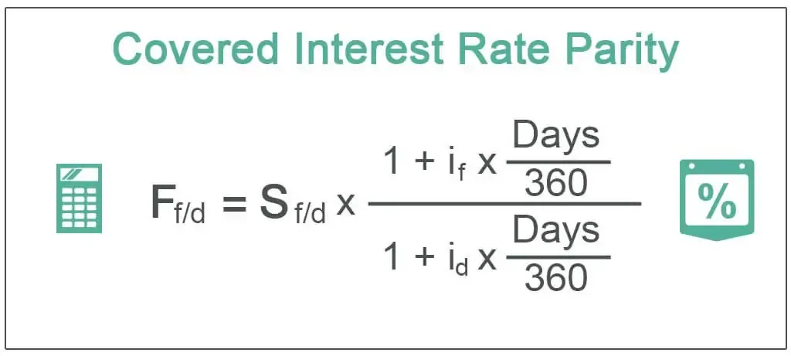

Algorithmic trading, often referred to as algo trading, represents a transformative advancement in financial market operations. This approach employs sophisticated algorithms to automatically execute trades at speeds significantly faster than human traders can achieve. The adoption of algorithmic trading has ushered in a new era of efficiency and precision in market transactions, allowing participants to capitalize on minor price fluctuations that would otherwise be difficult to exploit manually.

Within this revolutionary framework, basis grade finance differentials emerge as pivotal elements, particularly in commodity trading. Basis grade represents the established quality standard that a deliverable commodity must meet in a futures contract. This standardization ensures consistency and fairness in trading, allowing market participants to transact with confidence in the quality of the goods being traded.



Finance differentials, on the other hand, encompass the variability in the quality or location of a commodity, which directly affects the permissible price adjustments in futures contracts. These differentials are crucial as they can significantly influence trade pricing and execution strategies, ultimately impacting the profitability of trading operations.

In this context, the integral role of basis grade and finance differentials becomes apparent. By grasping these concepts, traders and investors can optimize their algorithmic trading strategies, effectively managing risks and exploiting market opportunities. Such an understanding enables market participants to navigate the complex dynamics of financial markets with greater acumen and strategic foresight.

Ultimately, the comprehension and integration of basis grade and finance differentials into trading algorithms not only enhance market operations but also provide traders with a substantial competitive edge. As financial markets continue to evolve, the reliance on sophisticated algorithms capable of analyzing complex financial differentials is becoming increasingly foundational to successful trading strategies.

## Table of Contents

## Understanding Basis Grade

Basis grade is a critical concept in commodity futures trading, establishing the minimum quality standards a deliverable commodity must meet in order to be used in a futures contract. This specification is essential for ensuring uniformity and consistency across trades, as it provides a standardized measure against which commodities are evaluated. By setting these standards, basis grade helps to maintain the integrity of the trading process, ensuring that all parties involved have a clear understanding of the quality of the commodity being exchanged.

Products that meet or exceed the basis grade often command higher market values. This is because higher-quality commodities present lower risks to buyers, who can be more confident in the product's consistency and performance. Consequently, sellers of commodities that meet rigorous basis grade criteria may secure more favorable trading terms, as buyers are often willing to pay a premium for assurance of quality.

Verification of compliance with basis grade is typically required, and a grading certificate from an approved inspector is commonly used for this purpose. The grading process involves a detailed assessment of the commodity's attributes, such as physical characteristics, purity, and composition, as prescribed by the futures contract. This systematic evaluation ensures that the product aligns with specified standards, minimizing disputes over quality during the trading process.

For instance, in the case of agricultural commodities like wheat or corn, basis grades might specify moisture content, weight per bushel, or permissible levels of impurities. Adhering to these specifications is crucial for the fluid operation of futures markets, which rely on the predictability and reliability of the commodities being traded.

In conclusion, understanding basis grade and its implementation in futures contracts is vital for participants in the commodity markets. It not only facilitates smoother trading processes but also enhances the market value of compliant products, providing economic benefits to producers and traders alike.

## Finance Differentials in Trading

Finance differentials refer to variations in the quality or location of a commodity, which directly affect the price adjustments allowed in futures contracts. These differentials are essential in pricing strategies as they can significantly influence both the pricing and execution of trades, ultimately impacting the profitability of trading strategies.

The variations in quality can arise from differences in the inherent characteristics of commodities such as purity, moisture content, or size. For example, [crude oil](/wiki/crude-oil) may be graded on sulfur content, with low-sulfur grades often commanding a higher price. Location-based differentials, on the other hand, account for logistical and transportation costs, as the delivery point of a commodity can lead to price variations. A commodity located closer to its final market typically incurs lower transportation costs, which is factored into its pricing.

Understanding these differentials allows traders to anticipate potential price adjustments in the market. By recognizing where and how these variations occur, traders can strategize to either capitalize on favorable differentials or mitigate the risks associated with unfavorable ones. For example, a trader might anticipate an increase in demand for a particular grade of oil and choose to invest in futures contracts that accommodate the expected price escalation due to quality differentials.

Some futures contracts explicitly permit trading on differentials, providing traders with the opportunity to exploit price discrepancies. These contracts are structured to allow the exchange of commodities not strictly in line with the basis grade, thus accommodating quality and location variations. Traders can benefit from these variations by effectively utilizing [arbitrage](/wiki/arbitrage) strategies, where they buy a commodity in one market at a lower price and simultaneously sell it in another market at a higher price, thus exploiting the differential.

A practical method to harness these opportunities is through [algorithmic trading](/wiki/algorithmic-trading), which can efficiently analyze and react to differential data. By integrating code that continuously scans for differential opportunities, traders can automate the execution of trades, swiftly capturing potential gains. Here's a simple Python example for arbitrage based on price differentials:

```python
def find_arbitrage_opportunities(prices_market1, prices_market2):
    opportunities = []
    for commodity in prices_market1:
        price_market1 = prices_market1[commodity]
        price_market2 = prices_market2.get(commodity, float('inf'))

        if price_market1 < price_market2:
            profit = price_market2 - price_market1
            opportunities.append((commodity, profit))

    return opportunities

# Example usage
prices_market1 = {'commodityA': 100, 'commodityB': 200}
prices_market2 = {'commodityA': 110, 'commodityB': 195}

arbitrage_opportunities = find_arbitrage_opportunities(prices_market1, prices_market2)
print(arbitrage_opportunities)
```

In this code, differences in prices between two markets for the same commodity are identified, and potential arbitrage opportunities are listed. This approach to understanding and exploiting finance differentials underscores their vital role in shaping profitable trading strategies in the complex world of futures trading.

## The Role of Algo Trading

Algorithmic trading utilizes computer algorithms to automate trading decisions and executions, optimizing these processes for speed and accuracy. This automation is particularly beneficial in markets where price fluctuations occur quickly, allowing traders to respond to market movements in real-time. 

By incorporating algorithmic trading, traders can efficiently capitalize on basis grade differentials. These differentials reflect variations in commodity quality or location that influence price discrepancies within futures contracts. As markets fluctuate, algorithmic systems can detect and act on these differentials almost instantaneously, thereby maximizing potential profits.

The integration of algorithmic trading with basis grade analysis enhances the efficacy of trading strategies by offering a competitive edge in commodity markets. As commodities meeting or exceeding the basis grade command higher market values, algorithms can be designed to prioritize trades based on these quality assessments, ensuring trades align with predefined criteria for quality. This alignment can be achieved through the use of grading certificates or inspection reports, which are automatically interpreted by the trading algorithms.

Algo trading systems are also inherently capable of automatically assessing finance differentials. By detecting variances allowed in futures contracts concerning quality or geographical location, these systems make rapid decisions to exploit price disparities efficiently. Python, a language favored for algorithmic trading, could implement these processes effectively. For example, an algorithm could be coded to monitor market feeds and execute trades based on identified basis grade differentials:

```python
import pandas as pd

def execute_trade_based_on_differential(market_data, threshold=0.05):
    for data in market_data:
        # Calculate the differential
        differential = data['futures_price'] - data['spot_price']

        # Check if differential exceeds the threshold
        if abs(differential) > threshold:
            if differential > 0:
                execute_trade("buy", data['commodity'], data['futures_price'])
            else:
                execute_trade("sell", data['commodity'], data['futures_price'])

def execute_trade(action, commodity, price):
    print(f"Executing {action} order for {commodity} at ${price}")

# Example market data
market_data = [
    {'commodity': 'Wheat', 'futures_price': 105.0, 'spot_price': 100.0},
    {'commodity': 'Corn', 'futures_price': 98.0, 'spot_price': 100.5}
]

execute_trade_based_on_differential(market_data)
```

This snippet reads hypothetical market data and executes buy or sell orders based on calculated differentials, showcasing how algorithms dynamically respond to market conditions. Traders leveraging such sophisticated technology can enhance their operations, remaining agile in rapidly evolving financial environments.

## Benefits and Challenges

Algorithmic trading, when integrated with basis grades and finance differentials, provides numerous advantages, notably improving risk management and enhancing market efficiency. The deployment of sophisticated algorithms allows traders to better hedge against market uncertainties by precisely assessing and responding to basis differentials. These differentials occur when the spot price of a commodity differs from the futures price, creating opportunities for arbitrage. For instance, if a trader identifies a negative basis differential ($\text{Basis} = \text{Spot Price} - \text{Futures Price}$), indicating that the spot price is lower than the futures price, they could buy the commodity in the spot market and sell a futures contract, profiting from the price convergence as the contract's expiration approaches.

However, the challenges associated with algorithmic trading are substantial. The sheer [volume](/wiki/volume-trading-strategy) of data involved in monitoring various markets and commodities requires robust data management systems. Traders must handle large, complex datasets while maintaining low latency to ensure timely trade execution. Moreover, price dynamics in the commodities market can shift rapidly due to geopolitical events, supply chain fluctuations, and changes in demand, necessitating adaptable algorithms that can respond to new information swiftly.

Effective algorithm design is central to overcoming these hurdles. Algorithms must be capable of real-time data analysis to detect and act upon market signals. This requires a continuous feedback loop where algorithms are updated based on recent market behavior. A well-designed algorithm might employ [machine learning](/wiki/machine-learning) techniques to predict future price movements, using historical data to inform model training.

```python
import pandas as pd
from sklearn.model_selection import train_test_split
from sklearn.linear_model import LinearRegression

# Example model for predicting basis differentials
# Simulated data for demonstration purposes
data = {
    'spot_price': [102, 105, 100, 98, 101],
    'futures_price': [100, 103, 99, 97, 102],
    'basis_differential': [2, 2, 1, 1, -1]  # Spot price - Futures price
}

df = pd.DataFrame(data)

# Train-test split
X = df[['spot_price', 'futures_price']]
y = df['basis_differential']
X_train, X_test, y_train, y_test = train_test_split(X, y, test_size=0.2, random_state=42)

# Linear regression model
model = LinearRegression()
model.fit(X_train, y_train)

# Predictions
predictions = model.predict(X_test)
print("Predicted Basis Differentials:", predictions)
```

Constant market analysis is also crucial. Traders must regularly review and update their algorithms to ensure they remain effective under changing market conditions. Understanding macroeconomic indicators, geopolitical events, and sector-specific news will provide the critical context needed to interpret algorithmic output correctly and make informed trading decisions.

In summary, while the integration of basis grades and finance differentials in algorithmic trading offers significant benefits, it also poses challenges that require sophisticated technology, strategic insights, and continual adaptation.

## Case Studies and Examples

Algorithmic trading has gained significant traction in commodity markets, particularly in sectors like corn trading, where the exploitation of basis grade differentials can yield profitable opportunities. The basis grade differential arises when there's a difference between the local cash prices and the futures market prices. This differential is essential in determining arbitrage opportunities and guiding trading decisions in dynamic market environments.

Consider, for instance, the case of negative basis grades in corn trading. A negative basis occurs when the local cash price of corn is below its futures market price. This scenario frequently arises due to factors such as transportation costs, storage capacity, or regional supply and demand variations. Traders utilizing algorithmic trading systems can capitalize on these discrepancies by executing a spread strategy. A basic form of such a strategy may involve buying corn at the lower local cash price and simultaneously selling futures contracts at the higher market price.

The strategy benefits from the convergence of cash and futures prices as the delivery date for the futures contract approaches. Typically, the basis narrows over time due to logistical adjustments and market alignment, thus offering a window for profit realization. For the execution of such strategies, the algorithms need to consider numerous factors, including real-time [volatility](/wiki/volatility-trading-strategies), storage costs, and potential delays that may affect the futures pricing.

Python can be used effectively to model such strategies thanks to its data manipulation capabilities and libraries for quantitative finance. Here is a simple conceptual outline of how such an algorithm might be implemented:

```python
import pandas as pd
import numpy as np

# Load market data
def load_data():
    # Fetch historical cash and futures prices
    cash_prices = pd.read_csv('local_cash_prices.csv')
    futures_prices = pd.read_csv('futures_market_prices.csv')
    return cash_prices, futures_prices

# Calculate basis differentials
def calculate_basis(cash, futures):
    # Assuming both cash and futures dataframes have a date column
    basis = pd.DataFrame()
    basis['date'] = cash['date']
    basis['basis'] = cash['price'] - futures['price']
    return basis

# Identify trading signals
def identify_signals(basis):
    basis['signal'] = np.where(basis['basis'] < 0, 'Buy cash, Sell futures', 'Hold')
    return basis

# Load the data
cash_data, futures_data = load_data()

# Calculate the basis
basis_data = calculate_basis(cash_data, futures_data)

# Generate signals based on negative basis
signals = identify_signals(basis_data)

print(signals.head())
```

In historical contexts, the application of these algorithms has allowed traders to achieve substantial profits by accurately predicting convergence and optimizing the timing of transactions. Strategic decision-making is further refined by real-world considerations such as regional demand forecasts and transportation logistics. Thus, the synthesis of basis grade analysis with algorithmic trading provides both a robust risk management approach and an opportunity to exploit arbitrage in commodity markets like corn.

## Conclusion

Understanding basis grade finance differentials is pivotal for implementing successful algorithmic trading strategies. By effectively integrating these financial concepts into trading algorithms, traders can enhance their market operations, optimizing for speed and precision. The sophisticated nature of algorithmic trading systems enables them to quickly analyze vast datasets, recognize patterns, and execute trades based on computed differentials. This capability empowers traders to exploit discrepancies and arbitrage opportunities across various financial markets, thus improving profit margins and risk management.

As the evolution of financial markets continues, the reliance on advanced algorithms will become even more pronounced. These algorithms, combined with [artificial intelligence](/wiki/ai-artificial-intelligence) and machine learning technologies, are poised to revolutionize trading by enhancing decision-making processes and execution efficiency. This technological integration allows for the quick adaptation to market changes and ensures that trading strategies remain robust against volatility and price fluctuations.

Remaining informed and adept with the concepts of basis grade finance differentials provides a significant advantage in this evolving landscape. As financial markets become increasingly complex, proficiency in these areas allows traders to design more effective algorithms and maintain a competitive edge. An understanding of how basis grade differentials impact commodity pricing and how these can be leveraged within an algorithmic framework is essential for strategic trading decisions. Embracing and mastering these advancements will be crucial for traders aiming to succeed in the future of financial markets.

## References & Further Reading

[1]: Gabbi, G., & Sironi, A. (2016). ["The Economics of Commodity Trading Firms."](https://www.trafigura.com/media/k4ocz3zq/2015_trafigura_economics_of_commodity_trading_firms_abridged_en.pdf) Journal of Economics and Business.

[2]: Hull, J. (2018). ["Options, Futures, and Other Derivatives"](https://www.amazon.com/Options-Futures-Other-Derivatives-9th/dp/0133456315). Pearson.

[3]: Lo, A. W. (2012). ["Adaptive Markets: Financial Evolution at the Speed of Thought"](https://archive.org/details/adaptivemarketsf0000loan). Princeton University Press.

[4]: Narang, R. K. (2013). ["Inside the Black Box: A Simple Guide to Quantitative and High-Frequency Trading"](https://onlinelibrary.wiley.com/doi/book/10.1002/9781118662717). Wiley.

[5]: Patel, S. (2007). ["Commodity Futures and Options: A Study of Their Economics"](https://acfr.aut.ac.nz/__data/assets/pdf_file/0006/188160/152523.2-M-Bohmann-Price-Discovery-in-Commodity-Derivatives.pdf). Routledge.

[6]: Simchi-Levi, D., & Kaminsky, P. (2003). ["Designing and Managing the Supply Chain: Concepts, Strategies, and Case Studies"](https://www.researchgate.net/publication/264332291_Designing_and_Managing_the_Supply_Chain_Concepts_Strategies_and_Case_Studies_David_Simchi-Levi_Philip_Kaminsky_Edith_Simchi-Levi). McGraw-Hill Education.