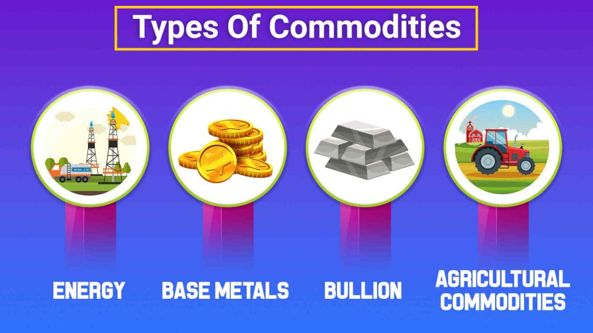

## Table of Contents

## What is Basis Grade?

Basis Grade is a standard quality of a commodity that is used as a reference point for trading. It helps buyers and sellers agree on the value of the commodity they are trading. For example, if you are trading wheat, the Basis Grade would be a specific type of wheat that everyone agrees is the standard. This makes it easier to set prices and understand the quality of what is being bought or sold.

When trading, the price of a commodity can be adjusted based on how it compares to the Basis Grade. If the commodity is better than the Basis Grade, the price might be higher. If it is worse, the price might be lower. This system helps keep trading fair and clear for everyone involved. By using a Basis Grade, traders can easily understand and communicate about the quality and price of the commodities they are dealing with.

## Why is Basis Grade important in commodity trading?

Basis Grade is important in commodity trading because it sets a standard for the quality of the commodity being traded. This standard helps everyone involved in the trade know exactly what they are buying or selling. Without a Basis Grade, it would be hard to agree on prices because people might have different ideas about what counts as good quality. By having a clear standard, traders can avoid confusion and disagreements about the value of the commodity.

Using a Basis Grade also makes trading smoother and more efficient. When everyone knows the standard, they can quickly compare the commodity they are trading to the Basis Grade and adjust the price accordingly. If the commodity is better than the Basis Grade, the price goes up. If it's worse, the price goes down. This system helps keep trading fair and straightforward, making it easier for buyers and sellers to do business with each other.

## How is Basis Grade determined?

Basis Grade is determined by organizations or groups that set standards for different commodities. These groups might be government agencies, industry associations, or exchanges where commodities are traded. They look at things like the size, shape, color, and other qualities of the commodity to decide what counts as the standard. For example, if they are setting the Basis Grade for corn, they might look at the moisture level, the size of the kernels, and how free it is from damage or disease.

Once these groups have decided on the qualities that make up the Basis Grade, they share this information with everyone who trades that commodity. This helps make sure that everyone is using the same standard. The Basis Grade can change over time if the groups decide that new information or technology means the standard should be updated. But until it changes, everyone uses the same Basis Grade to help them buy and sell the commodity fairly and clearly.

## What are the common standards used to establish Basis Grade?

Common standards used to establish Basis Grade often include things like the physical characteristics of the commodity. For example, when setting the Basis Grade for grains like wheat or corn, experts might look at the moisture content, the size and weight of the kernels, and whether the grains are free from damage or disease. These physical qualities help determine if a batch of the commodity meets the standard or not.

In addition to physical characteristics, other standards can include chemical composition and purity. For commodities like metals, the Basis Grade might be set based on the percentage of the main metal, like copper or gold, and how much of other substances are mixed in. For agricultural products, standards might also consider factors like the presence of foreign materials or the level of certain nutrients. These standards help ensure that the commodity is of a consistent quality that buyers and sellers can rely on.

## Can you explain the concept of Basis Grade differentials?

Basis Grade differentials are the differences in price between a commodity and its Basis Grade. When a commodity is better than the Basis Grade, it might cost more. If it's worse, it might cost less. These price differences help traders know how much to pay or charge for the commodity based on its quality.

For example, if you're selling wheat and your wheat is drier and has bigger kernels than the Basis Grade, you might get a higher price. But if your wheat is wetter or has smaller kernels, you might have to sell it for less. Basis Grade differentials make trading fair by adjusting the price to match the quality of the commodity.

## How do Basis Grade differentials affect pricing in commodity markets?

Basis Grade differentials help set prices in commodity markets by showing how a commodity compares to the standard. If a commodity is better than the Basis Grade, it can be sold for more money. For example, if a farmer's corn is drier and has bigger kernels than the Basis Grade, they can ask for a higher price because their corn is of higher quality. On the other hand, if the corn is wetter or has smaller kernels, the farmer might have to sell it for less because it doesn't meet the standard as well.

These price differences make trading fair and clear for everyone. Buyers know what they are getting and how much they should pay, and sellers know what they can expect to earn based on the quality of their commodity. By using Basis Grade differentials, commodity markets can work smoothly, with prices that reflect the true value of what is being bought and sold.

## What factors influence changes in Basis Grade differentials?

Changes in Basis Grade differentials can happen because of many things. One big reason is the supply and demand of the commodity. If there is a lot of a commodity around, the price difference for better quality might get smaller because people are not as willing to pay more. But if the commodity is hard to find, people might pay more for better quality, making the price difference bigger. Also, new technology or ways of farming can change how good the commodity is, which can affect the price difference too.

Another [factor](/wiki/factor-investing) is the weather. Bad weather can make it hard to grow good crops, so the price difference for better quality might go up because there is less of the good stuff around. On the other hand, if the weather is good and everyone can grow high-quality crops, the price difference might go down. Changes in what people want can also affect the price difference. If more people want high-quality food, the price difference for better quality might go up.

## How can traders use Basis Grade differentials to their advantage?

Traders can use Basis Grade differentials to their advantage by understanding how the quality of a commodity affects its price. If a trader knows that their commodity is better than the Basis Grade, they can ask for a higher price. For example, if a farmer's wheat is drier and has bigger kernels than the standard, they can sell it for more money. By knowing the market and what buyers are looking for, traders can make sure they get the best price for their high-quality goods.

On the other hand, if a trader's commodity is not as good as the Basis Grade, they can still use this information to their advantage. They might look for buyers who are okay with lower quality and offer them a lower price. This way, they can still sell their goods and make a profit, even if it's not as much as they would get for higher quality. Understanding Basis Grade differentials helps traders make smart decisions about when and how to sell their commodities.

## What are some examples of commodities that use Basis Grade?

Many different commodities use Basis Grade to help with trading. One example is wheat. When people trade wheat, they look at things like how dry it is, the size of the kernels, and if it's free from damage or disease. If a farmer's wheat is better than the Basis Grade, they can sell it for more money. If it's not as good, they might have to sell it for less. This helps everyone know what they are buying and selling.

Another example is corn. Just like wheat, the Basis Grade for corn is based on things like moisture content, kernel size, and how free it is from damage. If a batch of corn meets or is better than the Basis Grade, it can be sold for a higher price. If it's worse, the price goes down. This system helps keep trading fair and clear for everyone involved.

Metals like gold and copper also use Basis Grade. For these commodities, the standard is based on the purity of the metal. If a batch of gold is purer than the Basis Grade, it will be worth more. If it has more impurities, it will be worth less. This helps buyers and sellers agree on a fair price based on the quality of the metal.

## How does Basis Grade vary across different regions or markets?

Basis Grade can change from one place to another because different regions or markets might have their own standards for what counts as good quality. For example, in one country, the Basis Grade for wheat might be set by the government or a farming group, and they might look at things like how dry the wheat is and the size of the kernels. In another country, the Basis Grade might be different because they have different weather or farming practices that change what they think is good quality.

Even within the same country, different markets might use different Basis Grades. For example, a big city market might have stricter standards for fruits and vegetables because people there expect higher quality. But in a smaller town, the Basis Grade might be less strict because people there might be okay with lower quality goods. This means that traders need to know the Basis Grade for the specific market they are selling in, so they can set their prices right and meet what buyers expect.

## What are the challenges in maintaining a consistent Basis Grade?

Keeping a consistent Basis Grade can be hard because many things can change how good a commodity is. Weather, for example, can make it tough to grow crops that meet the standard. If it's too wet or too dry, the crops might not be as good as they need to be. Also, new farming ways or technology can change the quality of what is grown. If everyone starts using better seeds or machines, the Basis Grade might need to be updated to keep up with these changes.

Another challenge is that different places might have different ideas about what counts as good quality. What is seen as the standard in one country might not be the same in another. This can make it hard for traders who sell their goods in different markets. They need to know the Basis Grade for each place they sell in, and sometimes the standards can change over time. Keeping track of all these differences and changes takes a lot of work and can make trading more complicated.

## How do futures contracts relate to Basis Grade and its differentials?

Futures contracts are agreements to buy or sell a commodity at a set price on a future date. These contracts often use Basis Grade as a standard to make sure everyone knows exactly what they are buying or selling. When people trade futures, the price they agree on is usually based on the Basis Grade. If the commodity they end up delivering is better than the Basis Grade, they might get more money. If it's worse, they might get less. This is where Basis Grade differentials come in.

Basis Grade differentials help set the price in futures contracts by showing how much better or worse the actual commodity is compared to the standard. For example, if a farmer agrees to sell wheat in a futures contract and their wheat is drier and has bigger kernels than the Basis Grade, they can ask for a higher price when it's time to deliver. But if their wheat is wetter or has smaller kernels, they might have to accept a lower price. By using Basis Grade and its differentials, futures contracts can be more fair and clear for everyone involved.

## References & Further Reading

[1]: Gabbi, G., & Sironi, A. (2016). ["The Economics of Commodity Trading Firms."](https://www.trafigura.com/media/k4ocz3zq/2015_trafigura_economics_of_commodity_trading_firms_abridged_en.pdf) Journal of Economics and Business.

[2]: Hull, J. (2018). ["Options, Futures, and Other Derivatives"](https://www.amazon.com/Options-Futures-Other-Derivatives-9th/dp/0133456315). Pearson.

[3]: Lo, A. W. (2012). ["Adaptive Markets: Financial Evolution at the Speed of Thought"](https://archive.org/details/adaptivemarketsf0000loan). Princeton University Press.

[4]: Narang, R. K. (2013). ["Inside the Black Box: A Simple Guide to Quantitative and High-Frequency Trading"](https://onlinelibrary.wiley.com/doi/book/10.1002/9781118662717). Wiley.

[5]: Patel, S. (2007). ["Commodity Futures and Options: A Study of Their Economics"](https://acfr.aut.ac.nz/__data/assets/pdf_file/0006/188160/152523.2-M-Bohmann-Price-Discovery-in-Commodity-Derivatives.pdf). Routledge.

[6]: Simchi-Levi, D., & Kaminsky, P. (2003). ["Designing and Managing the Supply Chain: Concepts, Strategies, and Case Studies"](https://www.researchgate.net/publication/264332291_Designing_and_Managing_the_Supply_Chain_Concepts_Strategies_and_Case_Studies_David_Simchi-Levi_Philip_Kaminsky_Edith_Simchi-Levi). McGraw-Hill Education.