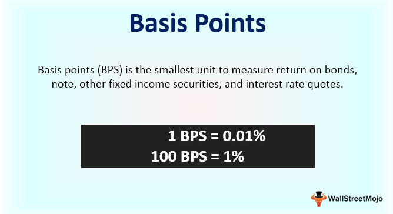

In the bustling world of finance, understanding key terms and concepts is essential for both seasoned traders and novices alike. The financial markets are rapidly evolving, with the rise of algorithmic trading and the emergence of complex financial instruments creating new opportunities and challenges. Navigating these markets effectively requires a comprehensive grasp of fundamental financial terms and concepts that underpin these systems.

Algorithmic trading, for instance, has revolutionized the way trades are executed, leveraging automated, quantitative strategies to ensure precision and speed. This shift emphasizes the importance of financial literacy, as traders and investors must understand both the technological and conceptual aspects that drive market dynamics. Core financial terms such as cost basis, capital gains, and tax implications are crucial in forming sound investment strategies and financial planning.

This article aims to explore the core financial terms related to the finance basis and algorithmic trading, offering insights into their definitions, uses, and implications in the financial markets. By understanding these core concepts, market participants can enhance their decision-making processes, enabling them to navigate the complexities of modern finance with confidence. Whether through manual trading techniques or sophisticated algorithmic strategies, mastering the terminology and concepts is vital for achieving financial success in today's volatile markets.

## Table of Contents

## Understanding Financial Terms

Basic financial literacy is crucial for successfully navigating trading and investing. It involves understanding key financial terms that form the basis of effective financial decision-making and planning. Some of these terms include cost basis, capital gains, and tax implications, each playing a pivotal role in personal and corporate finance.

The cost basis is the original value of an asset for tax purposes, typically the purchase price, adjusted for stock splits, dividends, and return of capital distributions. This value is essential for calculating capital gains or losses, which are determined when the asset is sold. The capital gain is the difference between the asset's selling price and its cost basis. Here's a simple formula to illustrate this:

$$
\text{Capital Gain} = \text{Selling Price} - \text{Cost Basis}
$$

Understanding capital gains is key to planning investment strategies, as these gains are subject to taxation. The tax implications of capital gains vary depending on whether they are short-term or long-term. Short-term capital gains, for assets held for one year or less, are typically taxed at ordinary income rates, while long-term capital gains, for assets held for more than a year, benefit from lower tax rates.

Knowledge of these financial terms allows investors to adopt effective strategies, such as tax-loss harvesting—selling securities at a loss to offset capital gains, thereby reducing taxable income. Additionally, comprehending these concepts aids in evaluating the potential after-tax returns on investments.

By gaining a solid understanding of essential financial terms like cost basis, capital gains, and tax implications, individuals and businesses can make informed decisions that enhance their financial strategies and align with their broader financial goals. This knowledge is a vital component in achieving successful financial planning and investment outcomes.

## What is Finance Basis?

The term 'basis' in finance is a fundamental concept that refers to the total cost associated with an investment. It serves as the foundational figure for calculating profits and losses. The cost basis plays a critical role in determining the taxable amount of a financial transaction, particularly when assessing capital gains. Capital gains taxes are calculated based on the difference between the sale price of an investment and its cost basis. The formula for calculating capital gains is:

$$
\text{Capital Gain (or Loss)} = \text{Sale Price} - \text{Cost Basis}
$$

For investors, accurate calculation of the cost basis is essential to ensure compliance with tax regulations and to avoid overpayment or underpayment of taxes.

In the context of futures markets, the term 'basis' takes on a different meaning. Here, it represents the difference between the cash price of an asset and its futures price. This difference is crucial for traders and portfolio managers who engage with futures contracts to hedge against risks or speculate on price movements. The formula for basis in futures markets is:

$$
\text{Basis} = \text{Cash Price} - \text{Futures Price}
$$

Understanding this concept is essential for managing the risk associated with the temporal difference between purchasing or selling an asset in the present and settling a futures contract at a future date.

Incorporating the understanding of basis, whether for tax purposes or in futures trading, is essential for comprehensive financial planning and for achieving investment objectives. It facilitates a more profound comprehension of market operations, enhancing the decision-making capabilities of both individual investors and institutional traders.

## Algorithmic Trading in Finance

Algorithmic trading employs automated software to execute trades based on predefined criteria, harnessing the power of speed, precision, and data processing capabilities far superior to human traders. The system relies on sophisticated algorithms that analyze market data, identify trading opportunities, and execute trades at optimal prices without human intervention. This method of trading offers significant advantages, such as eliminating human errors, minimizing emotions, and enhancing the speed of order execution to gain a competitive advantage in fast-paced markets.

There are various types of algorithms used in trading, each designed to achieve specific objectives and accommodate diverse trading strategies. Execution algorithms focus on executing large orders with minimal market impact. For instance, the Volume Weighted Average Price (VWAP) algorithm aims to achieve an average execution price close to the market's average price over a specified period by breaking large orders into smaller ones.

Profit-seeking algorithms are designed to identify profitable trading opportunities through strategies like [arbitrage](/wiki/arbitrage) and [momentum](/wiki/momentum) trading. These algorithms exploit price discrepancies across markets or predict trends based on historical data to generate profits. 

High-frequency trading ([HFT](/wiki/high-frequency-trading-strategies)), a subset of [algorithmic trading](/wiki/algorithmic-trading), involves executing a high [volume](/wiki/volume-trading-strategy) of trades at extremely rapid speeds, often within microseconds. HFT strategies capitalize on the smallest price fluctuations, necessitating substantial computational power and network speed to be effective.

Understanding the types and functions of algorithmic trading is essential for traders aiming to maintain a competitive edge. Traders can develop personalized algorithms that align with their risk tolerance and financial goals by leveraging [machine learning](/wiki/machine-learning) and [artificial intelligence](/wiki/ai-artificial-intelligence). Additionally, the ability to backtest algorithms against historical data strengthens their reliability and performance in real-time scenarios, reducing exposure to unintended market risks.

## Advantages and Disadvantages of Algorithmic Trading

Algorithmic trading, a method that utilizes computer algorithms to execute trading strategies, offers several notable advantages. Among the most significant are the enhanced speed and accuracy with which trades are executed. Unlike manual trading, algorithmic trading systems can process vast amounts of data in mere milliseconds, quickly identifying and capitalizing on trading opportunities. This rapid execution is particularly beneficial in markets where prices can fluctuate in fractions of a second, enabling traders to enter and [exit](/wiki/exit-strategy) positions with optimal timing.

In addition to speed, algorithmic trading provides improved accuracy. By reducing human intervention, the potential for manual errors is minimized. This precision ensures that trades are executed exactly as intended by the predefined algorithms, leading to reduced operational costs. As a result, traders can achieve increased efficiency in market operations, allowing for more effective allocation of resources and time.

Despite these advantages, algorithmic trading also poses certain disadvantages. Technical failures are one of the primary challenges. If an algorithm malfunctions or if there is an unexpected system crash, it can lead to significant financial losses. This risk underscores the necessity for robust and resilient systems with foolproof fail-safes and backup plans.

Furthermore, algorithmic trading can contribute to increased market [volatility](/wiki/volatility-trading-strategies). The rapid execution of a large volume of trades can amplify price movements, especially during periods of market stress. This situation is exacerbated by high-frequency trading (HFT) algorithms, which can execute thousands of trades per second. Such activities can sometimes create feedback loops, leading to flash crashes or other market anomalies.

Regulatory scrutiny is another concern associated with algorithmic trading. Financial authorities worldwide are increasingly monitoring and regulating algorithmic trading practices to ensure market stability and fairness. Traders and institutions must remain compliant with these regulations, which are continually evolving to address the complexities introduced by technological advancements in trading.

Balancing the advantages and disadvantages of algorithmic trading is crucial for traders seeking to leverage these strategies effectively. This balance involves not only understanding the technology and its potential pitfalls but also staying informed about regulatory changes and market conditions. By doing so, traders can harness the benefits of algorithmic trading while mitigating its inherent risks, ultimately enhancing their trading performance and financial outcomes.

## Key Financial Concepts in Algorithmic Trading

Incorporating critical financial concepts such as cost basis and tax implications within algorithmic trading is essential for maintaining compliance and ensuring profitability. Accurate calculation and understanding of the cost basis, which refers to the total original value of an investment adjusted for stock splits, dividends, and return of capital distributions, are crucial. These adjustments affect the capital gains or losses realized upon selling the asset. For instance, the formula to compute the cost basis for stocks is:

$$
\text{Cost Basis per Share} = \frac{\text{Total Purchase Price} + \text{Commissions and Fees}}{\text{Number of Shares}}
$$

This establishes an accurate starting point for determining potential profit margins as trades are executed.

Tax implications are another vital financial consideration. Depending on the holding period of an asset, tax rates on capital gains can differ significantly; short-term gains are typically taxed at a higher rate compared to long-term gains. Algorithmic trading systems must account for these factors to optimize trade execution and timing, potentially deferring trades to achieve favorable tax treatment.

Key trading strategies such as market-making, arbitrage, and trend-following heavily rely on algorithmic precision and incorporate these financial concepts to maximize profitability. 

1. **Market-Making**: Algorithmic systems provide liquidity by continuously quoting buy and sell prices within a specific spread, profiting from the bid-ask spread. Understanding transaction costs and tax implications associated with frequent trading aids in accurately pricing these spreads.

2. **Arbitrage**: Algorithms identify and exploit price differentials for the same asset across different markets or instruments. By precisely calculating the cost basis and considering tax implications, traders can accurately evaluate the profitability of arbitrage opportunities.

3. **Trend-Following**: This strategy focuses on capturing gains through the analysis of an asset's momentum. Incorporating cost basis calculations and tax-efficient strategies ensures more accurate assessments of when to initiate or exit positions, aligning trades with financial objectives.

Sophisticated algorithms use these concepts to perform extensive data analysis and execute trades at ideal moments, often incorporating machine learning and artificial intelligence to adapt to changing market conditions. Understanding these financial concepts, coupled with technological proficiency, enables traders to develop robust trading strategies that align with and meet their financial goals effectively.

## Conclusion

Mastering financial terms and the intricacies of finance basis and algorithmic trading is indispensable for any market participant. A profound understanding of these elements equips traders and investors with the necessary tools to make informed decisions, ultimately enhancing their ability to navigate the complexities of financial markets. The rapidly evolving nature of financial technologies and strategies demands that market participants remain vigilant and adaptable, continuously updating their knowledge to stay ahead.

In the context of algorithmic trading, where the speed and precision of transactions can offer significant advantages, staying informed about the latest advancements is crucial. This includes understanding the implications of financial concepts such as cost basis and tax effects, as well as the practical applications of various algorithmic strategies. By leveraging these insights, traders can refine their strategies to achieve better compliance, profitability, and overall success.

As the financial landscape continues to evolve, continuous learning and application of these concepts remain paramount. This commitment to education ensures that individuals and organizations are well-equipped to respond to new challenges and opportunities in the markets. Embracing a mindset of ongoing development can lead to improved financial outcomes and a stronger grasp of the ever-changing market dynamics.

## References & Further Reading

[1]: Lopez de Prado, M. (2018). ["Advances in Financial Machine Learning."](https://www.amazon.com/Advances-Financial-Machine-Learning-Marcos/dp/1119482089) Wiley.

[2]: Jansen, S. (2020). ["Machine Learning for Algorithmic Trading."](https://github.com/stefan-jansen/machine-learning-for-trading) Packt Publishing.

[3]: Chan, E. P. (2009). ["Quantitative Trading: How to Build Your Own Algorithmic Trading Business."](https://github.com/ftvision/quant_trading_echan_book) Wiley.

[4]: Aronson, D. R. (2006). ["Evidence-Based Technical Analysis: Applying the Scientific Method and Statistical Inference to Trading Signals."](https://www.amazon.com/Evidence-Based-Technical-Analysis-Scientific-Statistical/dp/0470008741) Wiley.

[5]: Hasbrouck, J. (2007). ["Empirical Market Microstructure: The Institutions, Economics, and Practice of Securities Trading."](https://archive.org/details/empiricalmarketm0000hasb) Oxford University Press.