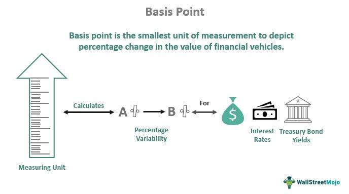

Understanding financial terminology is essential for effective investment management. An important term within this context is the basis point, often abbreviated as "bps." Basis points provide a standardized method to express minute changes in financial instruments, equating to 0.01% or 0.0001 in decimal form. They are indispensable in financial analyses, particularly in elucidating small variations in interest rates, bond yields, and fund costs, thus eliminating ambiguities associated with percentage terms.

Interest rates, another fundamental concept, play a pivotal role in shaping economic strategies and financial planning. As indicators of the cost of borrowing or the return on investment for lenders, changes in interest rates influence a broad spectrum of financial markets. Central banks adjust these rates to manage macroeconomic objectives, such as inflation control, economic growth stimulation, and demand regulation. Consequently, fluctuations in interest rates directly impact asset prices, including stocks, bonds, and real estate, requiring investors to remain attuned to these shifts for informed decision-making.



Algorithmic trading marks the intersection of finance and technology, introducing new dimensions to trading strategies. This approach leverages computer algorithms to execute trades based on predefined criteria, enabling rapid execution while minimizing manual errors and eliminating emotional biases. By analyzing vast datasets, algorithms can identify patterns that inform trading strategies, thereby optimizing investment outcomes. The precision and speed offered by algorithmic trading have made it an integral part of modern financial markets, particularly for high-frequency trading operations.

This article aims to explore the intricacies of basis points, interest rates, and algorithmic trading. By examining these elements and their interconnected roles in financial markets, readers will gain a comprehensive understanding of their importance in guiding investment strategies and enhancing market participation.

## Table of Contents

## Understanding Basis Points

Basis points, commonly abbreviated as "bps," are a crucial unit of measure in financial markets, denoting changes in interest rates and other percentages. One basis point is defined as 0.01%, making it an essential tool for representing minor fluctuations in financial metrics with precision. This unit is particularly useful when discussing changes in bond yields, equity indices, and fund costs, as it removes the ambiguity associated with percentage changes by providing a more granular measurement.

The conversion of basis points to percentage is straightforward. For example, a 50 basis point change is equivalent to a 0.50% change. This precision is especially important in financial contexts where even slight variations can have significant monetary implications, such as the pricing and yield of bonds. Consider the yield on a bond increasing from 2.50% to 2.75%. This change may be alternatively expressed as a 25 basis point increase, simplifying communication and reducing error potential in interpretation.

Basis points play a fundamental role in the calculation of changes in various financial instruments. For instance, when assessing bond yields, basis points offer a clear way to communicate adjustments without resorting to fractional percentages. They are also integral in delineating the performance of equity indices and computing fund management costs, facilitating clearer comparison across different financial products and services.

Moreover, basis points are vital in contexts that require exactitude, such as regulatory reporting and market analysis, where even minute discrepancies can lead to significant outcomes. By adopting this standard metric, financial analysts and investors can uniformly apply it across diverse financial discussions, enhancing clarity and consistency.

## Role of Interest Rates in Financial Markets

Interest rates serve as a fundamental element in financial markets, reflecting the cost of borrowing or the return on investment for lenders. They are pivotal in dictating the flow of money within an economy and have far-reaching implications for various asset classes and financial instruments.

Central banks, such as the Federal Reserve in the United States or the European Central Bank, wield significant influence over interest rates by setting benchmark rates that guide monetary policy. These institutions adjust interest rates primarily to manage inflation, a central target in maintaining economic stability. By increasing interest rates, central banks can curtail inflationary pressures by making borrowing more expensive, thereby cooling consumer spending and investment. Conversely, lowering interest rates can stimulate economic growth by reducing the cost of borrowing, encouraging spending and investment.

The impact of [interest rate](/wiki/interest-rate-trading-strategies) fluctuations is particularly pronounced in stock prices, bond yields, and real estate markets. For instance, higher interest rates increase the cost of capital, which can negatively affect corporate profitability and, by extension, stock prices. In bond markets, interest rates and bond prices share an inverse relationship; when interest rates rise, existing bonds with lower yields become less attractive, prompting a decline in their prices. On the other hand, when interest rates fall, bond prices generally rise, as existing bonds offer comparatively higher yields.

Real estate markets are also sensitive to changes in interest rates, which directly affect mortgage rates. Higher interest rates can dampen housing demand by increasing monthly mortgage repayments, whereas lower rates can boost demand by making housing more affordable.

For investors, understanding interest rate movements is crucial for anticipating market trends and making informed portfolio adjustments. For example, in a rising interest rate environment, investors might consider shifting towards sectors that benefit from higher rates, such as financials, or towards assets that are less sensitive to rate changes. In addition, derivative instruments, such as interest rate swaps and futures, provide investors with tools to hedge against interest rate risks or speculate on future rate movements.

The role of interest rates extends beyond the domestic economy, influencing international capital flows and exchange rates. When a country raises its interest rates relative to others, it often attracts foreign investments seeking higher returns, leading to an appreciation of its currency.

In conclusion, interest rates are a critical mechanism in financial markets, influencing economic activity, investor behavior, and market dynamics. A thorough understanding of how interest rate changes affect various components of the financial system is essential for investors looking to optimize their strategies and manage risk effectively.

 to Algorithmic Trading

Algorithmic trading, known colloquially as algo trading, relies on computer algorithms to automatically execute trades according to predefined instructions based on various market factors such as price, timing, and [volume](/wiki/volume-trading-strategy). This methodical approach enhances the efficiency of trading by significantly reducing the time between a decision and its execution. The automation inherent in [algorithmic trading](/wiki/algorithmic-trading) negates human errors and eliminates emotional influences that could otherwise lead to suboptimal trading decisions.

Algorithms utilized in trading probed vast amounts of market data to uncover patterns that can be leveraged for formulating trading strategies. The speed and precision with which these algorithms can operate enable them to execute trades faster than any human trader, often within milliseconds. One example of an algorithmic trading approach is statistical [arbitrage](/wiki/arbitrage), where algorithms identify and exploit inefficiencies in the pricing of securities across different markets.

In high-frequency trading ([HFT](/wiki/high-frequency-trading-strategies)), a subset of algorithmic trading, algorithmic models allow traders to execute a vast number of orders at extremely rapid speeds. This strategy relies heavily on quantitative analysis and high-speed data feeds to capitalize on the smallest inefficiencies in the market, usually measured in basis points. The algorithms are typically developed using complex statistical models and optimized with [machine learning](/wiki/machine-learning) techniques to maintain a competitive edge.

Python, with its simplicity and the vast availability of libraries, is frequently used in developing trading algorithms. For example, libraries like NumPy and pandas facilitate efficient data manipulation and analysis, while libraries such as PyAlgoTrade and Zipline offer infrastructure for [backtesting](/wiki/backtesting) trading strategies. A simple Python script employing an algorithmic trading strategy might look like this:

```python
import pandas as pd
import numpy as np

# Sample data
data = pd.DataFrame({
    'price': np.random.randn(100).cumsum() + 100
})

# Simple moving average strategy
short_window = 10
long_window = 30

signals = pd.DataFrame(index=data.index)
signals['signal'] = 0.0

# Create short simple moving average and long simple moving average
signals['short_mavg'] = data['price'].rolling(window=short_window, min_periods=1, center=False).mean()
signals['long_mavg'] = data['price'].rolling(window=long_window, min_periods=1, center=False).mean()

# Create signals
signals['signal'][short_window:] = np.where(signals['short_mavg'][short_window:] > signals['long_mavg'][short_window:], 1.0, 0.0)   

# Generate trading orders
signals['positions'] = signals['signal'].diff()

print(signals.head())
```

This basic example illustrates a moving average crossover strategy, a common algorithmic trading method. In this strategy, buying and selling signals are generated based on the crossover of short-term and long-term moving averages of a security's price.

Algorithmic trading represents a transformative force in financial markets, allowing participants to respond effectively to real-time market changes. Its growth underscores the increasing synergy between quantitative finance and technological innovation, setting the stage for sophisticated trading strategies that were previously impractical through manual approaches.

## Basis Points in Algorithmic Trading

Algorithms play a crucial role in modern financial markets, where precision is paramount, especially in high-frequency trading. Basis points (bps), which represent one-hundredth of a percentage point, serve as a vital unit of measure in algorithmic trading. They provide the granularity needed to assess market conditions accurately and refine trading strategies.

Interest rate shifts expressed in basis points are critical triggers for algorithmic trades. For example, a shift of 25 basis points in a central bank's policy rate can significantly affect the pricing of various financial instruments, such as bonds and derivatives. Algorithms are programmed to recognize such shifts, enabling rapid adjustments to trading strategies to optimize investment outcomes. This is particularly advantageous in volatile markets where timely reactions can make a substantial difference.

Basis points also establish thresholds for executing trades in high-frequency trading (HFT) scenarios. HFT algorithms use these precise measurements to determine the exact moments to enter or [exit](/wiki/exit-strategy) a position, ensuring minimal slippage and maximizing the execution efficiency. The granularity of basis points allows for the development of sophisticated trading models that can respond to minute market fluctuations with enhanced accuracy.

The precision offered by basis points extends to the accuracy of algorithmic trading models and risk assessments. For instance, when calibrating portfolio risk models, slight changes in interest rates or market conditions, measured in basis points, can significantly impact predicted risk measures such as Value at Risk (VaR). Algorithms can incorporate these changes seamlessly, adjusting positions to maintain the desired risk-return profile.

Incorporating basis points into algorithmic trading requires a detailed understanding of how minute percentage changes influence broader market dynamics and portfolio valuations. By leveraging the precision of basis points, algorithmic trading systems can operate with high accuracy and efficiency, thereby optimizing their strategies and improving risk management practices.

## Advantages and Challenges of Algorithmic Trading

Algorithmic trading fundamentally transforms financial market operations by improving trade execution efficiency, speed, and accuracy. This technology-driven approach allows traders to process large volumes of transactions swiftly, harnessing computational power to make precise and informed trading decisions.

### Advantages of Algorithmic Trading

1. **Increased Efficiency**: Algorithmic trading eliminates the need for manual intervention in executing trades, thus significantly reducing the time between market analysis and trade execution. Automated systems can process and react to market information in milliseconds, offering a precision that human traders cannot match.

2. **Rapid Execution**: The capability of executing trades at high speeds ensures that traders can capitalize on minute price discrepancies that exist for only fractions of a second. High-frequency trading (HFT) strategies, which rely heavily on algorithmic trading, exemplify this speed advantage.

3. **Accuracy in Execution**: By minimizing human intervention, algorithmic trading reduces the likelihood of errors that could occur due to emotional decision-making or manual input mistakes. This precision is crucial in high-stakes financial environments where inaccuracies can lead to significant losses.

### Challenges of Algorithmic Trading

1. **Continuous Monitoring and Adjustment**: The complexity of algorithmic trading systems requires constant oversight to ensure their functionality and effectiveness. Market conditions are inherently volatile, and strategies must be regularly revisited to adapt to new data and trends.

2. **Technical Failures**: Despite its technological advantage, algorithmic trading is susceptible to technical failures, such as software bugs or hardware malfunctions. These failures can lead to incorrect trade execution or even market disruptions, underscoring the need for robust disaster recovery plans.

3. **Regulatory Compliance**: Navigating the regulatory landscape is another formidable challenge for algorithmic trading. Traders must conform to numerous regulations designed to ensure fairness and transparency in financial markets. Compliance requires thorough documentation of trading strategies and adherence to legal standards set by financial authorities.

4. **Managing Large-Scale Data Processing**: The success of algorithmic trading hinges on the ability to process vast amounts of market data efficiently. High-frequency data streams demand significant computational resources, and the infrastructure must be capable of handling this load without bottlenecks. Efficient handling of data involves not only storage and retrieval but also real-time analysis, which is resource-intensive.

Algorithmic trading embodies both the promise and the pitfalls of leveraging technology in financial markets. While it offers unmatched speed and precision, ensuring system reliability and compliance with regulatory frameworks remains crucial to mitigating associated risks.

## The Intersection of Interest Rates and Algorithmic Trading

Algorithms play an integral role in handling dynamic elements of financial markets, especially through the effective integration of interest rate data to adjust trading strategies. Interest rate derivatives, such as futures, options, and swaps, are commonly incorporated within algorithmic models to offer valuable tools for hedging and managing risk exposure. These financial instruments allow traders to capitalize on expected interest rate movements or manage the impact of rate changes on their portfolios. 

In practice, algorithmic trading models utilize real-time interest rate data feeds to make instantaneous trading decisions. These feeds provide live updates on interest rate changes set by central banks or emerging through market dynamics. By incorporating this data, algorithms can dynamically recalibrate positions and optimize strategies, enhancing potential returns by seizing timely opportunities or avoiding adverse movements. 

To implement such strategies programmatically, consider a Python model leveraging libraries like `pandas` for data manipulation and `numpy` for numerical computations. Here's a basic conceptual example of how an algorithm might respond to real-time interest rate changes:

```python
import pandas as pd
import numpy as np

# Sample function to adjust trading decision based on interest rate
def adjust_trading_decisions(trading_df, interest_rate_change):
    threshold = 0.25  # Example threshold in basis points
    trading_df['Adjust'] = np.where(trading_df['Interest_Rate_Change'] >= threshold, 'Buy', 'Sell')
    return trading_df

# Sample dataframe representing trading decisions before adjustment
data = {
    'Trade_ID': [1, 2, 3],
    'Interest_Rate_Change': [0.20, 0.30, 0.15]
}

trading_df = pd.DataFrame(data)
adjusted_trading_df = adjust_trading_decisions(trading_df, trading_df['Interest_Rate_Change'])
print(adjusted_trading_df)
```

The adaptability of algorithmic systems ensures they remain robust amid economic shifts driven by interest rate changes. This dual focus on integrating interest rate data with algorithmic insights ensures the execution of strategies that are both informed and responsive to market events, allowing market participants to navigate complexities while achieving optimized investment outcomes.

## Conclusion

A comprehensive understanding of basis points, interest rates, and algorithmic trading is essential for gaining a strategic edge in financial markets. Basis points provide a precise metric for quantifying small percentage changes in financial instruments, crucial for analyzing interest rates' impact, particularly in bond pricing and yield. This precision aids investors in making more informed decisions, as even minute variations can significantly affect returns. 

Interest rates, managed by central banks, are pivotal in shaping economic policies. They influence critical financial variables such as stock prices, bond yields, and real estate valuations. By understanding interest rate trends, investors can better anticipate market movements and strategically adjust their portfolios to optimize outcomes.

Algorithmic trading harnesses the power of technology to enable real-time analysis and execution of trades based on predefined criteria. This approach not only speeds up the trading process but also minimizes human-induced errors and emotional biases. Algorithms utilize large datasets to identify patterns and inform trading strategies, benefitting from the precision offered by basis points to refine these strategies further. Additionally, integrating interest rate data into algorithmic models can enhance risk management practices and improve decision-making processes.

Embracing technological advancements in trading, such as algorithmic methods, significantly enhances market participation. As the financial landscape becomes more complex, leveraging these tools enables investors to remain competitive. Navigating these interconnected financial aspects—basis points, interest rates, and algorithmic strategies—is crucial for achieving investment success, allowing for optimized and informed decision-making in dynamic market conditions.

## References & Further Reading

[1]: Bergstra, J., Bardenet, R., Bengio, Y., & Kégl, B. (2011). ["Algorithms for Hyper-Parameter Optimization."](https://dl.acm.org/doi/10.5555/2986459.2986743) Advances in Neural Information Processing Systems 24.

[2]: ["Advances in Financial Machine Learning"](https://www.amazon.com/Advances-Financial-Machine-Learning-Marcos/dp/1119482089) by Marcos Lopez de Prado

[3]: ["Evidence-Based Technical Analysis: Applying the Scientific Method and Statistical Inference to Trading Signals"](https://www.amazon.com/Evidence-Based-Technical-Analysis-Scientific-Statistical/dp/0470008741) by David Aronson

[4]: ["Machine Learning for Algorithmic Trading"](https://github.com/PacktPublishing/Machine-Learning-for-Algorithmic-Trading-Second-Edition) by Stefan Jansen

[5]: ["Quantitative Trading: How to Build Your Own Algorithmic Trading Business"](https://books.google.com/books/about/Quantitative_Trading.html?id=j70yEAAAQBAJ) by Ernest P. Chan