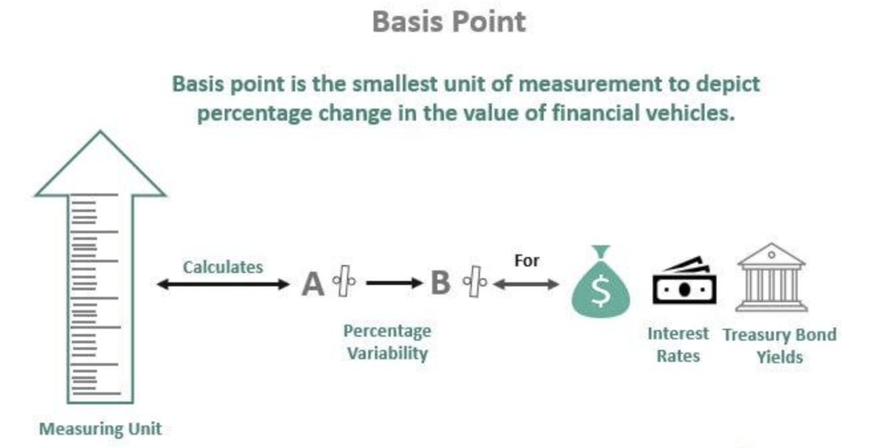

## Table of Contents

## What is a basis point?

A basis point is a way to measure very small changes in percentages. It is equal to one hundredth of a percent, or 0.01%. For example, if an interest rate goes up from 5% to 5.05%, that increase is 5 basis points.

Using basis points is helpful because it makes it easier to talk about small changes without using decimals or fractions. In finance, they are often used to describe changes in interest rates, bond yields, and other financial percentages. This makes it simpler to understand and compare these small changes.

## How is a basis point abbreviated?

A basis point is usually shortened to "bps" or "bp". These abbreviations stand for "basis points" or "basis point". You will see them a lot in financial news and reports.

Using "bps" or "bp" helps people talk about tiny changes in percentages easily. For example, instead of saying an [interest rate](/wiki/interest-rate-trading-strategies) went up by 0.25%, you can say it went up by 25 basis points or 25 bps. This makes it simpler to understand and compare small changes.

## What is the value of one basis point?

One basis point is worth 0.01%. That means it's one hundredth of a percent. If you have a percentage and you want to add or subtract one basis point, you are changing it by a very small amount.

In finance, people use basis points to talk about tiny changes in interest rates, bond yields, and other percentages. Saying something changed by a few basis points is easier than using decimals or fractions. It helps everyone understand and compare these small changes more clearly.

## Why are basis points used in finance?

Basis points are used in finance because they make it easier to talk about tiny changes in percentages. Instead of saying a number went up or down by a small decimal or fraction, you can say it changed by a certain number of basis points. This is helpful because it makes the change sound simpler and clearer. For example, if an interest rate goes up from 5% to 5.05%, it's easier to say it went up by 5 basis points than to say it went up by 0.05%.

Using basis points also helps people compare changes more easily. When you see that one interest rate went up by 10 basis points and another went up by 20 basis points, it's easy to see which one changed more. This makes it simpler to understand and talk about financial changes without getting confused by decimals. Overall, basis points help make financial discussions more straightforward and understandable.

## How do basis points help in understanding interest rates?

Basis points help people understand interest rates by making small changes easy to see and talk about. Instead of saying an interest rate went up by 0.25%, you can say it went up by 25 basis points. This makes it simpler because you don't have to deal with decimals. It's like using a smaller unit to measure something very small, which makes the change clear and easy to understand.

When you hear that an interest rate changed by a certain number of basis points, you can quickly know how much it changed without doing math in your head. For example, if one bank's interest rate goes up by 10 basis points and another bank's rate goes up by 20 basis points, it's easy to see which bank's rate changed more. This helps people compare different interest rates and make better decisions about where to put their money or borrow from.

## Can you give an example of basis points used in a financial context?

Imagine you're looking at news about the Federal Reserve. They decide to raise the interest rate by 25 basis points. This means the interest rate goes up by 0.25%. It's easier to say 25 basis points than 0.25% because it's a whole number and it sounds simpler.

Now think about a bond you own. Its yield goes up by 10 basis points. That means the yield increased by 0.10%. This small change can affect how much money you make from the bond. Using basis points makes it clear how the yield changed without confusing you with decimals.

## How are basis points used in bond yields?

Basis points are used in bond yields to talk about small changes in how much the bond pays you. If a bond's yield goes up by 10 basis points, it means the yield increased by 0.10%. This change might seem small, but it can affect how much money you get from the bond. Using basis points makes it easy to understand these tiny changes without using decimals.

When you hear that a bond's yield changed by a certain number of basis points, you know right away how much it changed. For example, if one bond's yield goes up by 20 basis points and another bond's yield goes up by 30 basis points, you can quickly see which bond's yield increased more. This helps you compare different bonds and make better choices about which ones to buy or sell.

## What role do basis points play in investment performance?

Basis points help people understand small changes in how well their investments are doing. If an investment fund's performance goes up by 50 basis points, it means the return on that fund increased by 0.50%. This might not sound like a lot, but over time, these small changes can make a big difference in how much money you make from your investments. Using basis points makes it easy to see these tiny changes without getting confused by decimals.

When you look at different investment options, basis points help you compare them. For example, if one stock's return goes up by 15 basis points and another stock's return goes up by 25 basis points, you can quickly see which stock did better. This helps you make smarter choices about where to put your money. Overall, basis points make it simpler to understand and talk about the performance of your investments.

## How can basis points affect mortgage rates?

Basis points can make a big difference when it comes to mortgage rates. If a bank says they are raising mortgage rates by 25 basis points, it means the interest rate on your mortgage will go up by 0.25%. That might not sound like a lot, but over the life of a mortgage, which can be 15 or 30 years, even a small change can add up to a lot of extra money you have to pay.

When you're shopping for a mortgage, looking at basis points can help you compare different loans. If one bank offers a rate that is 10 basis points lower than another, that's a difference of 0.10%. Over time, that lower rate can save you a good amount of money. So, understanding basis points helps you make better choices and could save you money on your home loan.

## What are the common misunderstandings about basis points?

Some people get confused and think a basis point is the same as a percentage point. But they're not the same. A basis point is much smaller. It's only 0.01%, while a percentage point is a full 1%. So if someone says an interest rate went up by 100 basis points, that's the same as saying it went up by 1 percentage point. It's easy to mix them up, but they're different.

Another misunderstanding is thinking that basis points don't matter because they're so small. But even tiny changes can make a big difference over time, especially with things like mortgages or investments. If your mortgage rate goes up by just 25 basis points, that can add a lot to what you pay over 30 years. So, it's important to pay attention to basis points because they can affect your money in a big way.

## How do financial institutions use basis points for pricing?

Financial institutions use basis points to make small changes in the prices of their products, like loans and investments. Instead of saying a loan's interest rate went up by 0.25%, they might say it went up by 25 basis points. This makes it easier for everyone to understand the change without getting confused by decimals. For example, if a bank wants to raise the interest rate on a savings account, they might say it's going up by 10 basis points, which is the same as 0.10%.

Using basis points helps financial institutions talk about pricing in a clear way. It's easier to compare different products when you know their prices changed by a certain number of basis points. For example, if one credit card's interest rate goes up by 15 basis points and another goes up by 20 basis points, you can quickly see which one changed more. This makes it simpler for people to understand how much they will have to pay or how much they will earn from their money.

## What advanced strategies involve basis points in financial markets?

In financial markets, basis points are used in advanced strategies like hedging and [arbitrage](/wiki/arbitrage). Hedging involves using basis points to manage risk. For example, if a trader expects interest rates to go up by 50 basis points, they might buy financial instruments that will gain value if rates increase. This way, they can protect their other investments from losing value because of the rate change. It's like having an umbrella ready if it starts to rain.

Arbitrage is another strategy where basis points matter a lot. Traders look for small differences in prices between different markets or products. If they see that one bond's yield is 10 basis points higher in one market than in another, they can buy the bond in the cheaper market and sell it in the more expensive one. This small difference, measured in basis points, can lead to big profits if done on a large scale. It's like buying something on sale in one store and selling it for a higher price in another store.

## References & Further Reading

[1]: Bergstra, J., Bardenet, R., Bengio, Y., & Kégl, B. (2011). ["Algorithms for Hyper-Parameter Optimization."](https://dl.acm.org/doi/10.5555/2986459.2986743) Advances in Neural Information Processing Systems 24.

[2]: ["Advances in Financial Machine Learning"](https://www.amazon.com/Advances-Financial-Machine-Learning-Marcos/dp/1119482089) by Marcos Lopez de Prado

[3]: ["Evidence-Based Technical Analysis: Applying the Scientific Method and Statistical Inference to Trading Signals"](https://www.amazon.com/Evidence-Based-Technical-Analysis-Scientific-Statistical/dp/0470008741) by David Aronson

[4]: ["Machine Learning for Algorithmic Trading"](https://github.com/PacktPublishing/Machine-Learning-for-Algorithmic-Trading-Second-Edition) by Stefan Jansen

[5]: ["Quantitative Trading: How to Build Your Own Algorithmic Trading Business"](https://books.google.com/books/about/Quantitative_Trading.html?id=j70yEAAAQBAJ) by Ernest P. Chan