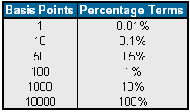

Understanding financial terms like interest rates and algorithmic trading is crucial for making informed investment decisions. These components directly influence how individuals and institutions allocate resources and manage risk in financial markets.

Interest rates represent the cost of borrowing money or the return on investment for lending money. They play a significant role in shaping economic conditions and financial strategies. When central banks adjust interest rates, they influence inflation, consumer spending, and economic growth. Investors must understand how these adjustments affect different asset classes. For instance, rising interest rates typically lead to lower bond prices because new bonds are issued with higher yields. Conversely, stocks might experience volatility as companies face higher borrowing costs. Real estate investments are also sensitive to interest rate changes, impacting mortgage rates and property valuations.



Algorithmic trading, or algo-trading, involves the use of computer programs to execute trades based on predetermined criteria. Unlike traditional trading methods that rely on human intuition and decision-making, algorithmic trading analyzes vast datasets to identify patterns and make split-second trading decisions. Its evolution has been remarkable, with algorithms now handling a significant portion of trades in global financial markets. Their popularity stems from their ability to process data faster than humans, reduce transaction costs, and remove emotional biases from trading decisions.

Incorporating interest rates and algorithmic trading into investment strategies can offer several advantages. By understanding how interest rate fluctuations impact market dynamics, investors can better predict market movements and allocate assets more effectively. Algorithmic trading adds an additional layer of sophistication by enabling rapid and systematic responses to market changes, helping investors optimize their strategies in real-time.

In summary, a solid grasp of interest rates and algorithmic trading is indispensable for successful investment strategies. These elements serve as key components in navigating complex financial markets, allowing investors to seize opportunities and mitigate risks.

## Table of Contents

## Understanding Interest Rates in Investments

Interest rates are a fundamental component of the financial markets, representing the cost of borrowing money or the return on investment for lending money. Typically expressed as a percentage, interest rates influence the economic decisions of both individual investors and large financial institutions. They are set by central banks, such as the Federal Reserve in the United States, and can vary depending on monetary policy objectives, inflation trends, and economic growth rates.

Interest rates serve as a critical determinant in investment decisions. They impact the overall market conditions by influencing consumer spending, saving, and borrowing behaviors. A change in interest rates can lead to adjustments in currency values, affecting international trade and investment flows. For instance, higher interest rates generally result in a stronger currency, as they attract foreign capital seeking higher returns.

When interest rates rise, the cost of borrowing increases. This scenario can curtail spending and investment by businesses and consumers, potentially slowing economic growth. Conversely, lower interest rates decrease borrowing costs, potentially stimulating economic expansion. These rate changes have a direct impact on various investment vehicles:

1. **Bonds**: Interest rates and bond prices are inversely related. When interest rates increase, existing bonds with lower rates become less attractive, causing their prices to fall. Conversely, when rates decline, bond prices generally rise. For investors, understanding this relationship is crucial for timing their bond investments effectively.

2. **Stocks**: The impact of interest rates on stocks is multifaceted. Higher rates can lead to higher borrowing costs for companies, potentially reducing profit margins and corporate earnings. This often results in stock price declines. Additionally, higher interest rates may provide attractive returns on savings accounts and bonds, drawing investment away from stocks. However, the specific impact can vary by sector—interest-sensitive sectors like utilities may be more adversely affected than others.

3. **Real Estate**: Interest rates significantly influence the real estate market. Higher rates increase mortgage costs, directly affecting the affordability of housing for consumers. This can lead to a slowdown in real estate sales and a decline in property values. Conversely, when rates are low, financing is cheaper, encouraging home purchases and real estate investments.

The interplay between interest rates and investment decisions is complex, with rates serving both as a barometer for economic health and a tool for economic policy. Investors must continuously monitor [interest rate](/wiki/interest-rate-trading-strategies) trends to make informed decisions, adjusting their strategies to align with prevailing and anticipated rate environments. Understanding these dynamics facilitates more effective allocation of financial resources across various asset classes.

## Introducing Algorithmic Trading

Algorithmic trading, often referred to as algo trading, is the use of computer programs and systems to execute financial transactions based on pre-defined criteria and algorithms. These algorithms are designed to identify optimal timing, pricing, or quantities for trades, enabling execution at speeds and efficiencies that are unattainable for human traders. The key difference between algorithmic and traditional trading lies in the automation and precision that algorithms provide, minimizing human intervention and thus reducing errors associated with emotions and fatigue.

The history of [algorithmic trading](/wiki/algorithmic-trading) dates back to the 1970s with the advent of electronic trading systems for financial markets. However, it wasn't until the 1980s and 1990s that algorithmic trading began to gain significant traction. The New York Stock Exchange (NYSE) and NASDAQ, for instance, introduced systems that facilitated quicker trade executions than manual methods. The growth of high-frequency trading ([HFT](/wiki/high-frequency-trading-strategies)) in the early 2000s further propelled the popularity and usage of algorithmic trading, allowing for trades to be executed in microseconds. 

Algorithmic trading has become indispensable among institutional investors and large trading firms due to several reasons. Firstly, it provides enhanced efficiency in executing trades by reducing the time and costs associated with manual trading. Algorithms can analyze vast datasets extensively and execute trades with precision and speed. Secondly, it offers significant scalability, enabling institutions with large resources to manage and execute a significant [volume](/wiki/volume-trading-strategy) of trades seamlessly. Thirdly, algorithmic trading platforms can integrate multiple data sources and utilize complex mathematical models, allowing investors to exploit [arbitrage](/wiki/arbitrage) opportunities, enhance portfolio management, and employ advanced trading strategies that include [statistical arbitrage](/wiki/statistical-arbitrage) and market-making.

Additionally, algorithmic trading mitigates the risk of human error and emotional decision-making by relying on data-driven models. This objectivity is particularly valuable in high-stakes trading environments where precision and reliability are critical. Moreover, automation through algorithms facilitates constant market monitoring and quick adaptation to market changes, thus maintaining competitive advantage.

These attributes make algorithmic trading a powerful tool in modern financial markets, unlocking opportunities for increased profitability and operational efficiency. As technological advancements continue, the role of algorithmic trading in shaping the landscape of trading practices is likely to grow even further.

## The Intersection of Interest Rates and Algorithmic Trading

Algorithms play a critical role in modern financial markets by adapting to interest rate fluctuations and enhancing trading strategies. The integration of interest rate changes into algorithmic trading strategies allows for dynamic adjustments based on real-time data. This process is essential for optimizing investment decisions and ensuring that trading strategies remain robust against market [volatility](/wiki/volatility-trading-strategies).

Algorithms typically incorporate interest rate data through a variety of methods, such as statistical models, [machine learning](/wiki/machine-learning) techniques, and quantitative analysis. For instance, a simple algorithm might use regression analysis to predict the impact of future interest rate movements on asset prices. More advanced systems could employ machine learning models that analyze historical interest rate trends and identify patterns indicative of market shifts.

Consider the following Python code implementing a basic algorithm that uses linear regression to model the impact of interest rates on stock prices:

```python
import numpy as np
from sklearn.linear_model import LinearRegression

# Example data: historical interest rates and corresponding stock prices
interest_rates = np.array([2.5, 2.75, 3.0, 3.25, 3.5]).reshape(-1, 1)
stock_prices = np.array([100, 98, 95, 92, 90])

# Create a linear regression model and fit it to the data
model = LinearRegression()
model.fit(interest_rates, stock_prices)

# Predict stock price given a new interest rate
new_interest_rate = np.array([[3.75]])
predicted_stock_price = model.predict(new_interest_rate)
print(predicted_stock_price)
```

This example illustrates how an algorithm might integrate historical interest rate data to forecast stock prices under new conditions. By refining these models with more complex datasets and machine learning techniques, algorithms can capture non-linear relationships and other market nuances.

The impact of real-time interest rate changes on algorithmic trading outcomes can be profound. Algorithms equipped with real-time data feeds can quickly adjust positions to capitalize on market inefficiencies or hedge against unfavorable movements. High-frequency trading (HFT) algorithms are particularly adept at this, executing trades in fractions of a second to exploit transient opportunities prompted by rate changes.

Moreover, algorithmic systems often use interest rate derivatives, such as interest rate swaps or futures, to hedge against risk or speculate on future rate movements. These derivatives are integral to formulating strategies that can brace or benefit from the anticipated interest rate environment.

In summary, the intersection of interest rates and algorithmic trading represents a confluence of data-driven strategy and market theory. As interest rates influence economic conditions and investor sentiment, algorithms harness this information to guide strategic investments, manage risk, and achieve optimal trading outcomes.

## Advantages of Using Algorithmic Trading in Interest Rate Analysis

Algorithmic trading, also known as algo trading, offers significant advantages in interest rate analysis, primarily through its speed and efficiency. Algorithms process large volumes of financial data rapidly, enabling market participants to react promptly to changes in interest rates. The swift execution provided by algorithmic trading platforms minimizes latency—an essential [factor](/wiki/factor-investing) in capitalizing on short-term market movements driven by interest rate fluctuations.

One key advantage of algorithmic trading is its ability to reduce human error. Traditional trading methods involve manual input and decision-making, which are susceptible to mistakes due to fatigue, misjudgments, or oversight. Algorithms, once programmed correctly, execute trades based on predefined criteria without deviation, minimizing the risk of human error. This precision ensures consistent adherence to an investment strategy, crucial for managing the intricacies of interest rate-sensitive assets such as bonds or rate-sensitive stocks.

Emotionless trading is another distinct benefit associated with algorithmic systems. Human traders can be influenced by emotions, leading to impulsive decisions that might deviate from rational investment strategies. Algorithmic trading, devoid of emotional influence, maintains objective decision-making based on quantifiable data and predetermined rules. This can be especially beneficial in volatile markets, where interest rate announcements often trigger rapid price swings.

Moreover, algorithmic trading can handle complex datasets more effectively than human traders. Interest rate analysis requires the assimilation and interpretation of numerous variables, from economic indicators to geopolitical events. Algorithms can be designed to process multifaceted data streams simultaneously, applying statistical models and machine learning techniques to identify trends and correlations that would be challenging to discern manually. For example, Python's pandas and scikit-learn libraries can be employed to build models that predict market movements based on interest rate changes.

Here is a simple example of how Python can be used to analyze interest rate data:

```python
import pandas as pd
from sklearn.linear_model import LinearRegression

# Sample data representing interest rates and corresponding asset prices
data = {
    'Interest_Rate': [1.5, 2.0, 2.5, 3.0, 3.5],
    'Asset_Price': [100, 98, 95, 93, 90]
}

# Create a DataFrame
df = pd.DataFrame(data)

# Define the feature (X) and the target (y)
X = df[['Interest_Rate']]
y = df['Asset_Price']

# Fit the regression model
model = LinearRegression()
model.fit(X, y)

# Predict asset prices for new interest rate values
new_rates = pd.DataFrame({'Interest_Rate': [4.0, 4.5]})
predicted_prices = model.predict(new_rates)

print(predicted_prices)
```

This script exemplifies how algorithmic systems use statistical techniques to predict asset price changes based on interest rate fluctuations. Such predictive models further enhance decision-making in trades sensitive to interest rates.

In summary, algorithmic trading's speed, accuracy, objectivity, and data processing capabilities make it a formidable tool for analyzing interest rate changes. By leveraging these advantages, traders and financial institutions can optimize their strategies, capitalizing on opportunities while mitigating risks inherent in volatile markets.

## Challenges and Risks Associated with Algorithmic Trading

Algorithmic trading, while offering numerous advantages, also presents several challenges and risks that must be carefully managed to ensure successful implementation. One significant risk is system failure, which can occur due to hardware malfunctions, software bugs, or unexpected external events. For instance, an algorithm might fail to execute trades if the server crashes or if there is a loss of connectivity to the trading platform. These failures can result in significant financial losses, especially when high-frequency trading (HFT) strategies are involved, where milliseconds can mean substantial monetary implications.

Market volatility adds another layer of risk. Algorithms are often programmed to react to specific market conditions and abrupt changes in volatility can lead to unintended trading activities. For example, during flash crashes, rapid price declines due to cascading buy or sell orders can trigger stop-loss algorithms to sell off assets, exacerbating the decline. Moreover, the reliance on historical data for model training may not always capture future market conditions accurately, leading to potential miscalculations and misguided trading actions.

Regulatory concerns are also paramount in the use of algorithmic trading. As this type of trading can amplify market movements and potentially destabilize markets, regulators around the world, such as the U.S. Securities and Exchange Commission (SEC) and the European Securities and Markets Authority (ESMA), have established guidelines and rules to govern its use. These include requirements for risk management frameworks, such as circuit breakers to halt trading in extreme conditions, and mandates for transparency to prevent market abuses.

To mitigate these risks, ongoing monitoring and robust testing are necessary. Backtesting algorithms with historical data, simulating various scenarios, and stress-testing under different market conditions can help anticipate and reduce the impact of adverse events. Furthermore, implementing safeguards, such as kill switches that can quickly shut down trading in case of anomalies, and maintaining a human oversight component can serve as critical checks against the automated nature of algorithmic systems. These measures help balance the efficiency benefits of algorithmic trading with the need for its safe and stable operation in increasingly complex financial markets.

## Best Practices for Algorithmic Trading in a Changing Interest Rate Environment

Adapting algorithmic trading models to a dynamic interest rate environment requires strategic planning and implementation to maintain efficacy. As interest rates fluctuate, traders need to ensure that their algorithms are capable of adjusting to these changes to maximize investment returns and mitigate risks.

One crucial strategy is the incorporation of interest rate sensitivity analysis within the algorithmic models. This involves evaluating how changes in interest rates can impact various financial instruments and adjusting the algorithms accordingly. Interest rate derivatives like futures and options can be used to hedge against adverse movements, thereby stabilizing returns. 

Mathematically, algorithms should be designed to evaluate the sensitivity of assets using metrics like Duration and Convexity for bonds. Duration measures the price change of a bond in response to a change in interest rates, whereas Convexity accounts for the curvature in the relationship between bond prices and interest rates. Calculating these metrics can guide the algorithm's decision-making process:

$$
\text{Modified Duration} = \frac{\text{Macaulay Duration}}{1 + \frac{\text{YTM}}{k}}
$$

$$
\text{Convexity} = \frac{1}{P} \sum \frac{C_t \times (t + 1) \times t}{(1 + YTM)^{t+2}}
$$

where $P$ is the bond price, $C_t$ is the cash flow at time $t$, $\text{YTM}$ is the yield to maturity, and $k$ is the compounding frequency per year.

Effective algorithmic trading also relies heavily on [backtesting](/wiki/backtesting). Historical data involving various interest rate scenarios should be used to simulate the algorithm's performance, identifying potential weaknesses and optimizing parameters. The process involves running the algorithm against historical data to ensure it can perform well under a variety of market conditions. In Python, backtesting can be implemented using libraries like Backtrader:

```python
import backtrader as bt

class MyStrategy(bt.Strategy):
    def __init__(self):
        self.sma = bt.indicators.SimpleMovingAverage(self.data.close, period=15)

    def next(self):
        if self.data.close[0] > self.sma[0]:
            self.buy(size=100)
        elif self.data.close[0] < self.sma[0]:
            self.sell(size=100)

cerebro = bt.Cerebro()
cerebro.addstrategy(MyStrategy)
data = bt.feeds.YahooFinanceData(dataname='AAPL', fromdate=datetime(2010, 1, 1), todate=datetime(2020, 12, 31))
cerebro.adddata(data)
cerebro.run()
```

Continuous monitoring and updating are essential to maintaining the effectiveness of algorithmic models in a changing interest rate environment. Developers should consistently analyze real-time data and adjust the algorithm’s parameters according to current economic indicators and forecasts. Machine learning approaches such as [reinforcement learning](/wiki/reinforcement-learning) can be employed for automatic adjustments, allowing the algorithm to learn and adapt from market experiences without explicit programming.

Ultimately, the key to successful algorithmic trading in such a volatile domain is a comprehensive framework that includes robust data analytics, risk management strategies, and ongoing refinement of the algorithm to align with evolving market conditions. Regular updates and calibrations informed by both historical performance and future predictions are vital to sustain competitiveness and achieve favorable outcomes.

## Conclusion

Algorithmic trading emerges as a pivotal tool in the financial markets, primarily due to its ability to process vast amounts of data with speed and precision, a feat particularly advantageous when analyzing interest rate changes. The interplay between algorithmic trading and interest rates offers a dual set of benefits and challenges for investors.

The benefits are manifold. Algorithms facilitate rapid response to interest rate fluctuations, which is crucial in highly volatile markets. This agility reduces execution time and diminishes the possibility of human error, thus allowing traders to capitalize on marginal gains that accumulate significantly over numerous trades. The emotionless nature of algorithmic trading further enhances its effectiveness, as decisions are based on data and statistical models rather than human sentiment, leading to more consistent outcomes. Furthermore, these systems can manage complex datasets, providing deep insights and enabling traders to craft nuanced strategies that consider myriad market variables influenced by interest rate shifts.

However, the challenges are equally formidable. Algorithmic trading systems are susceptible to technical glitches, which can lead to substantial financial losses. Market volatility, while an opportunity, also poses a risk as algorithms might amplify market movements, causing flash crashes. Regulatory concerns loom large, necessitating robust compliance frameworks to ensure fair market practices. Additionally, continuous monitoring and updating of algorithms are imperative to maintain their efficacy in dynamic interest rate environments.

In conclusion, mastering the interaction between algorithmic trading and interest rates is essential for devising sophisticated investment strategies. Both concepts hold critical importance; understanding interest rates aids in forecasting economic conditions that affect various asset classes, while algorithmic trading provides the tools to exploit these forecasted conditions efficiently. Together, they constitute a powerful combination that can significantly enhance investment decision-making processes. The ability to effectively leverage these tools requires a nuanced understanding and careful navigation of their inherent complexities and potential pitfalls.

## References

1. Hull, J.C. (2018). *Options, Futures, and Other Derivatives*. Pearson Education Limited. This textbook provides comprehensive insights into financial markets, detailing the mechanics of different financial instruments including the role of interest rates and algorithmic trading in investment strategies.

2. Fabozzi, F.J., Focardi, S.M., & Kolm, P.N. (2010). *Institutional Investment Management: Equity and Bond Portfolio Strategies and Applications*. John Wiley & Sons. This book outlines critical investment strategies and discusses the impact of interest rates on various asset classes, alongside integrating quantitative methods like algorithmic trading.

3. Aldridge, I. (2013). *High-Frequency Trading: A Practical Guide to Algorithmic Strategies and Trading Systems*. John Wiley & Sons. This guide investigates into algorithmic trading strategies, explaining how they have evolved and how interest rates can be integrated into these algorithms to optimize trading decisions.

4. MacKenzie, D., & Spears, T. (2014). "The Formula that Killed Wall Street: The Gaussian Copula and the Material Cultures of Modelling," *Social Studies of Science*, Vol. 44(3), pp. 393-417. Insightful paper on the complexities of financial modeling and the interplay between mathematical models and market variables like interest rates.

5. Hasbrouck, J. (2007). *Empirical Market Microstructure: The Institutions, Economics, and Econometrics of Securities Trading*. Oxford University Press. This resource offers an empirical approach to understanding the influence of interest rates in financial markets and includes discussions on the economics of algorithmic and high-frequency trading.

6. International Organization of Securities Commissions (IOSCO). (2011). *Regulatory Issues Raised by the Impact of Technological Changes on Market Integrity and Efficiency*. This report covers the regulatory implications of algorithmic trading, emphasizing the need for frameworks to manage the associated risks and how interest rates influence these systems.

7. Chhabria, C. (2020). *Algorithmic Trading Strategies*. [Online]. Available at: www.investopedia.com. This online resource provides an overview of various algorithmic trading strategies, illustrating how interest rate data is utilized for better market prediction.

8. Board of Governors of the Federal Reserve System. (n.d.). *Monetary Policy and Economic Conditions*. This official publication outlines how changes in interest rates impact economic conditions, which are crucial for developing algorithmic trading strategies.

These references collectively aid in understanding the complexity and significance of interest rates and algorithmic trading in formulating effective investment strategies.

## References & Further Reading

[1]: Bergstra, J., Bardenet, R., Bengio, Y., & Kégl, B. (2011). ["Algorithms for Hyper-Parameter Optimization."](https://papers.nips.cc/paper/4443-algorithms-for-hyper-parameter-optimization) Advances in Neural Information Processing Systems 24.

[2]: ["Advances in Financial Machine Learning"](https://www.amazon.com/Advances-Financial-Machine-Learning-Marcos/dp/1119482089) by Marcos Lopez de Prado

[3]: ["Evidence-Based Technical Analysis: Applying the Scientific Method and Statistical Inference to Trading Signals"](https://www.amazon.com/Evidence-Based-Technical-Analysis-Scientific-Statistical/dp/0470008741) by David Aronson

[4]: ["Machine Learning for Algorithmic Trading"](https://github.com/PacktPublishing/Machine-Learning-for-Algorithmic-Trading-Second-Edition) by Stefan Jansen

[5]: ["Quantitative Trading: How to Build Your Own Algorithmic Trading Business"](https://books.google.com/books/about/Quantitative_Trading.html?id=j70yEAAAQBAJ) by Ernest P. Chan