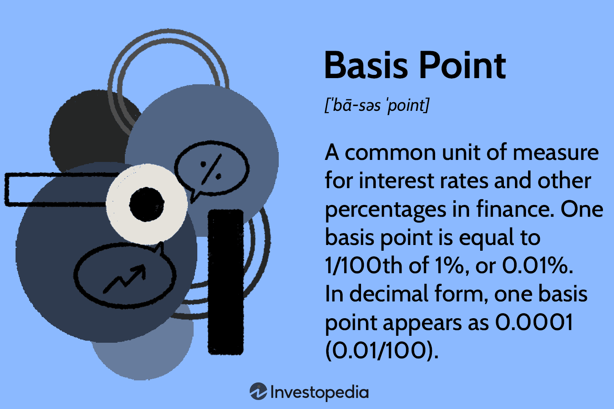

## Table of Contents

## What is a basis point?

A basis point is a unit of measure used in finance to describe the percentage change in a financial instrument. One basis point is equal to 1/100th of a percent, or 0.01%. This small unit is used because many financial changes are very small, and basis points make it easier to understand and communicate these changes accurately.

For example, if the interest rate on a loan goes up from 5% to 5.05%, it has increased by 5 basis points. Using basis points helps avoid confusion when talking about small changes in percentages. It's a standard way for people in finance to talk about changes in interest rates, bond yields, and other financial metrics.

## Why are basis points used?

Basis points are used because they make it easy to talk about small changes in percentages. In finance, changes in interest rates or investment returns are often very small. Instead of saying something went up by 0.01%, it's simpler to say it went up by 1 basis point. This makes conversations clearer and less confusing, especially when dealing with tiny numbers.

They are also useful because they help avoid mistakes. When people talk about percentages, it's easy to mix up whole numbers and decimals. For example, saying a rate went up by 50 can be confusing - does that mean 50% or 0.50%? But if you say it went up by 50 basis points, everyone knows it means 0.50%. This clear way of talking helps everyone understand financial changes better.

## How many basis points are in a percentage point?

A percentage point is the same as 100 basis points. This means if you have a change of 1 percentage point, that's the same as a change of 100 basis points.

Using basis points helps make small changes in percentages easier to understand. For example, if an [interest rate](/wiki/interest-rate-trading-strategies) goes up by 0.25%, that's the same as saying it went up by 25 basis points. It's a clear way to talk about tiny changes in finance.

## How can basis points be used in financial markets?

Basis points are really helpful in financial markets because they help people talk about small changes in interest rates, bond yields, and other financial numbers. For example, if a bank says it's raising the interest rate on a loan by 25 basis points, that means the rate is going up by 0.25%. This makes it easy for everyone to understand the change without getting confused by decimals.

They are also used a lot when talking about how well investments are doing. If someone says a mutual fund's performance went up by 50 basis points, that means it did 0.50% better than before. This way of talking helps investors and financial experts quickly understand and compare how different investments are doing, making it easier to make smart choices.

## What is the significance of basis points in interest rates?

Basis points are important when talking about interest rates because they help everyone understand small changes easily. If a bank says it's raising the interest rate on a loan by 25 basis points, that means the rate is going up by 0.25%. This way of talking avoids confusion with decimals and makes it clear to everyone what the change is. It's like using a simple tool to explain something that could be hard to understand otherwise.

In financial markets, using basis points for interest rates helps everyone talk about and compare changes without making mistakes. For example, if someone says the interest rate on a savings account went up by 10 basis points, people know right away that it's a 0.10% increase. This clear way of talking is really helpful for banks, investors, and anyone who needs to understand how interest rates are changing.

## How do basis points affect bond yields?

Basis points are important when talking about bond yields because they help everyone understand small changes easily. If someone says a bond's yield went up by 25 basis points, that means the yield increased by 0.25%. This way of talking makes it clear to everyone what the change is without getting confused by decimals. It's like using a simple tool to explain something that could be hard to understand otherwise.

In the bond market, using basis points for yields helps everyone talk about and compare changes without making mistakes. For example, if a bond's yield goes down by 10 basis points, people know right away that it's a 0.10% decrease. This clear way of talking is really helpful for investors and anyone who needs to understand how bond yields are changing. It makes it easier for them to make smart choices about buying or selling bonds.

## Can you explain how basis points are used in investment performance?

Basis points are a useful way to talk about how well investments are doing. If someone says a mutual fund went up by 50 basis points, that means it did 0.50% better than before. This way of talking helps investors understand small changes in their investments without getting confused by decimals. It's like using a simple tool to explain something that could be hard to understand otherwise.

In the world of investments, using basis points helps everyone talk about and compare how different investments are doing without making mistakes. For example, if one stock's performance went down by 20 basis points, people know right away that it's a 0.20% decrease. This clear way of talking is really helpful for investors because it makes it easier for them to make smart choices about where to put their money.

## What role do basis points play in monetary policy?

Basis points are important in monetary policy because they help central banks talk about small changes in interest rates easily. When a central bank says it's raising the interest rate by 25 basis points, that means the rate is going up by 0.25%. This way of talking makes it clear to everyone what the change is without getting confused by decimals. It's like using a simple tool to explain something that could be hard to understand otherwise.

In the world of monetary policy, using basis points helps everyone understand and talk about changes without making mistakes. For example, if a central bank lowers the interest rate by 50 basis points, people know right away that it's a 0.50% decrease. This clear way of talking is really helpful for banks, investors, and anyone who needs to understand how interest rates are changing. It makes it easier for them to make smart choices about their money and the economy.

## How are basis points calculated in financial transactions?

Basis points are calculated by figuring out how much a percentage has changed, then turning that into a number of basis points. For example, if an interest rate goes up from 3% to 3.25%, you first find the change in the percentage, which is 0.25%. Then, you know that one basis point is 0.01%, so you divide 0.25% by 0.01% to find out how many basis points that is. In this case, it's 25 basis points.

This way of calculating helps everyone understand small changes in financial transactions without getting confused by decimals. If a bank says it's raising the interest rate on a loan by 10 basis points, people know right away that it's a 0.10% increase. This clear way of talking is really helpful for everyone involved in financial transactions, like banks, investors, and anyone who needs to understand how rates are changing.

## What is the impact of basis point changes on large sums of money?

When basis points change, they can have a big impact on large sums of money. Even a small change, like 10 basis points, which is just 0.10%, can make a big difference when you're dealing with millions or billions of dollars. For example, if you have a $100 million loan and the interest rate goes up by 10 basis points, that's an extra $100,000 you have to pay in interest.

This is why basis points are so important in finance. They help everyone understand and talk about small changes in interest rates or investment returns without getting confused. When you're dealing with big money, these small changes can add up quickly, so it's important to be clear about them. Using basis points makes it easier for banks, investors, and anyone else to see how even tiny changes can affect their money.

## How do basis points relate to risk management in finance?

Basis points are important in risk management because they help people understand small changes in financial numbers easily. In risk management, it's important to keep track of changes in interest rates, bond yields, and investment returns. Using basis points makes it easier to talk about these changes without getting confused by decimals. For example, if a company is worried about interest rates going up, they might use basis points to figure out how a change of 25 basis points, or 0.25%, could affect their loans or investments.

This clear way of talking helps risk managers make better decisions. They can use basis points to see how small changes might affect big sums of money. For example, if a company has a lot of debt and the interest rate goes up by 50 basis points, that's a 0.50% increase, which could mean a lot more money to pay back. By understanding these changes in basis points, risk managers can plan better and take steps to protect their money from small but important changes in the financial world.

## Can you discuss advanced applications of basis points in financial modeling?

In financial modeling, basis points are used to make detailed predictions about how small changes in interest rates or investment returns can affect big financial plans. For example, when building a model for a company's future cash flows, financial analysts might use basis points to see how a change of just 10 basis points in interest rates could change the company's debt payments. This helps them understand the risks and plan for different scenarios. By using basis points, they can make their models more accurate and see how even tiny changes can have a big impact on the company's finances.

Another way basis points are used in financial modeling is in stress testing. This is when analysts want to see how a company or an investment would do if things got really tough, like if interest rates went up a lot. They might use basis points to model what would happen if rates went up by 100 basis points, or 1%. This helps them figure out if the company can handle big changes or if it needs to make changes to its plans. Using basis points in this way helps make the stress tests more realistic and helps everyone understand the risks better.

## What are the best practices for algorithmic trading in a changing interest rate environment?

Adapting [algorithmic trading](/wiki/algorithmic-trading) models to a dynamic interest rate environment requires strategic planning and implementation to maintain efficacy. As interest rates fluctuate, traders need to ensure that their algorithms are capable of adjusting to these changes to maximize investment returns and mitigate risks.

One crucial strategy is the incorporation of interest rate sensitivity analysis within the algorithmic models. This involves evaluating how changes in interest rates can impact various financial instruments and adjusting the algorithms accordingly. Interest rate derivatives like futures and options can be used to hedge against adverse movements, thereby stabilizing returns. 

Mathematically, algorithms should be designed to evaluate the sensitivity of assets using metrics like Duration and Convexity for bonds. Duration measures the price change of a bond in response to a change in interest rates, whereas Convexity accounts for the curvature in the relationship between bond prices and interest rates. Calculating these metrics can guide the algorithm's decision-making process:

$$
\text{Modified Duration} = \frac{\text{Macaulay Duration}}{1 + \frac{\text{YTM}}{k}}
$$

$$
\text{Convexity} = \frac{1}{P} \sum \frac{C_t \times (t + 1) \times t}{(1 + YTM)^{t+2}}
$$

where $P$ is the bond price, $C_t$ is the cash flow at time $t$, $\text{YTM}$ is the yield to maturity, and $k$ is the compounding frequency per year.

Effective algorithmic trading also relies heavily on [backtesting](/wiki/backtesting). Historical data involving various interest rate scenarios should be used to simulate the algorithm's performance, identifying potential weaknesses and optimizing parameters. The process involves running the algorithm against historical data to ensure it can perform well under a variety of market conditions. In Python, backtesting can be implemented using libraries like Backtrader:

```python
import backtrader as bt

class MyStrategy(bt.Strategy):
    def __init__(self):
        self.sma = bt.indicators.SimpleMovingAverage(self.data.close, period=15)

    def next(self):
        if self.data.close[0] > self.sma[0]:
            self.buy(size=100)
        elif self.data.close[0] < self.sma[0]:
            self.sell(size=100)

cerebro = bt.Cerebro()
cerebro.addstrategy(MyStrategy)
data = bt.feeds.YahooFinanceData(dataname='AAPL', fromdate=datetime(2010, 1, 1), todate=datetime(2020, 12, 31))
cerebro.adddata(data)
cerebro.run()
```

Continuous monitoring and updating are essential to maintaining the effectiveness of algorithmic models in a changing interest rate environment. Developers should consistently analyze real-time data and adjust the algorithm’s parameters according to current economic indicators and forecasts. Machine learning approaches such as [reinforcement learning](/wiki/reinforcement-learning) can be employed for automatic adjustments, allowing the algorithm to learn and adapt from market experiences without explicit programming.

Ultimately, the key to successful algorithmic trading in such a volatile domain is a comprehensive framework that includes robust data analytics, risk management strategies, and ongoing refinement of the algorithm to align with evolving market conditions. Regular updates and calibrations informed by both historical performance and future predictions are vital to sustain competitiveness and achieve favorable outcomes.

## References & Further Reading

[1]: Bergstra, J., Bardenet, R., Bengio, Y., & Kégl, B. (2011). ["Algorithms for Hyper-Parameter Optimization."](https://papers.nips.cc/paper/4443-algorithms-for-hyper-parameter-optimization) Advances in Neural Information Processing Systems 24.

[2]: ["Advances in Financial Machine Learning"](https://www.amazon.com/Advances-Financial-Machine-Learning-Marcos/dp/1119482089) by Marcos Lopez de Prado

[3]: ["Evidence-Based Technical Analysis: Applying the Scientific Method and Statistical Inference to Trading Signals"](https://www.amazon.com/Evidence-Based-Technical-Analysis-Scientific-Statistical/dp/0470008741) by David Aronson

[4]: ["Machine Learning for Algorithmic Trading"](https://github.com/PacktPublishing/Machine-Learning-for-Algorithmic-Trading-Second-Edition) by Stefan Jansen

[5]: ["Quantitative Trading: How to Build Your Own Algorithmic Trading Business"](https://books.google.com/books/about/Quantitative_Trading.html?id=j70yEAAAQBAJ) by Ernest P. Chan