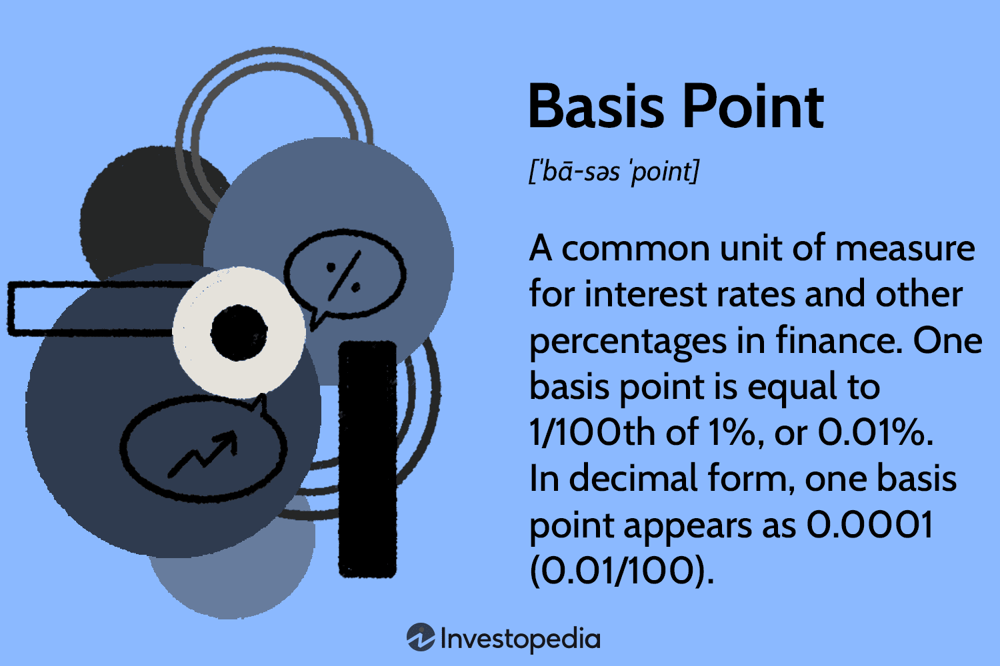

The financial world is characterized by intricacies that necessitate a comprehensive understanding of various metrics and their implications on both investment strategies and economic policy. Among these metrics, basis points, interest rates, and algorithmic trading emerge as pivotal concepts that shape the landscape of modern finance. 

Basis points (bps) provide a unit of measure used to express variations in interest rates, bond yields, and other percentages in financial contexts with clarity and precision. This standardized unit allows for effective communication among market participants by eliminating ambiguities associated with percentage calculations. A basis point represents 0.01%, facilitating precise quantification in financial transactions and analyses.

Interest rates serve as a fundamental determinant of the cost of borrowing money, thereby significantly influencing economic activity. Central banks utilize the manipulation of interest rates as a primary tool for monetary policy, aiming to control inflation and stimulate economic growth. The adjustment of interest rates can lead to immediate repercussions on stock prices, bond yields, and real estate markets, making their understanding essential for investors seeking to anticipate market trends and optimize their portfolios effectively.

Algorithmic trading, on the other hand, leverages computer algorithms to automate the execution of trade orders based on pre-established parameters. This approach to trading has gained prominence due to its capacity for rapid transaction processing, thereby enhancing market efficiency. Basis points serve as critical thresholds within these algorithms, particularly in high-frequency trading (HFT), enabling algorithms to respond dynamically to shifts in interest rates with precision in trading decisions.

This article examines these elements, scrutinizing their roles and their impact on the financial markets. By exploring the interconnectedness of basis points, interest rates, and algorithmic trading, we aim to elucidate their significance and the manner in which they collaboratively underpin the frameworks that guide modern financial systems.

## Table of Contents

## Understanding Basis Points

Basis points (bps) are a standardized unit of measure used to express slight changes in values, notably within financial instruments. One basis point is equivalent to 0.01%, or $0.0001$ in decimal form. This term provides a clear and precise method for communicating variations, especially for those linked to interest rates, bond yields, and equity indices. 

In financial sectors where precision is critical, the use of basis points becomes essential. For instance, when discussing interest rates, a change from 2.00% to 2.25% might be simply stated as a 25-basis point increase. This eliminates the potential for confusion that might arise from describing such a change as a percentage, particularly when communicating across different mathematical or linguistic contexts.

Furthermore, in financial calculations, basis points play a significant role in several areas:

1. **Interest Rates**: Central banks often use basis points to describe fluctuations in policy rates. For instance, a rate cut of 50 basis points implies a reduction of 0.50% in the interest rate. 

2. **Bond Yields**: Investors and analysts frequently reference shifts in bond yields in terms of basis points. A bond yield moving up 100 basis points indicates a substantial interest shift, equivalent to a full percentage point increase.

3. **Equity Indices**: Stock market indices also utilize basis points to signify changes. For example, if an index rises by 200 basis points, it represents a 2% increase.

Using basis points as a standardized measure allows financial professionals to communicate with precision and clarity, avoiding potential misunderstandings that could arise from using traditional percentage terms. This level of precision is vital for accurate financial analysis, risk management, and decision-making processes. Consequently, basis points are integral to a wide array of financial operations, ensuring stakeholders have a clear understanding of percentage-based changes.

## Role of Interest Rates in Financial Markets

Interest rates are fundamental to the functioning of financial markets as they symbolize the cost of borrowing and have a broad impact on economic activity. At their core, interest rates determine the price at which borrowers can access capital and investors can lend their funds. Their fluctuations influence various asset classes, including stocks, bonds, and real estate, thereby affecting investment decisions and economic growth.

Central banks are pivotal in managing interest rates as part of their monetary policy toolkit. By altering interest rates, central banks aim to control inflation and stabilize the economy. For instance, during periods of high inflation, a central bank might raise interest rates to curb spending and borrowing, thus cooling down economic activity. Conversely, during economic slowdowns, lowering interest rates can stimulate consumption and investment by making borrowing cheaper. The relationship between interest rates and inflation is often articulated using the Fisher equation:

$$
i = r + \pi
$$

where $i$ is the nominal interest rate, $r$ is the real interest rate, and $\pi$ is the inflation rate. Adjustments in these rates have downstream effects on asset pricing and investor behavior.

Interest rate adjustments are closely monitored by investors, as they provide insights into future economic conditions. For example, a predicted rise in interest rates might lead investors to anticipate higher costs for companies, potentially pressuring stock valuations. Similarly, bond yields, which move inversely with prices, tend to rise with increasing interest rates, reflecting the enhanced returns demanded by investors for [interest rate](/wiki/interest-rate-trading-strategies) risk.

Moreover, real estate markets are heavily influenced by interest rate movements, given their impact on mortgage rates. Higher interest rates can lead to increased mortgage costs, reducing affordability and potentially dampening housing demand. Conversely, lower rates generally make financing more accessible, supporting robust real estate activity.

Investors employ various models and analytical tools to understand and anticipate the impact of interest rate changes on financial markets. For instance, the Capital Asset Pricing Model (CAPM) may integrate interest rate considerations to help evaluate the expected return on an asset relative to its risk. Additionally, yield curve analysis, which looks at interest rates across different maturities, can offer insights into future economic conditions and guide investment strategies.

Understanding the dynamic nature of interest rates enables investors to optimize their portfolios by adjusting the allocation of assets based on anticipated rate movements. Strategies might include diversifying holdings to buffer against rate hikes or capitalizing on favorable borrowing conditions during times of low rates. Through a comprehensive analysis of interest rate environments, investors gain a competitive edge in navigating complex financial markets.

## Basis Points in Algorithmic Trading

Algorithmic trading leverages computer algorithms to efficiently execute trades based on a set of predefined criteria. One of the key aspects of these algorithms, particularly in high-frequency trading ([HFT](/wiki/high-frequency-trading-strategies)), is the use of basis points (bps) as critical thresholds. The precision of basis points—where one basis point equals 0.01%—is invaluable in the HFT environment where even minute price differences can affect the profitability of trades.

In [algorithmic trading](/wiki/algorithmic-trading), the response to shifts in interest rates is vital. Algorithms dynamically adjust their strategies based on changes at the level of basis points. This precision is crucial in making precise trading decisions in volatile financial markets. For example, a small shift of five basis points in interest rates can prompt algorithms to re-evaluate asset prices and execute a series of trades aimed at capitalizing on perceived [arbitrage](/wiki/arbitrage) opportunities.

In high-frequency trading, algorithms often strive to achieve what is known as latency arbitrage, exploiting small price discrepancies that exist only for milliseconds. In such cases, sensitivity to basis point shifts becomes a defining [factor](/wiki/factor-investing) in the success of trades. These algorithms are programmed to instantaneously calculate potential gains or losses from basis point alterations and adjust their strategies accordingly to maximize profitability.

Additionally, the use of basis points in algorithmic trading enhances risk assessment and management. By setting algorithm parameters based on anticipated changes in basis points, traders can better estimate risk exposure and effectively hedge their portfolios. The adaptability and precision of algorithms in response to basis point changes offer a significant advantage over manual trading, allowing for more sophisticated strategies that can operate at unparalleled speed and efficiency. 

In summary, the integration of basis points into algorithmic trading provides traders with a powerful tool to navigate the complexities of modern financial markets, enabling rapid and precise responses to fluctuating interest rates and price movements.

## Advantages and Challenges of Algorithmic Trading

Algorithmic trading significantly enhances market efficiency, speed, and precision by employing sophisticated algorithms to execute trades. One primary advantage is the ability to act swiftly on market opportunities, leveraging speed that far surpasses human capabilities. In high-frequency trading (HFT), for instance, algorithms execute thousands of trades within seconds, capitalizing on small price deviations. This rapid execution reduces transaction costs and increases [liquidity](/wiki/liquidity-risk-premium) in the markets.

Moreover, algorithmic trading minimizes human error, a common issue in manual trading. By utilizing pre-defined criteria and rules, these systems consistently adhere to trading strategies, eliminating emotional biases and increasing decision-making reliability. This predictability improves overall performance and aligns with strategic investment goals without the need for continuous human intervention.

Despite these advantages, algorithmic trading presents several challenges. Continuous monitoring is required to ensure that algorithms execute as intended, responding appropriately to changing market conditions. Although automation reduces human error, it cannot entirely eliminate the risk of technical failures. Disruptions such as software bugs, network outages, or data feed errors can lead to significant financial losses if not promptly addressed.

Further, regulatory compliance is a critical concern. Financial markets are subject to stringent regulations to ensure fair practices and prevent market abuse. Algorithmic traders must adhere to these regulations, which vary across jurisdictions, adding complexity to multinational trading operations.

Managing large-scale data processing is another major challenge. Algorithmic systems ingest and analyze massive volumes of data to generate trading signals. Efficient data processing frameworks are essential to handle this data influx, necessitating advanced computational resources and robust data management strategies. The ability to process and interpret real-time data accurately is crucial for maintaining competitiveness in algorithmic trading.

In summary, while algorithmic trading provides substantial benefits in terms of efficiency, speed, and precision, it requires ongoing efforts to manage technical and regulatory challenges effectively.

## The Intersection of Interest Rates and Algorithmic Trading

Algorithmic trading, a method that employs advanced algorithms to automate and optimize financial trading decisions, heavily relies on precise and timely data. Interest rates play a vital role in shaping these algorithms, as they are fundamental economic indicators that influence market conditions. By integrating real-time interest rate data, algorithmic models can dynamically adjust strategies to align with current market trends, thereby enhancing their effectiveness and profitability.

Interest rate derivatives, including futures and options, are essential tools in managing risk and hedging interest rate exposure. These financial instruments derive their value from the underlying interest rates and enable traders to speculate on future rate movements or protect against unforeseen fluctuations. By incorporating interest rate derivatives into their trading models, algorithmic systems can better manage risk and optimize returns in uncertain market environments.

The integration of real-time interest rate data allows algorithmic trading systems to respond promptly to changes in monetary policy, economic indicators, and global financial events. This responsiveness is achieved through the continuous monitoring and analysis of interest rate movements, which are then used to adjust trading strategies in real time. Python, a powerful programming language commonly used in finance, offers a range of libraries and tools that facilitate the development of such algorithmic trading systems. For instance, Python's `pandas` library can be used to manage and analyze large datasets, while `statsmodels` provides statistical modeling functions to evaluate the impact of interest rate changes on market dynamics.

Moreover, algorithmic trading's ability to incorporate interest rate data extends beyond immediate responses to policy changes. It also involves the assessment of long-term trends and patterns in interest rate movements, enabling the development of predictive models that anticipate future market scenarios. This strategic foresight allows traders to position themselves advantageously and capitalize on emerging opportunities.

In conclusion, the intersection of interest rates and algorithmic trading signifies a technologically driven approach to navigating the complexities of financial markets. By harnessing real-time data and sophisticated modeling techniques, algorithmic trading systems can effectively manage risk, adapt to changing conditions, and optimize decision-making processes. This synergy not only enhances the efficiency and precision of trading but also empowers investors to remain competitive in a rapidly evolving financial landscape.

## Conclusion

A comprehensive understanding of basis points, interest rates, and algorithmic trading is essential for navigating today's financial markets. Each of these elements contributes uniquely to the precision and efficiency required in strategic financial decision-making.

Basis points offer a granular measure for evaluating financial changes, ensuring clear communication and accurate financial calculations. Their application spans across interest rates, bond yields, and equity indices, reducing errors and misunderstandings in financial transactions. This precision is vital as even marginal percentage changes can significantly impact investment returns and market movements.

Interest rates are a primary economic indicator, signaling the cost of borrowing and influencing consumer behavior, corporate financing, and overall economic activity. Central banks exploit interest rates as a tool to manage inflation and stimulate economic growth. Thus, understanding interest rate trends enables investors to anticipate market shifts and optimize their portfolios for better risk-adjusted returns.

Algorithmic trading, facilitated by technological advancements, offers enhanced speed, efficiency, and accuracy in executing trades. This technology-driven approach leverages algorithms that respond dynamically to market conditions. By integrating interest rate data and basis points, algorithmic trading systems can make informed and timely trading decisions, offering a competitive edge in a rapidly evolving financial landscape.

Investors must embrace these technological advancements to remain competitive. Data-driven trading strategies powered by algorithms not only empower investors with improved decision-making capabilities but also ensure they can adeptly manage risks and capture opportunities in complex markets. Therefore, mastery of basis points, interest rates, and algorithmic trading is indispensable for achieving success and sustainability in financial markets.

## References & Further Reading

1. **Hull, J. C. (2015). Options, Futures, and Other Derivatives.** This book is a key resource providing insights into financial instruments beneficial for understanding basis points, interest rates, and algorithmic trading. It offers a comprehensive discussion on derivatives and their role in managing financial risks, including interest rate derivatives like futures and options. ISBN: 978-0133456318.

2. **Fabozzi, F. J. (2008). Fixed Income Analysis.** This text thoroughly explains fixed income securities, including interest rate movements and their impact on bond pricing. It provides foundational knowledge relevant to understanding how such rate changes are measured and communicated using basis points. ISBN: 978-0470078143.

3. **Chincarini, L. B., & Kim, D. (2006). Quantitative Equity Portfolio Management.** This book explores models used in quantitative trading, including those that factor in interest rate changes. It helps to understand how interest rate data is integrated into algorithmic trading strategies and portfolio management. ISBN: 978-0071459393.

4. **Hasbrouck, J. (2007). Empirical Market Microstructure.** This resource examines the empirical aspects of trading, including the intricacies of algorithmic and high-frequency trading. It sheds light on how basis points act as decision thresholds in algorithmic systems. ISBN: 978-0195301649.

5. **Bodie, Z., Kane, A., & Marcus, A. J. (2017). Investments.** This book offers a broad overview of investment principles, covering interest rate impacts on various asset classes. It investigates into how these impacts can be systematically approached within trading algorithms. ISBN: 978-0077861671.

6. **Jones, C. M. (2013). What do we know about high-frequency trading? Columbia Business School Research Paper.** This paper provides an in-depth analysis of high-frequency trading, highlighting the role of algorithmic strategies in processing real-time financial data, including interest rates and basis point changes. Available at SSRN: https://ssrn.com/abstract=2236201.

7. **Sengupta, C. (2004). Financial Modeling Using Excel and VBA.** This book is practical for learners interested in financial modeling, offering techniques to simulate trading strategies, consider interest rate impacts, and utilize basis points in financial calculations. ISBN: 978-0471267683.

8. **Engle, R. F. (1982). Autoregressive Conditional Heteroskedasticity with Estimates of the Variance of United Kingdom Inflation.** This seminal paper introduces the ARCH model, crucial for analyzing time series data in finance, facilitating the understanding of market volatility influenced by interest rate fluctuations. Available at: https://doi.org/10.1111/j.1468-0262.1982.tb03831.x.

9. **Biais, B., Foucault, T., & Moinas, S. (2014). Equilibrium High-Frequency Trading.** This study analyzes the effects of high-frequency trading in financial markets, focusing on the role of basis points in determining price equilibrium and strategy optimization. Available at SSRN: https://ssrn.com/abstract=2024360.

These resources collectively provide a robust foundation for understanding the interplay between financial metrics, algorithmic trading, and interest rate dynamics.

