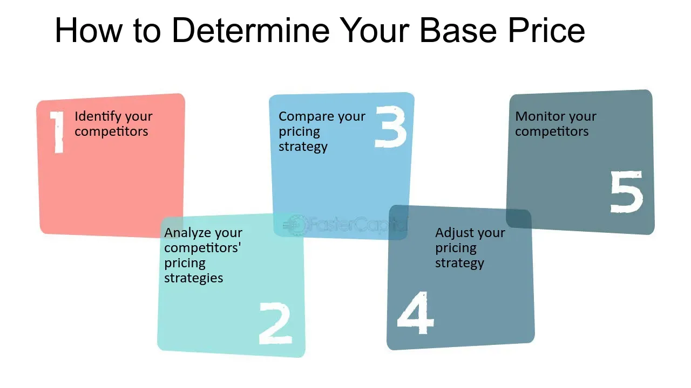

## Table of Contents

## What is the basis price?

The basis price is the starting price of a product or service before any additional costs or discounts are added. It's like the basic price you see on a price tag before taxes or any other fees are included. For example, if you're buying a car, the basis price would be the price of the car itself, not including things like sales tax, registration fees, or optional features.

In trading and finance, the basis price can also mean the difference between the spot price of a commodity and the futures price of that commodity. This is important for people who trade in commodities because it helps them understand market trends and make better decisions. For instance, if the basis price is high, it might mean that the demand for the commodity is expected to increase in the future.

## How is the basis price calculated?

The basis price in trading and finance is calculated by finding the difference between the spot price of a commodity and its futures price. The spot price is what you would pay to buy the commodity right now, while the futures price is what you would pay to buy it at a future date. To get the basis price, you simply subtract the futures price from the spot price. For example, if the spot price of wheat is $5 per bushel and the futures price for wheat in three months is $5.20 per bushel, the basis price would be $5 - $5.20 = -$0.20.

In the context of products or services, the basis price is usually set by the seller or manufacturer. It's the price before any additional costs like taxes, shipping, or optional features are added. For instance, if you're looking at a new smartphone, the basis price might be $700. That's the price before you add on things like sales tax, a case, or a warranty. The seller decides this price based on factors like production costs, market demand, and competition.

## Why is the basis price important in trading?

The basis price is really important in trading because it helps traders understand how the price of a commodity might change in the future. It's like a sneak peek into what might happen. By looking at the difference between the spot price and the futures price, traders can guess if the demand for the commodity will go up or down. For example, if the basis price is negative, it might mean that people expect the price to go up later, so they're willing to pay more for it now.

This information is super useful for making smart trading decisions. If a trader sees that the basis price is getting bigger, it might be a good time to buy the commodity now and sell it later at a higher price. On the other hand, if the basis price is shrinking, it could be a sign to sell the commodity now before the price drops. Understanding the basis price helps traders manage their risks and make plans that could lead to more profits.

## Can you provide a simple example of basis price in commodities?

Imagine you want to buy corn. Right now, you can buy a bushel of corn for $4. This is called the spot price. But if you want to buy corn in three months, the price might be $4.20 per bushel. This is the futures price. The basis price is the difference between these two prices. So, in this case, the basis price would be $4 - $4.20 = -$0.20.

The basis price tells you something about what people think will happen to corn prices in the future. If the basis price is negative, like in our example, it means people are willing to pay more for corn later. They might think that corn will be harder to get or more expensive in three months. Traders use this information to decide if they should buy corn now and sell it later, or wait and see what happens.

## How does basis price affect futures contracts?

The basis price is super important for people who trade futures contracts. It's the difference between what you pay for a commodity right now (the spot price) and what you agree to pay for it later (the futures price). When you're looking at a futures contract, the basis price helps you figure out if it's a good deal. If the basis price is negative, it means people think the commodity will be worth more in the future. So, if you buy a futures contract when the basis price is negative, you might make money if the price goes up like everyone expects.

On the other hand, if the basis price is positive, it means people think the commodity will be worth less in the future. This could be a warning sign for traders. If you buy a futures contract when the basis price is positive, you might lose money if the price drops like everyone expects. By keeping an eye on the basis price, traders can make smarter choices about when to buy or sell futures contracts, helping them manage their risks and maybe even make more money.

## What factors influence the basis price?

The basis price is affected by many things. One big factor is the supply and demand for the commodity. If there's a lot of a commodity around, the spot price might be low, but if people think there will be less of it later, the futures price could be high. This makes the basis price negative. On the other hand, if there's not much of a commodity now but people think there will be more later, the basis price might be positive. Things like weather, politics, and big news can also change how much of a commodity there is and what people think will happen to it.

Another thing that influences the basis price is the cost of storing and moving the commodity. If it's expensive to keep a commodity safe until later, the futures price might be higher to cover those costs. This can make the basis price more negative. Also, if it's hard or expensive to move the commodity from one place to another, that can affect the spot price and the futures price differently, changing the basis price. Traders need to think about all these things when they look at the basis price to make good decisions.

## How does the basis price vary across different regions?

The basis price can be different in different places because things like transportation costs, local supply and demand, and even local laws can change how much a commodity costs in one area compared to another. For example, if it's really expensive to move wheat from a farm to a city, the spot price in the city might be higher than in the countryside. This means the basis price could be different in the city than it is at the farm. Also, if there's a lot of a commodity in one region but not in another, the basis price can change because the spot price will be different in each place.

Sometimes, things like weather or local rules can make the basis price different in different regions. For instance, if a big storm hits one area and makes it hard to grow or move a commodity, the spot price in that area might go up, making the basis price there different from other places that weren't affected by the storm. Local laws, like taxes or rules about how commodities can be traded, can also make the basis price different from one region to another. Traders need to think about all these things when they look at the basis price in different places to make smart trading decisions.

## What are the common strategies traders use to manage basis risk?

Traders use different ways to handle basis risk, which is the chance that the basis price will change and mess up their plans. One common way is called hedging. This means they buy or sell futures contracts to protect themselves from big changes in the basis price. For example, if a farmer wants to make sure they get a good price for their corn later, they might sell a futures contract now. This way, even if the basis price changes, they know they'll get the price they agreed on in the futures contract.

Another way traders manage basis risk is by keeping a close eye on the market and making quick changes to their plans. They look at things like weather reports, news about supply and demand, and even what other traders are doing. If they see the basis price starting to change, they might decide to buy or sell their commodities or futures contracts at just the right time to avoid losing money. This takes a lot of watching and thinking, but it can help them make better decisions and lower their risk.

## How can understanding basis price improve hedging effectiveness?

Understanding the basis price can really help make hedging better. When you know how the basis price works, you can guess how the difference between the spot price and the futures price might change. This helps you pick the right futures contracts to use for hedging. If you see that the basis price is getting smaller, you might want to buy a futures contract to lock in a good price now, before it changes. On the other hand, if the basis price is getting bigger, selling a futures contract could be a smart move to protect yourself from future price drops.

By keeping an eye on the basis price, you can also time your hedging moves better. If you notice that the basis price often changes at certain times of the year or because of certain events, you can plan your hedging around those times. This way, you're not just guessing; you're making smart choices based on what you know about the market. Understanding the basis price lets you make your hedging plan more accurate and helps you avoid big surprises, making your trading safer and possibly more profitable.

## What is the relationship between basis price and arbitrage opportunities?

The basis price is really important for finding arbitrage opportunities. Arbitrage is when you buy something in one place and sell it in another place for a higher price, making a profit from the difference. If the basis price is different in two places, it can show you where there might be a chance to make money. For example, if the basis price for corn is negative in one place but positive in another, you could buy corn where the basis price is negative and sell it where it's positive, making a profit from the difference in prices.

Traders use the basis price to spot these arbitrage opportunities. They look at how the basis price changes over time and between different places. If they see that the basis price is moving in a way that creates a big difference between two markets, they can jump in and make a trade to take advantage of it. This helps them make money without taking a lot of risk, as long as they can move the commodity quickly enough to make the trade work. Understanding the basis price is key to finding these chances to make a profit.

## How do seasonal trends impact the basis price?

Seasonal trends can really change the basis price because they affect how much of a commodity is available and how much people want it. For example, during harvest time, there might be a lot of corn around, so the spot price might go down. But if people think there will be less corn later in the year, the futures price might stay high. This makes the basis price negative because the spot price is lower than the futures price. Farmers and traders need to watch these seasonal changes to guess how the basis price might move.

In winter, things can be different. If it's hard to grow or move a commodity because of cold weather, the spot price might go up because there's less of it around. But if people think there will be more of the commodity later when the weather gets better, the futures price might not go up as much. This can make the basis price positive because the spot price is higher than the futures price. By understanding how the seasons affect the basis price, traders can make better plans and maybe even find good times to buy or sell commodities.

## What advanced analytical tools are used to predict basis price movements?

Traders use fancy computer programs and math to guess how the basis price might change. One tool they use a lot is called regression analysis. This tool looks at past data to find patterns that can help predict what might happen next. For example, it can show how the basis price changes with the seasons or when big news happens. Another tool is time series analysis, which looks at how the basis price moves over time. This can help traders see if there are regular ups and downs in the basis price that they can use to make smart trades.

Another cool tool is [machine learning](/wiki/machine-learning). This is when computers learn from a lot of data to find hidden patterns that people might miss. Machine learning can look at things like weather reports, news about supply and demand, and even what other traders are doing to predict how the basis price might change. By using these advanced tools, traders can make better guesses about the future and make plans that might help them make more money while taking less risk.

## What is basis price?

Basis price is a pivotal concept in financial markets, serving as a reference point used to evaluate and compare the value of various financial instruments. In the context of financial terminology, the basis price essentially reflects the differential between the spot price and the future price of an asset. This concept holds significant importance in both bond markets and commodity futures markets.

In bond markets, basis price is closely associated with the yield to maturity (YTM), a fundamental metric for investors. Yield to maturity represents the total return expected on a bond if the bond is held until it matures, effectively capturing both interest income and capital gains or losses due to price changes. The basis price in this context is critical for comparing the yields of different fixed-income securities with varying characteristics, such as coupon rates and maturities. By evaluating the basis price, investors can discern which bonds offer higher expected returns and make more informed investment choices.

For example, suppose an investor is considering two bonds: Bond A with a YTM of 5% and Bond B with a YTM of 4.5%. The basis price helps the investor understand the yield spread, guiding them to decide whether the higher yield of Bond A justifies any potential additional risks compared to Bond B. Understanding the basis price helps investors align their portfolios with their risk-return objectives.

In commodity futures markets, basis price takes on another layer of importance as it reflects the spread between the spot price of a commodity and its corresponding futures price. This spread, often referred to simply as "the basis," can be represented as:

$$
\text{Basis} = \text{Spot Price} - \text{Futures Price}
$$

The basis is a crucial [factor](/wiki/factor-investing) in the decision-making processes for hedging and speculation. A positive basis indicates that the spot price is higher than the futures price, which might suggest a premium for immediate delivery. Conversely, a negative basis indicates that future prices exceed current spot prices, which can arise due to expectations of future shortages or increased demand.

Understanding this spread is essential, particularly for farmers and traders who are looking to hedge against price [volatility](/wiki/volatility-trading-strategies). By analyzing the basis, they can lock in favorable prices for future delivery, thus reducing the risks associated with price fluctuations.

In summary, the basis price acts as an essential indicator in comparing the value propositions of varying fixed-income securities and as an analytical tool to assess the price differentials in commodity futures markets. Its comprehension enables investors to make informed decisions concerning yield spreads and price risks, forming a keystone in the broader spectrum of financial analysis and investment strategy.

## What are the mechanisms for pricing in financial markets?

Pricing mechanisms in financial markets are critical for determining the values of financial instruments, enabling market participants to make informed decisions. These mechanisms involve complex calculations and models to ensure that instruments like options, futures, and other derivatives are priced accurately, reflecting their intrinsic and extrinsic values.

Different financial instruments have unique pricing methodologies. Options, for instance, are priced using the Black-Scholes model, a mathematical model that calculates the option's theoretical price by considering factors such as the stock price, strike price, time to expiration, risk-free rate, and volatility. The Black-Scholes formula for a call option is given by:

$$

C = S_0 N(d_1) - Xe^{-rt}N(d_2) 
$$

where:

$$

d_1 = \frac{\ln(\frac{S_0}{X}) + (r + \frac{\sigma^2}{2})t}{\sigma\sqrt{t}} 
$$

$$

d_2 = d_1 - \sigma\sqrt{t} 
$$

- $C$ = call option price
- $S_0$ = current stock price
- $N$ = cumulative distribution function of the standard normal distribution
- $X$ = strike price of the option
- $e$ = base of the natural logarithm
- $r$ = risk-free interest rate
- $t$ = time to maturity
- $\sigma$ = volatility of the stock returns

Futures contracts, on the other hand, rely on the cost-of-[carry](/wiki/carry-trading) model, which includes components like the spot price, interest rates, and storage costs (if applicable). The basic pricing formula for futures is:

$$

F = S_0 \times e^{r \times t} 
$$

where:
- $F$ = futures price
- $S_0$ = spot price
- $r$ = risk-free interest rate
- $t$ = time to contract expiration

Accurate pricing of these instruments is crucial as it impacts traders' and investors' decisions. Mispricing can lead to [arbitrage](/wiki/arbitrage) opportunities, where savvy investors can profit from price discrepancies. In addition, accurate pricing allows for proper risk assessment and management, ensuring that portfolios are balanced according to market dynamics and investor strategies.

Furthermore, robust pricing mechanisms enable transparency and fairness in the market, fostering trust among participants. They also facilitate [liquidity](/wiki/liquidity-risk-premium), as properly priced instruments attract more buyers and sellers, reducing transaction costs and improving market efficiency.

In summary, understanding the pricing mechanisms of financial instruments is fundamental for market participation and investment management. The models and methodologies deployed are essential tools that underpin market operations, influencing decision-making and overall market health.

## References & Further Reading

[1]: Hull, J. C. (2018). ["Options, Futures, and Other Derivatives"](https://www.semanticscholar.org/paper/Options%2C-Futures%2C-and-Other-Derivatives-Hull/89bdee500c8623864fc9eb7a471546aa713acc44). Pearson.

[2]: Black, F., & Scholes, M. (1973). ["The Pricing of Options and Corporate Liabilities."](https://www.cs.princeton.edu/courses/archive/fall09/cos323/papers/black_scholes73.pdf) Journal of Political Economy, 81(3), 637-654.

[3]: Jarrow, R. A., & Turnbull, S. M. (1996). ["Derivatives Securities"](https://archive.org/details/derivativesecuri0000jarr). South-Western College Publishing.

[4]: Aldridge, I. (2013). ["High-Frequency Trading: A Practical Guide to Algorithmic Strategies and Trading Systems"](https://www.amazon.com/High-Frequency-Trading-Practical-Algorithmic-Strategies/dp/1118343506). Wiley.

[5]: Lopez de Prado, M. (2018). ["Advances in Financial Machine Learning"](https://www.amazon.com/Advances-Financial-Machine-Learning-Marcos/dp/1119482089). Wiley.

[6]: Chan, E. P. (2009). ["Quantitative Trading: How to Build Your Own Algorithmic Trading Business"](https://github.com/ftvision/quant_trading_echan_book). Wiley.

[7]: Jansen, S. (2020). ["Machine Learning for Algorithmic Trading - Second Edition"](https://www.amazon.com/Machine-Learning-Algorithmic-Trading-alternative-ebook/dp/B08D9SP6MB). Packt Publishing.