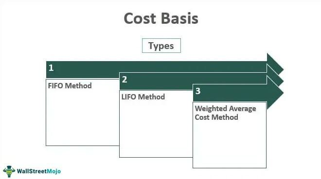

Understanding financial terminology is crucial in investment management as it forms the backbone of informed decision-making. Terms such as basis price and pricing mechanisms are central to financial language. The basis price is a pivotal concept that reflects the underlying cost of financial instruments, influencing their perceived value in the markets. Pricing mechanisms, on the other hand, determine how these instruments are valued and transacted. They encapsulate various models and systems that ascertain the price of financial products, from options to futures, ensuring market consistency and transparency.

Simultaneously, algorithmic trading has significantly reshaped modern financial markets. This form of trading uses pre-programmed strategies to execute trades at speeds and frequencies far beyond human capabilities, capitalizing on market inefficiencies and subtle pricing cues. The relevance of financial terminology is noticeable here, as algorithms are constructed upon complex mathematical models that include concepts like basis price, dictating their operational logic.

The interactions between these elements—basis price, pricing mechanisms, and algorithmic trading—underscore their collective impact on market dynamics. Understanding these relationships is essential for financial professionals and investors aiming to navigate and leverage market opportunities effectively. This exploration provides a foundational perspective on their significance in shaping financial transactions and strategies.

## Table of Contents

## What Is Basis Price?

Basis price is a pivotal concept in financial markets, serving as a reference point used to evaluate and compare the value of various financial instruments. In the context of financial terminology, the basis price essentially reflects the differential between the spot price and the future price of an asset. This concept holds significant importance in both bond markets and commodity futures markets.

In bond markets, basis price is closely associated with the yield to maturity (YTM), a fundamental metric for investors. Yield to maturity represents the total return expected on a bond if the bond is held until it matures, effectively capturing both interest income and capital gains or losses due to price changes. The basis price in this context is critical for comparing the yields of different fixed-income securities with varying characteristics, such as coupon rates and maturities. By evaluating the basis price, investors can discern which bonds offer higher expected returns and make more informed investment choices.

For example, suppose an investor is considering two bonds: Bond A with a YTM of 5% and Bond B with a YTM of 4.5%. The basis price helps the investor understand the yield spread, guiding them to decide whether the higher yield of Bond A justifies any potential additional risks compared to Bond B. Understanding the basis price helps investors align their portfolios with their risk-return objectives.

In commodity futures markets, basis price takes on another layer of importance as it reflects the spread between the spot price of a commodity and its corresponding futures price. This spread, often referred to simply as "the basis," can be represented as:

$$
\text{Basis} = \text{Spot Price} - \text{Futures Price}
$$

The basis is a crucial [factor](/wiki/factor-investing) in the decision-making processes for hedging and speculation. A positive basis indicates that the spot price is higher than the futures price, which might suggest a premium for immediate delivery. Conversely, a negative basis indicates that future prices exceed current spot prices, which can arise due to expectations of future shortages or increased demand.

Understanding this spread is essential, particularly for farmers and traders who are looking to hedge against price [volatility](/wiki/volatility-trading-strategies). By analyzing the basis, they can lock in favorable prices for future delivery, thus reducing the risks associated with price fluctuations.

In summary, the basis price acts as an essential indicator in comparing the value propositions of varying fixed-income securities and as an analytical tool to assess the price differentials in commodity futures markets. Its comprehension enables investors to make informed decisions concerning yield spreads and price risks, forming a keystone in the broader spectrum of financial analysis and investment strategy.

## Understanding Pricing Mechanisms in Financial Markets

Pricing mechanisms in financial markets are critical for determining the values of financial instruments, enabling market participants to make informed decisions. These mechanisms involve complex calculations and models to ensure that instruments like options, futures, and other derivatives are priced accurately, reflecting their intrinsic and extrinsic values.

Different financial instruments have unique pricing methodologies. Options, for instance, are priced using the Black-Scholes model, a mathematical model that calculates the option's theoretical price by considering factors such as the stock price, strike price, time to expiration, risk-free rate, and volatility. The Black-Scholes formula for a call option is given by:

$$

C = S_0 N(d_1) - Xe^{-rt}N(d_2) 
$$

where:

$$

d_1 = \frac{\ln(\frac{S_0}{X}) + (r + \frac{\sigma^2}{2})t}{\sigma\sqrt{t}} 
$$

$$

d_2 = d_1 - \sigma\sqrt{t} 
$$

- $C$ = call option price
- $S_0$ = current stock price
- $N$ = cumulative distribution function of the standard normal distribution
- $X$ = strike price of the option
- $e$ = base of the natural logarithm
- $r$ = risk-free interest rate
- $t$ = time to maturity
- $\sigma$ = volatility of the stock returns

Futures contracts, on the other hand, rely on the cost-of-[carry](/wiki/carry-trading) model, which includes components like the spot price, interest rates, and storage costs (if applicable). The basic pricing formula for futures is:

$$

F = S_0 \times e^{r \times t} 
$$

where:
- $F$ = futures price
- $S_0$ = spot price
- $r$ = risk-free interest rate
- $t$ = time to contract expiration

Accurate pricing of these instruments is crucial as it impacts traders' and investors' decisions. Mispricing can lead to [arbitrage](/wiki/arbitrage) opportunities, where savvy investors can profit from price discrepancies. In addition, accurate pricing allows for proper risk assessment and management, ensuring that portfolios are balanced according to market dynamics and investor strategies.

Furthermore, robust pricing mechanisms enable transparency and fairness in the market, fostering trust among participants. They also facilitate [liquidity](/wiki/liquidity-risk-premium), as properly priced instruments attract more buyers and sellers, reducing transaction costs and improving market efficiency.

In summary, understanding the pricing mechanisms of financial instruments is fundamental for market participation and investment management. The models and methodologies deployed are essential tools that underpin market operations, influencing decision-making and overall market health.

## The Role of Basis Price in Financial Analysis

Understanding the role of basis price is crucial for financial analysis and investment decision-making. Basis price, a critical concept in financial terminology, serves as a tool to comprehend and evaluate the complexities of various financial instruments. In essence, it represents the difference between the spot price of a security or commodity and its future price. By elucidating this difference, basis price provides investors with insights into the cost of carrying or holding an asset over time, aiding them in assessing risk and determining potential returns.

One key application of basis price is in evaluating the risk and return profiles of different investment products. In the bond market, for instance, basis price can be instrumental in comparing yields across different fixed-income instruments. Investors rely on this measure to analyze the yield to maturity (YTM) of a bond relative to the current market rates, enabling them to make informed decisions about buying, holding, or selling bonds. A positive basis indicates that the bond's yield is higher than the market rate, often perceived as a favorable investment opportunity, while a negative basis may signify an overvalued bond.

In commodity futures, understanding the basis is pivotal for predicting price movements and establishing hedging strategies. The basis reflects the spread between the spot price of a commodity and its futures price, offering insights into the future supply and demand dynamics. For instance, in agriculture, a soybean farmer can use the basis to decide whether to lock in future prices through hedging or wait for potential spot price increases at harvest. A narrowing basis might suggest a strengthening cash market, possibly signaling a good time to sell futures contracts.

Real-world examples showcase practical applications of basis price within investment portfolios. Consider a portfolio manager overseeing a range of fixed-income securities. By analyzing the basis, the manager can identify arbitrage opportunities, such as when a bond's market price deviates significantly from its intrinsic value based on prevailing interest rates. This allows for strategic adjustments, optimizing the risk-return balance by capitalizing on discrepancies between market prices and expected future values.

Moreover, basis price analysis can be employed using quantitative models and programming languages, such as Python, to automate calculations and enhance decision-making processes. For instance, utilizing libraries like NumPy or pandas, investors can model basis price movements across diverse asset classes, facilitating data-driven strategies in portfolio management.

In conclusion, the role of basis price in financial analysis is indispensable for comprehending risk and optimizing returns on investment products. It provides a framework for assessing market conditions and making strategic investment decisions. Through real-world examples and modern computational tools, basis price analysis continues to be a cornerstone of effective portfolio management and financial strategy development.

## Algorithmic Trading and Its Impact on Pricing Mechanisms

Algorithmic trading refers to the use of computer programs and systems to execute trades in financial markets based on pre-defined criteria and strategies. This approach leverages mathematical models and complex algorithms to make trading decisions, often with minimal human intervention. The primary function of [algorithmic trading](/wiki/algorithmic-trading) is to identify and capitalize on trading opportunities in financial markets with high speed and precision.

The use of pricing mechanisms in algorithmic trading is central to its operation. Pricing mechanisms, which include models for valuing financial instruments like options, futures, and bonds, are essential for determining the optimal strategies for buying and selling assets. For example, the Black-Scholes model is frequently used in options markets to estimate the fair price of an option, thus enabling algorithms to make informed decisions about when to enter and [exit](/wiki/exit-strategy) trades.

One of the key advantages of algorithmic trading is its ability to process large volumes of data at unprecedented speeds, making rapid decisions that a human trader could not match in terms of speed and accuracy. Algorithms are programmed to execute trades instantly based on market signals, which helps in capitalizing on short-lived opportunities. This speed is particularly advantageous in high-frequency trading environments, where the time to execute trades is measured in microseconds.

Moreover, algorithmic trading minimizes human error, enabling more consistent and disciplined trading strategies. By removing emotional influences from trading decisions, algorithms adhere strictly to the parameters set by their programming, which can result in more predictable and reliable outcomes.

Technology has significantly transformed traditional methods of pricing and trading in financial markets. Historically, trading was conducted manually, often based on human calculations and intuition. However, with technological advancements, financial markets have seen a shift towards automation and electronic trading platforms. These platforms provide broader access to financial markets and allow for more complex strategies to be executed in real time.

In conclusion, algorithmic trading, supported by sophisticated pricing mechanisms and financial terms, has revolutionized the trading landscape. It enables high-speed, accurate, and data-driven trading, reducing reliance on traditional, manual methods and paving the way for more efficient market operations.

## Integrating Basis Price into Algorithmic Strategies

Incorporating the concept of basis price into algorithmic trading strategies is increasingly becoming a standard practice in the financial sector. Basis price, which represents the difference between the spot price and the futures price of an asset, is crucial in formulating algorithms that seek to capitalize on market inefficiencies and arbitrage opportunities.

Algorithmic trading systems leverage basis price to improve precision in trade execution and predict price movements. For instance, algorithms may analyze fluctuations in the basis to identify discrepancies between the futures contract and the underlying asset price, which may indicate potential profit opportunities. When the basis is unusually high or low, it might signal mispricing or a shift in market sentiment, prompting the algorithm to execute trades accordingly.

Several algorithmic models incorporate basis price into their decision-making processes. A classic example is the arbitrage algorithm, which exploits price differences in various markets or asset classes. Such algorithms are programmed to buy the underpriced asset and sell the overpriced one, based on a calculated basis. This strategy ensures that small price discrepancies are leveraged to generate profit with minimal risk.

Another example is [statistical arbitrage](/wiki/statistical-arbitrage) algorithms, which use statistical models to predict future price movements by analyzing historical pricing data. Basis price plays a crucial role in these models by providing a metric for identifying anomalous pricing patterns that deviate from historical norms. Algorithms can use these deviations to initiate trades that align with predicted mean reversion trends.

The integration of financial terms like basis price in automated trading systems offers several advantages. By relying on algorithms that incorporate such terms, trading operations benefit from enhanced speed and accuracy, minimizing human error and allowing for the rapid reaction to market changes. This is particularly valuable in high-frequency trading ([HFT](/wiki/high-frequency-trading-strategies)) environments, where decisions must be made in fractions of a second.

Moreover, automated systems that utilize basis price facilitate more informed trading by interpreting complex market data into actionable insights. By continuously monitoring the basis, these algorithms can adjust trading strategies dynamically, ensuring that trades align with current market conditions and strategic objectives. 

In conclusion, the incorporation of basis price into algorithmic trading strategies not only enables more sophisticated and adaptive trading models but also enhances the efficiency and effectiveness of trading operations in rapidly changing financial markets.

## Conclusion

Understanding the concept of basis price and pricing mechanisms is essential in navigating contemporary financial markets. The basis price serves as a pivotal element in financial analysis, particularly within bond and commodity markets, by providing a benchmark for comparing the yield of various fixed-income instruments and assessing spreads in futures contracts. Its role in helping investors and financial professionals assess risk and return cannot be overstated. Pricing mechanisms, encompassing models like Black-Scholes for options, underline the necessity for precise price calculations in making informed trading choices.

Algorithmic trading has revolutionized market operations by leveraging such financial terms for executing trades with remarkable speed and accuracy. By incorporating basis price and sophisticated pricing models into algorithmic strategies, trading systems can react more swiftly to market changes, optimizing returns and managing risks effectively. The transformative impact of algorithmic trading underscores the critical need for financial professionals and investors to grasp these concepts, ensuring they remain equipped to adapt to rapidly evolving market dynamics and harness cutting-edge technological advancements in their investment strategies.

## References & Further Reading

[1]: Hull, J. C. (2018). ["Options, Futures, and Other Derivatives"](https://www.semanticscholar.org/paper/Options%2C-Futures%2C-and-Other-Derivatives-Hull/89bdee500c8623864fc9eb7a471546aa713acc44). Pearson.

[2]: Black, F., & Scholes, M. (1973). ["The Pricing of Options and Corporate Liabilities."](https://www.cs.princeton.edu/courses/archive/fall09/cos323/papers/black_scholes73.pdf) Journal of Political Economy, 81(3), 637-654.

[3]: Jarrow, R. A., & Turnbull, S. M. (1996). ["Derivatives Securities"](https://archive.org/details/derivativesecuri0000jarr). South-Western College Publishing.

[4]: Aldridge, I. (2013). ["High-Frequency Trading: A Practical Guide to Algorithmic Strategies and Trading Systems"](https://www.amazon.com/High-Frequency-Trading-Practical-Algorithmic-Strategies/dp/1118343506). Wiley.

[5]: Lopez de Prado, M. (2018). ["Advances in Financial Machine Learning"](https://www.amazon.com/Advances-Financial-Machine-Learning-Marcos/dp/1119482089). Wiley.

[6]: Chan, E. P. (2009). ["Quantitative Trading: How to Build Your Own Algorithmic Trading Business"](https://github.com/ftvision/quant_trading_echan_book). Wiley.

[7]: Jansen, S. (2020). ["Machine Learning for Algorithmic Trading - Second Edition"](https://www.amazon.com/Machine-Learning-Algorithmic-Trading-alternative-ebook/dp/B08D9SP6MB). Packt Publishing.