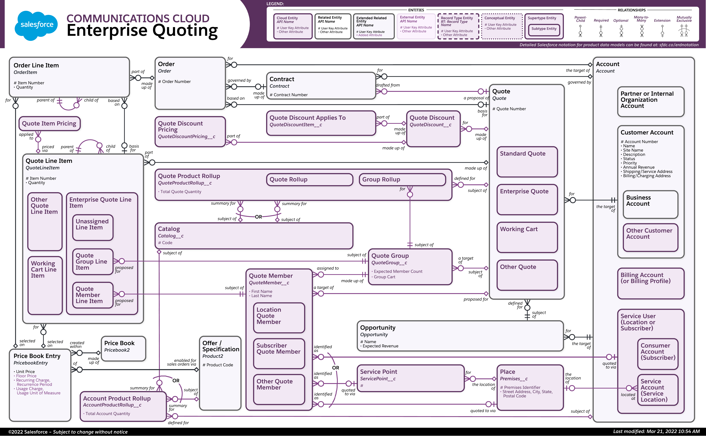

This article explores the complex world of financial markets with a focus on essential terminology and practical examples, particularly algorithmic trading. Financial markets are dynamic, constantly influencing global economies and individual financial well-being. By comprehending key concepts, traders and investors are better equipped to navigate this ever-changing landscape. Among these concepts, basis quotes serve as a fundamental element in futures trading, providing a comparative framework for pricing futures contracts relative to their underlying assets. This helps traders assess cost-effectiveness and strategize effectively.

Moreover, the evolution of technology has given rise to algorithmic trading, which uses computer algorithms to execute trades with precision and speed. This technological advancement has revolutionized trading, offering benefits such as reduced costs, increased market liquidity, and minimized human error. Understanding how various elements like basis quotes and algorithmic trading interconnect is critical in forming effective financial trading strategies.



As we delve further into the intricacies of these components, we'll see their significance in trading strategies and their integration into the future of financial markets. Mastery of these concepts is not only beneficial but necessary for thriving in today's fast-paced financial trading environment.

## Table of Contents

## Understanding Basis Quotes

A basis quote represents the price difference between a futures contract and its underlying asset. This differential serves as a critical metric for traders, providing insights into the cost-effectiveness of engaging with futures markets. The basis is generally calculated as follows:

$$
\text{Basis} = \text{Futures Price} - \text{Spot Price}
$$

For traders, understanding the basis is pivotal, since it influences decisions on whether to hold the futures contract or engage with the underlying asset directly. A positive basis (contango) implies that the futures price is higher than the spot price, whereas a negative basis (backwardation) signifies that the futures are priced lower than the spot price.

Basis quotes differ substantially across various markets. In commodity futures, basis movements can be impacted by factors such as storage costs, interest rates, and convenience yields. For instance, in agricultural commodities, seasonality might play a role; the basis could widen approaching harvest time due to supply fluctuations.

In other derivatives, like equity index futures, basis quotes are primarily driven by interest rates and expected dividends. Here, the cost of [carry](/wiki/carry-trading) model is often applied, where the futures price is a function of the spot price, the risk-free [interest rate](/wiki/interest-rate-trading-strategies), and the dividends anticipated during the contract's lifespan. The equation is generally:

$$
\text{Futures Price} = \text{Spot Price} \times e^{(r - q)T}
$$

where $r$ is the risk-free rate, $q$ is the dividend yield, and $T$ is the time to maturity.

These variations highlight that the effectiveness of using basis quotes can differ between markets, making it necessary for traders to consider market-specific factors. Traders can leverage these variances, aiming to exploit [arbitrage](/wiki/arbitrage) opportunities by capitalizing on price differentials between futures and spot prices. Understanding the basis is crucial for implementing risk management strategies and enhancing overall trading efficacy.

## Trading with Basis Quotes: Examples and Strategies

Utilizing basis quotes is an effective strategy in futures trading, particularly useful for identifying arbitrage opportunities where discrepancies between futures and spot prices can be leveraged. 

### Example 1: Equity Index Futures

Consider a scenario involving equity index futures. Suppose the S&P 500 Index is currently trading at 4,000, and the corresponding futures contract for delivery in three months is priced at 4,050. The basis quote, in this case, is the futures price minus the spot price, computed as:

$$
\text{Basis} = \text{Futures Price} - \text{Spot Price} = 4,050 - 4,000 = 50
$$

In this scenario, if the cost of carry, including interest rates and dividends, is less than the basis, an arbitrage opportunity exists. Traders can sell the futures contract and buy the S&P 500 Index in the spot market, profiting from the price convergence as the delivery date approaches, assuming other costs are managed effectively.

### Example 2: Commodity Futures

In commodity markets, basis quotes also serve critical roles. Suppose the current spot price of corn is $5.00 per bushel, and the December futures contract is trading at $5.25 per bushel. Here, the basis is:

$$
\text{Basis} = 5.25 - 5.00 = 0.25
$$

In this context, if the basis is unusually high compared to historical means and storage costs and other factors do not justify this difference, it indicates potential arbitrage. Traders may opt to store the physical commodity while selling futures contracts, exploiting pricing inefficiencies as futures and spot prices align over time.

### Strategies to Leverage Basis Quotes

1. **Calendar Spreads:** Involves buying and selling futures contracts of the same commodity but with different delivery dates. If a trader observes that current basis quotes suggest a wider-than-usual spread, it can be profitable to buy the nearer-term futures and sell the farther one.

2. **Convergence Trading:** This strategy aims to capitalize on the natural convergence of futures and spot prices as the contract's expiration date approaches. Traders monitor basis quotes to identify when to enter trades for maximum efficiency.

3. **Cross-Market Arbitrage:** Considers opportunities in linked or correlated markets. Traders can use basis quotes to identify mispricing across different but related sectors, such as between agricultural and energy markets that may have overlapping factors affecting supply and demand.

By carefully analyzing basis quotes, traders can enhance their strategies, focusing on exploiting mispricing between futures and spot markets. Such strategies rely on precise assumptions about costs, currency valuation, and market behavior, underscoring the need for comprehensive analysis and risk management.

## Algorithmic Trading: What It Is and How It Works

Algorithmic trading, often referred to as algo-trading, involves the use of complex algorithms to automate trading decisions and execute trades in financial markets. These algorithms are programmed to follow pre-set instructions regarding timing, price, or quantity, and are capable of executing a trade or series of trades much faster and more efficiently than a human trader could.

The mechanics of [algorithmic trading](/wiki/algorithmic-trading) fundamentally revolve around computational precision and speed. Algorithms are designed to parse vast amounts of market data, analyze it, and make trading decisions within milliseconds. This speed is one of the primary advantages, allowing traders to capitalize on minute price discrepancies across different markets.

Reduced costs are another significant benefit, as algorithmic trading minimizes human intervention, thereby reducing the likelihood of errors often associated with manual trading. Moreover, organizations employing algo-trading often witness lower transaction costs due to efficient trade execution and reduced market impact.

Enhanced market [liquidity](/wiki/liquidity-risk-premium) is a byproduct of algorithmic trading as these algorithms contribute to higher trading volumes and narrower bid-ask spreads. This liquidity is beneficial not only for the traders using these algorithms but also for the overall market, ensuring smoother price discovery and stability.

The development process of such algorithms involves meticulous planning and rigorous [backtesting](/wiki/backtesting). An algorithm must be built to respond effectively to diverse market conditions, and backtesting it on historical data is crucial to ensure the algorithm's reliability and adaptability. This process often involves sophisticated statistical models and data science techniques, including [machine learning](/wiki/machine-learning) for pattern recognition.

One major aspect of algorithmic trading is its ability to make trades devoid of human emotions such as fear and greed, which often cloud judgment and lead to irrational decision-making. By automating the trading process, emotions are entirely removed from the equation, allowing for methodical and consistent strategy execution.

For those interested in creating an algorithmic trading strategy, understanding programming and statistical analysis is essential. Here's a simple Python code snippet illustrating how a basic moving average crossover strategy might be implemented:

```python
import pandas as pd
import numpy as np

# Sample data loading
# Assuming 'data' is a DataFrame with a 'close' column representing closing prices
# data = pd.read_csv('historical_prices.csv')

# Calculate two simple moving averages
short_window = 40
long_window = 100

data['short_mavg'] = data['close'].rolling(window=short_window, min_periods=1).mean()
data['long_mavg'] = data['close'].rolling(window=long_window, min_periods=1).mean()

# Generate trading signals
data['signal'] = 0.0
data['signal'][short_window:] = np.where(data['short_mavg'][short_window:] > data['long_mavg'][short_window:], 1.0, 0.0)

# Calculate positions
data['positions'] = data['signal'].diff()

print(data[['close', 'short_mavg', 'long_mavg', 'signal', 'positions']].tail())
```

This code demonstrates a simple strategy where buy signals are generated when a short-term moving average exceeds a long-term moving average, and sell signals are generated for the opposite case. While real-world trading algorithms are far more complex, this example highlights the basic principles of algorithmic trading: systematic rule-following and leveraging computational power for market analysis and trade execution.

## Advantages and Challenges of Algorithmic Trading

Algorithmic trading, also known as algo-trading, has revolutionized financial markets by utilizing computer algorithms to execute trades. This technological advancement offers numerous advantages that enhance the trading process. Firstly, algo-trading allows for precision in executing transactions, minimizing slippage and optimizing entry and [exit](/wiki/exit-strategy) points. Precision is crucial in volatile markets where milliseconds can determine the difference between profit and loss.

Moreover, algo-trading significantly reduces human error. By automating the decision-making process and relying on pre-set parameters, traders can avoid the mistakes associated with emotional trading. This level of automation ensures that trades are executed based on data-driven strategies rather than impulsive reactions.

Efficiency is another notable advantage of algorithmic trading. Algorithms can analyze vast datasets quickly and execute trades at high speeds, which is particularly beneficial in high-frequency trading ([HFT](/wiki/high-frequency-trading-strategies)). This efficiency reduces transaction costs and increases market liquidity by ensuring that orders are filled promptly.

Despite its many advantages, algorithmic trading does present several challenges. One primary concern is the reliance on technology. System failures, network issues, or software bugs can lead to significant financial losses. Thus, robust technological infrastructure and regular system checks are imperative to mitigate these risks.

Another challenge involves 'black swan' events—unpredictable events that can have significant repercussions. Algorithms, primarily based on historical data, may fail to adapt to unprecedented market conditions, leading to erroneous trades and potential losses. Moreover, the highly automated nature of algo-trading can exacerbate market [volatility](/wiki/volatility-trading-strategies) during such unforeseen events.

Regulatory challenges also pose a significant hurdle. As algorithmic trading increases in complexity, regulatory bodies continually update compliance requirements to protect market integrity. Traders and firms must stay abreast of these regulations, which can vary across different jurisdictions, thus requiring significant resources and expertise.

In conclusion, while algorithmic trading enhances precision, reduces error, and boosts market efficiency, it also necessitates careful consideration of the associated technological risks, susceptibility to unpredictable events, and adherence to evolving regulations. Balancing these advantages and challenges is critical for leveraging the full potential of algorithmic trading.

## Case Study: Algo-Trading Strategies in Financial Markets

Algorithmic trading, often referred to as algo-trading, has revolutionized the financial markets by enabling transactions that are executed with speed and precision. This section highlights successful algo-trading strategies, focusing on high-frequency trading (HFT) and market-making, which have become integral to modern trading practices.

**High-Frequency Trading (HFT)**

High-frequency trading is a type of algorithmic trading characterized by the rapid execution of a large number of trades within fractions of a second. HFT firms leverage advanced computational models and state-of-the-art technology to tap into small price discrepancies across different markets. One of the core strategies in HFT is deal with the provision of liquidity through bid-ask spreads, and capturing arbitrage opportunities.

A typical HFT strategy involves [statistical arbitrage](/wiki/statistical-arbitrage), where algorithms detect inefficiencies between correlated securities or financial instruments. For example, if two equivalent financial assets are temporarily priced differently on two markets due to latency, an HFT algorithm can execute buy and sell orders simultaneously to exploit this discrepancy for profit.

**Market-Making**

Market-making involves providing liquidity to the market by simultaneously offering buy and sell quotes for a financial instrument. Market makers profit through the bid-ask spread, optimizing their quotes to attract trades while managing the risk of holding large inventories. In modern markets, algo-trading enables firms to perform market-making with higher efficiency and lower risk compared to manual traders.

Given the fluctuating nature of markets, market-making strategies employ complex algorithms that adjust bid and ask prices in response to market dynamics. This not only ensures competitive pricing but also helps in maintaining the balanced nature of supply and demand in the market.

**Backtesting and Strategy Refinement**

For algo-trading strategies to be successful, rigorous backtesting and ongoing refinement are essential. Backtesting involves simulating an algorithm's performance based on historical data to evaluate its efficacy. Traders can write Python scripts using libraries like pandas and NumPy to automate backtesting processes. For instance:

```python
import pandas as pd
import numpy as np

# Example of a simple moving average strategy backtest
def backtest_strategy(data, short_window, long_window):
    data['short_mavg'] = data['Close'].rolling(window=short_window).mean()
    data['long_mavg'] = data['Close'].rolling(window=long_window).mean()
    data['signal'] = 0
    data.loc[data['short_mavg'] > data['long_mavg'], 'signal'] = 1
    data['positions'] = data['signal'].diff()

    # Calculate strategy returns
    data['strat_returns'] = data['positions'].shift(1) * (data['Close'].pct_change())
    cumulative_returns = (1 + data['strat_returns']).cumprod() - 1
    return cumulative_returns

# Historical price data as a pandas DataFrame
price_data = pd.read_csv('historical_prices.csv')

backtest_strategy(price_data, 40, 100)
```

The continuous process of refining strategies based on live trading feedback is critical. This ensures that the algorithms remain robust against market volatility and can adapt to evolving market conditions.

In summary, algo-trading strategies like HFT and market-making significantly enhance the efficiency and liquidity of financial markets. Through rigorous backtesting and adaptive refinement, traders can harness these strategies to achieve consistent profitability amidst the complexities of modern trading environments.

## Conclusion: The Future of Financial Trading

Financial trading is experiencing significant transformation due to advancements in technology and evolving market dynamics. As we look toward future developments, both basis quoting and algorithmic trading are anticipated to offer new possibilities and challenges.

Basis quoting may evolve with enhanced modeling techniques that provide more precise valuations and better pricing insights for futures contracts relative to their underlying assets. Improvements in data analytics and machine learning could enable more accurate basis predictions, reducing uncertainties for traders and improving hedging strategies. Moreover, as global markets become more integrated, real-time data and communication technologies could refine the synchronization of basis quotes across various financial hubs, enhancing market efficiency.

Algorithmic trading is poised to advance further as computational power and data processing capabilities improve. Innovations in [artificial intelligence](/wiki/ai-artificial-intelligence) and machine learning promise trading algorithms that can analyze vast datasets more effectively, recognize complex patterns, and adapt to market changes with growing agility. This could lead to trading strategies that are not only faster but also more intelligent. As traders increasingly adopt machine learning-powered algorithms, the demand for talent skilled in data science and quantitative analysis is likely to grow.

However, the future landscape of trading technologies will require traders to remain adaptable. As technologies advance, regulatory environments and market structures will likely change, necessitating continuous learning and strategy refinement. Regulatory bodies may impose new rules to address the risks associated with algorithmic trading, such as market volatility and systemic risk, which traders must navigate effectively.

To succeed, traders should foster a mindset of versatility, staying abreast of technological developments, regulatory changes, and market trends. By doing so, they will be better equipped to leverage new opportunities while mitigating risks. Embracing ongoing education in fields like data analytics, machine learning, and financial modeling will be crucial for traders aiming to excel in this dynamic and evolving environment.

Ultimately, the future of financial trading holds immense potential for those who are informed, agile, and forward-thinking. The ability to integrate and adapt to new technologies and methodologies will define the next generation of successful traders in an ever-changing financial landscape.

## References & Further Reading

[1]: Chance, D. M., & Brooks, R. (2015). ["Introduction to Derivatives and Risk Management"](https://books.google.com/books/about/Introduction_to_Derivatives_and_Risk_Man.html?id=b8PgBQAAQBAJ). Cengage Learning.

[2]: Hull, J. C. (2017). ["Options, Futures, and Other Derivatives"](https://www.semanticscholar.org/paper/Options%2C-Futures%2C-and-Other-Derivatives-Hull/89bdee500c8623864fc9eb7a471546aa713acc44). Pearson.

[3]: Black, F., & Scholes, M. (1973). ["The Pricing of Options and Corporate Liabilities"](https://www.cs.princeton.edu/courses/archive/fall09/cos323/papers/black_scholes73.pdf). Journal of Political Economy, 81(3), 637-654.

[4]: Aldridge, I. (2013). ["High-Frequency Trading: A Practical Guide to Algorithmic Strategies and Trading Systems"](https://www.amazon.com/High-Frequency-Trading-Practical-Algorithmic-Strategies/dp/1118343506). Wiley.

[5]: Lopez de Prado, M. (2018). ["Advances in Financial Machine Learning"](https://www.amazon.com/Advances-Financial-Machine-Learning-Marcos/dp/1119482089). Wiley.

[6]: Gitman, L. J., & Zutter, C. J. (2015). ["Principles of Managerial Finance"](https://archive.org/details/principlesofmana0000gitm). Pearson.