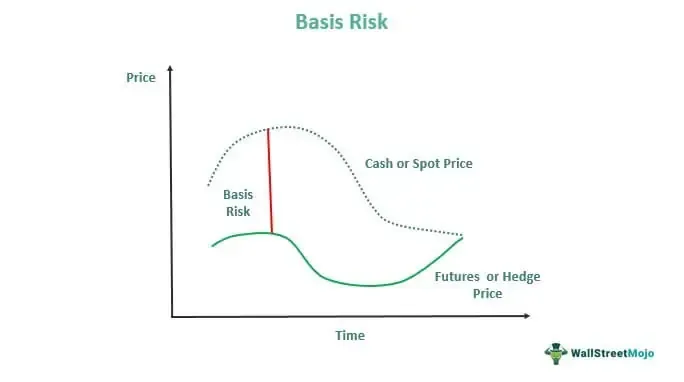

Financial derivatives are sophisticated financial instruments that have transformed the landscape of modern finance by providing mechanisms for risk mitigation and speculation. Among these derivatives, basis rate swaps and basis risk are pivotal elements in an array of hedging and trading strategies utilized by businesses and financial institutions. Basis rate swaps enable entities to exchange variable interest rates to manage interest rate uncertainties, aligning with specific financial objectives to maintain financial stability.

In essence, basis rate swaps involve the exchange of cash flows based on two differing floating interest rates, such as LIBOR and the Fed funds rate. By facilitating the swapping of interest rate exposure, they enable firms to effectively manage interest rate risks and improve cash flow predictability. This function is particularly critical in environments characterized by volatile interest rates and economic uncertainties.



The management and mitigation of basis risk, a phenomenon where the hedged instrument and its underlying asset do not move in perfect correlation, are crucial to the effectiveness of derivatives as hedging tools. Disparities in price movements can influence the degree of protection offered by derivatives, underscoring the necessity for strategic management of basis risk in achieving desired financial outcomes.

Algorithmic trading has emerged as an influential force in managing basis risk within derivatives markets. Algorithms enable traders to automatically execute trades at speeds and frequencies far beyond human capacity, identifying and exploiting market inefficiencies. With the integration of real-time data and advanced analytics, algorithmic trading enhances the precision of hedging strategies, reducing exposure to basis risk and optimizing financial performance. As technology continues to evolve, the role of algorithmic trading in derivatives markets is likely to expand, offering further tools to manage and mitigate basis risk effectively. 

Overall, basis rate swaps and the mitigation of basis risk represent fundamental components in the architecture of financial derivatives, offering vital tools for risk management and strategic financial operations. The expanding application of algorithmic trading in this domain highlights a continued evolution toward greater efficiency and precision in financial risk management practices. This interplay of derivatives, risk management, and technology underscores the dynamic nature of modern financial markets and their adaptability to the changing economic landscape.

## Table of Contents

## What Are Financial Derivatives?

Financial derivatives are financial instruments whose value is derived from an underlying asset, rate, index, or event. These contracts allow counterparties to trade specific financial risks and are integral to modern financial systems, facilitating efficient risk management, speculation, and arbitrage.

### Key Types of Derivatives

The primary types of derivatives include futures, options, and swaps. Each of these instruments serves specific purposes and is used under different circumstances:

1. **Futures Contracts**: A futures contract is a standardized agreement to buy or sell an asset at a predetermined price at a specified time in the future. Investors use futures to hedge against risk or to speculate on the direction of an asset's price. Futures are traded on exchanges which standardize the contract specifications, thereby enhancing liquidity and reducing counterparty risk.

2. **Options Contracts**: An option grants the holder the right, but not the obligation, to buy or sell an asset at a designated price before or at the contract's expiration. Options are versatile instruments used for hedging, generating income, or leveraging investment exposure. They come in two forms: call options, which provide the right to purchase, and put options, which provide the right to sell.

3. **Swaps**: Swaps are over-the-counter contracts where parties exchange cash flows or liabilities from two different financial instruments. The most common type is an interest rate swap, where one party exchanges a fixed interest rate payment for a floating rate payment with another party. Swaps are primarily used by institutions to manage interest rate risks or currency exposure.

### Role of Derivatives in Hedging

Derivatives play a vital role in managing and mitigating financial risks, particularly those associated with [interest rate](/wiki/interest-rate-trading-strategies) fluctuations. For example:

- **Interest Rate Risk**: Derivatives like swaps and futures are commonly used to hedge against fluctuations in interest rates. An interest rate swap can help a company transform its floating-rate debt into a fixed-rate obligation, providing predictability in interest payments.

- **Exchange Rate Risk**: Currency derivatives, such as forward contracts and currency swaps, are employed to hedge against unfavorable movements in exchange rates. This is especially important for multinational corporations that engage in trade across different currencies.

- **Commodity Price Risk**: Futures and options on commodities allow producers and consumers to lock in prices, thus protecting against the volatility of commodity markets.

By facilitating risk transfer, derivatives enhance market stability and enable entities to tailor financial solutions to their specific needs. Derivatives markets also contribute to market efficiency by improving [liquidity](/wiki/liquidity-risk-premium) and providing more accurate price discovery. Notably, the use of derivatives also carries inherent risks, such as counterparty risk, which necessitate appropriate risk management strategies.

## Understanding Basis Rate Swaps

A basis rate swap is a financial derivative used to exchange variable interest rates between two counterparties. This type of swap involves the exchange of cash flows based on different floating interest rate benchmarks. The primary motivation for engaging in a basis rate swap is to manage mismatches in interest rate exposures by aligning cash flows with corresponding liabilities or investment returns.

### Mechanism of Action

In a basis rate swap, two parties agree to exchange interest payments based on different floating rates. Parties may engage in a swap to balance exposure between varying benchmarks, for instance, by swapping payments indexed to LIBOR (London Interbank Offered Rate) with those indexed to a different benchmark like the Fed Funds Rate. The swap contract specifies the notional principal amount, which is used solely for calculating the interest payments exchanged and never changes hands.

For example, consider Company A, which has a loan with interest payments tied to LIBOR, and Company B, which has bonds issued with interest payments linked to the Fed Funds Rate. They can agree to a basis rate swap where Company A pays Company B a spread over the Fed Funds Rate, while Company B pays a spread over LIBOR. This structure allows each company to achieve a more favorable interest rate position relative to their financial strategies.

### Usage in Mitigating Interest Rate Risks

Basis rate swaps are particularly helpful for companies looking to minimize their exposure to fluctuations in interest rates. For example, a multinational corporation with revenues in multiple currencies might use a basis rate swap to align its debt servicing costs more closely with the variable revenue streams it receives.

Consider a scenario where a company has a Euro-denominated debt indexed to EURIBOR. If the company's revenue is largely derived in U.S. dollars, any adverse movement between EURIBOR and a U.S. dollar benchmark rate, such as LIBOR, could pose a risk. By engaging in a basis rate swap, the company could effectively hedge this risk by exchanging EURIBOR payments for those indexed to LIBOR, thereby stabilizing their interest costs relative to their revenue stream.

### Customization of Basis Rate Swaps

One of the appealing features of basis rate swaps is the flexibility offered in their customization. The terms of a basis rate swap can be tailored to match the specific financial goals of the counterparties involved. Elements such as the notional amount, payment frequency, duration, and the specific floating-rate indices can be customized.

For instance, payment schedules can be adjusted to align with cash flow requirements. If a company has seasonal revenue patterns, it may negotiate a swap that provides greater flexibility in timing the receipt and payment of cash flows. Additionally, counterparties may agree to include caps or floors within the swap agreement to further protect against extreme movements in interest rates.

In summary, basis rate swaps serve as a strategic tool for companies seeking to manage interest rate risk through tailored financial structures, allowing them to better align their financial liabilities with prevailing market conditions.

## What is Basis Risk?

Basis risk represents the potential discrepancy between the price movements of a hedged instrument and those of its underlying asset. This disparity can lead to inefficiencies in hedging strategies because the hedge does not perfectly offset the risk of the underlying position. The basis is essentially the difference between the spot price of an asset and its corresponding futures price. As the hedge matures, the basis should converge to zero. However, this is not always the case, which is where basis risk arises.

In financial markets, basis risk can significantly impact the effectiveness of hedging strategies. Hedgers typically aim for a perfect correlation between the financial instrument being hedged and the derivative used for hedging. When discrepancies occur, they may result in unexpected gains or losses, defeating the purpose of risk management. For instance, if the price of a commodity futures contract does not move in tandem with the price of the actual commodity, the imperfect hedge could lead to financial shortfalls.

Several factors influence basis risk, which can vary across different markets and instruments. Market [volatility](/wiki/volatility-trading-strategies) is a primary [factor](/wiki/factor-investing); high volatility might increase the unpredictability of price movements, thereby exacerbating basis risk. Additionally, interest rate changes can alter carrying costs, affecting the futures prices relative to spot prices. Variability in supply and demand conditions, geopolitical events, and policy changes can also cause misalignment between futures and spot prices.

Hedgers must account for basis risk by continuously assessing and adjusting their strategies. Advanced financial models and analytics are often employed to forecast basis movements and mitigate associated risks. By considering historical data and market conditions, predictive models assist in decision-making processes, helping to align hedging activities with financial objectives. The ultimate goal is to either minimize the basis risk or ensure it remains within acceptable boundaries, maintaining the efficacy of the hedging strategy.

## Algorithmic Trading and Basis Risk

Algorithmic trading, also known as algo trading, refers to the use of computer algorithms to automate trading decisions and execute orders in financial markets. This practice has become increasingly important in managing financial risks, including basis risk in derivatives trading. By utilizing pre-defined rules and real-time data analysis, [algorithmic trading](/wiki/algorithmic-trading) seeks to identify and capitalize on market inefficiencies.

In the context of basis rate swaps, algorithms play a crucial role in identifying and exploiting pricing inefficiencies that may arise due to discrepancies between different variable interest rates. Basis rate swaps involve exchanging cash flows based on two different floating interest rates to manage interest rate risk. Algorithms can analyze vast datasets to detect minor deviations in expected versus actual market behavior. For example, algorithms might monitor spreads between two interest rate benchmarks, such as the LIBOR and the Fed funds rate, and execute trades if these spreads deviate from historical norms or preset thresholds.

The advantages of using real-time data and analytics in reducing basis risk through algo trading are substantial. Real-time data allows for immediate responsiveness to market changes, which is essential in swiftly moving financial environments. Algorithms can process and analyze this data with high speed and precision, enabling traders to make informed decisions with minimal human intervention. This reduces the window of vulnerability to adverse market movements, thereby mitigating basis risk.

Moreover, real-time analytics enhance the ability to conduct continuous performance evaluations and adjustments to trading strategies, ensuring alignment with current market conditions. This dynamic approach helps minimize the impact of unexpected volatility and interest rate shifts on hedging strategies. Additionally, algorithmic trading can help institutions manage large portfolios by balancing hedging positions more effectively and adjusting them in response to evolving market dynamics.

In summary, algorithmic trading has transformed the landscape of financial risk management. By leveraging real-time data and analytics, algorithms are instrumental in reducing basis risk associated with basis rate swaps and improving the effectiveness of hedging strategies. These capabilities are essential as market conditions become increasingly complex and volatile, necessitating robust, automated solutions for managing derivatives in financial markets.

## Examples of Basis Rate Swaps

Basis rate swaps are a pivotal financial instrument used by businesses and financial institutions to mitigate interest rate risk and manage their interest rate exposure more effectively. These swaps involve exchanging floating interest rates based on different benchmarks, allowing counterparties to manage discrepancies in interest rate movements across various markets.

### LIBOR/LIBOR Swaps

A common type of basis rate swap is the LIBOR/LIBOR swap. This swap involves exchanging payments based on different LIBOR (London Interbank Offered Rate) tenors. For example, one party might pay a three-month LIBOR while receiving a six-month LIBOR. These swaps are instrumental for banks and corporations aiming to hedge mismatches between assets and liabilities that are tied to different LIBOR rates. 

**Outcome**: LIBOR/LIBOR swaps help minimize interest rate exposure from differing LIBOR tenors, ensuring alignment with the underlying financial structure. They are particularly useful for entities with funding requirements tied to different LIBOR benchmarks.

### Fed Funds Rate/LIBOR Swaps

Another prevalent swap type is the Fed Funds Rate/LIBOR swap. This involves exchanging a floating rate based on the Federal Reserve's funds rate and one based on the LIBOR. These swaps are superb tools for institutions with exposure to both U.S. domestic interest rate movements and international benchmarks like LIBOR.

**Outcome**: These swaps provide a hedge against the differential risks of U.S.-based and globally-influenced interest rates, allowing entities to manage their interest rate exposure effectively across different economic conditions.

### Prime Rate/LIBOR Swaps

Prime rate/LIBOR swaps involve the exchange of payments based on the prime lending rate and LIBOR. Banks and financial organizations frequently employ these swaps to align their loan portfolios with variable interest rate obligations.

**Outcome**: Such swaps effectively bridge the gap between domestic lending rates and global borrowing costs, offering a balanced hedging solution against interest rate fluctuations. They are particularly significant for businesses whose liabilities and revenues are tied to prime and LIBOR rates, respectively.

### Choosing Basis Rate Swaps

The selection of basis rate swaps is driven by specific financial objectives and prevailing market conditions. Entities assess their interest rate exposure and align it with their strategic hedging goals. Market conditions such as anticipated movements in interest rates, economic forecasts, and liquidity levels are critical in determining the appropriateness and timing of entering into these swaps. 

**Strategic Factors**: 
- **Cost effectiveness**: Firms consider transaction costs and benefits associated with locking in or exchanging interest rate exposures.
- **Hedging needs**: The specific risk profile of the business might require precise matching of cash flows associated with assets and liabilities to reduce financial volatility.
- **Market conditions**: Prevailing and anticipated interest rate trends influence the decision to use particular types of swaps, allowing businesses to take advantage of rate differentials.

In essence, basis rate swaps offer a dynamic vehicle for managing interest rate exposure, tailored to the unique needs and market contexts of each business or financial institution. These swaps are an integral part of risk management strategies, optimizing the balance between cost, risk, and financial objectives.

## Strategies for Managing Basis Risk

Basis risk, a potential challenge in financial derivatives, arises when differences exist between the hedged instrument and its underlying asset. Effectively managing basis risk requires implementing a variety of strategies, emphasizing the role of advanced methods and diversified approaches to mitigate risk exposure.

**Advanced Analytics, Monitoring, and Scenario Analysis**

A core strategy in managing basis risk is the use of advanced analytics. By employing quantitative models and tools, traders and risk managers can better comprehend complex market dynamics and forecast potential risk scenarios. Sophisticated financial software often incorporates [machine learning](/wiki/machine-learning) algorithms to analyze historical data, detect patterns, and make predictive assessments. These tools allow for real-time monitoring, providing insights that are crucial for timely decision-making.

Scenario analysis is particularly vital for stress testing an organization's exposure to basis risk. By simulating various market conditions and assessing how different scenarios could impact the hedging position, financial managers can gauge the resilience of their strategies. This proactive approach enables institutions to identify vulnerabilities and devise contingency plans to counteract adverse market outcomes.

**Diversification and Dynamic Hedging**

Diversification serves as a fundamental risk management strategy. By spreading investments across different assets or instruments, the impact of a volatile market movement on any single component can be reduced. Within the context of financial derivatives, diversification can involve using a mix of futures, options, and swaps to hedge against basis risk. The goal is to ensure that not all hedges are sensitive to the same kinds of basis discrepancies, hence reducing the overall risk in the portfolio.

Dynamic hedging, another key strategy, involves frequently adjusting the hedging positions based on market fluctuations and emerging data. This strategy requires a responsive approach, where positions are rebalanced as market conditions evolve. Dynamic hedging is advantageous because it accounts for real-time changes, allowing for more precise management of basis risk.

**Implementation Example with Python**

Using Python, a sample implementation for scenario analysis might involve simulating various interest rate paths and assessing their impact on a portfolio. The following pseudo-code outlines a basic framework for such an analysis:

```python
import numpy as np

# Simulate interest rate paths
def simulate_interest_rate_paths(initial_rate, volatility, num_steps, num_simulations):
    dt = 1/252  # Assume daily step size
    paths = np.zeros((num_steps, num_simulations))
    paths[0] = initial_rate

    for t in range(1, num_steps):
        random_shocks = np.random.normal(0, volatility * np.sqrt(dt), num_simulations)
        paths[t] = paths[t-1] + paths[t-1] * random_shocks

    return paths

# Analyze the simulated paths for basis risk impact
def analyze_basis_risk(paths, threshold):
    for i in range(paths.shape[1]):
        if max(paths[:, i]) > threshold:
            print(f"Simulation {i+1}: Exceeds Risk Threshold")
        else:
            print(f"Simulation {i+1}: Within Risk Threshold")

# Parameters
initial_rate = 0.05  # 5%
volatility = 0.01  # 1%
num_steps = 252  # One year of trading days
num_simulations = 1000
threshold = 0.08  # 8% risk threshold

# Execute the scenario analysis
rates_paths = simulate_interest_rate_paths(initial_rate, volatility, num_steps, num_simulations)
analyze_basis_risk(rates_paths, threshold)
```

This example demonstrates how to simulate interest rate fluctuations and assess whether basis risk thresholds are breached in different scenarios. The results can inform necessary adjustments to the hedging strategies.

Overall, managing basis risk effectively requires a combination of advanced analytical techniques, ongoing monitoring, scenario analysis, diversification, and dynamic hedging strategies. These approaches collaboratively enhance a firm's ability to withstand market volatility and optimize the returns on their derivative portfolios.

## Conclusion

Basis rate swaps are pivotal instruments in financial risk management, offering businesses a mechanism to counteract the challenges posed by fluctuating interest rates. By enabling parties to exchange variable interest rate payments under mutually agreed terms, these swaps provide a tailored approach to balance sheet restructuring and risk mitigation. The versatility of basis rate swaps allows businesses to hedge against the volatility inherent in financial markets, ensuring greater stability in financial planning and operations.

Algorithmic trading has further advanced the efficacy of swap strategies by leveraging real-time data analytics to optimize execution and reduce basis risk. Through the implementation of sophisticated algorithms, market participants can accurately identify inefficiencies within basis rate swaps and quickly adjust positions in response to market dynamics. These technologies enhance the precision and speed of trading strategies, thereby minimizing exposure to basis risk and maximizing hedging effectiveness.

Looking ahead, continued learning and adaptation are crucial in navigating the evolving landscape of financial instruments and trading technologies. As financial markets grow increasingly complex, staying informed about new developments in derivates, emerging trading platforms, and innovative risk management techniques will be key for professionals seeking to maintain a competitive edge. The integration of cutting-edge technologies, such as machine learning and [artificial intelligence](/wiki/ai-artificial-intelligence), will likely play a transformative role in the future of financial derivatives, potentially offering even more robust solutions for managing basis risk. Encouraging rigorous education and training in these areas will empower market participants to better navigate the intricacies of modern finance.

## References & Further Reading

[1]: ["Swaps and Other Derivatives"](https://www.investopedia.com/ask/answers/060215/what-difference-between-derivatives-and-swaps.asp) by Richard Flavell

[2]: ["Interest Rate Swaps and Other Derivatives"](https://cup.columbia.edu/book/interest-rate-swaps-and-other-derivatives/9780231159647) by Howard Corb

[3]: Hull, John C. (2018). ["Options, Futures, and Other Derivatives."](https://www.semanticscholar.org/paper/Options%2C-Futures%2C-and-Other-Derivatives-Hull/89bdee500c8623864fc9eb7a471546aa713acc44) Pearson Education.

[4]: ["Algorithmic Trading: Winning Strategies and Their Rationale"](https://play.google.com/store/books/details/Algorithmic_Trading_Winning_Strategies_and_Their_R?id=CIwCTVqEj4oC&hl=en-US) by Ernie Chan

[5]: Paddrik, R., Hayman, J., & Todd, G. (2012). ["The Flash Crash and Stochastic Basis Risk: A Study of Co-movements Between Futures and ETFs."](https://doi.org/10.2139/ssrn.2029625) Federal Reserve Board.