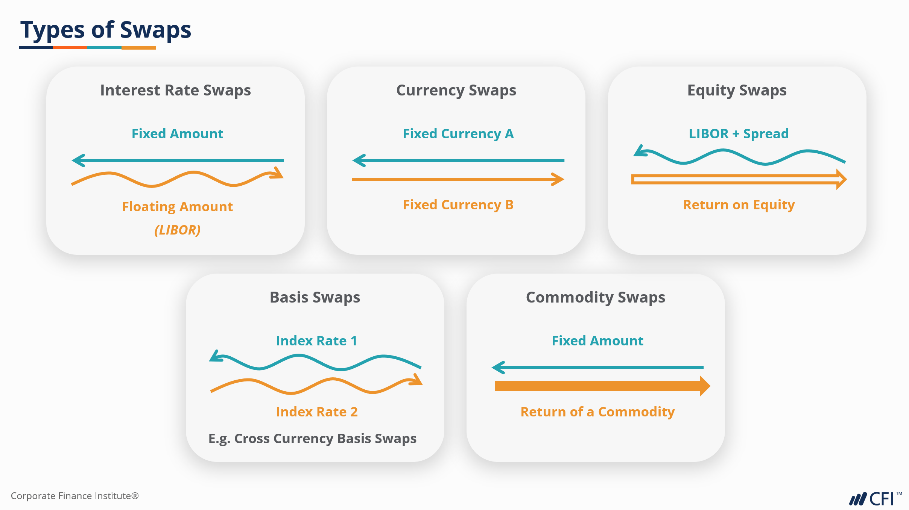

## Table of Contents

## What is a basis rate swap?

A basis rate swap is a type of financial agreement where two parties exchange different floating interest rates. These rates are often based on different benchmarks, like the London Interbank Offered Rate (LIBOR) and the Secured Overnight Financing Rate (SOFR). The purpose of a basis swap is to manage the risk that comes from having loans or investments tied to different interest rate indexes. For example, one party might be paying interest on a loan based on LIBOR, but they want to switch to a rate based on SOFR because they think it will be more stable or cheaper.

In a basis rate swap, the two parties agree to pay each other the difference between the two interest rates at regular intervals, usually every three or six months. If one rate is higher than the other, one party will pay the other the difference. This way, both parties can benefit from the swap if their predictions about the future movements of the interest rates are correct. Basis rate swaps are commonly used by banks, financial institutions, and large corporations to manage their interest rate exposure and to take advantage of potential savings or gains from different interest rate markets.

## How does a basis rate swap differ from other types of swaps?

A basis rate swap is different from other swaps because it involves exchanging two different floating interest rates, instead of swapping a fixed rate for a floating rate like in a plain vanilla interest rate swap. In a basis rate swap, both rates are variable and based on different benchmarks, like LIBOR and SOFR. This is useful when someone wants to change from one floating rate to another because they think it might be better or cheaper.

Other types of swaps include currency swaps, where two parties exchange principal and interest payments in different currencies, and commodity swaps, where payments are based on the price of a commodity like oil or gold. Unlike a basis rate swap, these swaps don't involve exchanging different floating interest rates. Instead, they help manage risks related to currency exchange rates or commodity prices. So, basis rate swaps are specifically about managing the risk of having loans or investments tied to different [interest rate](/wiki/interest-rate-trading-strategies) benchmarks.

## What are the common types of indices used in basis rate swaps?

In basis rate swaps, people often use different types of indices to set the floating interest rates they exchange. Some common indices are LIBOR, which stands for London Interbank Offered Rate, and SOFR, which is the Secured Overnight Financing Rate. LIBOR is based on the interest rates banks charge each other for short-term loans, while SOFR is based on the rates for overnight loans backed by U.S. Treasury securities. These two indices are popular because they are widely used and trusted in the financial world.

Another index used in basis rate swaps is the Euro Interbank Offered Rate (EURIBOR), which is similar to LIBOR but for the euro area. It reflects the average interest rate at which eurozone banks offer to lend money to one another. Additionally, the Federal Funds Rate, which is the interest rate at which U.S. banks lend to each other overnight, can also be used. These indices help people manage their interest rate risks by allowing them to switch between different floating rates based on what they think will be more beneficial in the future.

## What is basis risk and how does it arise in basis rate swaps?

Basis risk is the chance that the two floating interest rates in a basis rate swap won't move in the same way. This can make the swap less effective at managing risk. In a basis rate swap, you swap one floating rate for another, like switching from LIBOR to SOFR. If these two rates don't change together, you might end up paying more than you expected or not saving as much as you hoped.

This risk comes from the fact that different interest rate indices are based on different markets or economic conditions. For example, LIBOR is based on what banks charge each other for short-term loans, while SOFR is based on overnight loans backed by U.S. Treasury securities. If the conditions in these markets change differently, the rates will move differently too. This mismatch is what creates basis risk in basis rate swaps.

## Can you explain the mechanics of a basis rate swap with an example?

Let's say there's a company, ABC Corp, that has a loan with an interest rate based on LIBOR. But they think that the Secured Overnight Financing Rate (SOFR) might be cheaper or more stable in the future. So, they decide to do a basis rate swap with another company, XYZ Corp, which has a loan based on SOFR but thinks LIBOR might be better for them. In this swap, ABC Corp agrees to pay XYZ Corp the interest based on SOFR, and in return, XYZ Corp agrees to pay ABC Corp the interest based on LIBOR.

Every three months, they compare the two rates. If LIBOR is higher than SOFR, XYZ Corp pays ABC Corp the difference. If SOFR is higher than LIBOR, then ABC Corp pays XYZ Corp the difference. This way, ABC Corp can switch from paying interest based on LIBOR to SOFR, and XYZ Corp can switch from SOFR to LIBOR. If their predictions about the future movements of these rates are right, they can both save money or manage their risks better.

## What are the primary reasons financial institutions enter into basis rate swaps?

Financial institutions enter into basis rate swaps mainly to manage their interest rate risk. They might have loans or investments tied to one floating interest rate, like LIBOR, but they want to switch to another rate, like SOFR, because they think it might be cheaper or more stable. By doing a basis rate swap, they can exchange the interest payments they receive or pay, which helps them protect against unexpected changes in interest rates.

Another reason is to take advantage of potential savings or gains from different interest rate markets. If a bank thinks that one floating rate will perform better than another in the future, they can use a basis rate swap to switch to the rate they believe will be more beneficial. This way, they can potentially save money or earn more from their loans and investments.

## How is the pricing of a basis rate swap determined?

The pricing of a basis rate swap is determined by comparing the two floating interest rates that are being swapped. For example, if a swap involves LIBOR and SOFR, the price depends on the difference between these two rates at the time of the swap. Financial institutions look at the current values of these rates and use their predictions about how these rates will change in the future to decide on the swap's price. They might also consider other factors like the creditworthiness of the parties involved and the length of the swap agreement.

The actual cost of the swap is the difference between the two rates at each payment period. If LIBOR is higher than SOFR, the party paying LIBOR will owe money to the party paying SOFR. If SOFR is higher, the reverse happens. The swap's price is essentially the net present value of these expected future payments, taking into account the time value of money. This means the price reflects not just the current rate difference but also how those rates are expected to change over the life of the swap.

## What are the potential risks involved in basis rate swaps beyond basis risk?

Apart from basis risk, another risk in basis rate swaps is credit risk. This is the chance that one of the parties involved in the swap might not be able to make their payments. If one company agrees to pay based on one interest rate but then can't pay, the other company could lose money. To manage this risk, financial institutions often check the creditworthiness of the other party before agreeing to the swap. They might also use things like collateral or credit support agreements to make sure they get their money even if the other party can't pay.

Another risk is [liquidity](/wiki/liquidity-risk-premium) risk. This happens if it's hard to find someone to take the other side of the swap or if it's hard to get out of the swap before it ends. If the market for basis rate swaps isn't very active, it can be tough to find someone to swap with, or to sell the swap to someone else if you need to. This can make the swap less valuable or harder to manage. Financial institutions try to manage this risk by keeping an eye on market conditions and being ready to adjust their strategies if needed.

## How can basis risk be managed or mitigated in a basis rate swap?

Basis risk in a basis rate swap can be managed by carefully choosing the indices that are swapped. If the two rates are closely related and tend to move together, the basis risk will be lower. For example, if a company is swapping from LIBOR to SOFR, they might look at how these rates have moved in the past and how they are expected to move in the future. If the rates are expected to stay close to each other, the risk of big differences in payments will be smaller.

Another way to manage basis risk is by using financial tools like options or other types of swaps. For example, a company might use an interest rate option to protect against big changes in one of the rates. This way, if one rate goes up a lot more than the other, the option can help cover the extra cost. Also, companies can sometimes use a portfolio of different swaps to balance out the risks. By having swaps that cover different rates and different times, they can spread out the risk and make it less likely that a big difference in rates will hurt them too much.

## What are the regulatory considerations for basis rate swaps?

When it comes to basis rate swaps, there are rules that financial institutions need to follow. These rules come from groups like the Commodity Futures Trading Commission (CFTC) and the Securities and Exchange Commission (SEC) in the United States. The main goal of these rules is to make sure that swaps are done in a safe and clear way. For example, they might need to report their swaps to a trade repository, which keeps a record of all the swaps that happen. This helps everyone see what's going on in the market and makes it easier to spot problems.

Another important rule is about clearing. Some basis rate swaps need to go through a clearinghouse, which acts like a middleman to make sure both sides of the swap can pay what they owe. This helps reduce the risk that one side won't be able to pay. Also, there are rules about how much money a company can put into swaps and how much risk they can take. These rules are there to keep the financial system stable and to protect companies and their customers from big losses.

## How do changes in monetary policy affect basis rate swaps and basis risk?

Changes in monetary policy can have a big impact on basis rate swaps because these swaps involve exchanging payments based on different interest rates. When a central bank, like the Federal Reserve, changes its policy, it can affect the rates that are used in swaps, like LIBOR or SOFR. For example, if the Fed raises interest rates to fight inflation, the floating rates in the swap might go up. This could make one rate go up more than the other, which would change the payments in the swap. If a company was expecting the rates to move together, but they don't, they might end up paying more or getting less than they planned.

This is where basis risk comes in. Basis risk is the chance that the two rates in a swap won't move in the same way. When monetary policy changes, it can make this risk bigger. For example, if the Fed starts using a new tool to control rates, it might affect one rate more than the other. If a company is using a basis rate swap to manage their interest rate risk, they need to keep an eye on what the central bank is doing. By understanding how changes in monetary policy might affect the rates they're using, they can better manage their basis risk and make sure their swaps are still helping them the way they want.

## What advanced strategies can be employed to optimize the use of basis rate swaps?

One advanced strategy to optimize the use of basis rate swaps is to use them as part of a larger portfolio of financial tools. A company might combine basis rate swaps with other types of swaps, like interest rate swaps or currency swaps, to balance out their risks. For example, if a company has loans based on different interest rates and in different currencies, they could use a mix of swaps to manage the risks from both interest rate changes and currency fluctuations. By carefully choosing which swaps to use and how much to use them, a company can make sure they are protected no matter what happens in the markets.

Another strategy is to use basis rate swaps to take advantage of market predictions. If a company thinks that one interest rate will do better than another in the future, they can use a basis rate swap to switch to the rate they think will be cheaper or more stable. They can also use financial tools like options to protect against big changes in one of the rates. By keeping a close eye on what's happening in the economy and what experts are saying about future interest rates, a company can make smart choices about when to enter into swaps and how to set them up to get the best results.

## References & Further Reading

[1]: ["Swaps and Other Derivatives"](https://www.investopedia.com/ask/answers/060215/what-difference-between-derivatives-and-swaps.asp) by Richard Flavell

[2]: ["Interest Rate Swaps and Other Derivatives"](https://cup.columbia.edu/book/interest-rate-swaps-and-other-derivatives/9780231159647) by Howard Corb

[3]: Hull, John C. (2018). ["Options, Futures, and Other Derivatives."](https://www.semanticscholar.org/paper/Options%2C-Futures%2C-and-Other-Derivatives-Hull/89bdee500c8623864fc9eb7a471546aa713acc44) Pearson Education.

[4]: ["Algorithmic Trading: Winning Strategies and Their Rationale"](https://play.google.com/store/books/details/Algorithmic_Trading_Winning_Strategies_and_Their_R?id=CIwCTVqEj4oC&hl=en-US) by Ernie Chan

[5]: Paddrik, R., Hayman, J., & Todd, G. (2012). ["The Flash Crash and Stochastic Basis Risk: A Study of Co-movements Between Futures and ETFs."](https://doi.org/10.2139/ssrn.2029625) Federal Reserve Board.