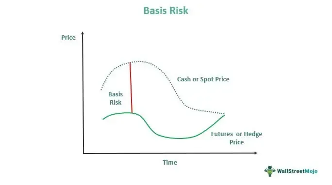

In financial risk management and algorithmic trading, recognizing different risk types is essential for developing robust strategies. Basis risk, a significant financial risk, arises from mismatches between the prices of financial instruments used in hedging. This article focuses on basis risk, examining its implications, measurement, and mitigation strategies within algorithmic trading. Conceptualizing basis risk in this context is vital for optimizing trading strategies and minimizing potential financial losses.

Algorithmic trading involves using automated systems to execute trades based on predefined criteria. While this approach can enhance trade execution speed and efficiency, it also introduces specific risks that must be managed effectively. Basis risk poses challenges to traders and risk managers, as it can affect the effectiveness of hedges, leading to unintended financial exposure.



Effective financial risk management requires an understanding of the variables influencing basis risk. Traders can use various techniques and tools to measure basis risk, enabling them to develop strategies to mitigate its effects. By leveraging robust measurement and hedging techniques, financial professionals can better manage this risk, which is crucial for maintaining the integrity of trading operations.

The financial landscape is continually evolving, making it vital for algorithmic traders to keep up with changes in basis risk dynamics. As we explore basis risk's impact on financial decisions and trading frameworks, understanding these elements will aid in forming strategies that mitigate risks and promote successful trading.

## Table of Contents

## Understanding Basis Risk

Basis risk arises when the correlation between a hedging instrument and the underlying asset it intends to offset is imperfect. This divergence results in potential financial exposure as the hedge might not fully mitigate potential losses associated with the underlying asset. 

The significance of basis risk in risk management is paramount because it underlines the potential [volatility](/wiki/volatility-trading-strategies) that might be underestimated when constructing hedging strategies. When basis risk is not adequately managed, an assumed secure position might result in unexpected losses, undermining financial stability.

To understand basis risk more comprehensively, it's essential to recognize its various forms:

1. **Locational Basis Risk**: This type of basis risk occurs due to geographical differences affecting the pricing of hedging instruments relative to the underlying asset. For instance, in the commodities market, the price of crude oil might differ between two locations due to transportation costs, affecting the efficiency of a hedging strategy that's geographically specific.

2. **Product Basis Risk**: Arises when the hedging instrument differs in product specification or quality from the underlying asset. For example, a wheat producer hedging using a futures contract for a different wheat grade may experience product basis risk if price differentials occur due to quality discrepancies.

3. **Calendar Basis Risk**: This risk emerges from timing differences between the expiration of the hedging instrument and the cash flows of the underlying asset. An example can be found in agricultural futures, where a farmer's crop might be ready for harvest after the futures contract expires, potentially resulting in unwanted exposure.

To illustrate basis risk using real-world scenarios, consider a wheat farmer who hedges against price fluctuations by entering into a futures contract. If the futures price does not move inversely to the spot price due to differences in location, grade, or harvest timing, the farmer is exposed to basis risk despite the hedge. 

In another scenario, an investor managing a portfolio with international equities might hedge currency risk using forward contracts. If the hedge does not perfectly align with movements in the spot exchange rate due to locational or calendar mismatches, currency basis risk emerges.

Understanding different types of basis risk is critical for developing comprehensive hedging strategies that effectively minimize financial exposure due to imperfect correlation. Recognizing these risk types allows traders and risk managers to tailor their strategies and choose appropriate instruments that align more closely with their specific risk characteristics, thereby enhancing risk management in financial markets.

## Types of Basis Risk

Basis risk can be categorized into several important types, each significantly influencing different market conditions. Understanding these categories is essential for tailoring effective hedging and management strategies.

### Interest Rate Basis Risk
Interest rate basis risk arises when there is a mismatch in [interest rate](/wiki/interest-rate-trading-strategies) movements between related financial instruments. This type of risk is particularly significant in the fixed-income markets where bond yields, interest rate swaps, and other fixed-income derivatives are traded. For instance, if a trader holds a position in a 10-year government bond while simultaneously holding an interest rate swap based on a different rate benchmark (e.g., LIBOR), changes in market conditions could cause these rates to move differently, resulting in potential financial exposure. Managing this risk often involves the use of interest rate derivatives to align the durations and benchmarks more closely.

### Commodity Basis Risk
Commodity basis risk involves the differences between the spot price and the futures price of commodities. This form of risk is prevalent in markets dealing with physical goods such as oil, wheat, or metals. For example, a producer of [crude oil](/wiki/crude-oil) may use futures contracts to hedge against price fluctuations. However, if the futures contract does not perfectly track the spot price of crude oil due to factors like storage costs, transportation, or regional demand and supply imbalances, basis risk can arise. To mitigate this, traders can use a combination of spot and futures markets to achieve a more effective hedge.

### Currency Basis Risk
Currency basis risk emerges from disparities between spot and forward exchange rates in foreign exchange markets. This occurs when the future exchange rate agreed upon in a forward contract does not accurately predict the future spot rate, leading to potential losses or gains. This type of risk is crucial for multinational corporations engaged in international trade and investment activities. Effective management of currency basis risk often involves the use of forward contracts, options, and cross-currency swaps to lock in exchange rates and minimize uncertainties.

Each type of basis risk requires specific strategies that are tailored to the unique challenges they present. These strategies might include diversifying assets across different markets to avoid excessive exposure to a single type of risk, adjusting hedging positions as market conditions change, and employing sophisticated financial instruments to offset potential discrepancies. Understanding these distinctions and their implications is critical for successful risk management in financial markets.

## Measuring Basis Risk

Accurately measuring basis risk is essential for managing it effectively. It involves the use of various statistical and analytical tools to understand better and mitigate the potential financial exposure that arises when there is an imperfect correlation between hedged assets.

Statistical tools play a crucial role in assessing the relationships between hedged items. Correlation coefficients, for instance, are used to determine the degree to which two variables move in relation to each other. The formula for the Pearson correlation coefficient, $r$, is given by:

$$
r = \frac{\sum{(X_i - \overline{X})(Y_i - \overline{Y})}}{\sqrt{\sum{(X_i - \overline{X})^2} \sum{(Y_i - \overline{Y})^2}}}
$$

where $X_i$ and $Y_i$ are the individual data points of variables X and Y, respectively, and $\overline{X}$ and $\overline{Y}$ are their means.

Regression analysis provides insights into the strength and nature of price relationships. By fitting a line through data points, it identifies whether changes in a predictor variable can explain variations in a response variable. The linear regression model can be expressed as:

$$
Y = \beta_0 + \beta_1X + \epsilon
$$

where $Y$ is the dependent variable, $X$ is the independent variable, $\beta_0$ and $\beta_1$ are the intercept and slope, respectively, and $\epsilon$ represents the error term.

Simulation methods, including stress testing, forecast potential basis movements by exposing the hedged assets to hypothetical scenarios. This offers a way to examine how various factors might impact the positions under extreme conditions. One common simulation technique used is Monte Carlo simulation, which uses repeated random sampling to calculate the range of possible outcomes in a model.

Analytical models such as the Capital Asset Pricing Model (CAPM) and Arbitrage Pricing Theory (APT) offer deeper insights into the factors driving basis risk. CAPM assesses the expected return of an asset, considering its risk relative to the market, using the formula:

$$
E(R_i) = R_f + \beta_i(E(R_m) - R_f)
$$

where $E(R_i)$ is the expected return of the investment, $R_f$ is the risk-free rate, $\beta_i$ is the beta of the investment, and $E(R_m)$ is the expected return of the market.

APT, a more flexible alternative, considers multiple factors that could affect an asset's return, thus offering a broader understanding of basis risk drivers.

By employing these statistical and analytical techniques, financial professionals can assess and manage basis risk with greater precision, enhancing the robustness of risk management strategies within [algorithmic trading](/wiki/algorithmic-trading) frameworks.

## Hedging Strategies to Mitigate Basis Risk

Hedging is essential for managing basis risk in financial markets, aiming to minimize the discrepancies between hedging instruments and the underlying assets. Derivative instruments, such as futures and options, are pivotal in this process. Futures contracts allow traders to lock in prices for future dates, reducing exposure to price fluctuations. By using options, traders can protect against unfavorable price movements while maintaining the potential for gain if prices move favorably. For instance, purchasing a put option provides the right, but not the obligation, to sell an asset at a predetermined price, thus offering a hedge against price drops.

Portfolio diversification is another strategy to mitigate basis risk by spreading investments across various asset classes and geographical regions. By reducing reliance on a single asset or market, investors can lower the portfolio's overall risk, including basis risk. This diversification helps to balance the losses in one area with gains in another, stabilizing returns.

Dynamic hedging involves continuously adjusting hedging positions in response to market changes, aiming to maintain a consistent level of risk exposure. This strategy requires frequent recalibration of positions, which can be resource-intensive but is necessary for adapting to volatile markets. Dynamic hedging ensures that the hedged position remains effective despite changes in market conditions, thereby minimizing potential losses due to basis risk.

Algorithmic trading platforms play a crucial role in facilitating dynamic hedging. By automating buy and sell orders based on predefined algorithms, these platforms increase the efficiency of executing trades and reduce the likelihood of manual errors. Algorithms can quickly adjust positions in response to market movements, ensuring that the hedging strategy remains aligned with the trader's risk management objectives. For example, Python libraries such as `pandas` and `numpy` can be used to build models that analyze market data and make trading decisions based on specific criteria. Here is a simple example of how one might set up a basic hedging model using Python:

```python
import numpy as np
import pandas as pd

# Sample market data
data = pd.DataFrame({'asset_price': [100, 102, 101, 104, 103], 'futures_price': [101, 103, 102, 105, 104]})

# Calculate basis as the difference between futures and underlying asset price
data['basis'] = data['futures_price'] - data['asset_price']

# Dynamic hedging condition
hedge_condition = data['basis'].abs() > 1

# Print when to adjust hedging positions
adjustments_needed = data[hedge_condition]
print("Adjust hedging positions at these points:", adjustments_needed.index.tolist())
```

This code snippet demonstrates how to compute the basis and identify when adjustments in hedging might be necessary based on a simple condition. By leveraging algorithmic trading strategies like this, traders can ensure that their hedging practices are both efficient and effective in mitigating basis risk.

## Quantitative Analysis Methods in Risk Management

Quantitative methods play a pivotal role in managing basis risk, offering sophisticated tools to assess and mitigate potential exposures. Time-series analysis is integral for identifying trends and patterns in price movements. By analyzing historical data over specific intervals, this method can highlight periodic variations and cyclical components, providing valuable insight into the temporal dynamics that affect hedging strategies. An example application might involve the Autoregressive Integrated Moving Average (ARIMA) model, which forecasts future price movements based on past data.

Monte Carlo simulations, another powerful method, are utilized to estimate the probability of various outcomes by simulating a large number of scenarios under different conditions. These simulations help in assessing potential basis risk by modeling inherent uncertainties in price movements. The Monte Carlo approach essentially provides a distribution of possible price outcomes, allowing risk managers to evaluate potential profit or loss scenarios. Here's a basic Python example using NumPy for a Monte Carlo simulation of asset price:

```python
import numpy as np

# Parameters
S0 = 100  # Initial asset price
mu = 0.05  # Expected return
sigma = 0.2  # Volatility
T = 1.0  # Time in years
N = 252  # Number of time steps
simulations = 10000  # Number of simulations

dt = T/N
S = np.zeros((N+1, simulations))
S[0] = S0

for t in range(1, N+1):
    Z = np.random.standard_normal(simulations)
    S[t] = S[t-1] * np.exp((mu - 0.5 * sigma**2) * dt + sigma * np.sqrt(dt) * Z)

# Simulated end asset prices
simulated_end_prices = S[-1]
```

Machine learning algorithms, especially those tailored for large datasets, have become indispensable in processing and uncovering hidden patterns in financial data. Techniques such as regression trees, clustering, and neural networks enable the extraction of nuanced insights from complex data structures. For instance, a [neural network](/wiki/neural-network) might be used to predict movements in the basis by understanding nonlinear relationships between variables that traditional models might overlook.

These quantitative techniques collectively enhance the accuracy and timeliness of risk management strategies, particularly in algorithmic trading. By integrating these methods, traders can more effectively anticipate and adjust to potential basis risk fluctuations. This integration allows for more responsive hedging strategies, ultimately contributing to more stable and reliable financial outcomes.

## Conclusion

Understanding and managing basis risk is paramount for effective financial risk management. As algorithmic trading becomes increasingly prevalent, implementing sophisticated risk management strategies is more critical than ever. Basis risk, arising when assets intended for hedging do not move in perfect opposition, can lead to significant financial exposure if not adequately addressed.

To mitigate potential losses stemming from basis risk, traders must employ proper measurement and hedging techniques. Accurate measurement, involving statistical tools such as correlation coefficients and regression analysis, helps quantify the relationship between hedged items. This enables the development of tailored hedging strategies that can adjust to market conditions. For instance, dynamic hedging involves recalibrating a portfolio's composition in response to market changes, which algorithmic trading platforms facilitate with efficiency and reduced manual errors.

The evolving financial landscape necessitates continuous adaptation and learning about basis risk. Ongoing education and the integration of new technologies, such as [machine learning](/wiki/machine-learning) algorithms for processing large datasets, provide deeper insights into market behaviors and help refine risk management strategies. As markets continue to advance, a robust understanding of basis risk and a proactive approach to managing it will be essential for achieving sustainable trading success.

## References & Further Reading

[1]: Hull, J. C. (2018). ["Options, Futures, and Other Derivatives"](https://www.semanticscholar.org/paper/Options%2C-Futures%2C-and-Other-Derivatives-Hull/89bdee500c8623864fc9eb7a471546aa713acc44). Pearson Education.

[2]: Murphy, J. J. (1999). ["Technical Analysis of the Financial Markets: A Comprehensive Guide to Trading Methods and Applications"](https://archive.org/details/technicalanalysi0000murp). Penguin Books.

[3]: Fabozzi, F. J., Kolm, P. N., Pachamanova, D. A., & Focardi, S. M. (2007). ["Robust Portfolio Optimization and Management"](https://onlinelibrary.wiley.com/doi/book/10.1002/9781119202172). Wiley Finance.

[4]: Black, F., & Scholes, M. (1973). ["The Pricing of Options and Corporate Liabilities."](https://www.cs.princeton.edu/courses/archive/fall09/cos323/papers/black_scholes73.pdf) Journal of Political Economy, 81(3), 637-654.

[5]: Enderlein, J. (2018). ["Algorithmic Trading and Quantitative Strategies: A Comprehensive Guide"](https://scholar.google.com/citations?user=i1m5lxkAAAAJ&hl=en).

[6]: Gatheral, J. (2006). ["The Volatility Surface: A Practitioner's Guide"](https://onlinelibrary.wiley.com/doi/book/10.1002/9781119202073). Wiley Finance.