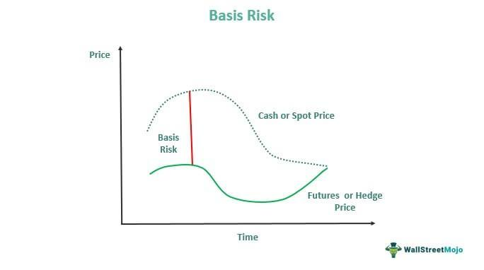

## Table of Contents

## What is basis risk?

Basis risk is the risk that the value of a financial hedge, like a futures contract, won't move in the same way as the value of the asset it's supposed to protect. Imagine you own wheat and want to protect its price from dropping. You might use a futures contract on wheat as a hedge. However, if the price of your wheat and the price of the futures contract don't move together perfectly, you still face some risk. This difference between the two is called basis risk.

This risk can come from many places. For example, the location where your wheat is grown might have different price movements than the location used for the futures contract. Or, the quality of your wheat might be different from the standard used in the futures market. Even small differences can lead to basis risk. It's important for people using hedges to understand and manage this risk, as it can affect how well their financial protection works.

## How does basis risk differ from other types of financial risk?

Basis risk is different from other financial risks because it specifically deals with the mismatch between a hedge and the asset it's meant to protect. For example, if you use a futures contract to hedge against price changes in wheat, basis risk is the chance that the futures price and the actual wheat price won't move together perfectly. This is different from market risk, which is the risk of losses due to overall market movements, or credit risk, which is the risk that a borrower won't repay a loan.

Other types of financial risk include [liquidity](/wiki/liquidity-risk-premium) risk, which is the risk that you can't buy or sell an asset quickly enough without affecting its price, and operational risk, which involves losses from failed internal processes or external events. Basis risk is unique because it focuses on the effectiveness of a hedge, not on broader market conditions or the ability to trade. Understanding basis risk helps people see how well their hedging strategies will work, while other risks might affect their overall financial strategy in different ways.

## What are the main types of basis risk?

Basis risk can come from different places. One type is location basis risk. This happens when the price of something in one place doesn't move the same way as the price in another place. For example, if you're using a futures contract for wheat grown in Kansas to hedge wheat grown in Illinois, the prices might not match up perfectly. Another type is product basis risk. This is when the thing you're hedging, like a specific type of wheat, is different from the standard used in the futures contract. If your wheat is of a different quality or type, the prices might not move together as expected.

There's also timing basis risk. This happens when the time you need to hedge doesn't match up with the time the futures contract is for. If you need to protect the price of wheat for next month but the futures contract is for three months from now, there could be a mismatch. Lastly, there's currency basis risk, which comes up when you're hedging something in one currency but the futures contract is in another. If the exchange rate between the two currencies changes, it can affect how well your hedge works. Understanding these types of basis risk can help you make better decisions about how to protect your investments.

## Can you explain the formula used to calculate basis risk?

Basis risk is calculated by looking at the difference between the price of the asset you're trying to protect and the price of the hedge you're using. Let's say you're a farmer who wants to protect the price of your wheat. You use a futures contract to do this. The basis is the difference between the price of your wheat and the price of the futures contract. If the price of your wheat is $5 per bushel and the futures contract price is $5.10 per bushel, the basis is -$0.10. Basis risk is the chance that this difference, or basis, will change over time.

To measure basis risk, you can look at how much the basis changes over time. You might do this by looking at historical data to see how the basis has moved in the past. If the basis tends to change a lot, there's more basis risk. If it stays pretty steady, there's less basis risk. This helps you understand how well your hedge might work. If the basis changes a lot, your hedge might not protect you as well as you hoped.

## What are some common examples of basis risk in financial markets?

Basis risk often shows up when farmers use futures contracts to protect the price of their crops. Let's say a wheat farmer wants to make sure they get a good price for their wheat next month. They might use a futures contract that's set to end in three months. If the price of wheat in their area changes differently than the price of the futures contract, the farmer faces basis risk. This could happen because the wheat in their area might be a different type or quality than the standard wheat used in the futures market.

Another common example is when companies use currency futures to protect against changes in exchange rates. Imagine a U.S. company that sells products in Europe and wants to protect against the euro getting weaker against the dollar. They might use a futures contract to lock in the exchange rate. But if the actual exchange rate they get when they sell their products doesn't match the rate in the futures contract, they face basis risk. This can happen because the timing of when they need the exchange rate might not match the timing of the futures contract, or because the market conditions change in unexpected ways.

## How does basis risk affect hedging strategies?

Basis risk can make hedging strategies less effective. When you use a hedge, like a futures contract, to protect against price changes, you want the price of the hedge to move the same way as the price of what you're trying to protect. But if there's basis risk, these prices might not move together perfectly. This means your hedge might not work as well as you hoped. For example, a farmer might use a futures contract to protect the price of their wheat, but if the price of their wheat and the futures contract don't move together, the farmer could still lose money.

To manage basis risk, people need to think carefully about their hedging strategies. They might choose hedges that are as close as possible to what they're trying to protect. This could mean [picking](/wiki/asset-class-picking) futures contracts that are for the same type of wheat they grow, or ones that end at the same time they need to sell their wheat. By understanding and managing basis risk, people can make their hedging strategies work better and protect themselves more effectively against price changes.

## What are the implications of basis risk for commodity traders?

Basis risk can be a big deal for commodity traders. When traders use futures contracts to protect the price of commodities like wheat or oil, they want the price of the futures to move the same way as the price of the commodity. But if there's basis risk, these prices might not match up perfectly. This means the trader's hedge might not work as well as they hoped. For example, if a trader is using a futures contract for wheat grown in one place to hedge wheat grown in another place, the prices might not move together. This can lead to unexpected losses, even if the trader thought they were protected.

To deal with basis risk, commodity traders need to be smart about their hedging strategies. They might choose futures contracts that are as close as possible to the commodity they're trading. This could mean picking contracts for the same type of wheat or oil, or ones that end at the same time they need to sell their commodity. By understanding and managing basis risk, traders can make their hedges work better and protect themselves more effectively against price changes. This helps them make better decisions and reduce the chance of losing money.

## How can basis risk be managed or mitigated?

Managing basis risk involves choosing the right hedging tools that closely match what you're trying to protect. For example, if you're a farmer growing a specific type of wheat, you should pick a futures contract that's for the same type of wheat. This can help make sure the price of your wheat and the price of the futures contract move together more closely. Also, if you're worried about the timing, try to use futures contracts that end around the same time you need to sell your product. By doing this, you can reduce the chance that the prices will move differently.

Another way to manage basis risk is by diversifying your hedges. Instead of using just one futures contract, you might use several different ones that cover different aspects of what you're trying to protect. This can help spread out the risk and make your overall hedge more effective. It's also important to keep an eye on the market and be ready to adjust your strategy if things change. By staying flexible and informed, you can better handle the ups and downs that come with basis risk.

## What role does correlation play in basis risk?

Correlation is a big part of basis risk. It's about how much the price of what you're trying to protect moves with the price of the hedge you're using. If the two prices move together a lot, like if they go up and down at the same time, they have a high correlation. This means there's less basis risk because the hedge will likely work well. But if the prices don't move together much, or if they move in different ways, there's more basis risk. This means your hedge might not protect you as well as you hoped.

Understanding correlation can help you pick the right hedge. If you know that the price of your wheat and the price of a certain futures contract move together closely, you can use that futures contract to hedge your wheat. But if the prices don't move together well, you might need to find a different hedge or use several hedges to cover your risk better. By looking at how things are correlated, you can make smarter choices and manage basis risk more effectively.

## How does basis risk impact the pricing of financial derivatives?

Basis risk can affect how much financial derivatives, like futures contracts, cost. When people use these derivatives to protect against price changes, they want the price of the derivative to move the same way as the price of what they're trying to protect. But if there's a lot of basis risk, meaning the prices might not move together well, the derivative might not work as a good hedge. This makes it riskier to use, so people might not want to pay as much for it. As a result, the price of the derivative could be lower because of the higher basis risk.

To manage this, people who make and sell derivatives need to think about basis risk when they set their prices. If they know there's a lot of basis risk, they might lower the price to make it more attractive to buyers who are willing to take on that risk. Or, they might try to find ways to reduce the basis risk, like making the derivative more closely match what people are trying to protect. By understanding and dealing with basis risk, they can set prices that make sense for both them and the people buying the derivatives.

## Can you discuss a case study where basis risk had a significant impact on a company's financial performance?

A good example of basis risk affecting a company's financial performance is the case of an airline that used oil futures to hedge against rising fuel costs. The airline wanted to make sure they didn't lose money if oil prices went up, so they bought futures contracts that would pay out if oil prices increased. But the oil they bought for their planes was different from the oil used in the futures market. This difference caused basis risk. When oil prices did go up, the price of the oil the airline bought went up more than the price of the oil in the futures contract. As a result, the hedge didn't work as well as the airline hoped, and they ended up losing money even though they had a hedge in place.

This case shows how important it is for companies to understand and manage basis risk. The airline could have done better if they had used futures contracts that more closely matched the type of oil they used. They might also have used several different hedges to spread out the risk. By doing this, they could have reduced the impact of basis risk and protected their financial performance more effectively. It's a reminder that even with a good hedging strategy, basis risk can still cause problems if it's not managed carefully.

## What are the latest research findings on basis risk and its management in complex financial environments?

Recent research on basis risk has focused on how it affects financial markets in complex environments, like when there are many different factors at play. One key finding is that basis risk can be harder to manage when markets are more connected and global. For example, if a company is trying to hedge against price changes in one country but the futures contract they use is based on prices in another country, the basis risk can be bigger because of differences in how the economies work. Researchers have found that using more advanced models and data analysis can help companies understand these risks better and make better choices about how to hedge.

Another important finding is that technology and new financial tools can help manage basis risk more effectively. For instance, some companies are now using [machine learning](/wiki/machine-learning) to predict how prices might move and to find the best hedges. This can help them pick futures contracts that are more likely to move the same way as the prices they're trying to protect. Also, new types of derivatives and financial products are being created to better match what companies need to hedge, which can reduce basis risk. By using these new tools and staying up to date with the latest research, companies can handle basis risk better and protect their financial performance in complex markets.

## How can we measure basis risk?

Accurately measuring basis risk is essential for managing it effectively. It involves the use of various statistical and analytical tools to understand better and mitigate the potential financial exposure that arises when there is an imperfect correlation between hedged assets.

Statistical tools play a crucial role in assessing the relationships between hedged items. Correlation coefficients, for instance, are used to determine the degree to which two variables move in relation to each other. The formula for the Pearson correlation coefficient, $r$, is given by:

$$
r = \frac{\sum{(X_i - \overline{X})(Y_i - \overline{Y})}}{\sqrt{\sum{(X_i - \overline{X})^2} \sum{(Y_i - \overline{Y})^2}}}
$$

where $X_i$ and $Y_i$ are the individual data points of variables X and Y, respectively, and $\overline{X}$ and $\overline{Y}$ are their means.

Regression analysis provides insights into the strength and nature of price relationships. By fitting a line through data points, it identifies whether changes in a predictor variable can explain variations in a response variable. The linear regression model can be expressed as:

$$
Y = \beta_0 + \beta_1X + \epsilon
$$

where $Y$ is the dependent variable, $X$ is the independent variable, $\beta_0$ and $\beta_1$ are the intercept and slope, respectively, and $\epsilon$ represents the error term.

Simulation methods, including stress testing, forecast potential basis movements by exposing the hedged assets to hypothetical scenarios. This offers a way to examine how various factors might impact the positions under extreme conditions. One common simulation technique used is Monte Carlo simulation, which uses repeated random sampling to calculate the range of possible outcomes in a model.

Analytical models such as the Capital Asset Pricing Model (CAPM) and Arbitrage Pricing Theory (APT) offer deeper insights into the factors driving basis risk. CAPM assesses the expected return of an asset, considering its risk relative to the market, using the formula:

$$
E(R_i) = R_f + \beta_i(E(R_m) - R_f)
$$

where $E(R_i)$ is the expected return of the investment, $R_f$ is the risk-free rate, $\beta_i$ is the beta of the investment, and $E(R_m)$ is the expected return of the market.

APT, a more flexible alternative, considers multiple factors that could affect an asset's return, thus offering a broader understanding of basis risk drivers.

By employing these statistical and analytical techniques, financial professionals can assess and manage basis risk with greater precision, enhancing the robustness of risk management strategies within [algorithmic trading](/wiki/algorithmic-trading) frameworks.

## References & Further Reading

[1]: Hull, J. C. (2018). ["Options, Futures, and Other Derivatives"](https://www.semanticscholar.org/paper/Options%2C-Futures%2C-and-Other-Derivatives-Hull/89bdee500c8623864fc9eb7a471546aa713acc44). Pearson Education.

[2]: Murphy, J. J. (1999). ["Technical Analysis of the Financial Markets: A Comprehensive Guide to Trading Methods and Applications"](https://archive.org/details/technicalanalysi0000murp). Penguin Books.

[3]: Fabozzi, F. J., Kolm, P. N., Pachamanova, D. A., & Focardi, S. M. (2007). ["Robust Portfolio Optimization and Management"](https://onlinelibrary.wiley.com/doi/book/10.1002/9781119202172). Wiley Finance.

[4]: Black, F., & Scholes, M. (1973). ["The Pricing of Options and Corporate Liabilities."](https://www.cs.princeton.edu/courses/archive/fall09/cos323/papers/black_scholes73.pdf) Journal of Political Economy, 81(3), 637-654.

[5]: Enderlein, J. (2018). ["Algorithmic Trading and Quantitative Strategies: A Comprehensive Guide"](https://scholar.google.com/citations?user=i1m5lxkAAAAJ&hl=en).

[6]: Gatheral, J. (2006). ["The Volatility Surface: A Practitioner's Guide"](https://onlinelibrary.wiley.com/doi/book/10.1002/9781119202073). Wiley Finance.