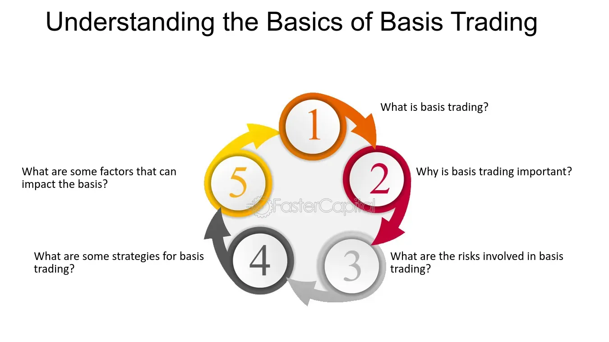

## Table of Contents

## What is basis trading?

Basis trading is a strategy used in financial markets where traders try to make money by taking advantage of the difference between the price of a futures contract and the price of the underlying asset. This difference is called the "basis." Traders buy or sell the futures contract and at the same time, they do the opposite with the underlying asset. The goal is to profit from the changes in the basis over time.

For example, if a trader thinks the basis will get smaller, they might buy the futures contract and sell the underlying asset. If the basis does shrink, they can make a profit when they close out their positions. Basis trading can be complex and risky, but it can also be rewarding if done correctly. It requires a good understanding of the market and the factors that affect the basis.

## How does basis trading work?

Basis trading involves taking advantage of the difference between the price of a futures contract and the price of the underlying asset, which is called the basis. Traders do this by buying or selling the futures contract and doing the opposite with the underlying asset. For example, if a trader thinks the basis will get smaller, they might buy the futures contract and sell the underlying asset. If the basis does shrink, they can make a profit when they close out their positions.

This strategy can be profitable if the trader correctly predicts how the basis will change. However, it can also be risky because the basis can be affected by many things, like changes in supply and demand, interest rates, and other market conditions. Traders need to understand these factors well to make good decisions. Basis trading is not simple, but with the right knowledge and careful planning, it can be a useful tool for making money in the financial markets.

## What are the key components of basis trading?

Basis trading involves two main parts: the futures contract and the underlying asset. The futures contract is an agreement to buy or sell something at a set price in the future. The underlying asset is the thing that the futures contract is based on, like a commodity or a stock. The difference between the price of the futures contract and the price of the underlying asset is called the basis. Traders in basis trading try to make money by betting on how this difference will change over time.

To do basis trading, a trader will take opposite positions in the futures contract and the underlying asset. For example, if a trader thinks the basis will get smaller, they might buy the futures contract and sell the underlying asset. If their prediction is right and the basis does shrink, they can make a profit when they close out their positions. This strategy can be profitable but it's also risky because the basis can be affected by many things, like changes in supply and demand, interest rates, and other market conditions. Traders need to understand these factors well to make good decisions.

## What is the difference between basis and spread in trading?

Basis and spread are two terms used in trading, but they mean different things. Basis is the difference between the price of a futures contract and the price of the underlying asset. Traders use basis trading to make money by betting on how this difference will change over time. For example, if a trader thinks the basis will get smaller, they might buy the futures contract and sell the underlying asset. If the basis does shrink, they can make a profit when they close out their positions.

Spread, on the other hand, refers to the difference between two prices, but it can be used in different ways. In trading, spread often means the difference between the bid price (what buyers are willing to pay) and the ask price (what sellers are asking for). This is called the bid-ask spread. Traders can also use spread trading, where they take positions in two related securities to profit from the change in their price difference. For example, a trader might buy one stock and sell another stock in the same industry, hoping to make money from the change in the spread between the two stocks.

## What are the common strategies used in basis trading?

In basis trading, one common strategy is called the calendar spread. Traders use this strategy when they think the basis will change over time. They do this by buying a futures contract that will end in the near future and selling a futures contract that will end later. If the basis changes in the way they expect, they can make money when they close out their positions. This strategy is often used in commodity markets, like oil or corn, where the supply and demand can change a lot over time.

Another strategy is called cash and [carry](/wiki/carry-trading) [arbitrage](/wiki/arbitrage). This is used when the futures price is higher than the spot price of the underlying asset, plus the costs of holding it until the futures contract ends. Traders will buy the underlying asset and sell the futures contract at the same time. They hope to make a profit from the difference between the futures price and the spot price, after taking out the costs of holding the asset. This strategy is often used in markets where the costs of holding the asset, like storage or interest, are well-known.

A third strategy is reverse cash and carry arbitrage. This is used when the futures price is lower than the spot price of the underlying asset, minus the costs of holding it. Traders will sell the underlying asset and buy the futures contract at the same time. They hope to make a profit from the difference between the spot price and the futures price, after taking out the costs of holding the asset. This strategy is less common than cash and carry arbitrage but can be useful in certain market conditions.

## How do market participants use basis trading to hedge risk?

Market participants use basis trading to hedge risk by taking positions in both a futures contract and the underlying asset. If a participant is worried that the price of the underlying asset might go down, they can sell a futures contract to protect themselves. At the same time, they might buy the underlying asset. If the price of the underlying asset does go down, the loss on the asset can be offset by the profit on the futures contract. This way, the participant can reduce their risk.

For example, a farmer who grows wheat might use basis trading to hedge against falling wheat prices. The farmer can sell wheat futures contracts to lock in a price for their wheat in the future. At the same time, they continue to grow and sell their wheat in the spot market. If wheat prices drop, the farmer loses money on the wheat they sell in the spot market, but they make money on the futures contracts they sold. This helps the farmer manage the risk of price changes and protect their income.

## What are the potential risks associated with basis trading?

Basis trading can be risky because it depends on the difference between the futures price and the spot price of the underlying asset, called the basis. If the basis moves in the opposite way from what the trader expects, they can lose money. For example, if a trader thinks the basis will get smaller and buys the futures contract while selling the underlying asset, but the basis actually gets bigger, the trader will lose money on both positions. This can happen because many things can affect the basis, like changes in supply and demand, interest rates, and other market conditions. Traders need to understand these factors well to make good decisions, but even with good knowledge, there's always a chance they might be wrong.

Another risk in basis trading is the cost of holding the underlying asset. If a trader is doing a cash and carry arbitrage, they need to buy and hold the underlying asset until the futures contract ends. This can cost money for things like storage, insurance, and interest. If these costs are higher than expected, the trader might not make as much profit as they hoped, or they might even lose money. Also, if the market is very volatile, the prices of the futures contract and the underlying asset can change a lot in a short time, making it hard for the trader to manage their positions and increasing the risk of big losses.

## How does basis trading impact market liquidity?

Basis trading can help make the market more liquid. When traders do basis trading, they buy and sell both futures contracts and the underlying assets. This means more trading happens, which can make it easier for other people to buy and sell things in the market. More trading can also help keep the prices of futures contracts and the underlying assets closer together, which can make the market work better.

But basis trading can also make the market less liquid if traders are not careful. If a lot of traders are doing the same kind of basis trading at the same time, it can make the market move in big ways. This can scare other people away from trading, making the market less liquid. Also, if traders are holding onto the underlying assets for a long time as part of their basis trading strategy, there might be fewer of those assets available for other people to trade, which can also make the market less liquid.

## What role does arbitrage play in basis trading?

Arbitrage is a big part of basis trading. It's when traders try to make money from the difference between the price of a futures contract and the price of the thing it's based on. If the futures price is higher than the spot price of the thing, plus the costs of holding it until the futures contract ends, traders can do something called cash and carry arbitrage. They buy the thing and sell the futures contract at the same time. If everything goes right, they make money from the difference between the two prices, after paying for the costs of holding the thing.

There's also another kind of arbitrage called reverse cash and carry arbitrage. This happens when the futures price is lower than the spot price of the thing, minus the costs of holding it. Traders will sell the thing and buy the futures contract at the same time. If the prices move in the right way, they can make money from the difference between the spot price and the futures price, after paying for the costs of holding the thing. Arbitrage helps keep the prices of futures contracts and the things they're based on close together, which can make the market work better.

## How can basis trading be used in different financial markets?

Basis trading can be used in many different financial markets, like commodities, stocks, and bonds. In commodity markets, like oil or corn, traders might use basis trading to bet on how the difference between the futures price and the spot price will change over time. They might buy a futures contract that will end soon and sell one that will end later, hoping to make money from the change in the basis. In stock markets, traders might use basis trading to hedge against price changes. For example, if a trader owns a stock and is worried about its price going down, they can sell a futures contract on that stock to protect themselves. If the stock price does go down, the loss on the stock can be offset by the profit on the futures contract.

In bond markets, basis trading can be used to take advantage of the difference between the price of a bond futures contract and the price of the underlying bond. Traders might buy the bond and sell the futures contract if they think the basis will get smaller, or do the opposite if they think it will get bigger. This can help them make money from the changes in the basis. No matter which market they're in, traders need to understand the factors that affect the basis, like supply and demand, interest rates, and other market conditions, to make good decisions and manage their risk.

## What advanced techniques can be applied to optimize basis trading?

To optimize basis trading, traders can use advanced techniques like [algorithmic trading](/wiki/algorithmic-trading). This means using computer programs to make trading decisions based on data and math. These programs can look at a lot of information very quickly and find the best times to buy and sell. They can also help traders manage their risk better by automatically adjusting their positions when the market changes. This can make basis trading more efficient and help traders make more money.

Another technique is to use statistical models to predict how the basis will change. Traders can use past data to build models that show how the basis has moved in the past and use these models to guess how it might move in the future. This can help them make better decisions about when to buy and sell. Traders can also use these models to find patterns in the market that they might not see otherwise. By using these advanced techniques, traders can improve their basis trading strategies and increase their chances of making a profit.

## How do regulatory environments affect basis trading strategies?

Regulatory environments can have a big impact on basis trading strategies. Rules set by governments and financial watchdogs can change how traders do basis trading. For example, some rules might limit how much traders can buy or sell at one time. This can make it harder for traders to do big basis trades. Also, rules about how much money traders need to have to do certain trades can affect basis trading. If the rules say traders need a lot of money to do basis trading, fewer people might do it.

Another way regulations affect basis trading is by changing the costs of trading. Some rules might make traders pay more to buy and sell futures contracts or the things they're based on. This can make basis trading less profitable. Also, rules about reporting trades can make basis trading more complicated. Traders might need to spend more time and money keeping track of their trades and making sure they follow the rules. All these things can make traders change their basis trading strategies to fit the rules.

## What is Basis Trading: Definition and Mechanics?

Basis trading is a financial strategy that involves exploiting the difference between the spot price of a commodity and its futures contract price, commonly known as the basis. The basis is defined mathematically as:

$$
\text{Basis} = \text{Spot Price} - \text{Futures Price}
$$

This trading strategy is particularly appealing to both hedgers and speculators due to its potential to generate profit or mitigate risk based on price movements in the spot and futures markets.

### Mechanism and Application

For hedgers, typically producers or consumers of commodities, basis trading provides a mechanism to stabilize revenue or costs against market price [volatility](/wiki/volatility-trading-strategies). Producers, such as farmers, use basis trading to lock in future prices for their commodities. By selling futures contracts while holding the physical commodity, they hedge against unfavorable price shifts. For instance, a corn producer may sell a futures contract at a favorable price, securing income regardless of potential spot price declines at the time of harvest.

Speculators, on the other hand, engage in basis trading to profit from shifts in the basis itself. Their strategy involves predicting changes in the basis due to factors such as supply and demand imbalances, changes in interest rates, or seasonal variations. By accurately forecasting these changes, speculators can enter positions that yield profit when the actual basis deviates from their predictions.

### Practical Examples

To illustrate, consider the [crude oil](/wiki/crude-oil) market. A refiner might use basis trading to lock in the cost of crude oil by purchasing futures contracts while delaying the physical purchase of oil. Conversely, an arbitrageur might notice that the basis widens significantly due to unforeseen supply constraints, allowing them to buy underpriced spot oil and sell futures contracts, capitalizing on the discrepancy.

In agricultural markets, a grain elevator operator may leverage basis trading by purchasing grain from farmers at the spot price while simultaneously selling futures contracts. This approach guarantees a margin regardless of future price movements, as long as the basis remains predictable.

### Conclusion

Basis trading is a versatile strategy tailored to the needs of both hedgers seeking price stability and speculators aiming for profit from price differentials. Understanding the dynamics of the basis allows market participants to effectively manage risk or identify lucrative opportunities across various commodity markets.

## References & Further Reading

[1]: Chan, E. P. (2009). ["Quantitative Trading: How to Build Your Own Algorithmic Trading Business."](https://github.com/ftvision/quant_trading_echan_book) Wiley.

[2]: Lopez de Prado, M. (2018). ["Advances in Financial Machine Learning."](https://www.amazon.com/Advances-Financial-Machine-Learning-Marcos/dp/1119482089) Wiley.

[3]: Aronson, D. (2006). ["Evidence-Based Technical Analysis: Applying the Scientific Method and Statistical Inference to Trading Signals."](https://www.amazon.com/Evidence-Based-Technical-Analysis-Scientific-Statistical/dp/0470008741) Wiley.

[4]: Jansen, S. (2020). ["Machine Learning for Algorithmic Trading."](https://github.com/stefan-jansen/machine-learning-for-trading) Second Edition. Packt Publishing.

[5]: Treynor, J. L. (1981). "The Financial Objective in Basis Trading." Financial Analysts Journal, 37(4), 70-71. 

[6]: Massey, R. Jr., & Jackson, M. (2003). ["Basis Trading and Risk Management."](https://archive.org/details/IntroductionToStatisticalAnalysis) ResearchGate. 

[7]: Carver, R. (2015). ["Systematic Trading: A Unique New Method for Designing Trading and Investing Systems."](https://www.amazon.com/Systematic-Trading-designing-trading-investing/dp/0857194453) Harriman House.