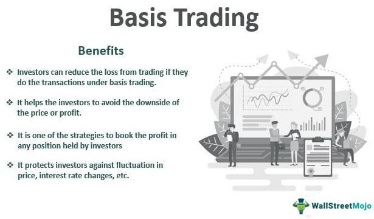

Financial trading is a sophisticated field involving various strategies and techniques to generate profits in different market conditions. At its core, financial trading involves the buying and selling of financial instruments, such as stocks, bonds, commodities, and derivatives, with the objective of achieving financial gains. Technological advancements and the globalization of markets have increased the complexity and scope of trading strategies available to investors and traders.

Two prominent strategies that have gained popularity due to their efficiency and effectiveness are algorithmic trading and basis trading. Algorithmic trading, often referred to simply as algo trading, utilizes computer algorithms to automate trading processes. These algorithms are designed to execute trades based on pre-defined criteria and market signals, allowing for precise and speedy execution while minimizing human error and emotional biases.



On the other hand, basis trading capitalizes on the price difference between the spot price of a commodity and its corresponding futures contract price, a difference known as the basis. This strategy is employed by both hedgers, who aim to protect against adverse price movements, and speculators, who seek to profit from these price differentials. Basis trading provides opportunities to generate returns across various market conditions by exploiting the natural discrepancies between spot and futures prices.

This article explores these trading strategies and provides insights into their working mechanisms and applications. It aims to provide a comprehensive understanding of basis trading and algorithmic trading, catering to both novice and experienced traders. Through this exploration, readers will gain a nuanced view of the sophisticated techniques involved in modern financial trading and how these strategies can be used to optimize trading outcomes.

## Table of Contents

## Understanding Financial Trading Strategies

Financial trading strategies are essential for successful engagement in various market environments, enabling traders to make informed decisions about when to buy or sell assets. These strategies are foundational to trading in diverse financial instruments, including stocks, cryptocurrencies, bonds, and commodities. The choice of a particular trading strategy is influenced by several factors, such as current market conditions, the trader's experience level, risk tolerance, and specific financial goals.

Several basic trading strategies form the cornerstone of financial trading practices:

1. **Buy and Hold Strategy**: This long-term approach involves purchasing assets and holding them for an extended period, regardless of market fluctuations. The goal is to capitalize on the gradual appreciation in value. This strategy is often adopted in stock markets where investors believe in the long-term growth potential of the companies they invest in.

2. **Day Trading**: Unlike the buy and hold strategy, day trading involves buying and selling financial instruments within the same trading day. The primary objective is to profit from short-term market movements. It requires making quick decisions based on market signals and trends and is commonly used in markets with high volatility, such as cryptocurrencies and the stock market.

3. **Swing Trading**: This involves holding positions for several days to weeks to profit from expected market price movements or 'swings.' Traders often rely on technical analysis and market indicators to identify potential buy/sell points. This strategy strikes a balance between the rapid pace of day trading and the slow accumulation of profits seen in buy and hold.

4. **Scalping**: A short-term trading strategy focused on exploiting small price gaps created by order flows or spreads. Traders using this strategy execute numerous trades in a day to accumulate profits from minor price shifts. Scalping requires a disciplined and attentive approach to monitoring market conditions.

5. **Value Investing**: This strategy focuses on identifying undervalued stocks with strong fundamentals and long-term growth prospects. Traders look for opportunities where the intrinsic value of a company's stock is higher than its market value. Value investing requires thorough financial analysis and patience, as it often takes time for the market to recognize a stock’s true value.

6. **Momentum Trading**: Momentum traders seek to capitalize on existing trends in stock prices. The principle is to buy securities that are rising and sell them when they start to show signs of breaking down. Technical analysis tools play a crucial role in this strategy, helping traders spot trend strength and duration.

Understanding these foundational strategies is crucial before venturing into more complex methodologies like basis and [algorithmic trading](/wiki/algorithmic-trading). Each strategy involves unique techniques and considerations, and the best approach often combines elements from multiple strategies to match the trader's objectives and adapts to market dynamics. This adaptability allows traders to thrive in different market conditions, ultimately supporting the pursuit of enhanced profitability and stability in financial markets.

## Basis Trading: Definition and Mechanics

Basis trading is a financial strategy that involves exploiting the difference between the spot price of a commodity and its futures contract price, commonly known as the basis. The basis is defined mathematically as:

$$
\text{Basis} = \text{Spot Price} - \text{Futures Price}
$$

This trading strategy is particularly appealing to both hedgers and speculators due to its potential to generate profit or mitigate risk based on price movements in the spot and futures markets.

### Mechanism and Application

For hedgers, typically producers or consumers of commodities, basis trading provides a mechanism to stabilize revenue or costs against market price [volatility](/wiki/volatility-trading-strategies). Producers, such as farmers, use basis trading to lock in future prices for their commodities. By selling futures contracts while holding the physical commodity, they hedge against unfavorable price shifts. For instance, a corn producer may sell a futures contract at a favorable price, securing income regardless of potential spot price declines at the time of harvest.

Speculators, on the other hand, engage in basis trading to profit from shifts in the basis itself. Their strategy involves predicting changes in the basis due to factors such as supply and demand imbalances, changes in interest rates, or seasonal variations. By accurately forecasting these changes, speculators can enter positions that yield profit when the actual basis deviates from their predictions.

### Practical Examples

To illustrate, consider the [crude oil](/wiki/crude-oil) market. A refiner might use basis trading to lock in the cost of crude oil by purchasing futures contracts while delaying the physical purchase of oil. Conversely, an arbitrageur might notice that the basis widens significantly due to unforeseen supply constraints, allowing them to buy underpriced spot oil and sell futures contracts, capitalizing on the discrepancy.

In agricultural markets, a grain elevator operator may leverage basis trading by purchasing grain from farmers at the spot price while simultaneously selling futures contracts. This approach guarantees a margin regardless of future price movements, as long as the basis remains predictable.

### Conclusion

Basis trading is a versatile strategy tailored to the needs of both hedgers seeking price stability and speculators aiming for profit from price differentials. Understanding the dynamics of the basis allows market participants to effectively manage risk or identify lucrative opportunities across various commodity markets.

## Algorithmic Trading: Concept and Operations

Algorithmic trading leverages computer algorithms to automate trading processes, executing orders based on pre-defined criteria and market signals. This technological approach enhances trading precision and speed, significantly reducing human error and the influence of emotional biases. By relying on algorithms, traders can take advantage of even minute market fluctuations, executing trades in fractions of a second which is impossible for humans to achieve manually.

### Types of Algorithmic Trading Strategies

There are several strategies within algorithmic trading, each tailored to specific market conditions and trader objectives. Among the most prevalent are trend-following and [arbitrage](/wiki/arbitrage) strategies.

**Trend-Following Strategies** involve algorithms that identify and capitalize on trends in market data. These algorithms monitor price movements and volume indicators to detect trends and execute trades accordingly. For instance, a trend-following algorithm might sell a security when its moving average trends downward over a certain period, signaling a potential price drop.

**Arbitrage Strategies** exploit price discrepancies between different markets or financial instruments. Algorithms can identify and trade these discrepancies faster than any human trader, ensuring profits from temporary inefficiencies. For example, if a stock is undervalued in one market compared to another, an arbitrage algorithm would buy the stock in the cheaper market and sell it in the more expensive one, profiting from the difference.

### Key Features and Advantages

The primary advantages of algorithmic trading are automation, speed, and the ability to backtest strategies effectively.

- **Automation** allows for systematic trading without the need for continuous human intervention. Traders can define the criteria upon which trades should be executed, and the algorithm will proceed to act on these instructions autonomously.

- **Speed** is a critical factor, as algorithms can process data and execute trades much faster than humans. This speed allows traders to take advantage of fleeting market opportunities that may only exist for a few seconds.

- **Backtesting Capabilities** enable traders to test their trading strategies against historical data. This process allows them to refine their algorithms by analyzing how well they would have performed in previous market conditions. In Python, traders often use libraries like `pandas` for data manipulation and `Backtrader` for strategy testing. Here is a simple example of how backtesting might be implemented in Python:

```python
import backtrader as bt

class MyStrategy(bt.Strategy):
    def __init__(self):
        self.sma = bt.indicators.SimpleMovingAverage(self.data, period=15)

    def next(self):
        if self.data.close > self.sma:
            self.buy()
        elif self.data.close < self.sma:
            self.sell()

if __name__ == '__main__':
    cerebro = bt.Cerebro()
    data = bt.feeds.YahooFinanceData(dataname='AAPL', fromdate='2020-01-01', todate='2021-01-01')
    cerebro.adddata(data)
    cerebro.addstrategy(MyStrategy)
    cerebro.run()
```

This code illustrates a basic moving average strategy, where the script buys when the stock price is above its 15-day moving average and sells when it's below. 

Algorithmic trading has revolutionized the financial markets by providing a level of precision and efficiency that manual trading cannot match. However, the implementation of these systems requires an understanding of both market dynamics and the technical complexities involved in coding and maintaining trading algorithms.

## Comparing Basis and Algorithmic Trading

Both basis trading and algorithmic trading offer distinct advantages to traders, yet they cater to different market dynamics and trader profiles. Understanding their mechanics, applications, and ideal market conditions can help traders align these strategies with their overall trading goals.

### Mechanics and Applications

**Basis Trading:**
Basis trading is primarily concerned with the price discrepancy between the spot price and futures price of a commodity, known as the basis. This strategy is mainly used by hedgers, such as producers and consumers, who aim to lock in prices and minimize price risk. Speculators also engage in basis trading to profit from anticipated changes in the basis. For example, if a producer expects the basis to narrow, they might sell a futures contract to capture this expected movement. The success of basis trading largely depends on accurately predicting the convergence of futures and spot prices.

**Algorithmic Trading:**
Algorithmic trading relies on complex mathematical models and computer algorithms to execute trades automatically, based on predefined criteria. These algorithms can engage in various strategies such as [market making](/wiki/market-making), arbitrage, and [trend following](/wiki/trend-following). Algo trading is particularly advantageous in markets characterized by high volatility and rapid price movements where swift execution is crucial. This strategy serves both institutional and retail traders looking to leverage speed and precision in trade execution.

### Market Conditions

**Basis Trading:**
Basis trading thrives in markets where there are regular patterns in the basis or where predictable factors influence basis movements, such as seasonal demand in agricultural commodities. Stability and predictability in the factors impacting the basis make this strategy more feasible.

**Algorithmic Trading:**
Algorithmic trading flourishes in liquid markets, such as equities and [forex](/wiki/forex-system), where trades can be executed rapidly without significantly affecting the market price. High-frequency trading, a subset of algo trading, particularly benefits from narrow bid-ask spreads and deep market [liquidity](/wiki/liquidity-risk-premium).

### Complementing Trading Portfolios

**Basis Trading with Algorithmic Trading:**
By integrating both strategies, traders can hedge against price movements in underlying commodities using basis trading while exploiting short-term market inefficiencies through algorithmic trading. This diversification can enhance the stability of a portfolio by balancing risk through hedging and seeking profits from volatility.

### Risks and Challenges

**Basis Trading Risks:**
Key challenges include basis volatility and the risk that both futures and spot prices may move unfavorably, thus affecting the expected profit from the trade. Understanding and predicting basis changes require significant expertise and market insight.

**Algorithmic Trading Risks:**
The primary risks involve technical failures, such as software glitches or connectivity issues, which could prevent trades from being executed as intended. Moreover, algos might make rapid decisions based on erroneous market signals, leading to substantial losses. Additionally, regulatory scrutiny in algo trading is intense, given its potential impact on market stability.

In summary, while basis trading offers predictability and hedging benefits, algorithmic trading provides speed and efficiency. Their complementary nature can help traders optimize performance and manage risks effectively across different market conditions.

## Conclusion: Choosing the Right Strategy

Selecting a trading strategy necessitates a careful consideration of an individual's financial goals, understanding of the market, and tolerance for risk. Both basis trading and algorithmic trading hold significant positions in modern financial markets, each presenting unique opportunities to traders.

Basis trading is particularly suited for those looking to exploit the differential between spot prices and futures contract prices. It is a strategy often embraced by hedgers who aim to stabilize earnings against fluctuating market prices. This strategy can be beneficial in markets with predictable seasonal trends or known demand cycles. Basis trading allows traders to mitigate risks associated with price volatility, but it requires a deep understanding of both spot and futures markets to be executed effectively.

On the other hand, algorithmic trading offers an entirely different set of advantages. By leveraging computer algorithms to execute trades based on pre-determined criteria, traders can benefit from enhanced precision and speed. Algorithmic trading removes the emotional biases that can often lead to irrational decision-making, enabling more consistent and strategic trading actions. This strategy is particularly advantageous in highly liquid markets, where rapid execution of trades is crucial. Moreover, the ability to backtest these algorithms against historical data strengthens their reliability and efficiency.

It is imperative for traders to stay informed about market developments and be adaptable in their strategies. Market conditions are not static; hence, strategies need to evolve to remain effective. For instance, a trader employing basis trading might need to consider abrupt changes in production or consumption behavior that could impact the basis. Similarly, an algorithmic trader needs to ensure that algorithms are continuously tuned to reflect the current market dynamics.

Leveraging these strategies effectively can significantly enhance a trader's profitability and stability. The right strategy, or combination of strategies, can provide an edge in capturing opportunities and mitigating risks inherent in market participation. Ultimately, the choice between basis trading and algorithmic trading—or the integration of both—should be guided by a trader’s specific objectives and market outlook.

In conclusion, both basis and algorithmic trading offer distinct advantages and can be powerful tools for traders. By aligning their trading strategies with personal financial goals and market insights, traders can optimize their potential for success in the financial markets.

## Frequently Asked Questions (FAQs)

### What are the primary differences between basis trading and algorithmic trading?

Basis trading and algorithmic trading are fundamentally different in their approach and execution within financial markets. Basis trading focuses on the difference between the spot price of a commodity and its futures contract price, leveraging this difference to gain profits or hedge risks. It is specifically related to commodities and futures markets and can be practiced by both hedgers, who manage risks, and speculators, who aim to profit from market price movements.

On the other hand, algorithmic trading involves using computer algorithms to automate trading decisions based on predefined criteria and market signals. This strategy can be applied across various asset classes, including stocks, cryptocurrencies, and bonds, and is designed to maximize execution speed and precision while minimizing human errors and emotional biases.

### How can a novice trader get started with algorithmic trading?

For novice traders interested in algorithmic trading, getting started requires a few key steps:

1. **Fundamental Knowledge**: Understanding the basics of financial markets and trading strategies is essential. Familiarity with programming languages like Python can be beneficial, as it is widely used in algorithmic trading for strategy development.

2. **Learning Resources**: Utilize online courses, tutorials, and books focused on algorithmic trading. Resources like Coursera, edX, and books by Ernest Chan or Yves Hilpisch can offer valuable insights.

3. **Simulation Platforms**: Start with paper trading or simulation platforms to practice without risking actual capital. Platforms like QuantConnect and Alpaca allow traders to test algorithms with historical data.

4. **Strategy Development**: Begin by coding simple trading algorithms based on well-known strategies like moving average crossovers or momentum-based approaches. As skills improve, more complex strategies can be explored.

5. **Risk Management**: Understanding risk management and setting proper stop-loss and take-profit levels is crucial to avoid significant losses.

### Is basis trading applicable to all types of commodities?

Basis trading is typically applicable to commodities that have active futures markets, such as crude oil, agricultural products (like corn and wheat), and precious metals (like gold and silver). However, it may not be suitable for commodities without established futures contracts or those with low trading volumes, as these conditions could lead to illiquid markets and increased basis risk.

### Are there any legal considerations to be aware of when engaging in algorithmic trading?

Engaging in algorithmic trading involves several legal and regulatory considerations:

1. **Compliance**: Traders must ensure compliance with the regulations set by financial authorities like the U.S. Securities and Exchange Commission (SEC) and the Commodity Futures Trading Commission (CFTC).

2. **Market Manipulation**: Algorithms should not engage in deceptive practices like spoofing (placing fake orders to manipulate prices) or layering, which are illegal.

3. **Data Privacy**: Ensuring the confidentiality of data and adhering to privacy regulations is crucial, especially when dealing with customer information.

4. **System Testing and Monitoring**: Regulators often require thorough testing and real-time monitoring of algorithmic systems to prevent market disruptions.

### What tools and resources are recommended for effective basis and algo trading practices?

For effective basis trading, tools like futures trading platforms (e.g., CME Group, ICE) and market analysis software are essential for tracking price differences and executing trades.

For algorithmic trading, the following resources and tools are recommended:

- **Development Environments**: Python IDEs like PyCharm or Jupyter Notebooks for coding and testing algorithms.

- **Backtesting Libraries**: Libraries such as Backtrader or Zipline can facilitate the backtesting of trading strategies using historical data.

- **Data Providers**: Access to high-quality market data through providers like Bloomberg, Quandl, or Alpha Vantage is crucial for strategy testing and execution.

- **Brokerage APIs**: Integrate with brokers offering API access (e.g., Interactive Brokers, Alpaca) to automate trade execution.

By equipping themselves with the right tools and knowledge, traders can enhance their efficacy in both basis and algorithmic trading practices.

## References & Further Reading

[1]: Chan, E. P. (2009). ["Quantitative Trading: How to Build Your Own Algorithmic Trading Business."](https://github.com/ftvision/quant_trading_echan_book) Wiley.

[2]: Lopez de Prado, M. (2018). ["Advances in Financial Machine Learning."](https://www.amazon.com/Advances-Financial-Machine-Learning-Marcos/dp/1119482089) Wiley.

[3]: Aronson, D. (2006). ["Evidence-Based Technical Analysis: Applying the Scientific Method and Statistical Inference to Trading Signals."](https://www.amazon.com/Evidence-Based-Technical-Analysis-Scientific-Statistical/dp/0470008741) Wiley.

[4]: Jansen, S. (2020). ["Machine Learning for Algorithmic Trading."](https://github.com/stefan-jansen/machine-learning-for-trading) Second Edition. Packt Publishing.

[5]: Treynor, J. L. (1981). "The Financial Objective in Basis Trading." Financial Analysts Journal, 37(4), 70-71. 

[6]: Massey, R. Jr., & Jackson, M. (2003). ["Basis Trading and Risk Management."](https://archive.org/details/IntroductionToStatisticalAnalysis) ResearchGate. 

[7]: Carver, R. (2015). ["Systematic Trading: A Unique New Method for Designing Trading and Investing Systems."](https://www.amazon.com/Systematic-Trading-designing-trading-investing/dp/0857194453) Harriman House.