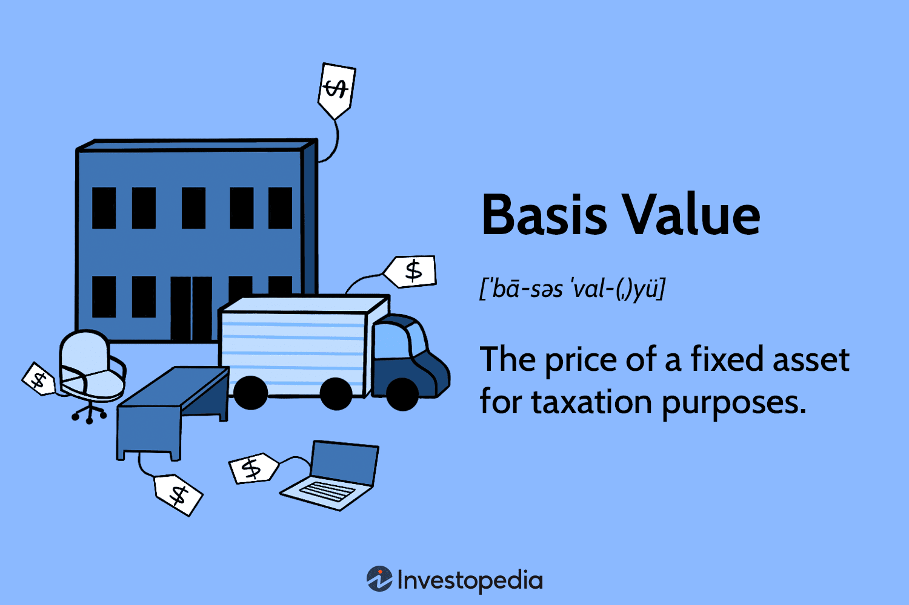

## Table of Contents

## What is the basic definition of basis value?

Basis value is a term used in finance and accounting. It refers to the original cost of an asset, plus any additional costs needed to get the asset ready for use. For example, if you buy a machine for your business, the basis value would include the purchase price of the machine and any costs to set it up and make it work.

This value is important because it is used to calculate depreciation and capital gains or losses when the asset is sold. Depreciation is the way businesses account for the wear and tear of an asset over time. When you sell an asset, the difference between the sale price and the basis value helps determine if you made a profit or a loss. Understanding the basis value helps businesses manage their finances better.

## Why is basis value important in financial analysis?

Basis value is important in financial analysis because it helps businesses keep track of their money and make smart decisions. When a company buys something like a machine or a building, the basis value is what they paid for it, plus any extra costs to get it working. This number is crucial because it's used to figure out how much the asset is worth over time and how much it can be sold for later.

Knowing the basis value also helps with taxes. When a business sells an asset, the difference between the sale price and the basis value tells them if they made a profit or a loss. This information is needed for tax returns. If the sale price is higher than the basis value, the business might have to pay taxes on the profit. If it's lower, they might be able to claim a loss, which can reduce their taxes. So, understanding basis value helps businesses plan their finances better and follow tax rules.

## How does basis value differ from market value?

Basis value and market value are two different ways to look at the worth of an asset. Basis value is what you originally paid for the asset, plus any extra costs to get it ready to use. For example, if you bought a car for $20,000 and spent $2,000 on taxes and registration, the basis value of the car would be $22,000. This number stays the same unless you make improvements to the asset.

Market value, on the other hand, is what someone would pay for the asset right now in the open market. It can go up or down based on things like how much people want the asset, the condition of the asset, and what's happening in the economy. Using the same car example, if the market value of the car drops to $15,000 because of wear and tear or because newer models are out, that's what someone would pay for it today. So, while basis value is about what you spent, market value is about what the asset is worth now.

## What are the common methods used to calculate basis value?

To calculate the basis value of an asset, you start with the original cost of the asset. This is the price you paid to buy it. But you don't stop there. You also need to add any other costs that were needed to get the asset ready to use. For example, if you bought a piece of land, you would add the cost of the land plus any fees for surveys, legal work, or improvements you made to the land before using it. All these costs together make up the basis value.

Sometimes, the basis value can change over time. If you make improvements to the asset, like adding a new room to a house or upgrading machinery, you add the cost of those improvements to the original basis value. On the other hand, if you get money back, like an insurance payout for damage to the asset, you subtract that from the basis value. Keeping track of these changes helps you know the correct basis value, which is important for figuring out taxes and profits when you sell the asset.

## Can you explain the concept of cost basis in relation to basis value?

Cost basis and basis value are closely related concepts in finance. Cost basis is the original amount you paid for an asset, like a stock or a piece of property. It's the starting point for figuring out how much you've gained or lost when you sell the asset. For example, if you bought a stock for $50, that $50 is your cost basis. When you sell the stock, you compare the sale price to your cost basis to see if you made a profit or a loss.

Basis value, on the other hand, builds on the cost basis by including any additional costs needed to get the asset ready for use. So, if you bought a house for $200,000 and spent another $20,000 on repairs and upgrades before moving in, your basis value would be $220,000. This total amount is important for calculating depreciation and for determining capital gains or losses when you sell the asset. Essentially, basis value gives you a more complete picture of what you've invested in the asset, which is crucial for financial and tax purposes.

## How do adjustments affect the basis value of an asset?

Adjustments can change the basis value of an asset in different ways. If you spend more money on the asset after you buy it, like making improvements or upgrades, you add those costs to the original basis value. For example, if you buy a house and later add a new kitchen, the cost of the kitchen gets added to the basis value of the house. This makes the basis value higher because you've put more money into the asset.

On the other hand, if you get money back related to the asset, like an insurance payout for damage or a tax refund, you subtract that amount from the basis value. This makes the basis value lower because you've gotten some money back. Keeping track of these adjustments is important because they affect how much you can claim in depreciation and how much profit or loss you have when you sell the asset.

## What role does depreciation play in determining the basis value?

Depreciation is a way to account for how an asset loses value over time because of wear and tear or becoming outdated. When you buy something like a machine or a car for your business, you can't use the whole cost of it right away to lower your taxes. Instead, you spread out the cost over the years you use the asset. This is called depreciation. Depreciation doesn't change the basis value directly, but it's important because it helps you figure out how much of the asset's cost you can claim each year.

When you sell the asset, the basis value is still the total amount you paid for it, plus any improvements, minus any money you got back. But the total depreciation you've claimed over the years is subtracted from the sale price to find out if you made a profit or a loss. So, while depreciation doesn't change the basis value itself, it affects how you use the basis value to calculate your taxes and profits when you sell the asset.

## How is basis value used in tax calculations?

Basis value is important for figuring out taxes when you sell an asset. When you sell something like a house or a piece of equipment, you need to know how much you paid for it, which is the basis value. If you sell it for more than what you paid, you might have to pay taxes on the profit. This profit is called a capital gain. The basis value helps you find out how big that gain is by comparing it to the sale price. If you sell it for less than what you paid, you might be able to claim a loss on your taxes, which can lower what you owe.

Depreciation also plays a part in how basis value is used for taxes. When you own an asset and use it for your business, you can claim a little bit of its cost each year as a tax deduction. This is called depreciation. Even though depreciation doesn't change the basis value directly, it does affect your taxes when you sell the asset. You subtract the total depreciation you've claimed from the sale price to see if you made a profit or a loss. So, knowing the basis value and how much you've depreciated the asset helps you figure out your taxes correctly.

## Can you provide an example of calculating basis value for a stock investment?

Let's say you bought 100 shares of a company's stock for $50 each. The total cost for the stock is $5,000. This $5,000 is your cost basis. But, if you had to pay a brokerage fee of $50 to buy the stock, you would add that fee to your cost basis. So, your basis value for the stock would be $5,050. This is the total amount you spent to get the stock.

Now, imagine that after a year, the company did well and the stock price went up to $60 per share. If you decide to sell all 100 shares, you would get $6,000 from the sale. To figure out if you made a profit, you compare the sale price to your basis value. You subtract your basis value of $5,050 from the sale price of $6,000. That gives you a profit of $950. This profit, called a capital gain, might be taxed depending on your country's tax laws.

## What are the implications of basis value for estate planning?

Basis value is important for estate planning because it affects how much tax your family might have to pay when you pass away. When you leave things like a house or stocks to your family, the basis value of those things can change. This new basis value is called the stepped-up basis. It means the value of the asset is reset to what it's worth on the day you die, not what you paid for it. If your family sells the asset soon after you die, they might pay less in taxes because they can use this new, higher basis value to figure out their profit.

For example, let's say you bought a house for $100,000 a long time ago, and now it's worth $500,000 when you die. If your family sells it right away for $500,000, they won't have to pay taxes on the $400,000 difference because the basis value stepped up to $500,000. But if they keep the house and it goes up to $600,000 before they sell it, they would only pay taxes on the $100,000 difference between the stepped-up basis and the sale price. Understanding how basis value works can help you plan your estate so your family pays less in taxes and keeps more of what you leave them.

## How do regulatory changes impact the calculation of basis value?

Regulatory changes can change how you figure out the basis value of things you own. Governments sometimes make new rules about what costs you can add to the basis value. For example, they might say you can now include certain fees or costs that you couldn't before. Or they might change the rules about how you handle things like depreciation or improvements. These changes can make the basis value go up or down, depending on what the new rules are.

When the rules change, it's important to keep up with them so you can figure out the right basis value. This is because the basis value helps you know how much tax you owe when you sell something. If you don't follow the new rules, you might end up paying too much or too little in taxes. So, staying updated on regulatory changes helps you manage your money better and follow the law.

## What advanced techniques can be used to optimize basis value in complex financial portfolios?

In complex financial portfolios, one advanced technique to optimize basis value is tax loss harvesting. This means selling assets that have lost value to lower your taxes. When you sell these assets, you can use the losses to reduce the taxes you owe on your gains from other investments. By carefully choosing which assets to sell and when, you can keep your basis value as low as possible for the assets you want to keep. This way, when you sell those assets later, your profit might be higher, and you might pay less in taxes.

Another technique is to use a strategy called asset location. This involves placing different types of investments in different types of accounts to get the best tax benefits. For example, you might put investments that grow a lot in tax-deferred accounts like an IRA, where you don't pay taxes on the gains until you take the money out. This can help keep the basis value lower because you're not paying taxes on the gains as they happen. By thinking about where to put your investments, you can manage your basis value better and save on taxes over time.

## What are the key concepts in understanding valuation?

Valuation is a foundational element in finance, essential for determining the intrinsic value of assets. Accurate valuation allows investors to identify whether assets are undervalued or overpriced. This forms the basis for many investment strategies and trading decisions.

### Fundamental Valuation Concepts

Three principal concepts underpin valuation in financial analysis: basis value, book value, and fair value. Each concept brings its unique perspective and set of metrics that influence investment decisions.

1. **Basis Value**: This metric is crucial in taxation as it determines the asset's cost basis, influenced by purchase price, additional costs, and deductions. It affects the calculation of taxable capital gains. The formula generally used is:
$$
   \text{Basis Value} = \text{Purchase Price} + \text{Improvements} + \text{Legal Fees} - \text{Depreciation}

$$

2. **Book Value**: A more straightforward metric representing a company's net asset value calculated as:
$$
   \text{Book Value} = \text{Total Assets} - \text{Total Liabilities}

$$

   This serves as a benchmark in valuation methods and plays a significant role in value investing, providing insights into whether a stock is undervalued relative to its book value per share.

3. **Fair Value**: This concept involves estimating the true market value of an asset based on factors like market conditions, comparable sales, and future cash flows. Fair value is often derived through models such as discounted cash flow (DCF), which encapsulates the present value of expected future cash flows.

### Effective Valuation Approaches

Valuation integrates historical data, financial models, and market dynamics to provide accurate asset assessments. Analysts use a combination of quantitative and qualitative data, including past performance, market trends, and economic conditions.

Challenges arise from market [volatility](/wiki/volatility-trading-strategies), where asset prices can fluctuate due to economic, political, or social changes. Subjectivity also plays a role, as different investors might interpret financial data and market signals differently. As such, effective valuation requires adaptable and precise methods to adjust to changing market scenarios.

In summary, understanding and applying valuation concepts is crucial for making informed investment decisions. By leveraging historical data and incorporating flexibility to account for market changes, investors and analysts can navigate potential uncertainties and capitalize on market opportunities.

## What is an Example of Basis Value Calculation?

Basis value, essential in taxation, represents the adjusted price of a fixed asset. This calculation begins with the asset's initial purchase price, accounting for various modifications such as improvements, legal fees, and selling costs. Importantly, deductions like depreciation are subtracted to determine the basis value accurately. This adjusted value directly impacts the taxable capital gains when the asset is sold, influencing the tax burden.

For example, consider a scenario where a company purchases machinery for $100,000. Over time, the company incurs $20,000 in improvements and $5,000 in legal fees related to the asset. Additionally, the company claims $10,000 in depreciation. The basis value calculation for this machinery would be:

$$
\text{Basis Value} = \text{Purchase Price} + \text{Improvements} + \text{Legal Fees} - \text{Depreciation}
$$

Plugging in the numbers:

$$
\text{Basis Value} = 100,000 + 20,000 + 5,000 - 10,000 = 115,000
$$

Thus, the basis value of the machinery is $115,000. This value will serve as the foundational amount for calculating any taxable capital gains upon the sale of the asset.

Accurate determination of basis value ensures compliance with tax regulations and serves as an optimized approach to minimize tax liabilities. This underscores its importance in financial calculations, helping businesses and investors accurately reflect the cost basis for taxation purposes.

## References & Further Reading

[1]: Bergstra, J., Bardenet, R., Bengio, Y., & Kégl, B. (2011). ["Algorithms for Hyper-Parameter Optimization."](https://dl.acm.org/doi/10.5555/2986459.2986743) Advances in Neural Information Processing Systems 24.

[2]: ["Advances in Financial Machine Learning"](https://www.amazon.com/Advances-Financial-Machine-Learning-Marcos/dp/1119482089) by Marcos Lopez de Prado

[3]: ["Evidence-Based Technical Analysis: Applying the Scientific Method and Statistical Inference to Trading Signals"](https://www.amazon.com/Evidence-Based-Technical-Analysis-Scientific-Statistical/dp/0470008741) by David Aronson

[4]: ["Machine Learning for Algorithmic Trading"](https://github.com/stefan-jansen/machine-learning-for-trading) by Stefan Jansen

[5]: ["Quantitative Trading: How to Build Your Own Algorithmic Trading Business"](https://github.com/LucindaYa/quant-resources/blob/master/Quantitative%20Trading%20How%20to%20Build%20Your%20Own%20Algorithmic%20Trading%20Business.pdf) by Ernest P. Chan