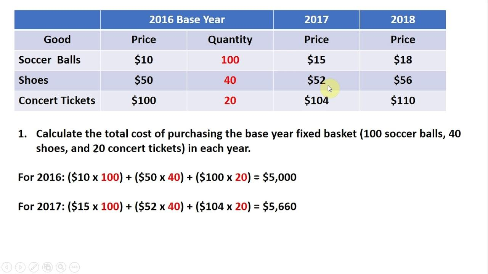

## Table of Contents

## What is a basket of goods?

A basket of goods is a collection of different products and services that people usually buy. It helps to measure the cost of living or the inflation rate in a country. By looking at the prices of these items over time, economists can see if things are getting more expensive or if people's money is worth less.

The basket of goods can include things like food, clothes, and even services like haircuts. It is important that the basket represents what a typical person buys. That way, it gives a good idea of how much it costs to live. Different countries might have different baskets because people in different places buy different things.

## Why is a basket of goods important for economic analysis?

A basket of goods is important for economic analysis because it helps economists understand how prices change over time. By looking at the prices of the items in the basket, they can see if things are getting more expensive. This is called measuring inflation. If the cost of the basket goes up, it means that people need more money to buy the same things they used to buy. This information is very useful for governments and businesses to make plans and decisions.

The basket of goods also helps to compare the cost of living in different places. If one country's basket costs more than another's, it might mean that it's more expensive to live there. This can help people decide where to live or work. It also helps companies figure out where to sell their products. By using a basket of goods, economists can get a clear picture of the economy and how it affects everyday life.

## How is the basket of goods used to calculate the Consumer Price Index (CPI)?

The Consumer Price Index, or CPI, is a way to measure how prices change over time. To calculate the CPI, economists use a basket of goods. They start by [picking](/wiki/asset-class-picking) a base year and figuring out how much the basket costs in that year. Then, they look at the cost of the same basket in later years. If the basket costs more in the later year, it means prices have gone up.

To get the CPI number, economists divide the cost of the basket in the later year by the cost of the basket in the base year. They then multiply this number by 100. For example, if the basket cost $100 in the base year and $105 in the later year, the CPI would be 105. This shows that prices have gone up by 5%. The CPI helps people understand if they need more money to buy the same things they used to buy.

## What types of goods and services are typically included in the basket of goods?

The basket of goods usually includes things that people buy every day. This can be food like bread, milk, and eggs. It also includes things like clothes, shoes, and even gas for cars. These are things that most people need to live their daily lives. The basket might also have things like soap, toothpaste, and other cleaning supplies. These are important for keeping homes and people clean.

Services are also part of the basket of goods. This can include things like haircuts, doctor visits, and even the cost of renting a home. These services are important because they help people stay healthy and have a place to live. The basket might also include the cost of going to the movies or eating out at a restaurant. These are things that people enjoy and can show how much fun costs.

The basket of goods can change over time. If people start buying different things, the basket might need to be updated. For example, if more people start using smartphones, the basket might include the cost of a phone and the monthly bill. This helps make sure the basket always shows what people are really buying.

## How often is the basket of goods updated and why?

The basket of goods is usually updated every few years. This might happen every year or every few years, depending on the country. The main reason for updating the basket is to make sure it still shows what people are buying. If people start buying new things or stop buying old things, the basket needs to change to keep up.

Updating the basket helps keep the Consumer Price Index accurate. If the basket doesn't change, it might not show the real cost of living. For example, if more people start using smartphones, the basket needs to include the cost of phones and data plans. This way, the CPI can show how prices are changing for things people actually buy. Keeping the basket up to date is important for understanding the economy and making good decisions.

## What is the difference between a fixed basket and a variable basket in CPI calculation?

A fixed basket in CPI calculation is when the list of goods and services stays the same over time. This means that once the basket is chosen, it doesn't change, even if people start buying different things. Using a fixed basket can be good because it makes it easier to compare prices from one year to the next. But, it can also be a problem because it might not show the real cost of living if people's buying habits change a lot.

A variable basket, on the other hand, changes over time. This means that the list of goods and services can be updated to match what people are actually buying. Using a variable basket can give a more accurate picture of the cost of living because it keeps up with changes in what people buy. But, it can make it harder to compare prices from one year to another because the basket itself is different.

In practice, most countries use a mix of both fixed and variable baskets. They might keep the basket mostly the same for a few years but update it every so often to make sure it still matches what people are buying. This way, they can get the benefits of both methods and have a good, accurate measure of inflation.

## How does the weighting of items in the basket affect the CPI?

The weighting of items in the basket is very important for the Consumer Price Index (CPI). It means that some things in the basket count more than others. For example, if people spend a lot of money on gas, gas will have a bigger weight in the basket. This means that if the price of gas goes up a lot, it will make the CPI go up more than if the price of something people don't buy as much, like a fancy watch, goes up.

This weighting helps the CPI show what is really happening to the cost of living. If the weights are right, the CPI will go up when the things people buy a lot of get more expensive. But if the weights are wrong, the CPI might not show the real changes in prices. That's why economists need to keep the weights up to date, so the CPI stays a good measure of inflation.

## Can you explain the substitution bias in the context of the basket of goods?

Substitution bias happens when people change what they buy because prices change, but the basket of goods doesn't change. For example, if the price of beef goes up a lot, people might start buying more chicken instead. But if the basket still counts beef the same way, it might make it look like the cost of living is going up more than it really is. This is because the basket doesn't show that people are switching to cheaper options.

This can make the Consumer Price Index (CPI) less accurate. If the basket doesn't change to match what people are really buying, it might show higher inflation than what people are actually feeling. To fix this, economists sometimes update the basket to include more of the things people are buying now. This helps make sure the CPI is a better measure of how prices are really affecting people's lives.

## How do changes in consumer behavior impact the accuracy of CPI based on the basket of goods?

Changes in consumer behavior can make the CPI less accurate if the basket of goods doesn't change too. For example, if people start buying more online and less in stores, the cost of shipping might become more important. But if the basket still focuses on store prices, it won't show the real changes in what people are spending money on. This can make the CPI show the wrong picture of how prices are changing.

To keep the CPI accurate, economists need to update the basket to match what people are really buying. If they don't, the CPI might say that prices are going up more than they really are. This is because the basket might still count things that people aren't buying as much anymore. By keeping the basket up to date, the CPI can better show what's happening with prices and help everyone understand the economy better.

## What are the challenges in maintaining a representative basket of goods across different regions?

Keeping a basket of goods that represents what people buy in different regions can be hard. People in different places buy different things. For example, people in cold places might buy more warm clothes, while people in hot places might buy more air conditioners. This means that the basket needs to change depending on where it's being used. If it doesn't, it might not show the real cost of living in those areas.

Another challenge is that prices can be different in different regions. Something might be cheap in one place but expensive in another. This makes it hard to use the same basket everywhere. Economists need to find a way to make the basket work for everyone, even though prices and what people buy can be very different. By understanding these challenges, they can make the basket more accurate and helpful for everyone.

## How do international standards influence the composition of the basket of goods?

International standards help make sure that the basket of goods is the same in different countries. This means that when economists in one country look at their basket, they can compare it with baskets from other countries. This helps them understand if prices are going up more in one place than another. It also makes it easier for businesses that sell things in many countries to see how prices are changing everywhere.

Sometimes, international groups like the International Labour Organization (ILO) give rules on what should be in the basket. These rules help make sure that the basket includes things that people all over the world buy. This can include food, clothes, and services like healthcare. By following these rules, countries can make sure their basket of goods is fair and accurate, and it helps them work together to understand the global economy better.

## What advanced statistical methods are used to refine the CPI calculation using the basket of goods?

Economists use advanced statistical methods to make the CPI calculation more accurate. One method they use is called "hedonic regression." This method helps them see how much of a price change is because the product got better, not just because it got more expensive. For example, if a new phone is more expensive but also has better features, hedonic regression can help figure out how much of the price change is because of the new features. This makes the CPI more accurate because it only counts the real price changes, not the changes from better products.

Another method is called "chain weighting." This method helps update the basket of goods more often. With chain weighting, economists can change the weights of items in the basket every time they collect new data. This means the basket can stay up to date with what people are really buying. It helps fix problems like substitution bias, where people switch to cheaper products when prices go up. By using chain weighting, the CPI can show a more accurate picture of how prices are changing over time.

## What is the Methodology of CPI Calculation?

The Consumer Price Index (CPI) calculation is a multifaceted process that begins with comprehensive data collection on prices for items in the designated basket of goods and services. This data is meticulously gathered from a variety of retail and service outlets to ensure accurate representation. Each item's price information is then weighted to reflect its relative importance in the budget of an average consumer. 

The weighting process involves assigning a proportionate significance to each category based on surveys of household expenditure patterns. This ensures that changes in the prices of more critical items have a commensurate impact on the overall CPI. The formula for calculating the weighted average price change can be expressed as:

$$

CPI = \left( \frac{\sum (P_t \times W)}{\sum (P_0 \times W)} \right) \times 100 
$$

where $P_t$ represents the price of the item in the current period, $P_0$ denotes the price in the base period, and $W$ is the weight of the item in the consumer's basket. 

After computing the price changes for individual items, these variations are aggregated into an average price change for the basket. This figure is then expressed as a percentage relative to a predefined base year to yield the CPI value. The resulting index provides a quantitative measure of inflation by comparing current price levels to those in the base year. 

Notably, the calculation of CPI presents several challenges. One significant issue is adjusting for quality changes, which requires distinguishing between price changes due to inflation and those resulting from enhancements in product quality. This adjustment ensures that the CPI reflects pure price movements devoid of value enhancements. 

Another challenge is the substitution bias, which occurs when consumers alter their purchasing behavior due to changes in relative prices, opting for less expensive alternatives that are not reflected in the fixed basket. Without adjusting for this bias, the CPI might overstate inflation by failing to account for these changes in consumer behavior. 

Addressing these challenges is crucial for maintaining the accuracy and reliability of CPI as an indicator of economic stability and inflationary trends.

## References & Further Reading

[1]: ["Consumer Price Index: Concepts, Sources and Methods"](https://www.bls.gov/opub/hom/cpi/concepts.htm) - Office for National Statistics

[2]: Bureau of Labor Statistics. ["Consumer Price Index (CPI)"](https://www.bls.gov/cpi/)

[3]: ["The Econometrics of Financial Markets"](https://press.princeton.edu/books/hardcover/9780691043012/the-econometrics-of-financial-markets) by John Y. Campbell, Andrew W. Lo, and A. Craig MacKinlay

[4]: ["Algorithmic Trading and DMA: An Introduction to Direct Access Trading Strategies"](https://www.amazon.com/Algorithmic-Trading-DMA-introduction-strategies/dp/0956399207) by Barry Johnson

[5]: ["Inflation Targeting: Lessons from the International Experience"](https://www.jstor.org/stable/j.ctv301gdr) by Ben S. Bernanke, Thomas Laubach, Frederic S. Mishkin, and Adam S. Posen