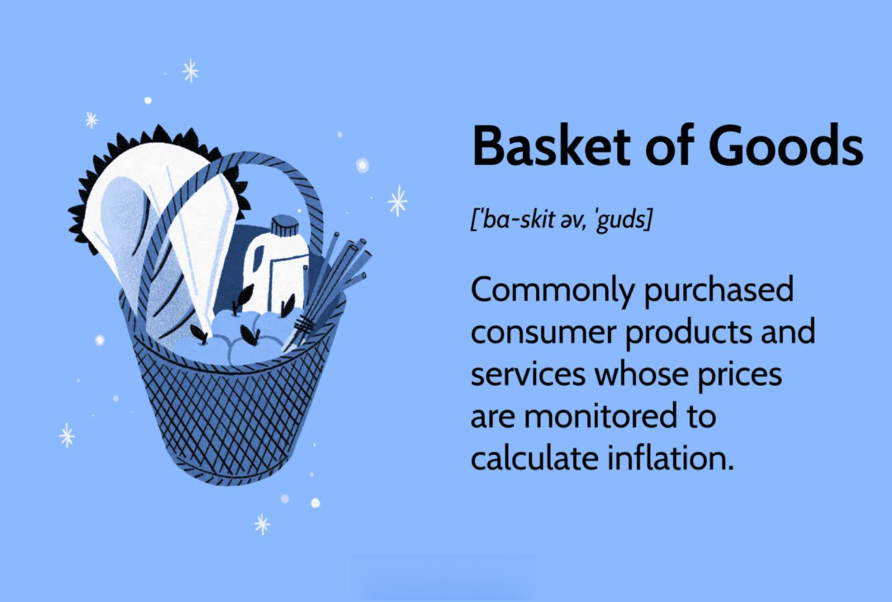

The Consumer Price Index (CPI) is a fundamental economic indicator that tracks the average change over time in the prices paid by urban consumers for a representative basket of goods and services. It serves as a critical measure for assessing inflation, allowing policymakers, investors, and businesses to make well-informed economic decisions. The CPI is designed to capture the price dynamics of a predefined set of goods and services, reflecting various consumer expenditures.

Understanding CPI is essential as it directly influences economic policy and financial strategies. Policymakers rely on CPI data to gauge inflation levels and adjust monetary policies accordingly. Investors use CPI trends to tailor investment strategies and hedge against inflation risks, while businesses monitor CPI fluctuations to predict cost changes and optimize pricing models.



The calculation of CPI is a complex process involving the collection and analysis of price data across a wide array of goods and services. This basket typically includes categories such as housing, food and beverages, medical care, and transportation. The data is then weighted based on the relative importance of each category to a typical consumer's budget, enabling a comprehensive assessment of price changes over time.

In recent years, the advent of algorithmic trading has revolutionized the use of economic indicators like CPI. Algorithmic trading platforms utilize real-time data analysis to swiftly respond to CPI announcements, leveraging market volatility for financial gains. By integrating CPI data into trading algorithms, traders can predict market movements and adjust their portfolios to optimize returns.

This article provides an in-depth exploration of the components of the CPI basket of goods, uncovers the methodology behind its calculation, and discusses the significant role that algorithmic trading plays in leveraging CPI data for financial advantage. By understanding the intricacies of CPI, readers can better appreciate its impact on economic forecasts and trading strategies.

## Table of Contents

## Understanding the CPI Basket of Goods

The Consumer Price Index (CPI) basket of goods is a curated selection of items that serve as a proxy for the consumption habits of the typical consumer. The basket is designed to capture a wide array of expenditure categories such as housing, food and beverages, apparel, transportation, medical care, recreation, education, and communication, among others. This selection ensures that the CPI accurately reflects the everyday living expenses and cost fluctuations faced by households.

To keep the CPI relevant and representative, statistical agencies meticulously update the composition of the basket. This updating process considers the evolution of consumer preferences, technological advancements, and emerging consumption trends. For instance, as new products enter the market or as societal norms shift—such as a move toward digital goods over physical ones—the basket is adjusted to include these changes. This dynamism in basket composition is crucial for maintaining the integrity and accuracy of the CPI.

The rigorous selection process for goods and services in the CPI basket involves comprehensive surveys and data analysis to ensure that the items chosen are indeed reflective of national spending patterns. This entails evaluating the frequency and context of purchases across different demographics and regions to avoid any biases that could distort the CPI's representation of the economy.

By tracking the price changes of items within the CPI basket, economists can gain valuable insights into inflationary trends and the purchasing power of the currency. The CPI functions as a critical measure of inflation by comparing the current cost of the basket to a base period. This comparison allows economists and policymakers to gauge how much more, or less, it costs over time to maintain a standard of living.

Inflation, as measured by the CPI, is indicative of the economic climate, signaling adjustments in consumer purchasing power. A rise in the CPI suggests decreasing purchasing power, whereas a drop may indicate increased affordability. Thus, the CPI not only tracks price level changes but also serves as an essential tool for economic analysis and decision-making in both the public and private sectors.

## The Methodology of CPI Calculation

The Consumer Price Index (CPI) calculation is a multifaceted process that begins with comprehensive data collection on prices for items in the designated basket of goods and services. This data is meticulously gathered from a variety of retail and service outlets to ensure accurate representation. Each item's price information is then weighted to reflect its relative importance in the budget of an average consumer. 

The weighting process involves assigning a proportionate significance to each category based on surveys of household expenditure patterns. This ensures that changes in the prices of more critical items have a commensurate impact on the overall CPI. The formula for calculating the weighted average price change can be expressed as:

$$

CPI = \left( \frac{\sum (P_t \times W)}{\sum (P_0 \times W)} \right) \times 100 
$$

where $P_t$ represents the price of the item in the current period, $P_0$ denotes the price in the base period, and $W$ is the weight of the item in the consumer's basket. 

After computing the price changes for individual items, these variations are aggregated into an average price change for the basket. This figure is then expressed as a percentage relative to a predefined base year to yield the CPI value. The resulting index provides a quantitative measure of inflation by comparing current price levels to those in the base year. 

Notably, the calculation of CPI presents several challenges. One significant issue is adjusting for quality changes, which requires distinguishing between price changes due to inflation and those resulting from enhancements in product quality. This adjustment ensures that the CPI reflects pure price movements devoid of value enhancements. 

Another challenge is the substitution bias, which occurs when consumers alter their purchasing behavior due to changes in relative prices, opting for less expensive alternatives that are not reflected in the fixed basket. Without adjusting for this bias, the CPI might overstate inflation by failing to account for these changes in consumer behavior. 

Addressing these challenges is crucial for maintaining the accuracy and reliability of CPI as an indicator of economic stability and inflationary trends.

## The Impact of CPI on Economic Decision-Making

The Consumer Price Index (CPI) plays a vital role in economic decision-making, serving as a key indicator of economic health. Central banks, such as the Federal Reserve in the United States, use CPI as a primary metric for determining monetary policy, especially in the context of setting interest rates to manage inflation. When CPI data indicates rising inflation, central banks may opt to increase interest rates to cool down the economy by making borrowing more expensive, thereby reducing consumer spending and investment. Conversely, a low or negative CPI growth might lead to [interest rate](/wiki/interest-rate-trading-strategies) cuts to spur economic activity.

In the business sphere, companies heavily rely on CPI data to anticipate and manage cost fluctuations. By analyzing CPI trends, businesses can adjust their pricing strategies accordingly to maintain profitability. For instance, if there is a significant increase in the CPI, indicating higher consumer prices, businesses might raise their product prices to cover increased costs of raw materials and other expenses. This proactive adjustment helps businesses protect their profit margins in the face of inflationary pressure.

Investors also monitor CPI trends closely, as changes can signal potential shifts in economic policy that might influence market dynamics. An unexpected rise or drop in the CPI can lead to speculation about future monetary policy decisions, influencing investor behavior and market [volatility](/wiki/volatility-trading-strategies). Understanding CPI allows investors to make informed decisions about asset allocation and risk management, thereby enhancing the robustness of their financial planning.

Moreover, CPI data is crucial in setting parameters for wage negotiations and social security adjustments. In many cases, wage contracts include cost-of-living adjustments based on CPI changes, ensuring that employee earnings keep pace with inflation. Similarly, government programs that provide social security benefits often rely on CPI data to adjust payments, maintaining the purchasing power of beneficiaries.

Comprehending the nuances and implications of CPI data is essential for policymakers, businesses, and investors alike. It aids in the formulation of more accurate economic forecasts and financial strategies, ultimately contributing to sound economic governance and sustainable growth.

## Incorporating CPI Data into Algorithmic Trading

Algorithmic trading systems heavily rely on vast datasets, including critical economic indicators such as the Consumer Price Index (CPI), to automate trade decisions with precision and speed. The integration of CPI data into trading algorithms enables these systems to anticipate and respond to market movements by assessing anticipated economic conditions. 

CPI data offers valuable insights into inflationary trends and consumer purchasing power, aspects that directly impact asset prices and yield curves. Trading algorithms utilize this information to forecast market dynamics, allowing traders to position themselves advantageously in anticipation of shifts triggered by inflation data releases. For instance, a higher-than-expected CPI release might indicate rising inflation, prompting an algorithm to adjust its strategy, such as shorting bonds or buying commodities.

The capability for real-time data analysis is paramount. Algorithmic traders can swiftly react to CPI announcements, often in milliseconds, to exploit potential market volatility. An algorithm designed for high-frequency trading ([HFT](/wiki/high-frequency-trading-strategies)) might use CPI data as a signal to execute buy or sell orders, capturing short-term price movements that follow such economic releases.

Sophisticated algorithms extend beyond short-term trades, incorporating CPI trends into broader investment strategies. By analyzing long-term CPI trends, algorithms can optimize investment portfolios to achieve balance and hedge against inflationary risks. For instance, a [machine learning](/wiki/machine-learning) model could be trained to shift asset allocations in a portfolio based on detected inflation trends as indicated by CPI data, redistributing investments from fixed-income assets to equities or real estate, which might better withstand inflation.

Understanding the nuances of CPI is crucial for both traders and financial analysts to effectively leverage these algorithms. Knowledge about seasonal adjustments, core versus headline CPI, and how different CPI components affect various asset classes is indispensable. This expertise ensures that the algorithms' design and the parameters set within them align with the underlying economic realities, rendering them more accurate and profitable.

By capturing and processing CPI data in conjunction with other economic indicators, [algorithmic trading](/wiki/algorithmic-trading) systems can make nuanced predictions about market conditions, enhancing their decision-making capabilities. These systems must be programmed to understand not just the raw CPI data, but also the implications of these data points on broader economic landscapes, thereby optimizing trading strategies accordingly.

## The Future of CPI Utilization in Trading

The integration of Consumer Price Index (CPI) data into trading strategies is poised for significant evolution as data analytics and machine learning technologies advance. With the continuous digital transformation in financial markets, the real-time processing and application of CPI data are expected to improve substantially, allowing traders to respond to market changes more swiftly and accurately.

Predictive models that utilize CPI data have the potential to revolutionize how traders anticipate economic downturns and identify investment opportunities. By analyzing historical CPI data, alongside other economic indicators, machine learning algorithms can be trained to recognize patterns that signal impending economic shifts. This approach allows for the proactive adjustment of trading strategies, potentially yielding higher returns.

Python, a popular language for data analysis and machine learning, can be employed to develop such models. For instance, a predictive model using CPI data might be implemented as follows:

```python
import pandas as pd
from sklearn.model_selection import train_test_split
from sklearn.ensemble import RandomForestRegressor

# Load CPI data and other economic indicators
data = pd.read_csv('economic_indicators.csv')
features = data.drop('target', axis=1)
target = data['target']

# Split data into training and testing sets
X_train, X_test, y_train, y_test = train_test_split(features, target, test_size=0.2, random_state=42)

# Create and train the model
model = RandomForestRegressor(n_estimators=100, random_state=42)
model.fit(X_train, y_train)

# Predict future trends
predictions = model.predict(X_test)
```

Regulatory changes and technological advancements will continue to influence how CPI data is accessed and used by traders globally. For instance, improvements in data transmission speeds and storage capabilities will make it easier to handle large datasets, while ensuring compliance with new financial regulations may necessitate adjustments to data handling and analysis processes.

By embracing these technological advancements and regulatory changes, traders and analysts can maintain a competitive edge in the fast-paced financial markets. The use of automated and sophisticated trading systems, incorporating CPI data, can lead to more informed and strategic investment decisions. This adaptability is crucial for thriving in the dynamic financial landscape, where timely and accurate economic insights are key to sustainable success.

## Conclusion

The Consumer Price Index (CPI) stands as a crucial instrument in delineating inflation patterns and shaping both economic and trading strategies. By comprehensively understanding the components and calculation methods of the CPI, stakeholders can significantly enhance their economic forecasts and analytical capabilities. The intricacies of how the CPI reflects price changes in a representative basket of goods and services are vital for formulating accurate predictions about inflation and purchasing power, which in turn influence broader economic outcomes.

Algorithmic trading, in particular, stands to substantially benefit from the effective incorporation of CPI data. With the automation and speed inherent in algorithmic trading systems, integrating CPI data can lead to the development of more effective trading strategies that leverage anticipated market movements. This integration can result in lucrative investment opportunities, especially when the data is used to predict inflationary trends and subsequently inform real-time trading decisions.

For both investors and policymakers, maintaining awareness and ability to adapt to changes in the CPI is imperative for promoting sustainable economic growth. The CPI's role as a barometer of economic health influences monetary policy decisions, business pricing strategies, and investment plans. The ability to respond to CPI fluctuations thus becomes a significant advantage in crafting responsive and resilient economic policies.

Moreover, the ongoing interplay between CPI data and trading innovation underscores the dynamic nature of contemporary financial markets. As technological advancements continue to reshape data analytics and algorithmic processes, the capacity to utilize CPI insights will remain a key [factor](/wiki/factor-investing) in staying competitive and responsive in these evolving arenas. This dynamic highlights the importance of continuous adaptation and the strategic application of economic indicators in navigating the complexities of global finance.

## References & Further Reading

[1]: ["Consumer Price Index: Concepts, Sources and Methods"](https://www.bls.gov/opub/hom/cpi/concepts.htm) - Office for National Statistics

[2]: Bureau of Labor Statistics. ["Consumer Price Index (CPI)"](https://www.bls.gov/cpi/)

[3]: ["The Econometrics of Financial Markets"](https://press.princeton.edu/books/hardcover/9780691043012/the-econometrics-of-financial-markets) by John Y. Campbell, Andrew W. Lo, and A. Craig MacKinlay

[4]: ["Algorithmic Trading and DMA: An Introduction to Direct Access Trading Strategies"](https://www.amazon.com/Algorithmic-Trading-DMA-introduction-strategies/dp/0956399207) by Barry Johnson

[5]: ["Inflation Targeting: Lessons from the International Experience"](https://www.jstor.org/stable/j.ctv301gdr) by Ben S. Bernanke, Thomas Laubach, Frederic S. Mishkin, and Adam S. Posen