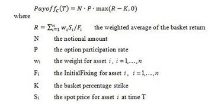

## Table of Contents

## What is a basket option?

A basket option is a type of financial option where the payoff depends on the value of a group of underlying assets, rather than just one. These assets are often combined into what's called a "basket." The basket could include stocks, commodities, currencies, or other financial instruments. The value of the basket option is determined by the overall performance of all the assets in the basket.

Basket options are useful for investors who want to manage risk or gain exposure to a variety of assets without having to buy each one separately. For example, an investor might use a basket option to bet on the overall performance of a sector, like technology or healthcare, instead of picking individual stocks. This can be more cost-effective and less risky than buying multiple individual options.

## How does a basket option differ from a single asset option?

A basket option is different from a single asset option because it depends on the value of a group of assets instead of just one. With a single asset option, you are betting on the future price of one specific stock, commodity, or currency. But with a basket option, you are looking at the combined performance of several assets. This means that the payoff of a basket option is based on how well the whole group does, not just one item.

Basket options can be a good choice if you want to spread your risk across different assets. Instead of putting all your money into one stock, you can invest in a mix of stocks, for example. This can make your investment less risky because if one asset in the basket does poorly, the others might do well and balance it out. Single asset options don't give you this kind of spread, so they can be riskier if the one asset you bet on doesn't perform well.

## What are the key components of a basket option?

The key components of a basket option include the basket itself, which is a group of different assets like stocks, commodities, or currencies. The value of the basket option depends on how these assets perform together. For example, if you have a basket of tech stocks, the option's value will go up or down based on how well those tech stocks do as a group.

Another important part is the strike price, which is the price at which the option can be used. If the total value of the basket is higher than the strike price when the option expires, you can make money. The expiration date is also crucial because it tells you when the option will end. If the basket's value is not higher than the strike price by this date, the option will be worthless.

Lastly, the type of option, whether it's a call or a put, affects how the basket option works. A call option lets you buy the basket at the strike price if it's worth more, while a put option lets you sell it if it's worth less. These components together decide if and how much money you can make from a basket option.

## What are the benefits of using basket options for investors?

Basket options are great for investors because they help spread out risk. Instead of betting on just one stock or asset, you can invest in a group of them. This means if one stock in the basket does badly, the others might do well and balance it out. This can make your investment safer because you're not putting all your eggs in one basket. It's like having a team where different players can help each other out.

Another benefit is that basket options can be cheaper and easier to manage than buying lots of single options. If you want to invest in several stocks, buying a basket option can be less expensive than buying separate options for each stock. It also saves time because you only need to keep an eye on one option instead of many. This makes it simpler for investors to get exposure to a whole sector or market without having to pick and watch every single asset.

## What are the risks associated with basket options?

Basket options can be tricky because they depend on how a whole group of assets does, not just one. If most of the assets in the basket go down, the option can lose value quickly. This means you could lose money if the basket doesn't perform well. Also, the way the assets are mixed in the basket matters a lot. If one asset takes up a big part of the basket and it does badly, it can drag down the whole basket's value.

Another risk is that basket options can be hard to understand and price right. They're more complex than options on just one asset, so it's tough to know exactly what they're worth. This can make it harder to buy and sell them at a fair price. Plus, if you're using basket options to bet on a whole sector or market, you might miss out on big gains from a single star performer because the option's value depends on the group, not just the best part of it.

## How is the value of a basket option calculated?

The value of a basket option is figured out by looking at the total value of all the assets in the basket. Each asset in the basket has a certain weight, which means some might be more important than others. For example, if a basket has 10 stocks, one stock might count for 20% of the basket's value while another only counts for 5%. To find the total value of the basket, you add up the values of all the assets, each multiplied by its weight. If the total value of the basket is higher than the strike price when the option expires, the option has value.

Calculating the value of a basket option can be tricky because it involves more math than a single asset option. You need to use a model, like the Black-Scholes model, but adjusted for multiple assets. This model takes into account things like how the prices of the assets move together, the time left until the option expires, and the expected ups and downs in the market. It's a bit like solving a puzzle where you have to think about how all the pieces fit together to get the final picture of the option's value.

## Can you provide examples of common basket options in the market?

One common type of basket option is an index option. This is an option based on a stock market index like the S&P 500 or the Dow Jones Industrial Average. Instead of betting on one company, you're betting on how a whole group of companies will do. For example, if you buy a call option on the S&P 500, you're hoping that the overall value of the 500 companies in that index will go up. This can be a good way to invest in the whole market without having to pick individual stocks.

Another example is a sector basket option. This type of option focuses on a specific part of the economy, like technology or healthcare. If you think the tech sector will do well, you might buy a call option on a basket of tech stocks. This way, you're betting on the whole sector instead of just one tech company. It can be a smart move if you believe in the growth of that sector but don't want to risk it all on one company.

Sometimes, investors use commodity basket options. These options are based on a group of commodities like oil, gold, and wheat. If you think commodity prices will go up, you might buy a call option on a basket of commodities. This can help you spread your risk across different types of commodities, so if one commodity's price falls, the others might help balance it out.

## What are the pricing models used for basket options?

Pricing basket options can be tricky because they depend on how a whole group of assets performs, not just one. The most common way to price them is by using a version of the Black-Scholes model that's been adjusted for multiple assets. This model looks at things like how the prices of the assets in the basket move together, how much time is left until the option expires, and how much the market might go up or down. It's like solving a puzzle where you need to think about how all the pieces fit together to figure out what the option is worth.

Another model that's often used is the Monte Carlo simulation. This method involves running lots of different scenarios to see how the basket might perform in the future. It's like playing out many possible futures and then averaging the results to get an idea of the option's value. This can be really helpful because it takes into account the way the different assets in the basket might affect each other, but it can also be more time-consuming and needs a lot of computer power.

## How do correlation and volatility affect the pricing of basket options?

Correlation and [volatility](/wiki/volatility-trading-strategies) play big roles in figuring out the price of basket options. Correlation is about how the prices of the different assets in the basket move together. If the assets tend to go up and down at the same time, they have a high correlation. This can make the basket option less valuable because if one asset goes down, the others might go down too, making the whole basket less likely to beat the strike price. On the other hand, if the assets don't move together much, they have a low correlation. This can make the basket option more valuable because the ups and downs of one asset might be balanced out by the others, giving the basket a better chance to do well.

Volatility is about how much the prices of the assets in the basket might change. If the assets are very volatile, meaning their prices can swing a lot, this can make the basket option more valuable. That's because there's a bigger chance that the basket's value will jump above the strike price, even if it's currently below it. But if the assets are not very volatile, their prices don't change much, and this can make the basket option less valuable because it's less likely the basket will move enough to beat the strike price. Both correlation and volatility are important pieces of the puzzle when trying to figure out how much a basket option is worth.

## What are the strategies for hedging basket options?

One way to hedge basket options is by using the assets in the basket itself. If you have a call option on a basket of stocks, you can buy some of those stocks to balance out the risk. If the basket's value goes down, the stocks you own might lose value too, but they can help cushion the blow. On the other hand, if you have a put option, you can sell some of the stocks in the basket short. This means you borrow the stocks and sell them, hoping to buy them back cheaper later. This can help protect you if the basket's value drops.

Another strategy is to use other financial products like futures or options on individual assets. For example, if your basket option is based on tech stocks, you could buy futures or options on a tech index to hedge your risk. This can help balance out any losses in your basket option if the tech sector as a whole goes down. It's like having a backup plan that kicks in if things don't go the way you hoped.

Sometimes, investors use a mix of different hedging methods to protect their basket options. They might combine buying some of the assets in the basket with buying futures or options on related indexes. This way, they can cover their bases from different angles. It's a bit like wearing both a raincoat and carrying an umbrella when you're not sure how heavy the rain will be.

## How do regulatory requirements impact the trading of basket options?

Regulatory requirements can make trading basket options more complicated. Different countries have their own rules about who can trade these options and how they need to report their trades. For example, some places might say that only big investors with a lot of money can trade basket options. This is to make sure that people know what they're doing and can handle the risk. Also, regulators might ask for a lot of information about the trades to keep an eye on the market and make sure everything is fair and safe.

These rules can also affect how much it costs to trade basket options. If there are a lot of rules to follow, it might take more time and money to make sure everything is done right. This can make the options more expensive or harder to trade. But these rules are important because they help keep the market honest and protect investors from big risks. So while they might make things a bit trickier, they're there to help keep the trading world safe and fair for everyone.

## What advanced techniques can be used to optimize the performance of a basket option portfolio?

One advanced technique to optimize a basket option portfolio is through dynamic hedging. This means changing your hedging strategy as the market changes. For example, if the stocks in your basket start to move differently than you expected, you can adjust your hedges by buying or selling more of the stocks or using other financial products like futures or options. This can help you manage risk better and make your portfolio perform better. It's like steering a boat through changing waters, always making small adjustments to stay on [course](/wiki/best-algorithmic-trading-courses).

Another technique is using advanced mathematical models to figure out the best mix of assets in your basket. These models can look at things like how the assets move together, how much they might go up or down, and how much risk you're willing to take. By using these models, you can find the best combination of assets that will give you the highest chance of making money while keeping your risk low. It's like cooking a meal where you tweak the recipe to make it taste just right, balancing different ingredients to get the best result.

## What are basket options?

A basket option is a type of exotic financial derivative with an underlying asset that comprises a collection, or basket, of various commodities, securities, or currencies. Unlike traditional single options, which relate to one underlying asset, basket options provide the right—though not the obligation—to buy or sell this group of assets collectively at a predetermined price and date. This collective trading approach allows investors to benefit from the price movements of a diversified range of assets within the basket.

These financial instruments are customized extensively to align with the specific requirements and strategies of the buyer. The customization can include specific weights assigned to each asset within the basket, allowing for tailored exposure to various sectors or geographical regions. For example, a basket option might involve a portfolio of technology stocks with differing weights, reflecting the investor's outlook or investment strategy about the technology market.

Basket options are typically traded over-the-counter (OTC), meaning they are negotiated directly between two parties rather than through a centralized exchange. This OTC trading provides greater flexibility concerning the terms and conditions of the option, including the composition of the basket, expiry date, and strike price. However, this also means that they may come with increased counterparty risk compared to exchange-traded derivatives.

The price of a basket option can be modeled using various mathematical tools, one common approach being the weighted sum of the assets' prices to account for their respective contributions to the basket. This can be represented mathematically as:

$$

\text{Basket Price} = \sum_{i=1}^n w_i \cdot S_i 
$$

where $w_i$ is the weight of the $i^{th}$ asset in the basket, and $S_i$ is the current price of the $i^{th}$ asset. Pricing such options requires sophisticated models and often involves complex calculations, particularly when considering the correlations between the assets in the basket.

The flexibility and customization of basket options make them appealing for diverse investment strategies, including hedging and speculation. By involving multiple assets, these options allow investors to spread their risk while maintaining a cohesive investment approach across different financial instruments or markets.

## References & Further Reading

[1]: Hull, J. C. (2017). ["Options, Futures, and Other Derivatives"](https://www.semanticscholar.org/paper/Options%2C-Futures%2C-and-Other-Derivatives-Hull/89bdee500c8623864fc9eb7a471546aa713acc44). Pearson Education.

[2]: Black, F., & Scholes, M. (1973). ["The Pricing of Options and Corporate Liabilities,"](https://www.cs.princeton.edu/courses/archive/fall09/cos323/papers/black_scholes73.pdf) The Journal of Political Economy, 81(3), 637-654.

[3]: Tsay, R. S. (2010). ["Analysis of Financial Time Series,"](https://onlinelibrary.wiley.com/doi/book/10.1002/9780470644560) 3rd Edition. Wiley.

[4]: Kwok, Y. K. (2008). ["Mathematical Models of Financial Derivatives,"](https://link.springer.com/book/10.1007/978-3-540-68688-0) 2nd Edition. Springer.

[5]: Lo, A. W., & MacKinlay, A. C. (1999). ["A Non-Random Walk Down Wall Street,"](https://www.jstor.org/stable/j.ctt7tccx) Princeton University Press. 

[6]: Jarrow, R. A., & Turnbull, S. M. (2000). ["Derivatives Securities,"](https://archive.org/details/derivativesecuri0000jarr) Thomson South-Western.

[7]: Merton, R. C. (1973). ["Theory of Rational Option Pricing,"](https://www.jstor.org/stable/3003143) Bell Journal of Economics and Management Science, 4(1), 141-183.