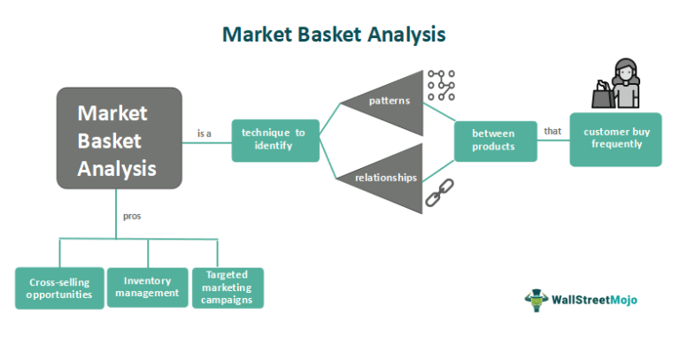

In algorithmic trading, the development of efficient and effective strategies is crucial for success. One strategy that has been gaining traction among traders is basket trading. This approach entails executing trades on a collection of securities simultaneously, rather than individually. Basket functionality integrated into algorithmic trading platforms empowers traders with the tools to automate and seamlessly manage multiple trades. This capability not only simplifies complex trading operations but also optimizes performance by offering enhanced control over a portfolio.

Basket trading is not just about executing transactions; it is about refining trading strategies to better align with specific market objectives. This article explores the concept of basket functionality in algorithmic trading. It highlights key features such as automation, risk management, and order execution algorithms that make this strategy attractive for modern traders. Additionally, it provides insights into the advantages and potential applications of basket trading across different scenarios. By understanding these elements, traders can leverage basket functionality to improve their trading performance and operational efficiency.



The article aims to offer a comprehensive perspective on how integrating basket functionality can lead to improved decision-making and strategic trading execution. Whether diversifying investments, hedging against index movements, or attempting to achieve socially responsible investment goals, basket trading proves to be a versatile tool. As technology continues to evolve, the role of basket functionality in enhancing trading operations is set to expand, offering new opportunities for traders worldwide. We will examine the impact and potential of basket functionality within algorithmic trading to provide a meaningful contribution to trading strategies.

## Table of Contents

## Understanding Basket Trading

Basket trading refers to the strategy of buying or selling a group of securities simultaneously. This approach is frequently employed to replicate or hedge against a particular index, or to achieve portfolio diversification. In basket trading, a "basket" is a collection of different financial instruments, such as stocks, bonds, or other securities, which are traded collectively rather than individually.

One of the primary advantages of basket trading lies in its ability to mimic the performance of a specific index. For example, if an investor aims to track the performance of the S&P 500, they can create a basket of stocks that matches the constituent stocks of this index. This strategy not only enables investors to hedge against fluctuations in the index but also facilitates the management of large-scale investments by reducing the transaction costs associated with purchasing or selling individual securities.

Basket functionality is particularly beneficial in algorithmic trading, where speed and efficiency are vital. Algorithms can be programmed to execute trades on entire baskets of securities in milliseconds, allowing traders to capitalize on minute price differences and market opportunities. This rapid execution minimizes the market impact, which is the adverse effect on security prices due to large order volumes.

The financial markets have become increasingly volatile and complex. Basket trading enables traders to manage multiple securities quickly and efficiently, thus balancing their portfolios in response to shifting market dynamics. For example, if a trader identifies an opportunity arising from a temporary mispricing in the market, they may use basket trading to simultaneously purchase undervalued securities and sell overvalued ones, effectively exploiting the price differential.

Basket trading also contributes to the reduction of transaction costs. By aggregating multiple trades into a single transaction, traders can benefit from lower brokerage fees and more favorable execution prices. This aggregation can be particularly advantageous for institutional investors or hedge funds that handle large orders.

Furthermore, balancing portfolios becomes more manageable and less time-consuming with basket trading. Instead of individually adjusting each asset in a portfolio, traders can shift entire baskets to maintain desired exposure levels or achieve a targeted risk-return profile. This efficiency in portfolio management is one of the key factors driving the growing popularity of basket trading among sophisticated investors.

In summary, basket trading serves as a powerful tool for traders seeking to emulate index performance, hedge risks, and streamline the execution of complex trading strategies. By utilizing basket functionality, traders can efficiently manage their portfolios, reduce costs, and mitigate market impact, setting the stage for the exploration of more intricate trading strategies in [algorithmic trading](/wiki/algorithmic-trading).

## Key Features of Basket Functionality

Basket functionality in trading platforms provides several features to enhance trading efficiency and precision. At its core, this functionality involves enabling traders to define custom baskets. A custom basket is a collection of different financial instruments, such as stocks, bonds, or exchange-traded funds, selected to implement a specific trading strategy. Traders can tailor these baskets according to their strategy requirements, such as sector concentration or market capitalization preferences, allowing for more targeted and efficient market exposure.

Another key feature is automated rebalancing, which ensures that the basket remains aligned with both market conditions and the trader's strategic objectives. As asset prices fluctuate, the relative weightings of different securities within a basket can drift from their target allocations. Automated rebalancing adjusts these allocations, maintaining the desired portfolio structure and adhering to investment mandates without manual intervention. This process can be dynamically configured to occur at predefined intervals or in response to specific market triggers, providing flexibility and responsiveness to changing market conditions.

Risk management is a critical consideration in basket trading, and advanced functionality offers traders tools to keep exposure within predefined limits. By doing so, traders can protect their portfolios against excessive [volatility](/wiki/volatility-trading-strategies). For instance, platforms may provide features that assess and manage risk through value-at-risk (VaR) calculations, scenario analysis, and stress testing. These tools help in monitoring the overall portfolio risk and ensure that the risk profile remains consistent with the trader's tolerance levels.

Order execution algorithms play an essential role in optimizing trade timing and [volume](/wiki/volume-trading-strategy), thereby minimizing slippage and enhancing execution quality. Slippage occurs when there is a difference between the expected price of a trade and the actual price. Advanced algorithms use techniques like time-weighted average price (TWAP) or volume-weighted average price (VWAP) to distribute trades over time, reducing the price impact of large orders. Additionally, smart order routing (SOR) can improve execution by directing orders to the best available prices across various venues. Here is a basic example of how one might implement a VWAP execution in Python:

```python
def vwap_execution(prices, volumes, target_quantity):
    total_volume = sum(volumes)
    weighted_prices = [prices[i] * volumes[i] for i in range(len(prices))]
    vwap_price = sum(weighted_prices) / total_volume

    executed_quantity = 0
    executed_volume = 0

    for i in range(len(prices)):
        if executed_quantity + volumes[i] <= target_quantity:
            executed_quantity += volumes[i]
            executed_volume += prices[i] * volumes[i]
        else:
            remaining_quantity = target_quantity - executed_quantity
            executed_quantity += remaining_quantity
            executed_volume += prices[i] * remaining_quantity
            break

    average_execution_price = executed_volume / executed_quantity
    return average_execution_price

# Example usage
prices = [100.0, 101.5, 102.0, 101.0]
volumes = [150, 200, 120, 180]
target_quantity = 500

execution_price = vwap_execution(prices, volumes, target_quantity)
print("Average Execution Price:", execution_price)
```

In this example, the function calculates the VWAP and executes the trades, ensuring minimal slippage and optimal timing. Such algorithmic strategies are integral in achieving efficient execution in basket trading. These features collectively contribute to the operational leverage that traders gain from utilizing basket functionality, ultimately enhancing the effectiveness of their trading activities.

## Practical Examples of Basket Functionality in Algo Trading

In today's fast-paced financial markets, basket functionality is increasingly used for executing algorithmic trading strategies. One illustrative example is a [hedge fund](/wiki/hedge-fund-trading-strategies) leveraging baskets composed of technology sector stocks to counterbalance a tech-heavy index. This approach mitigates sector-specific risk while aligning with the fund's strategic objectives. 

Another compelling use of basket functionality is observed among asset managers who focus on socially responsible investing. By constructing baskets targeting Environmental, Social, and Governance ([ESG](/wiki/esg-investing))-compliant companies, these managers can efficiently align portfolios with sustainable investment principles. This method combines ethical considerations with potential fiscal benefits, all within a streamlined trading process.

Traders often utilize basket functionality for pairs trading, where related securities are bought and sold concurrently. This strategy capitalizes on the relative movements between two correlated assets, allowing traders to exploit price discrepancies. Pairs trading requires precise execution, which basket algorithms can efficiently handle, optimizing the entry and [exit](/wiki/exit-strategy) points with predefined criteria.

Complex strategies such as index [arbitrage](/wiki/arbitrage) demonstrate advanced applications of basket functionality. Here, futures and component stocks are paired simultaneously to exploit price differentials between index futures and the actual underlying stocks. Such tasks demand precise coordination and rapid execution, which are well-supported by algorithms capable of managing large volumes with minimal slippage.

These examples underscore the versatility and breadth of basket functionality in algorithmic trading. The ability to simultaneously manage multiple assets not only enhances operational efficiency but also allows traders to implement sophisticated strategies that require timely and accurate execution. Consequently, basket functionality remains an indispensable tool for achieving diverse trading goals across varying market conditions.

## Advantages of Using Basket Functionality

Basket functionality significantly enhances trading efficiency by enabling the simultaneous execution of complex strategies. In traditional trading, executing trades across multiple securities could be cumbersome and time-consuming. With basket trading, multiple assets are bought or sold simultaneously, streamlining the process and facilitating the execution of sophisticated trading strategies. This ability to manage numerous positions at once is particularly advantageous in fast-paced trading environments where timing is critical.

One of the key benefits of basket functionality is its ability to reduce transaction costs. By optimizing trade sizes and execution timings across multiple assets, basket trading minimizes slippage and ensures that trades are executed at the most favorable prices. This is achieved through advanced order execution algorithms that calculate the optimal timing and order sizes, thus reducing the impact on the market and enhancing overall cost efficiency.

Automating routine trading tasks is another advantage of using basket functionality. Automation allows traders to focus on developing and analyzing trading strategies rather than being bogged down by the mechanical aspects of trade execution. This shift from manual to automated trading processes not only saves time but also reduces the likelihood of human error, leading to more consistent trading outcomes.

Diversification is effortlessly achieved with basket functionality. By trading a diverse group of securities in a single operation, traders can spread risk across various instruments. This diversification reduces the potential impact of adverse price movements in any single security, thereby enhancing the stability and resilience of the overall portfolio.

Finally, basket trading provides traders with better control over exposure and risk management, which is crucial for navigating volatile markets. By predefining the composition and weights of each security within a basket, traders can systematically manage their exposure to different market segments. Advanced risk management tools available within trading platforms ensure that exposure levels are maintained within predetermined limits, thereby safeguarding against excessive volatility and potential losses.

In summary, the advantages of basket functionality in algorithmic trading are multifaceted. By enhancing efficiency, reducing costs, automating tasks, achieving diversification, and improving risk control, basket trading provides a robust framework for executing complex trading strategies effectively.

## Challenges and Considerations

Basket trading, despite its numerous benefits, presents several challenges that traders must navigate. One primary concern is [liquidity](/wiki/liquidity-risk-premium), which can become a significant issue, particularly when dealing with large baskets or securities that are not frequently traded. High liquidity ensures that securities can be bought or sold without causing a substantial change in price. However, in markets with low liquidity, executing a trade in a large basket of securities may lead to wide bid-ask spreads and increased transaction costs, thereby impacting overall profitability.

Another challenge lies in the technical complexities associated with basket trading. The successful implementation of basket functionality often requires seamless integration with trading platforms and real-time data feeds. Discrepancies in data feed synchronization or integration issues can result in erroneous trades or suboptimal execution. This necessitates robust IT infrastructure and advanced technological solutions to manage data efficiently and ensure that the trading algorithms function as intended.

Managing market impact is also critical when executing basket trades. Large volume trades can influence security prices, which is especially concerning for traders aiming to maintain a market-neutral position. Algorithms designed for basket trading must optimize execution by breaking down large orders into smaller, more manageable sizes to mitigate any adverse market impacts. This tactic, often referred to as "trade slicing," helps in minimizing slippage and achieving more favorable entry and exit points.

Furthermore, alignment of strategy with basket composition is vital to meet performance goals. Traders must meticulously design their baskets to reflect the intended strategy, whether it be risk mitigation, sector exposure, or index tracking. This involves constant monitoring and adjustment to ensure that the basket remains aligned with market conditions and the trader’s overall financial objectives. Misalignment could lead to unintended exposure or deviation from the targeted investment strategy, adversely affecting the portfolio's performance.

Overall, while basket trading offers substantial advantages, overcoming these challenges requires a combination of strategic foresight, technological infrastructure, and comprehensive market analysis to ensure optimal execution and performance alignment.

## Conclusion

In algorithmic trading, basket functionality stands out as a significant asset for traders seeking to optimize their strategies. This tool offers a streamlined approach to executing trades on multiple securities simultaneously, providing substantial benefits in terms of efficiency and effectiveness. By mastering the features and understanding the real-world applications of basket functionality, traders can unlock enhanced performance and broaden the scope of their trading operations. 

One of the key advantages of basket trading is its ability to manage complex strategies seamlessly, facilitating smoother execution and cost-saving by minimizing slippage and transaction fees. Additionally, it allows traders to diversify their portfolios with ease, distributing risk across a variety of instruments to achieve more stable investment outcomes. Furthermore, through automation, traders can offload routine tasks and focus more intently on strategy development and market analysis.

While basket trading presents substantial opportunities, it also poses challenges, including liquidity constraints and integration complexities. Nevertheless, with strategic planning and precise execution, these challenges can be mitigated. As technology continues to advance, the capabilities and potential applications of basket functionality are expected to expand, providing traders with even more opportunities to enhance their trading success.

The ongoing journey of exploring and implementing basket functionality promises to bring about further advancements in trading efficiency and effectiveness. As traders continue to adapt and integrate these tools into their operations, they are better positioned to navigate the evolving landscape of financial markets, ultimately driving greater success in their trading endeavors.

## References & Further Reading

[1]: Chan, E. P. (2008). ["Quantitative Trading: How to Build Your Own Algorithmic Trading Business."](https://github.com/ftvision/quant_trading_echan_book) Wiley Finance.

[2]: Lopez de Prado, M. (2018). ["Advances in Financial Machine Learning."](https://www.amazon.com/Advances-Financial-Machine-Learning-Marcos/dp/1119482089) Wiley.

[3]: Jansen, S. (2020). ["Machine Learning for Algorithmic Trading: Second Edition."](https://www.amazon.com/Machine-Learning-Algorithmic-Trading-alternative/dp/1839217715) Packt Publishing.

[4]: Aronson, D. R. (2006). ["Evidence-Based Technical Analysis: Applying the Scientific Method and Statistical Inference to Trading Signals."](https://www.amazon.com/Evidence-Based-Technical-Analysis-Scientific-Statistical/dp/0470008741) Wiley.

[5]: Kissell, R. (2013). ["The Science of Algorithmic Trading and Portfolio Management."](https://www.sciencedirect.com/book/9780124016897/the-science-of-algorithmic-trading-and-portfolio-management) Academic Press.