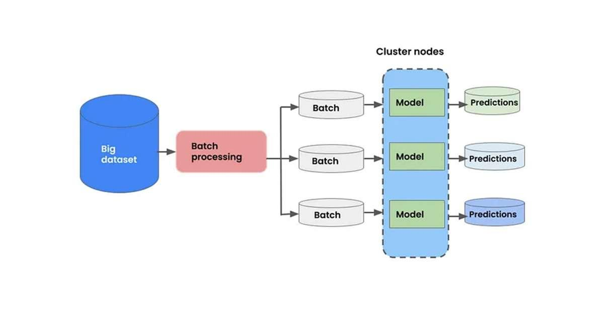

## Table of Contents

## What is batch inference in machine learning?

Batch inference in machine learning is a process where a model makes predictions on a large set of data all at once. Imagine you have a big pile of photos and you want to know what's in each one. Instead of looking at each photo one by one, you could sort through them all at the same time. This is like batch inference, where the model processes many data points together, which can be more efficient than handling them one at a time.

This method is particularly useful when you need to make predictions on a large dataset, like recommending products to thousands of users or analyzing weather patterns across a country. By processing data in batches, the model can use the computer's resources more effectively, often leading to faster results. For example, if you're using a machine learning model to predict house prices, you could feed it data about many houses at once and get all the predictions back in one go, saving time and computational power.

## How does batch inference differ from real-time inference?

Batch inference and real-time inference are two different ways to use a machine learning model to make predictions. Batch inference is like cooking a big meal for a party. You prepare all the food at once and serve it to everyone together. In machine learning, this means you take a large set of data, like a bunch of photos or customer records, and run them through the model all at once to get predictions. This is good when you have a lot of data and you're not in a hurry to get the results right away.

Real-time inference, on the other hand, is like cooking a meal for someone who is hungry right now. You make the food quickly and serve it as soon as it's ready. In machine learning, this means you take one piece of data at a time and get a prediction right away. This is useful when you need immediate results, like when a user is waiting for a recommendation on a website or when a self-driving car needs to make quick decisions on the road. The key difference is that batch inference is slower but can handle large amounts of data efficiently, while real-time inference is faster but works with one data point at a time.

## What are the typical use cases for batch inference?

Batch inference is often used when you need to process a lot of data but don't need the results right away. For example, a company might use batch inference to predict how much stock they need to order for next month. They take all their sales data, run it through the model, and get predictions for each product. This way, they can plan their inventory without rushing, and it's more efficient because the computer can work on all the data at once.

Another common use case is in generating reports or analytics. Imagine a health organization that wants to analyze patient data to find trends in diseases. They can collect data from many patients, run it through a model to predict health risks, and then use these predictions to create detailed reports. This helps them understand patterns over time and plan better healthcare strategies. Batch inference is great for these kinds of tasks because it can handle large datasets and provide comprehensive insights without needing instant results.

## What are the advantages of using batch inference over other methods?

Batch inference has several advantages when you're working with big piles of data. One big plus is that it can be more efficient. When you run a bunch of data through a model all at once, the computer can use its power better. It's like doing laundry - washing a full load at once uses less energy per piece of clothing than washing each item separately. This means you can get predictions for a lot of data faster and with less work from the computer.

Another advantage is that batch inference is great for tasks where you don't need answers right away. For example, if a store wants to figure out how much of each product to order for next month, they can use batch inference to look at all their sales data at once. This way, they can plan their inventory without rushing, and it's more efficient because the computer can work on all the data together. It's perfect for jobs like generating reports or analyzing trends over time, where you want to take your time to get a good, thorough look at the data.

## How can batch inference be implemented in a machine learning pipeline?

To implement batch inference in a [machine learning](/wiki/machine-learning) pipeline, you start by gathering all the data you need to make predictions on. This could be customer data, images, or any other type of data. Once you have your data ready, you organize it into batches. Each batch is a group of data points that the model will process together. You then load your trained model, which is the set of rules that the computer learned from past data. You feed each batch of data into the model, and the model gives you predictions for all the data in that batch at once. This process is repeated for all the batches until you have predictions for your entire dataset.

After you get the predictions, you need to save them somewhere useful. This could be in a database, a file, or even sent to another part of your system for further analysis or action. For example, if you're using batch inference to predict how much stock to order, you might save the predictions in a system that helps with inventory management. The key to making batch inference work well in a pipeline is to make sure your data is organized and your model is ready to go. This way, you can process large amounts of data efficiently and get useful insights without needing to wait for each prediction one by one.

## What are the common tools and frameworks used for batch inference?

When setting up batch inference, you might use tools like Apache Spark, which is great for processing big piles of data. Spark can handle data in batches and is often used with machine learning libraries like MLlib. Another popular choice is TensorFlow, which has tools for running models on large datasets. TensorFlow's tf.data API helps you organize your data into batches, making it easy to feed them into your model. If you're working with Python, you might also use libraries like scikit-learn, which has functions for batch processing and can work well with other tools in your pipeline.

For more complex setups, you might look at frameworks like Apache Beam, which can handle data processing across different systems. Beam works well with Google Cloud Dataflow, making it easier to run batch inference in the cloud. If you're using a cloud service like Amazon Web Services, you might use Amazon SageMaker for batch inference. SageMaker can take your model and run it on large datasets, saving the predictions in a place where you can use them later. These tools and frameworks help make batch inference smoother and more efficient, whether you're working on your own computer or in the cloud.

## How do you prepare data for batch inference?

To prepare data for batch inference, you start by gathering all the data you need. This could be from different sources like databases, files, or even other systems. Once you have all your data together, you need to clean it up. This means fixing any missing or wrong information, and making sure all the data is in the same format. For example, if you're predicting house prices, you might need to make sure all the dates are in the same format and all the prices are in the same currency.

After cleaning the data, you organize it into batches. Each batch is a group of data points that the model will process together. You might use tools like Apache Spark or TensorFlow to help with this. For example, in TensorFlow, you could use the `tf.data` API to create batches. Once your data is in batches, you need to make sure it's in a format that your model can understand. This might mean turning text into numbers or resizing images. By the end of this process, your data should be ready to be fed into your model for batch inference.

## What are the scalability considerations when deploying batch inference?

When deploying batch inference, one of the main things to think about is how well your system can handle a lot of data. If you have a huge amount of data, you need to make sure your computer or cloud service can process it all without slowing down too much. This is called scalability. You might need to use tools like Apache Spark or cloud services like Amazon SageMaker to help with this. These tools can split up the work across many computers, so even if you have a lot of data, it can still be processed quickly.

Another important thing to consider is how you store and move your data. If your data is too big to fit on one computer, you might need to use a distributed storage system. This means your data is spread out across different places, and you need a way to bring it all together when it's time for batch inference. Also, think about how often you need to run batch inference. If it's every day or every hour, you need to make sure your system can keep up with that schedule without getting overwhelmed. By planning carefully and using the right tools, you can make sure your batch inference setup can grow with your needs.

## How can performance be optimized in batch inference processes?

To optimize performance in batch inference processes, you can start by making sure your data is organized well. This means cleaning up your data and putting it into batches that are the right size. If your batches are too big, it might take too long to process them. If they're too small, you might not be using your computer's power as well as you could. You can use tools like Apache Spark or TensorFlow to help with this. For example, in TensorFlow, you might use the `tf.data` API to create batches that are just the right size for your model.

Another way to boost performance is by using the right hardware. If you have a lot of data, you might need to use more than one computer to process it all. This is called distributed computing, and tools like Apache Spark can help with that. Also, using special chips like GPUs can make your model run faster. GPUs are good at doing a lot of calculations at the same time, which is perfect for batch inference. By choosing the right tools and hardware, you can make sure your batch inference runs smoothly and quickly, even with a lot of data.

## What metrics should be monitored during batch inference?

When you're running batch inference, it's important to keep an eye on how long it takes to process all your data. This is called the processing time, and it tells you if your setup is working efficiently. If the processing time is too long, you might need to adjust the size of your batches or use more powerful hardware. Another thing to watch is the throughput, which is how many predictions you can make in a certain amount of time. High throughput means your system is working well and can handle a lot of data quickly.

You should also check for any errors that happen during the process. Errors can slow things down and mess up your predictions, so it's good to know if they're happening and why. Memory usage is another important metric. If your system is using too much memory, it might slow down or even crash. Keeping an eye on these metrics helps you make sure your batch inference is running smoothly and giving you the best results possible.

## How does batch inference handle model versioning and updates?

When you use batch inference, handling model versioning and updates is important to make sure you're always using the best version of your model. Imagine you have different versions of a recipe book, and you want to use the latest one to cook a big meal. In batch inference, you can keep track of different versions of your model by saving each new version with a unique name or number. This way, when you run batch inference, you can choose which version of the model to use. If you update your model and want to use the new version, you just need to make sure you're pointing to the right one before you start processing your data.

Updating a model during batch inference can be tricky, but it's doable. Let's say you've finished cooking with one recipe, and then you get a new, better recipe. You wouldn't want to start over, but you might want to use the new recipe for the next batch. In batch inference, you can set up a system where you can switch to a new model version between batches. This means you can keep processing your data with the old model until you're ready to switch, and then use the new model for the rest of the data. By doing this, you can keep improving your predictions without having to redo everything.

## What are the advanced techniques for improving batch inference efficiency?

To improve batch inference efficiency, one key technique is to use parallel processing. This means you can split your data into smaller chunks and process them at the same time on different computers or processors. Tools like Apache Spark are great for this because they can handle big data and spread the work across many machines. By doing this, you can make your batch inference run much faster. Another technique is to use hardware like GPUs, which are really good at doing a lot of calculations quickly. If you use a GPU, your model can process data in batches much faster than with a regular CPU.

Another advanced technique is to optimize how you load and preprocess your data. If you can load your data into memory quickly and preprocess it efficiently, you can speed up the whole batch inference process. For example, using caching can help by keeping frequently used data in a fast memory space. You can also use techniques like data compression to make your data smaller and easier to move around. By focusing on these parts of the pipeline, you can make sure your batch inference runs smoothly and quickly, even with a lot of data.