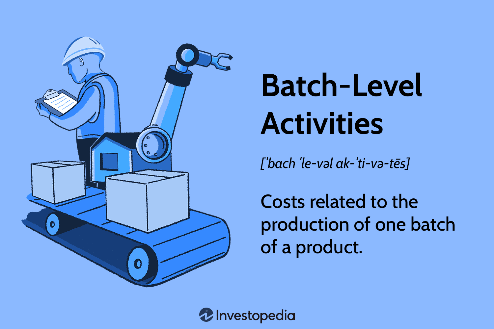

## Table of Contents

## What are batch-level activities?

Batch-level activities are actions that companies do when they make a group of products, not just one. These activities happen every time a new batch is started, no matter how many items are in the batch. For example, setting up machines or checking the quality of a batch are batch-level activities. They are important because they help make sure all the products in the batch are good and meet the standards.

These activities are different from unit-level activities, which happen for each single product, and from facility-level activities, which are needed to keep the whole factory running. Batch-level activities are important for managing costs because they show how much it costs to make a batch of products. By understanding these costs, a company can decide if it's better to make products in big batches or small ones, and how to price their products to cover these costs.

## How do batch-level activities differ from unit-level and product-level activities?

Batch-level activities are things a company does when making a group of products, not just one. They happen every time a new batch starts, like setting up machines or checking the quality of the batch. These activities are important because they help make sure all the products in the batch are good. They are different from unit-level activities, which are done for each single product. For example, if you're making cookies, putting the dough on the tray is a unit-level activity because it's done for each cookie.

Product-level activities are different from batch-level activities because they are done for all the products of one type, no matter how many batches are made. For example, designing a new type of cookie or doing market research for that type of cookie are product-level activities. These activities help make sure the product is good and will sell well. Batch-level activities, on the other hand, focus on making sure each batch of the product is made correctly.

Understanding the difference between these activities helps companies manage their costs better. Batch-level activities show how much it costs to make a batch of products, while unit-level activities show the cost for each item. Product-level activities show the cost of developing and supporting a whole product line. By knowing these costs, a company can decide the best way to make and price their products.

## Can you provide examples of batch-level activities in manufacturing?

In manufacturing, batch-level activities are things that happen every time a new group of products is made. For example, when a factory starts making a new batch of cookies, they have to set up the machines. This means cleaning the machines, adjusting them to make the right size and shape of cookies, and making sure they are ready to go. Another batch-level activity is quality control. Before the cookies go out to stores, the factory checks a few cookies from the batch to make sure they taste good and look right.

Another example of a batch-level activity is the preparation of materials. When making a new batch of paint, the factory has to mix the right colors and amounts of paint. This mixing happens every time a new batch is started, not for each can of paint. Also, when making a batch of car parts, the factory might need to change the tools on the machines to make the right parts. This tool change is a batch-level activity because it happens for the whole batch, not for each part.

## What is the historical origin of batch-level activities?

Batch-level activities started a long time ago when people began making things in bigger groups instead of one at a time. Back in the old days, like during the Industrial Revolution in the 1700s and 1800s, factories started making things like cloth and metal parts in batches. This was a big change because before that, people made things by hand, one at a time. When factories came along, they needed to set up machines and check the quality of the whole batch, not just one item. This is how batch-level activities started.

As time went on, factories got better at making things in batches. By the 1900s, companies were using batch-level activities more and more to save time and money. For example, car factories would set up machines to make a batch of car parts, and then they would check the whole batch to make sure everything was right. This way of working became very important in manufacturing because it helped companies make more things faster and cheaper. Batch-level activities became a big part of how factories worked, and they are still used today in many industries.

## How have batch-level activities evolved over time?

Batch-level activities have changed a lot since they first started. Back in the old days, during the Industrial Revolution, factories began making things in batches instead of one at a time. This was a big change because it meant setting up machines and checking the quality of the whole batch, not just one item. At first, these activities were pretty simple, like getting the machines ready and making sure the batch was good enough to sell. Over time, as factories got better at making things, batch-level activities became more important and more detailed.

As we moved into the 20th century, batch-level activities got more advanced. Factories started using new technology and better ways to set up machines and check quality. For example, car factories would set up machines to make a batch of car parts, and then they would use special tools to check if everything was right. This made batch-level activities more efficient and helped companies make more things faster and cheaper. Today, batch-level activities are still very important in many industries, but they use even more advanced technology and methods to make sure batches are made well and meet high standards.

## What are the key benefits of implementing batch-level activities in a production process?

Implementing batch-level activities in a production process helps factories work better and save money. When factories make things in batches, they can set up machines once for the whole batch instead of setting them up for each item. This saves time and makes the process smoother. Also, by checking the quality of the whole batch at once, factories can make sure all the products are good without having to check each one separately. This helps them find problems faster and fix them before sending the products out.

Another big benefit is that batch-level activities help factories manage their costs better. By knowing how much it costs to set up a batch and check its quality, factories can figure out the best way to make their products. They can decide if it's better to make big batches or small ones, and how to price their products to cover these costs. This helps them make more money and stay competitive in the market.

## What challenges are commonly associated with managing batch-level activities?

Managing batch-level activities can be tough because it involves setting up machines and checking the quality of the whole batch. This means that if something goes wrong during the setup, it can affect the whole batch. For example, if a machine is not set up right, it might make all the products in the batch bad. Also, checking the quality of a batch can take a lot of time and effort. If the factory misses a problem, the whole batch might have to be thrown away, which is a big waste of money.

Another challenge is figuring out the best size for a batch. If the batch is too big, it can take a long time to make and might tie up a lot of money in materials and storage. But if the batch is too small, the factory might have to set up machines and check quality too often, which can also be expensive. It's a tricky balance to find the right size that saves time and money without causing problems.

## How can batch-level activities be optimized for efficiency?

To make batch-level activities more efficient, factories can use better technology and smarter planning. For example, using machines that can be set up quickly and easily can save a lot of time. Also, using special tools to check the quality of the batch faster and more accurately can help. Factories can also use computers to plan when to make batches so they don't have to wait too long between them. This way, they can keep making products without wasting time.

Another way to make batch-level activities more efficient is by training workers well. When workers know exactly what to do and how to do it, they can set up machines and check quality faster and better. Factories can also try to make batches the right size. If the batch is too big, it can take a long time to make and might tie up a lot of money. But if it's too small, the factory might have to set up machines and check quality too often. Finding the right size can help save time and money.

## What role do batch-level activities play in cost accounting and activity-based costing?

Batch-level activities are important in cost accounting because they help companies figure out how much it costs to make a group of products. When a factory makes things in batches, they have to set up machines and check the quality of the whole batch. These costs are different from the costs of making each single item, which are called unit-level costs. By knowing the costs of batch-level activities, companies can see how much it costs to make a batch and use this information to price their products correctly. This helps them make sure they are making enough money to cover all their costs.

In activity-based costing, batch-level activities are used to assign costs more accurately to products. This method looks at all the different activities that go into making a product, including setting up machines and checking quality for each batch. By understanding how much these activities cost, companies can see which products are really expensive to make and which ones are not. This helps them make better decisions about what to make and how to price their products. It also helps them find ways to save money by making their batch-level activities more efficient.

## How do technological advancements impact batch-level activities?

Technological advancements have made batch-level activities a lot easier and faster. New machines can be set up quickly and can switch between making different batches without much trouble. This means factories can make more batches in less time. Also, new technology like computers and special tools can check the quality of a batch faster and more accurately. This helps factories find problems quickly and fix them before the products go out to stores. With these new technologies, factories can save time and money on batch-level activities.

These advancements also help factories plan their batches better. Computers can help figure out the best time to make batches so that the factory doesn't have to wait too long between them. This keeps the factory running smoothly and helps them make more products. Also, new technology can help train workers better so they know exactly what to do when setting up machines and checking quality. This makes the whole process more efficient and helps factories make high-quality products in a shorter amount of time.

## What are the best practices for monitoring and improving batch-level activities?

To monitor and improve batch-level activities, factories need to keep a close eye on how long it takes to set up machines and check the quality of each batch. They can use computers to track this information and see if there are any patterns or problems. For example, if setting up machines is taking too long, the factory might need to train workers better or use new machines that are easier to set up. Also, by checking the quality of batches regularly, factories can find and fix problems quickly. This helps them make sure all the products in the batch are good and meet the standards.

To make batch-level activities better, factories should always be looking for new ways to do things. This could mean using new technology to set up machines faster or using special tools to check the quality of batches more accurately. Factories can also try to make batches the right size. If a batch is too big, it can take a long time to make and might tie up a lot of money. But if it's too small, the factory might have to set up machines and check quality too often. Finding the right size can help save time and money. By always trying to improve, factories can make their batch-level activities more efficient and keep making high-quality products.

## Can you discuss case studies where batch-level activities significantly impacted business performance?

In one case, a car parts factory in Michigan used batch-level activities to improve their business. They noticed that setting up machines for each batch took a long time and often caused delays. So, they decided to use new machines that could be set up quickly and easily. They also trained their workers to do the setup faster. After making these changes, the factory could make more batches in less time. This helped them make more car parts and sell them faster, which made their business more successful.

Another example is a food company in California that makes cookies. They used to check the quality of each batch by hand, which took a lot of time and sometimes missed problems. They decided to use special machines to check the quality of the batches faster and more accurately. This helped them find and fix problems quickly, so they didn't have to throw away as many cookies. By improving their batch-level activities, the company saved money and could make more cookies to sell, which made their business perform better.

## What are Batch-Level Activities in Cost Accounting?

Batch-level activities are an integral component of Activity-Based Costing (ABC), focusing on expenses incurred per batch of production. This approach breaks down costs into specific activities that occur at each batch stage, such as machine setups, maintenance, and quality testing. These activities are not directly proportional to the number of units produced but are incurred whenever a batch is processed.

Machine setups, for instance, involve setting operational parameters, arranging tools, and calibrating equipment to meet specific production requirements. Maintenance within batch-level activities refers to routine checks and adjustments to prevent equipment malfunctions, ensuring seamless production continuity. Quality tests are conducted to verify that products meet pre-defined standards before proceeding further in the production cycle.

The adoption of batch-level costing within ABC allows manufacturers to ascertain fixed costs associated with each batch. This clarity helps in detailing the per-batch expenses that remain consistent regardless of the batch size, assisting in precise breakeven analysis and profitability assessments. For instance, if a factory incurs a setup cost of $500 for each batch, the cost remains $500 whether the batch consists of 100 or 1,000 units.

$$
\text{Cost per Unit} = \frac{\text{Total Batch-Level Costs}}{\text{Number of Units in the Batch}}
$$

This methodology enables a more nuanced understanding of cost allocation, as it distinguishes between variable costs dependent on production [volume](/wiki/volume-trading-strategy) and fixed costs incurred per batch. As a result, businesses can better control and manage these expenses, identifying patterns and inefficiencies that may not be evident through traditional costing methods.

Moreover, detailed batch-level analysis aids in streamlining operations by spotlighting inefficiencies and potential areas for cost reduction. For instance, if a significant portion of batch-level costs is attributed to frequent machine setups, a company might consider investments in flexible manufacturing systems or reduced setup times to improve cost control. This level of detail is invaluable in modern manufacturing contexts, where production processes are more complex and varied.

Overall, batch-level activities within the ABC framework provide robust tools for enhancing operational efficiency and financial performance, making them essential for contemporary manufacturing environments. By offering detailed insights into the cost components of each production batch, companies can make informed decisions to optimize resources, streamline production, and ultimately enhance profitability.

## References & Further Reading

[1]: Kaplan, R. S., & Anderson, S. R. (2007). ["Time-Driven Activity-Based Costing: A Simpler and More Powerful Path to Higher Profits."](https://www.hbs.edu/ris/Publication%20Files/04-045_d62528d4-7931-4ea1-a205-d9683c639d6e.pdf) Harvard Business Review Press.

[2]: Cooper, R., & Kaplan, R. S. (1991). ["Profit Priorities from Activity-Based Costing."](https://hbr.org/1991/05/profit-priorities-from-activity-based-costing) Harvard Business Review.

[3]: Cokins, G. (2006). ["Activity-Based Cost Management: An Executive's Guide."](https://www.wiley.com/en-us/Activity+Based+Cost+Management%3A+An+Executive%27s+Guide-p-9780471443285) Wiley.

[4]: ["Algorithmic Trading: Winning Strategies and Their Rationale"](https://www.amazon.com/Algorithmic-Trading-Winning-Strategies-Rationale-ebook/dp/B00CY5HC0U) by Ernest P. Chan

[5]: ["Cost Accounting: A Managerial Emphasis"](https://www.amazon.com/Cost-Accounting-Managerial-Emphasis-15th/dp/0133803813) by Charles T. Horngren, Srikant M. Datar, and Madhav V. Rajan

[6]: Turney, P. B. B. (2005). ["Common Cents: How to Succeed with Activity-Based Costing and Activity-Based Management."](https://archive.org/details/commoncentshowto0000turn) McGraw-Hill.