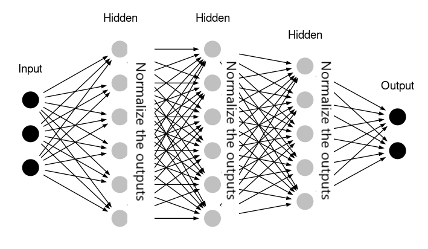

## Table of Contents

## What is Batch Normalization in the context of machine learning?

Batch Normalization is a technique used in machine learning to make training neural networks faster and more stable. It works by normalizing the inputs to each layer of the network, which helps to reduce the internal covariate shift. Internal covariate shift is when the distribution of inputs to a layer changes as the parameters of the previous layers change during training. By normalizing these inputs, Batch Normalization helps to keep the distribution of inputs consistent, which can lead to faster and more reliable training.

The process of Batch Normalization involves calculating the mean and variance of the inputs to a layer across a mini-batch of data. These statistics are used to normalize the inputs, and then the normalized values are scaled and shifted using learned parameters. This allows the model to maintain the representational power of the layer while still benefiting from the normalization. The formula for Batch Normalization can be expressed as $$ \hat{x} = \frac{x - \mu_B}{\sqrt{\sigma_B^2 + \epsilon}} $$ and $$ y = \gamma \hat{x} + \beta $$, where $$ \mu_B $$ and $$ \sigma_B^2 $$ are the mean and variance of the mini-batch, $$ \epsilon $$ is a small constant to avoid division by zero, and $$ \gamma $$ and $$ \beta $$ are learned parameters.

In practice, Batch Normalization is often applied after the activation function in a neural network, although it can also be applied before the activation. It has become a standard technique in many deep learning architectures because it helps to reduce the sensitivity of the model to the initial random weights and the learning rate, making the training process more robust and less prone to overfitting.

## Why was Batch Normalization introduced?

Batch Normalization was introduced to solve some common problems that happen when training deep neural networks. One big problem is called internal covariate shift. This is when the data going into each layer of the network keeps changing as the network learns. This can make training slower and harder. Batch Normalization helps by making sure the data going into each layer stays the same, which helps the network learn faster and better.

The way Batch Normalization works is by taking the data in small groups, called mini-batches, and calculating the average and spread of the data in each group. Then it adjusts the data so that it has a standard average and spread. This is done using the formula $$ \hat{x} = \frac{x - \mu_B}{\sqrt{\sigma_B^2 + \epsilon}} $$ and then $$ y = \gamma \hat{x} + \beta $$. Here, $$ \mu_B $$ and $$ \sigma_B^2 $$ are the average and spread of the mini-batch, $$ \epsilon $$ is a small number to avoid dividing by zero, and $$ \gamma $$ and $$ \beta $$ are numbers the network learns to adjust the data. By doing this, Batch Normalization makes the network easier to train and less sensitive to the starting weights and learning rate.

## How does Batch Normalization work during training?

During training, Batch Normalization helps make the [neural network](/wiki/neural-network) learn better by normalizing the data going into each layer. It does this by looking at a small group of data, called a mini-batch, and figuring out the average and spread of the data in that group. Then, it adjusts the data so that it has a standard average and spread. The formula for this is $$ \hat{x} = \frac{x - \mu_B}{\sqrt{\sigma_B^2 + \epsilon}} $$, where $$ \mu_B $$ is the average of the mini-batch, $$ \sigma_B^2 $$ is the spread, and $$ \epsilon $$ is a tiny number to make sure we don't divide by zero. After normalizing, the data is then scaled and shifted using two more numbers, $$ \gamma $$ and $$ \beta $$, which the network learns during training. The final step is $$ y = \gamma \hat{x} + \beta $$.

This process happens for each mini-batch during training. By doing this, Batch Normalization makes sure the data going into each layer stays consistent, even as the network learns and changes. This helps the network train faster and more smoothly. It also makes the network less sensitive to the starting weights and the learning rate, which can make training more reliable and easier to manage.

## What are the benefits of using Batch Normalization in neural networks?

Batch Normalization helps make training neural networks faster and more stable. It does this by normalizing the data going into each layer, which keeps the data consistent even as the network learns and changes. This is important because when the data going into a layer keeps changing, it can make training slower and harder. Batch Normalization solves this problem by using the average and spread of a small group of data, called a mini-batch, to adjust the data. The formula for this is $$ \hat{x} = \frac{x - \mu_B}{\sqrt{\sigma_B^2 + \epsilon}} $$ and then $$ y = \gamma \hat{x} + \beta $$. This makes the network learn faster and more smoothly.

Another benefit of Batch Normalization is that it makes the network less sensitive to the starting weights and the learning rate. This means that the network is easier to train and less likely to have problems like overfitting. When the network is less sensitive to these things, it's easier to find the right settings for training, which can save time and effort. Overall, Batch Normalization helps make training neural networks more reliable and easier to manage, which is why it's used a lot in [deep learning](/wiki/deep-learning).

## Can Batch Normalization help with the problem of vanishing gradients?

Batch Normalization can help with the problem of vanishing gradients. Vanishing gradients happen when the gradients, which are used to update the weights of the neural network, get smaller and smaller as they go through the layers. This makes it hard for the network to learn, especially for the layers at the start of the network. Batch Normalization helps by normalizing the data going into each layer, which makes the gradients more consistent and less likely to vanish. This means that the network can learn better and faster, even for deep networks with many layers.

The way Batch Normalization works is by calculating the average and spread of the data in a small group, called a mini-batch. It then adjusts the data so that it has a standard average and spread. The formula for this is $$ \hat{x} = \frac{x - \mu_B}{\sqrt{\sigma_B^2 + \epsilon}} $$, where $$ \mu_B $$ is the average of the mini-batch, $$ \sigma_B^2 $$ is the spread, and $$ \epsilon $$ is a tiny number to make sure we don't divide by zero. After normalizing, the data is then scaled and shifted using two more numbers, $$ \gamma $$ and $$ \beta $$, which the network learns during training. The final step is $$ y = \gamma \hat{x} + \beta $$. By doing this, Batch Normalization helps keep the gradients stable, which can prevent the vanishing gradient problem and make training easier.

## How does Batch Normalization affect the training process and model performance?

Batch Normalization helps make training neural networks faster and more stable. It does this by normalizing the data going into each layer, which keeps the data consistent even as the network learns and changes. When the data going into a layer keeps changing, it can make training slower and harder. Batch Normalization solves this problem by using the average and spread of a small group of data, called a mini-batch, to adjust the data. The formula for this is $$ \hat{x} = \frac{x - \mu_B}{\sqrt{\sigma_B^2 + \epsilon}} $$ and then $$ y = \gamma \hat{x} + \beta $$. This makes the network learn faster and more smoothly.

Another way Batch Normalization helps is by making the network less sensitive to the starting weights and the learning rate. This means that the network is easier to train and less likely to have problems like overfitting. When the network is less sensitive to these things, it's easier to find the right settings for training, which can save time and effort. Overall, Batch Normalization helps make training neural networks more reliable and easier to manage, which is why it's used a lot in deep learning.

## What are the differences between Batch Normalization and other normalization techniques?

Batch Normalization is different from other normalization techniques because it normalizes the data in small groups, called mini-batches, during training. This means it calculates the average and spread of the data in each mini-batch and then adjusts the data to have a standard average and spread. The formula for this is $$ \hat{x} = \frac{x - \mu_B}{\sqrt{\sigma_B^2 + \epsilon}} $$ and then $$ y = \gamma \hat{x} + \beta $$. This helps the network learn faster and more smoothly because it keeps the data going into each layer consistent, even as the network learns and changes.

Other normalization techniques, like Layer Normalization and Instance Normalization, work differently. Layer Normalization normalizes across all the neurons in a layer, which means it calculates the average and spread for each example across all the features in a layer. This can be helpful for networks where the size of the input can change, like in recurrent neural networks. Instance Normalization, on the other hand, normalizes each example in a batch separately, which is useful for tasks like style transfer in image processing. Each of these techniques has its own use and can be better for different types of networks and tasks.

## How is Batch Normalization applied during inference?

During inference, Batch Normalization works a bit differently than during training. Instead of using the average and spread of the current mini-batch, it uses the average and spread that were calculated during training across all the mini-batches. These are called the moving average and moving variance. This way, the normalization stays the same for every example, which makes the predictions more consistent and reliable. The formula for Batch Normalization during inference is $$ \hat{x} = \frac{x - \mu}{\sqrt{\sigma^2 + \epsilon}} $$, where $$ \mu $$ and $$ \sigma^2 $$ are the moving average and moving variance, and $$ \epsilon $$ is a small number to avoid dividing by zero. After normalizing, the data is scaled and shifted using the learned parameters $$ \gamma $$ and $$ \beta $$ with the formula $$ y = \gamma \hat{x} + \beta $$.

Using the moving average and moving variance during inference makes sure that the normalization is the same for every example. This is important because it helps the model make good predictions. If we used the mini-batch [statistics](/wiki/bayesian-statistics) like we do during training, the predictions could be different depending on the examples in the mini-batch, which would make the model less reliable. By using the statistics from training, Batch Normalization helps make the model's predictions more consistent and accurate.

## What are some common challenges or limitations when using Batch Normalization?

Batch Normalization can make training neural networks faster and more stable, but it also has some challenges. One big challenge is that it can make the network take up more memory and need more time to train. This is because Batch Normalization needs to keep track of the average and spread of the data in each mini-batch, which takes up extra space and time. Another challenge is that Batch Normalization can make the network less good at working with small datasets. This is because it needs a lot of data to calculate good averages and spreads, and if there isn't enough data, the normalization might not work well.

Another limitation of Batch Normalization is that it can be hard to use with some types of networks, like recurrent neural networks (RNNs). RNNs process data in sequences, and the data in each sequence can be different, which can make it hard to use Batch Normalization. Also, Batch Normalization can sometimes make the network less good at learning certain types of patterns in the data. This is because the normalization can change the data in ways that make it harder for the network to see the important patterns. Overall, while Batch Normalization can help a lot, it's important to think about these challenges and limitations when deciding to use it.

## How can Batch Normalization be implemented in popular deep learning frameworks like TensorFlow or PyTorch?

In TensorFlow, implementing Batch Normalization is straightforward using the `tf.keras.layers.BatchNormalization` layer. You can add this layer to your model after the convolutional or dense layer but before the activation function. During training, TensorFlow automatically calculates the mean and variance of each mini-batch and updates the moving averages for use during inference. Here's a simple example of how to implement Batch Normalization in a TensorFlow model:

```python
import tensorflow as tf

model = tf.keras.Sequential([
    tf.keras.layers.Dense(64, activation='relu', input_shape=(10,)),
    tf.keras.layers.BatchNormalization(),
    tf.keras.layers.Dense(32, activation='relu'),
    tf.keras.layers.BatchNormalization(),
    tf.keras.layers.Dense(1, activation='sigmoid')
])

model.compile(optimizer='adam', loss='binary_crossentropy', metrics=['accuracy'])
```

In PyTorch, Batch Normalization can be implemented using the `torch.nn.BatchNorm1d` or `torch.nn.BatchNorm2d` modules, depending on whether you're working with 1D or 2D data. You would typically add a Batch Normalization layer after a linear or convolutional layer but before the activation function. PyTorch also handles the calculation of the mini-batch statistics and the moving averages during training and inference. Here's an example of how to implement Batch Normalization in a PyTorch model:

```python
import torch
import torch.nn as nn

class SimpleModel(nn.Module):
    def __init__(self):
        super(SimpleModel, self).__init__()
        self.fc1 = nn.Linear(10, 64)
        self.bn1 = nn.BatchNorm1d(64)
        self.fc2 = nn.Linear(64, 32)
        self.bn2 = nn.BatchNorm1d(32)
        self.fc3 = nn.Linear(32, 1)

    def forward(self, x):
        x = torch.relu(self.bn1(self.fc1(x)))
        x = torch.relu(self.bn2(self.fc2(x)))
        x = torch.sigmoid(self.fc3(x))
        return x

model = SimpleModel()
criterion = nn.BCELoss()
optimizer = torch.optim.Adam(model.parameters())
```

## What are some advanced techniques or variations of Batch Normalization?

One advanced technique is called Group Normalization. Instead of using mini-batches like Batch Normalization, Group Normalization splits the channels of the input into smaller groups and normalizes each group separately. This can be helpful for tasks where the size of the mini-batch can change or when working with small datasets. The formula for Group Normalization is similar to Batch Normalization but calculates the mean and variance across each group. This helps keep the data consistent, even when the mini-batch size changes, making it a good choice for some types of networks.

Another variation is Layer Normalization. Unlike Batch Normalization, which normalizes across the mini-batch, Layer Normalization normalizes across all the neurons in a layer. This means it calculates the mean and variance for each example across all the features in a layer. This can be helpful for networks where the size of the input can change, like in recurrent neural networks. The formula for Layer Normalization is $$ \hat{x} = \frac{x - \mu}{\sqrt{\sigma^2 + \epsilon}} $$, where $$ \mu $$ and $$ \sigma^2 $$ are the mean and variance calculated across the layer, and $$ \epsilon $$ is a small number to avoid dividing by zero. After normalizing, the data is scaled and shifted using learned parameters, just like in Batch Normalization.

Instance Normalization is another variation that's useful for tasks like style transfer in image processing. Instead of normalizing across the mini-batch or across the layer, Instance Normalization normalizes each example in the batch separately. This means it calculates the mean and variance for each channel of each example. The formula for Instance Normalization is similar to Batch Normalization but uses the statistics of each instance. This helps the network focus on the style of the image rather than the content, which is important for style transfer tasks.

## How does Batch Normalization interact with other regularization techniques in neural networks?

Batch Normalization can work well with other regularization techniques like dropout and L2 regularization. Dropout helps prevent overfitting by randomly turning off some of the neurons during training. When you use Batch Normalization with dropout, you usually put the Batch Normalization layer before the dropout layer. This way, Batch Normalization can normalize the data going into the dropout layer, which can make the training process more stable. L2 regularization, also known as weight decay, adds a penalty to the loss function based on the size of the weights. Batch Normalization can help make the network less sensitive to the learning rate, which can make it easier to use L2 regularization without worrying about the weights getting too big or too small.

Another regularization technique that can be used with Batch Normalization is [data augmentation](/wiki/data-augmentation). Data augmentation makes the training data bigger by adding small changes to the examples, like rotating or flipping images. Batch Normalization can help the network learn better from this bigger dataset by keeping the data going into each layer consistent, even as the data changes. This can make the network more robust and less likely to overfit. Overall, Batch Normalization can work well with other regularization techniques, making the network easier to train and more reliable.

## References & Further Reading

[1]: Sergey Ioffe and Christian Szegedy. ["Batch Normalization: Accelerating Deep Network Training by Reducing Internal Covariate Shift."](https://arxiv.org/abs/1502.03167) arXiv preprint arXiv:1502.03167, 2015.

[2]: Gao Huang, Zhuang Liu, Laurens van der Maaten, and Kilian Q. Weinberger. ["Densely Connected Convolutional Networks."](https://arxiv.org/abs/1608.06993) arXiv preprint arXiv:1608.06993, 2018.

[3]: Jimmy Lei Ba, Jamie Ryan Kiros, and Geoffrey E. Hinton. ["Layer Normalization."](https://arxiv.org/abs/1607.06450) arXiv preprint arXiv:1607.06450, 2016.

[4]: Kaiming He, Xiangyu Zhang, Shaoqing Ren, and Jian Sun. ["Deep Residual Learning for Image Recognition."](https://arxiv.org/abs/1512.03385) arXiv preprint arXiv:1512.03385, 2015.

[5]: Yuxin Wu and Kaiming He. ["Group Normalization."](https://arxiv.org/abs/1803.08494) arXiv preprint arXiv:1803.08494, 2018.