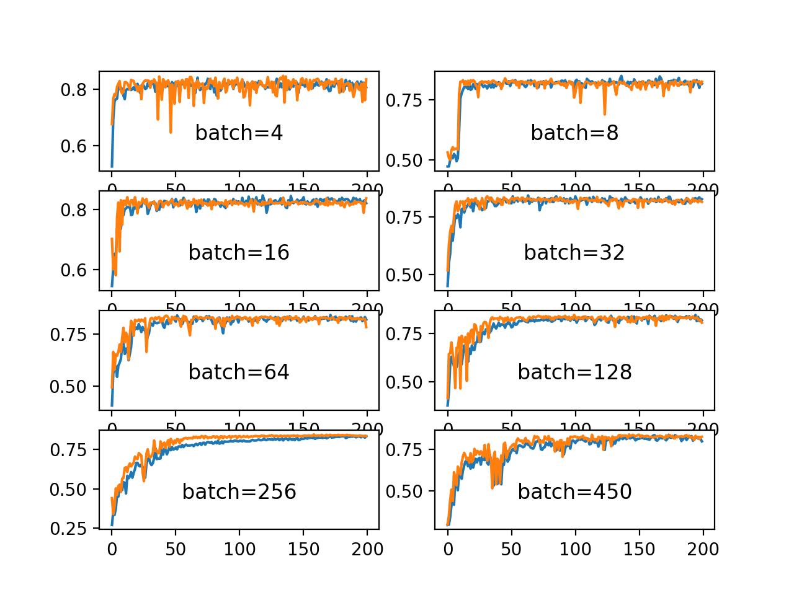

## Table of Contents

## What is batch size in machine learning?

In machine learning, batch size refers to the number of training examples used in one iteration of model training. When a model is being trained, the data is often divided into smaller groups called batches. The batch size determines how many examples are processed before the model's internal parameters are updated. For example, if you have 1000 training examples and you choose a batch size of 100, the model will process the data in 10 batches of 100 examples each.

Choosing the right batch size can impact the training speed and the model's performance. A smaller batch size means more frequent updates to the model, which can lead to faster convergence but might also make the training process noisier. On the other hand, a larger batch size can lead to more stable updates and potentially better utilization of hardware like GPUs, but it might slow down the convergence. The optimal batch size often depends on the specific problem, the amount of data, and the computational resources available.

## Why is batch size important in training machine learning models?

Batch size is important in training machine learning models because it affects how the model learns from the data. When you use a smaller batch size, the model updates its parameters more often. This can help the model learn faster because it gets more chances to adjust based on the data it sees. However, smaller batches can also make the learning process a bit noisy, meaning the model might jump around a lot before settling on the best solution.

On the other hand, using a larger batch size means the model updates its parameters less often. This can make the learning process more stable because the model sees more examples before making changes. But, it might take longer for the model to learn because it gets fewer chances to adjust. The right batch size depends on the problem you're solving, how much data you have, and the computer you're using. Finding the best batch size can help your model learn well and use your computer's power effectively.

## How does batch size affect the training time of a model?

The batch size you choose can change how long it takes to train your model. When you use a smaller batch size, your model gets updated more often. This can make the training go faster because the model can learn from the data more quickly. But, using a smaller batch size can also make your computer work harder because it has to do more updates. So, while the model might learn faster, the actual training time might not be shorter because the computer is doing more work.

On the other hand, using a larger batch size means your model gets updated less often. This can make the training slower because the model has fewer chances to learn from the data. But, a larger batch size can make your computer work more efficiently because it can handle bigger chunks of data at once. This can lead to faster training times if your computer has enough power to process the larger batches quickly. So, finding the right batch size is important to make sure your model trains well and doesn't take too long.

## What is the difference between batch size, mini-batch size, and stochastic gradient descent?

Batch size, mini-batch size, and stochastic gradient descent are all related to how a [machine learning](/wiki/machine-learning) model learns from data. Batch size is the number of training examples used in one update of the model. If you use all your data at once, that's called batch gradient descent. Mini-batch size is a smaller number of examples used in each update, usually between 1 and the total number of examples. This is called mini-batch gradient descent. Stochastic gradient descent (SGD) is when you use just one example at a time to update the model.

The choice between these methods affects how the model learns. Batch gradient descent can be more stable because it uses all the data at once, but it can be slow and might need a lot of memory. Mini-batch gradient descent is a good middle ground; it's faster than batch gradient descent because it updates more often, and it's more stable than SGD because it uses more than one example at a time. SGD updates the model very often, which can make it learn quickly, but it can also make the learning process noisy because it's based on just one example at a time.

## How does batch size influence the model's generalization performance?

Batch size can impact how well a model generalizes to new data. When you use a smaller batch size, the model gets updated more often. This can help the model learn the patterns in the data better because it has more chances to adjust. But, using a smaller batch size can also make the model's learning a bit noisy. This means the model might not always find the best solution because it's getting updated too often. So, a smaller batch size might lead to better generalization if it helps the model find the right patterns, but it can also make the model overfit if it focuses too much on the noise in the data.

On the other hand, using a larger batch size means the model gets updated less often. This can make the learning process more stable because the model sees more examples before making changes. A larger batch size can help the model see the bigger picture and avoid overfitting to small details in the data. But, if the batch size is too large, the model might not get enough chances to adjust to the data, which can lead to underfitting. So, finding the right batch size is important to help the model generalize well to new data without overfitting or underfitting.

## What are the common batch sizes used in practice?

In practice, common batch sizes often range from 32 to 256. These sizes are popular because they work well with many types of models and datasets. A batch size of 32 is often used because it's small enough to update the model frequently, which can help the model learn quickly. On the other hand, a batch size of 256 is larger and can make the training more stable and efficient, especially if you have a powerful computer.

Sometimes, people use even smaller batch sizes, like 16 or 8, especially when they have less data or want the model to learn very quickly. But using such small batch sizes can make the training process a bit noisy. On the other hand, some people use larger batch sizes, like 512 or 1024, especially when they have a lot of data and a powerful computer. But using such large batch sizes can make the model learn more slowly because it gets updated less often.

## How can you choose an optimal batch size for a specific model?

Choosing the right batch size for your model depends on a few things like how much data you have, what kind of problem you're solving, and how powerful your computer is. If you have a lot of data and a strong computer, you might want to try a larger batch size like 256 or 512. This can make your model learn more smoothly and use your computer's power well. But, if you have less data or a weaker computer, a smaller batch size like 32 or 64 might be better. This can help your model learn faster because it gets updated more often, but it might also make the learning a bit noisy.

One good way to find the best batch size is to try different sizes and see how your model does. You can start with a common size like 32 or 64 and then try bigger or smaller sizes to see what works best. You can measure how well your model is doing by looking at things like how quickly it learns and how well it can predict new data. Sometimes, you might need to try a few different batch sizes before you find the one that works best for your specific model and problem.

## What are the effects of batch size on memory usage during training?

When you train a machine learning model, the batch size you choose can change how much memory your computer needs. A bigger batch size means your computer has to hold more data in its memory at once. This can be a problem if your computer doesn't have a lot of memory, because it might not be able to handle the large batches. For example, if you have a dataset with a lot of examples and you choose a batch size of 512, your computer might need a lot of memory to process all those examples at once.

On the other hand, using a smaller batch size can help if your computer doesn't have much memory. A smaller batch size means your computer only has to hold a little bit of data at a time, which can make it easier to train the model. But, using a smaller batch size might make the training take longer because the model gets updated more often. So, finding the right batch size is important to make sure your model trains well without using too much memory.

## How does batch size impact the convergence rate of a model?

Batch size can change how quickly a model learns, which we call the convergence rate. When you use a smaller batch size, the model gets updated more often. This means it can learn faster because it has more chances to adjust based on the data. But, using a smaller batch size can also make the learning a bit noisy. This means the model might jump around a lot before it finds the best solution. So, a smaller batch size can help the model learn quickly, but it might not always find the best answer right away.

On the other hand, using a larger batch size means the model gets updated less often. This can make the learning more stable because the model sees more examples before it makes changes. A larger batch size can help the model learn more smoothly and might help it find a good solution faster. But, if the batch size is too big, the model might not get enough chances to adjust to the data, which can make it learn more slowly. So, finding the right batch size is important to help the model learn quickly and find the best solution.

## Can batch size affect the stability of training, and if so, how?

Yes, batch size can affect how stable the training of a model is. When you use a smaller batch size, the model gets updated more often. This can make the training a bit noisy because the model is adjusting based on just a few examples at a time. Imagine if you're trying to find your way in a dark room by feeling around with your hands. If you move your hands a lot and quickly, you might bump into things more often and feel like you're not getting anywhere. That's what can happen with a small batch size - the model might jump around a lot before it finds the right path.

On the other hand, using a larger batch size can make the training more stable. With a larger batch size, the model sees more examples before it makes changes. This is like feeling around the room with bigger, slower movements. You might find your way more smoothly because you're getting a better sense of where things are. But, if the batch size is too big, the model might not get enough chances to adjust to the data, which can make it learn more slowly. So, finding the right batch size is important to help the model learn smoothly and find the best solution.

## What are the considerations for adjusting batch size in distributed training environments?

When training a model on multiple computers, or in a distributed environment, the batch size you choose can affect how well and how fast your model learns. A bigger batch size can make better use of the power of all the computers working together. This is because each computer can handle a part of the batch, and they can all work at the same time. But, if the batch size is too big, it might use up too much memory on each computer, which can slow things down or even make the training stop.

Finding the right batch size in a distributed setup is important to make sure your model learns well and uses the computers' power effectively. You might need to try different batch sizes to see what works best. A good starting point could be to use a batch size that's bigger than what you would use on just one computer, but not so big that it uses up all the memory. This way, the model can learn smoothly and quickly without running into problems with memory or speed.

## How does batch size interact with learning rate in optimizing model performance?

Batch size and learning rate work together to help a model learn. The learning rate is like how big of a step the model takes when it updates itself. If the learning rate is too big, the model might take steps that are too large and miss the best solution. If it's too small, the model might take tiny steps and take a long time to learn. The batch size affects how often the model updates itself. A smaller batch size means the model updates more often, so it might need a smaller learning rate to keep the steps small and steady. A larger batch size means the model updates less often, so it might be okay with a larger learning rate because the steps are more spread out.

Finding the right balance between batch size and learning rate is important for the model to learn well. If you use a small batch size and a large learning rate, the model might jump around a lot and not learn smoothly. On the other hand, if you use a large batch size and a small learning rate, the model might take too long to learn because the steps are too small and too far apart. A good way to find the best combination is to try different batch sizes and learning rates and see what works best for your model and data.

## References & Further Reading

[1]: Goodfellow, I., Bengio, Y., & Courville, A. (2016). ["Deep Learning"](https://link.springer.com/article/10.1007/s10710-017-9314-z). MIT Press.

[2]: Smith, L. N.. (2017). ["Cyclical Learning Rates for Training Neural Networks."](https://arxiv.org/abs/1506.01186) 2017 IEEE Winter Conference on Applications of Computer Vision (WACV), 464-472.

[3]: Keskar, N. S., Mudigere, D., Nocedal, J., Smelyanskiy, M., & Tang, P. T. P. (2016). ["On Large-Batch Training for Deep Learning: Generalization Gap and Sharp Minima"](https://arxiv.org/abs/1609.04836). arXiv preprint arXiv:1609.04836.

[4]: Masters, D., & Luschi, C. (2018). ["Revisiting Small Batch Training for Deep Neural Networks."](https://arxiv.org/abs/1804.07612) arXiv preprint arXiv:1804.07612.

[5]: Bottou, L. (2010). ["Large-Scale Machine Learning with Stochastic Gradient Descent"](https://link.springer.com/chapter/10.1007/978-3-7908-2604-3_16). Proceedings of COMPSTAT'2010. 177-186.