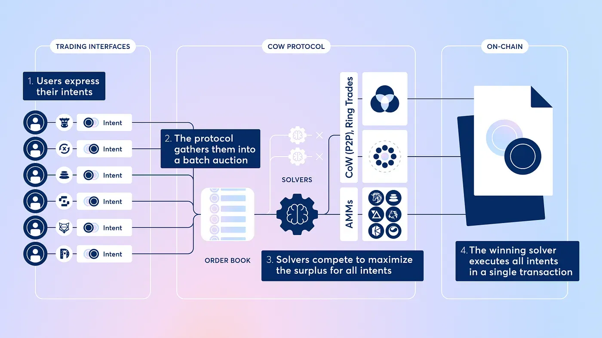

## Table of Contents

## What is batch trading?

Batch trading is a way of buying and selling stocks where all the orders are collected over a certain period of time and then processed together at once. Instead of trading happening continuously throughout the day, all the trades are grouped into batches and executed at specific times. This method is used in some stock markets to help make trading more efficient and fair for everyone.

For example, in a batch trading system, if you want to buy or sell a stock, you would place your order during a set time period. Once that period ends, all the orders that were placed are matched up and executed at the same time. This can help reduce the impact of rapid price changes and make sure that all orders are treated equally, no matter when they were placed within the batch period.

## What is continuous trading?

Continuous trading is a way of buying and selling stocks where trading happens all the time during the market's open hours. Instead of waiting for a specific time like in batch trading, you can place your order and it gets processed right away. This means that the prices of stocks can change quickly because people are always buying and selling.

This type of trading is common in many big stock markets around the world. It lets people trade whenever they want during the day, which can be good for those who want to react quickly to news or changes in the market. But it can also make the market more unpredictable because prices can go up and down a lot in a short time.

## How does batch trading differ from continuous trading?

Batch trading and continuous trading are two different ways to buy and sell stocks. In batch trading, all the orders to buy or sell stocks are collected over a set period of time. Then, at a specific time, all those orders are matched up and processed together. This means that if you want to trade, you have to wait until the batch time to see if your order goes through. Batch trading can make things more fair because everyone's order is treated the same, no matter when it was placed within the batch period.

On the other hand, continuous trading lets you buy and sell stocks anytime during the market's open hours. Your order is processed right away, so you don't have to wait. This can be good if you want to trade quickly, especially if something important happens that changes the stock's price. But it can also make the market more unpredictable because prices can change a lot in a short time as people keep trading all day.

## What are the advantages of batch trading for beginners?

Batch trading can be really helpful for beginners because it makes the trading process simpler and less stressful. When you're just starting out, it can be hard to keep up with how fast prices change in continuous trading. But with batch trading, all the orders are put together and done at the same time. This means you don't have to worry about prices going up and down a lot while you're trying to make a decision. It's like having a little break to think things through before your order goes through.

Another advantage for beginners is that batch trading can be fairer. In continuous trading, if you're a bit slow, someone else might get a better price before you. But in batch trading, everyone's order is treated the same, no matter when it was placed during the batch period. This levels the playing field and gives beginners a better chance to get a good deal without feeling rushed or outmatched by more experienced traders.

## What are the benefits of continuous trading for experienced traders?

Continuous trading is great for experienced traders because it lets them react quickly to news and changes in the market. If something important happens, like a company announcing good or bad news, experienced traders can buy or sell right away. This means they can take advantage of new information faster than if they had to wait for a batch time. They can also use strategies that need quick decisions, like buying a stock when its price drops a little and selling it when it goes up again.

Another benefit is that continuous trading gives experienced traders more control over their trades. They can watch the market all day and choose the best times to buy or sell. This is important for traders who use complex strategies that depend on timing. They can also use tools like stop-loss orders, which automatically sell a stock if its price falls too much, to manage their risks better. Overall, continuous trading lets experienced traders be more flexible and use their skills to make the most of the market.

## Can you explain the process of order matching in batch trading?

In batch trading, all the orders to buy or sell stocks are collected during a specific time period. This time period is called the batch period. When the batch period ends, all the orders that were placed are put together and sorted. The system looks at all the buy orders and all the sell orders and tries to match them up. For example, if someone wants to buy a stock at a certain price, the system will look for someone who wants to sell that stock at the same or a lower price.

Once the system finds matching orders, it decides the price at which the trades will happen. This price is usually the one that allows the most trades to happen. For example, if there are many people wanting to buy at $10 and many people wanting to sell at $10, then $10 might be the price chosen. After the price is decided, all the matching orders are executed at the same time. This means that everyone who placed an order during the batch period finds out if their trade went through and at what price, all at once.

## How does price discovery occur in continuous trading?

In continuous trading, price discovery happens all the time because people are buying and selling stocks throughout the day. When someone wants to buy a stock, they might offer a certain price. If someone else agrees to sell at that price, the trade happens, and that price becomes part of the information used to figure out the stock's value. As more people buy and sell, the price can go up or down based on what everyone thinks the stock is worth at that moment. This ongoing buying and selling helps the market find the best price for the stock.

Sometimes, news or events can change what people think about a stock very quickly. For example, if a company announces good news, more people might want to buy the stock, pushing the price up. If bad news comes out, more people might want to sell, making the price go down. All these trades happening one after another help the market keep up with the latest information and adjust the stock's price accordingly. This way, continuous trading helps make sure the price of a stock reflects what people think it's worth right now.

## What impact does batch trading have on market volatility?

Batch trading can help reduce market [volatility](/wiki/volatility-trading-strategies). This is because all the trades happen at the same time instead of all day long. When trades are done in batches, the prices don't change as quickly as they do in continuous trading. This means that if a lot of people want to sell a stock, the price might not drop as fast because the orders are all processed together. It's like everyone gets a chance to see where the price is going to be before they decide to buy or sell.

But batch trading can also lead to some big price changes at the times when the batches are processed. If a lot of people want to buy or sell at the same time, the price can jump a lot when the batch is done. This can make the market seem a bit more unpredictable at those specific times. Still, overall, batch trading can make the market calmer because it slows down how fast prices can change.

## How does continuous trading affect liquidity in the market?

Continuous trading makes the market more liquid. This means it's easier for people to buy and sell stocks whenever they want during the trading day. Because trades happen all the time, there are always people ready to buy or sell. This helps keep the market active and makes it easier for people to get in and out of their investments quickly.

But continuous trading can also make the market less predictable. Prices can change a lot because people are always trading. If a lot of people want to sell a stock at the same time, the price can go down quickly. And if many people want to buy, the price can go up fast. This means that while it's easier to trade, the prices can be more up and down, which can affect how easy it is to buy or sell at a good price.

## What are the technological requirements for implementing batch trading systems?

To set up a batch trading system, you need a strong computer system that can handle a lot of orders at the same time. This system needs to be able to collect all the orders during the batch period and then sort them quickly. It should also be able to match up the buy and sell orders and decide on the best price for everyone. The system needs to be reliable so it doesn't crash when it's processing all the trades at once. This means having good servers and backup systems to make sure everything works smoothly.

Another important part of a batch trading system is the software that runs it. This software needs to be able to handle the batch process well, making sure all the orders are treated fairly. It should also be easy for people to use, so they can place their orders without any trouble. The software needs to be secure, too, to keep all the trading information safe. Overall, the technology needs to be fast, reliable, and secure to make batch trading work well.

## How do regulatory frameworks differ for batch and continuous trading?

Regulatory frameworks for batch trading and continuous trading have some big differences. Batch trading systems usually have rules that make sure all orders are treated the same way. This means the rules focus on making sure the batch process is fair and that everyone gets a chance to trade at the same time. Regulators might set specific times for when batches happen and make sure the system can handle all the orders without crashing. They also check that the prices are set in a way that's fair for everyone.

On the other hand, continuous trading systems need rules that keep the market stable and fair all day long. Since trades happen all the time, the rules need to stop too much up-and-down movement in prices. Regulators might set limits on how much the price can change in a short time or make rules about how quickly orders can be processed. They also need to make sure the system can handle a lot of trades without slowing down or crashing, and that there are ways to stop bad trading practices, like people trying to cheat the system.

## What advanced strategies can be employed in continuous trading to optimize returns?

In continuous trading, experienced traders can use a strategy called "[day trading](/wiki/day-trading-spy)" to try to make money from small changes in stock prices during the day. They buy a stock when they think the price will go up and sell it quickly when it does. This can be done many times in one day. Day traders often use charts and other tools to guess where the price might go next. They might also use "stop-loss orders" to automatically sell a stock if it starts to lose too much value, which helps them manage their risk.

Another strategy is "swing trading," where traders hold onto a stock for a few days or weeks, trying to catch bigger price moves. They look for patterns in the stock's price over time and try to buy when they think the price will start going up and sell when they think it's about to go down. Swing traders need to be good at reading the market and understanding how news and events can affect stock prices. Both day trading and swing trading need a lot of practice and a good understanding of the market to work well.

## References & Further Reading

[1]: Securities and Exchange Commission. ["Algorithmic Trading: Overview, Pros and Cons"](https://www.sec.gov/rules-regulations/exchange-delistings/1-08056)

[2]: Hasbrouck, J. (2007). ["Empirical Market Microstructure: The Institutions, Economics, and Econometrics of Securities Trading"](https://academic.oup.com/book/52241). Oxford University Press.

[3]: Harris, L. (2003). ["Trading and Exchanges: Market Microstructure for Practitioners"](https://www.amazon.com/Trading-Exchanges-Market-Microstructure-Practitioners/dp/0195144708). Oxford University Press.

[4]: Aldridge, I. (2013). ["High-Frequency Trading: A Practical Guide to Algorithmic Strategies and Trading Systems"](https://www.amazon.com/High-Frequency-Trading-Practical-Algorithmic-Strategies/dp/1118343506). Wiley.

[5]: Gould, M.D., Porter, M.A., Williams, S., McDonald, M., Fenn, D.J., & Howison, S.D. (2013). ["Limit Order Books"](https://arxiv.org/abs/1012.0349). Quantitative Finance, 13(11), pp. 1709-1742.