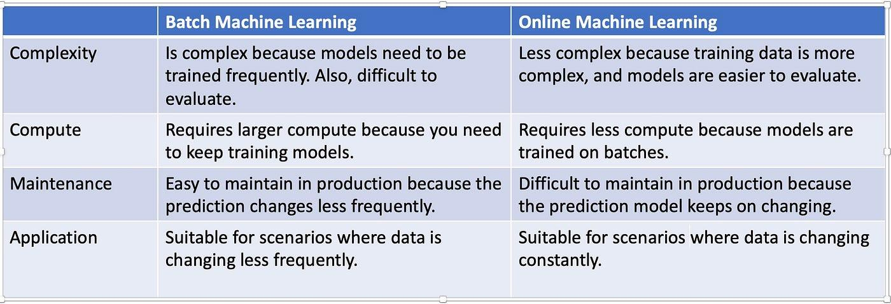

## Table of Contents

## What is batch machine learning?

Batch machine learning is a type of machine learning where the model is trained using all the available data at once. This means that you collect a large amount of data, and then you use this entire dataset to train your model. Once the training is done, the model is ready to make predictions or classify new data. This method is often used when you have a fixed dataset and you want to build a model that performs well on that specific data.

Batch machine learning can be time-consuming and resource-intensive because it requires processing all the data at once. However, it is very effective for creating stable and accurate models, especially when the data doesn't change frequently. For example, if you are training a model to recognize handwritten digits, you might use a large batch of images to train your model, and then use it to predict new handwritten digits. This approach is commonly used in scenarios where data is not continuously streaming in, and you can afford to wait for the model to be fully trained before using it.

## How does batch machine learning differ from online machine learning?

Batch machine learning and online machine learning are two different ways to train a model. In batch machine learning, you gather all your data first and then train your model using the entire dataset at once. This means you might wait a long time for the model to finish training, but once it's done, it's ready to use. Batch learning is good when you have a big, fixed set of data and you don't need to update your model very often.

On the other hand, online machine learning, also called incremental learning, trains the model one piece of data at a time as it comes in. This means the model can start making predictions right away and can keep learning from new data as it arrives. Online learning is useful when you have data coming in continuously, like in real-time applications, and you need your model to adapt quickly to new information.

Both methods have their own advantages. Batch learning can be more accurate because it uses all the data at once, but it can be slow and might not adapt well to new data. Online learning can adapt quickly to new data but might be less accurate at first because it starts with less information. Choosing between them depends on your specific needs, like how fast you need your model to start working and how often your data changes.

## What are the typical use cases for batch machine learning?

Batch [machine learning](/wiki/machine-learning) is often used when you have a big set of data that doesn't change much. For example, if you want to train a model to recognize pictures of cats and dogs, you might collect thousands of pictures and use them all at once to train your model. This method works well because you can take your time to make sure the model learns everything from the data before you start using it. It's like studying for a test with all your notes spread out in front of you, so you can learn everything thoroughly before the exam.

Another common use case for batch machine learning is in analyzing historical data. If a company wants to predict future sales based on past sales data, they might use batch learning to train a model on years of sales records. This way, the model can learn from all the historical data at once and make accurate predictions. It's useful for things like predicting stock prices or understanding customer behavior over time, where the data is already collected and you want to make the best use of it.

## What are the advantages of using batch machine learning?

Batch machine learning has several advantages. One big advantage is that it can be very accurate. When you use all your data at once to train your model, it gets to see everything and can learn from it all. This means the model can make better predictions because it has a complete picture of the data. For example, if you're trying to predict the weather, using all the historical weather data at once can help your model understand patterns better than if you trained it a little bit at a time.

Another advantage of batch machine learning is that it's easier to manage. Once you have all your data ready, you can set the model to train and then wait for it to finish. You don't need to worry about new data coming in while the model is training, which can make things simpler. This is especially helpful if you're working with a big team or if you need to make sure the model is as good as it can be before you start using it. Batch learning is like baking a cake: you gather all your ingredients, mix them together, and then let it bake until it's done.

## What are the disadvantages of using batch machine learning?

One disadvantage of batch machine learning is that it can take a long time to train the model. If you have a lot of data, the computer needs to go through all of it at once. This can be slow and might mean you have to wait a while before you can start using your model. It's like trying to read a very long book in one sitting; it takes a lot of time and you can't start using what you've learned until you're done.

Another downside is that batch machine learning isn't good at adapting to new data. Once the model is trained, it doesn't change until you train it again with all the new data. This can be a problem if your data is always changing or if you need your model to keep learning as new information comes in. For example, if you're trying to predict the stock market, using batch learning means your model won't update quickly enough to catch new trends.

## How does the data processing pipeline work in batch machine learning?

In batch machine learning, the data processing pipeline starts with collecting all the data you need. This means gathering a big set of information, like pictures, numbers, or text, that you want your model to learn from. Once you have all the data, you need to clean it up. This means fixing any mistakes, like missing values or wrong information, so your model can learn better. After cleaning, you might also need to change the data into a format that your model can understand. This could mean turning pictures into numbers or making sure all your data is in the same scale. When all this is done, you put the data into the model and let it train on the whole set at once.

Training the model in batch machine learning involves feeding all the prepared data into the algorithm at the same time. The model looks at all the data to find patterns and learn how to make predictions or classify new information. This can take a while because the model has to go through everything. Once the training is finished, you test the model to see how well it works. If it does well, you can start using it to make predictions on new data. If it doesn't do well, you might need to go back and fix something in your data or change how you're training the model.

## What are common algorithms used in batch machine learning?

In batch machine learning, some common algorithms include linear regression, logistic regression, and decision trees. Linear regression is used when you want to predict a number, like how much a house will cost. It finds a line that best fits your data, so you can use it to make predictions. Logistic regression is used when you want to predict a category, like whether an email is spam or not. It uses a special curve to decide which category something fits into. Decision trees are like a flowchart. They split your data into smaller groups based on different questions, and each split helps the model make better predictions.

Other popular algorithms are k-nearest neighbors (k-NN) and support vector machines (SVM). k-NN is simple but effective. It looks at the data points closest to the one you're trying to predict and uses them to make a guess. For example, if you're trying to decide if a fruit is an apple or an orange, k-NN would look at the fruits around it and see which type is most common. SVM, on the other hand, tries to find the best line or curve to separate different categories of data. It's like drawing a line on a playground to separate two teams as clearly as possible.

Neural networks are also widely used in batch machine learning. They are made up of layers of connected nodes that can learn complex patterns in data. For example, a [neural network](/wiki/neural-network) can learn to recognize faces in pictures by looking at lots of face images all at once. These algorithms are powerful but can take a long time to train because they have to go through all the data in one go.

## How can you evaluate the performance of a batch machine learning model?

To evaluate the performance of a batch machine learning model, you usually split your data into two parts: a training set and a test set. You use the training set to teach the model, and then you use the test set to see how well it learned. One common way to measure how good the model is at making predictions is by using accuracy. Accuracy is the percentage of correct predictions out of all predictions. For example, if your model correctly predicts 90 out of 100 cases, its accuracy is 90%. You can also use other measures like precision, which tells you how many of the positive predictions were actually correct, and recall, which tells you how many of the actual positive cases were correctly identified.

Another way to evaluate a batch machine learning model is by looking at the confusion matrix. A confusion matrix shows you how many times the model got things right and wrong in a table. It can help you see if the model is making certain kinds of mistakes more often. For example, if you're trying to predict whether emails are spam or not, the confusion matrix can show you how many spam emails were correctly identified as spam and how many were incorrectly labeled as not spam. You can also use metrics like the F1 score, which is a combination of precision and recall. The F1 score is useful when you want to balance the importance of precision and recall. By using these different methods, you can get a good idea of how well your batch machine learning model is performing and where it might need improvement.

## What are the best practices for preparing data for batch machine learning?

When preparing data for batch machine learning, it's important to start by collecting all the data you need. This means gathering a big set of information that you want your model to learn from. Once you have all the data, you should clean it up. This means fixing any mistakes, like missing values or wrong information, so your model can learn better. After cleaning, you might need to change the data into a format that your model can understand. This could mean turning pictures into numbers or making sure all your data is in the same scale. When all this is done, you split the data into a training set and a test set. The training set is used to teach the model, and the test set is used to see how well it learned.

Another best practice is to make sure your data is balanced. This means having a good mix of different types of data so your model doesn't learn to favor one type over another. For example, if you're trying to predict whether an email is spam or not, you should have a similar number of spam and non-spam emails in your data. Also, it's a good idea to normalize your data. This means making sure all your data is on the same scale, so one type of data doesn't have more influence over the model than another. For instance, if you're predicting house prices and you have data on the size of the house in square feet and the number of bedrooms, you might want to normalize these values so they're on the same scale. By following these steps, you can make sure your data is ready for batch machine learning and your model will perform its best.

## How do you scale batch machine learning processes for large datasets?

When you have a very big set of data for batch machine learning, you need to find ways to handle it without slowing down too much. One way to do this is by using more computers to help with the work. This is called distributed computing. You can split your big data into smaller parts and send each part to a different computer. Each computer works on its part of the data, and then they all come together to finish the job. This way, the work gets done faster because many computers are working at the same time. Another way to speed things up is by using special tools that are made for handling big data, like Apache Hadoop or Apache Spark. These tools help manage the data and make sure everything is working smoothly.

Another important thing to do when scaling batch machine learning for large datasets is to use smart ways to process the data. For example, you can use techniques like data sampling, where you only use a smaller part of your data to train the model. This can make the training go faster, but you need to be careful that the sample still represents your whole dataset well. Also, you can use algorithms that are good at handling big data, like gradient boosting or neural networks with mini-batch training. These algorithms can work on parts of the data at a time, which makes them faster and more efficient. By using these methods, you can make sure your batch machine learning process works well even with a lot of data.

## What are the latest advancements in batch machine learning techniques?

One of the latest advancements in batch machine learning is the use of more powerful and efficient algorithms. For example, researchers have been working on improving [deep learning](/wiki/deep-learning) models, which can handle large amounts of data very well. These models, like neural networks, can learn complex patterns in data. A new technique called transfer learning has also become popular. Transfer learning lets you use a model that was trained on one task to help with another task. This can save a lot of time because you don't have to start training from scratch. For instance, if you have a model that's good at recognizing cars, you can use it to help build a model that recognizes trucks, even if you don't have as much truck data.

Another advancement is in the way we process data. Tools like Apache Spark have been improved to handle even bigger datasets more quickly. This means you can train your batch machine learning models on huge amounts of data without waiting too long. Also, there have been developments in [data augmentation](/wiki/data-augmentation) techniques. Data augmentation is when you create more training data by changing the data you already have. For example, if you're training a model to recognize pictures of cats, you can create more pictures by flipping or rotating the ones you have. This can make your model better at recognizing cats in different positions. These advancements help make batch machine learning more effective and efficient, so you can get better results from your data.

## How can batch machine learning be integrated with other AI technologies?

Batch machine learning can be integrated with other AI technologies to make them work better together. For example, you can use batch machine learning to train a model on a big set of data, and then use that model in a system that uses [reinforcement learning](/wiki/reinforcement-learning). Reinforcement learning is when an AI learns by trying different things and seeing what works best. By starting with a model that's already been trained on a lot of data, the reinforcement learning system can learn faster and make better decisions. Another way to combine batch machine learning with other AI technologies is by using it with natural language processing (NLP). You can train a model on a large batch of text data to understand language better, and then use that model in a chatbot or a voice assistant to help it understand and respond to people more naturally.

Another important integration is with computer vision. Batch machine learning can be used to train a model on a large set of images to recognize objects or patterns. Once the model is trained, it can be used in real-time systems that need to identify things quickly, like self-driving cars or security cameras. These systems can use the batch-trained model as a starting point and then fine-tune it with new data as it comes in. By combining batch machine learning with other AI technologies, you can create systems that are more powerful and can handle a wider range of tasks. This makes AI more useful in everyday life and helps solve complex problems more effectively.

## References & Further Reading

[1]: Friedman, J., Hastie, T., & Tibshirani, R. (2001). ["The Elements of Statistical Learning: Data Mining, Inference, and Prediction."](https://link.springer.com/book/10.1007/978-0-387-84858-7) Springer Series in Statistics.

[2]: Murphy, K. P. (2012). ["Machine Learning: A Probabilistic Perspective."](https://www.cs.ubc.ca/~murphyk/MLbook/pml-toc-1may12.pdf) MIT Press.

[3]: ["Pattern Recognition and Machine Learning"](https://www.microsoft.com/en-us/research/publication/pattern-recognition-machine-learning/) by Christopher M. Bishop, Springer.

[4]: ["Deep Learning"](https://en.wikipedia.org/wiki/Deep_learning) by Ian Goodfellow, Yoshua Bengio, and Aaron Courville, MIT Press.

[5]: Zaharia, M., Chowdhury, M., Franklin, M. J., Shenker, S., & Stoica, I. (2010). ["Spark: Cluster Computing with Working Sets."](https://people.csail.mit.edu/matei/papers/2010/hotcloud_spark.pdf) HotCloud'10 Proceedings of the 2nd USENIX conference on Hot topics in cloud computing.

[6]: LeCun, Y., Bengio, Y., & Hinton, G. (2015). ["Deep Learning."](https://www.nature.com/articles/nature14539) Nature, 521(7553), 436-444.

[7]: Domingos, P. (2012). ["A Few Useful Things to Know About Machine Learning."](https://dl.acm.org/doi/10.1145/2347736.2347755) Communications of the ACM, 55(10), 78-87.