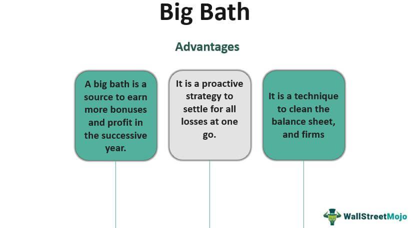

Understanding the overlapping concepts of bath hygiene and algorithmic trading may initially seem perplexing; however, parallels exist within their systematic practices. Both require strategic planning, disciplined decision-making, and a focus on risk management to achieve optimal outcomes. In the context of investing, taking a "bath" refers to experiencing significant financial losses. Such occurrences can highlight the need for careful risk mitigation, much as personal hygiene emphasizes preventive care to maintain health and well-being.

Algorithmic trading, which uses computer programs to execute predefined trading strategies with speed and precision, shares similarities with the structured approach necessary for maintaining personal hygiene. Whether in investment strategies or daily hygiene routines, success relies on the consistent application of systematic processes. By exploring these similarities, we can appreciate how maintaining fiscal hygiene through strategic investment, as well as personal hygiene through disciplined bath practices, involves attentiveness to detail, risk assessment, and the implementation of routine.

The aim here is to demonstrate the relevance and application of strategic planning across diverse fields such as finance and personal care. Just as investors employ risk management techniques to avoid significant losses, individuals adopt systematic hygiene practices to prevent health problems. Both fields benefit from a comprehensive strategy that involves preparation, execution, and regular review. Thus, recognizing these cross-disciplinary parallels can provide valuable insights for maintaining both personal and financial well-being.

## Table of Contents

## What Does 'Take a Bath' Mean in Investing?

"Take a bath" is an informal term used in finance to describe a situation where an investor incurs a substantial financial loss. This expression reflects a severe setback, akin to the consequences of an all-encompassing market downturn or a significant drop in a specific asset's value.

Investors might find themselves "taking a bath" due to several factors, such as market volatility and company-specific challenges. Market volatility, characterized by rapid and unpredictable price movements, can lead to substantial losses if investors cannot adapt quickly. For example, sudden economic shifts or geopolitical events can cause wide market swings, affecting stock prices and leading to unexpected financial losses. Furthermore, events like poor earnings reports or leadership changes can negatively impact a company's stock, causing individual investors to suffer significant losses if heavily invested in that firm.

To mitigate the risk of such losses, investors often employ risk management strategies. This includes diversification, which involves spreading investments across various assets to reduce exposure to any single investment's adverse events. The goal is to achieve a balance where the positive performance of some investments neutralizes the negative performance of others. Another essential preventive measure is strategic planning, where investors set clear financial goals and establish systematic approaches to achieve them, such as regular portfolio rebalancing and setting stop-loss orders.

The psychological aspects of investing can be just as crucial as strategic measures. Maintaining emotional discipline and avoiding panic during market fluctuations is vital for long-term success. This situation is comparable to maintaining physical hygiene and wellness through regular, disciplined practices. Just as proper hygiene can prevent health issues by fostering resilience against disease, a disciplined investment approach can shield investors from severe financial "illnesses" due to rash decisions.

Ultimately, the concept of avoiding significant losses in investing shares similarities with maintaining personal hygiene. Both require a proactive and strategic approach to prevent negative outcomes. Strategic loss prevention in investments, much like personal hygiene, involves consistent and thoughtful actions to preserve wellbeing, be it financial or physical.

## The Concept of Hygiene in Bath Practices

Personal hygiene involves a set of practices performed to preserve health and prevent disease. Just as risk management in investments aims to minimize losses, maintaining good hygiene is essential for minimizing health issues.

Basic bath hygiene practices include daily washing of the body to remove dirt, bacteria, and dead skin cells. Regular bathing helps in preventing skin infections, body odor, and other health-related issues. The long-term benefits include improved skin health, reduced risk of diseases, and enhanced overall well-being.

Maintaining hygiene requires a systematic approach similar to structured strategies in trading and investment. A consistent routine of personal care practices mirrors the discipline needed in financial markets to achieve sustained success. Both areas rely on regular, methodical approaches for optimal outcomes, be it through a hygiene regimen or a well-designed investment strategy.

Routine and discipline are essential in both hygiene and trading, akin to the precision and consistency seen in [algorithmic trading](/wiki/algorithmic-trading). Bathing regularly, maintaining cleanliness, and using appropriate personal care products require commitment and routine. Similarly, algorithmic trading depends on the reliance on automated systems to execute trades with speed and accuracy, ensuring consistency in approach and outcome.

Both personal and financial well-being benefit from systematic, disciplined practices. Just as disciplined hygiene can stave off health issues, disciplined financial practices can prevent substantial economic loss. This parallel highlights a universal truth: whether managing personal health or financial portfolios, a structured and consistent approach is crucial for long-term success.

## What is Algorithmic Trading?

Algorithmic trading is defined as the employment of computer algorithms to execute trading strategies with speed and precision unattainable by human traders. These algorithms analyze data and execute orders based on pre-defined criteria, minimizing human intervention and emotional bias. 

Key features of algorithmic trading include automation, speed, precision, [backtesting](/wiki/backtesting), and scalability. Automation allows for the execution of trades at any time, efficiently responding to market conditions without constant human oversight. The speed and precision offered by algorithms ensure prompt order execution and minimize errors, maximizing potential profitability. Backtesting involves evaluating trading strategies using historical data to assess their effectiveness before real-world application. Scalability of algorithmic trading allows strategies to be applied across various markets and asset types without additional efforts.

An organized approach to maintaining health and hygiene is reflected in these features. Automation in trading resembles the systematic scheduling of hygiene activities, ensuring consistency and regularity. The precision and speed of algorithms parallel the effectiveness of personal grooming products designed to deliver quick, targeted results. Regular evaluation of personal health routines can be likened to backtesting, where analyzing past behaviors helps refine methods for optimal well-being. The scalability of both contexts ensures practices can be adapted as circumstances change.

Algorithmic trading employs several types of strategies, such as trend-following, [arbitrage](/wiki/arbitrage), and mean reversion. Trend-following strategies capitalize on the persistence of asset price trends, basing decisions on historical price movements. Arbitrage strategies exploit price discrepancies between different markets or instruments, aiming for risk-free profits. Mean reversion strategies are founded on the idea that asset prices will revert to their historical averages, initiating trades when deviations occur. Each strategy leverages technology to identify opportunities and execute trades with efficiency and accuracy.

Technology plays a pivotal role in shaping algorithmic trading, akin to how advancements in self-care products revolutionize hygiene practices. Just as trading algorithms have evolved with improvements in computing power and data analytics, personal care products have advanced through scientific research and innovative materials, enhancing efficacy and consumer experience. This synergy underscores the importance of technology in progressing both financial strategies and personal well-being.

## Comparing Risk Mitigation Techniques

Risk mitigation in investing and personal hygiene shares a common goal: the prevention of adverse outcomes through strategic practices. In the financial world, techniques such as diversification and hedging play pivotal roles in managing potential losses and reducing risk exposure, whereas regular health check-ups and preventive measures serve as essential practices for maintaining personal well-being.

### Diversification and Hedging in Investing

Diversification involves spreading investments across various assets to minimize the impact of a poor-performing investment on the overall portfolio. By investing in a mix of asset classes, sectors, and geographies, investors can reduce unsystematic risk, which is specific to individual investments. The underlying principle is that while some investments may experience downturns, others may perform well, thereby balancing the overall risk.

Hedging, in contrast, refers to the strategic use of financial instruments—such as options and futures—to offset potential losses in an investment portfolio. For example, an investor holding a significant stake in a company's stock might purchase a put option to protect against a potential decline in the stock's value. This technique minimizes risk by providing a safety net, much like how an insurance policy functions for tangible assets.

### Regular Health Check-Ups and Preventive Measures

Just as diversification and hedging serve as risk mitigation strategies in investing, regular health check-ups and preventive measures are vital in maintaining personal health. Routine medical examinations can detect health issues at an early stage, allowing for prompt intervention and reducing the risk of severe conditions. Preventive measures, such as vaccinations and maintaining a balanced diet, further assist in safeguarding against potential health problems.

### Role of Disciplined Practice

In both investment and personal health, disciplined practice is crucial for avoiding catastrophic outcomes. Investors must consistently adhere to their risk management strategies and not succumb to psychological biases that may lead to impulsive decisions. Likewise, individuals must maintain regular health check-ups and follow preventive measures diligently to preserve their health.

### Real-World Examples of a Proactive Approach

A proactive approach is essential in both areas. For instance, during the 2008 financial crisis, a diversified investment strategy protected many portfolios from systemic collapse. Investors who diversified across asset classes and geographies were better positioned to weather the storm compared to those heavily concentrated in subprime mortgage securities.

Similarly, amidst the COVID-19 pandemic, those who adhered to preventive health guidelines—such as wearing masks, social distancing, and vaccination—demonstrated the effectiveness of proactive measures. These individuals not only protected themselves but also contributed to the broader public health effort.

### Case Studies

**Algorithmic Trading**: High-frequency trading (HFT) firms employ algorithmic trading strategies that automatically execute transactions based on predetermined criteria. This disciplined approach allows for quick adaptation to changing market conditions, reducing potential losses. For example, during the 2010 Flash Crash, certain HFT firms managed to limit their exposure through rapid execution and systematic risk management models.

**Personal Health**: A landmark study in the New England Journal of Medicine highlighted the impact of regular health screenings in reducing mortality rates from common diseases like cancer and heart disease. Patients who underwent routine check-ups had significantly lower mortality rates, illustrating the long-term benefits of systematic health management.

In sum, both investing and personal health benefit from disciplined, proactive strategies aimed at mitigating risk. The integration of these practices ensures stability and sustainability, whether managing an investment portfolio or pursuing a healthy lifestyle. These parallels underscore the universal importance of strategic planning across diverse fields.

## The Future of Algo Trading and Bath Hygiene Practices

As we look towards the future of algorithmic trading, we see significant advancements driven by the integration of [artificial intelligence](/wiki/ai-artificial-intelligence) (AI) and [machine learning](/wiki/machine-learning). These technologies enable trading algorithms to analyze vast amounts of data at unprecedented speeds and with improved accuracy, enhancing the decision-making process. Machine learning models, through their ability to discern complex patterns and predict market movements, are set to redefine the landscape of investment strategies. This progression is comparable to how innovations in grooming and health technologies are redesiging personal care routines. Smart devices, such as wearable health monitors, and AI-driven personalized skincare regimens are becoming increasingly common, suggesting a future where personal hygiene is not only easier to manage but also more tailored to individual needs.

However, the advancement of algorithmic trading and bath hygiene practices does not come without its challenges. In algorithmic trading, one of the major concerns is data privacy. As algorithms require extensive data to function optimally, ensuring that this data remains secure and private is crucial. This involves implementing robust cybersecurity measures and adhering to stringent data regulations. Similarly, the sustainability of personal hygiene products poses a significant challenge. The production and disposal of these products impact the environment, necessitating the development of eco-friendly alternatives that do not compromise on efficacy.

Technological and strategic innovations hold promise for enhancing the efficiency of both domains. In algorithmic trading, the use of quantum computing could offer solutions to currently intractable problems, significantly boosting processing capabilities. In personal hygiene, advancements in biotechnology might lead to products that can adapt to changing environmental and personal health conditions, ensuring optimal care.

An integrated approach, combining technology with traditional methods, offers comprehensive solutions for these challenges. In trading, this might involve leveraging historical data alongside sophisticated machine learning techniques to create hybrid strategies that are both innovative and reliable. In personal care, traditional wisdom regarding natural ingredients could be merged with contemporary scientific research to create products that are both effective and sustainable.

Ongoing research and development are pivotal in driving progress in these fields. For algorithmic trading, this includes refining machine learning models to better interpret market signals and reducing computational costs. For personal hygiene, researchers are focused on improving product formulations to enhance their environmental friendliness while ensuring superior performance. Both fields benefit from an approach that embraces both technological innovation and traditional techniques, ensuring progress is both sustainable and effective.

## Conclusion

Understanding the parallels between maintaining health through hygiene practices and managing investments through algorithmic trading provides a unique perspective on the importance of systematic strategies. Both domains rely heavily on structured approaches to achieve long-term success. In personal hygiene, consistent routines such as regular bathing and health check-ups are essential to prevent illness and promote well-being. Similarly, algorithmic trading employs predefined strategies and automation to optimize investment outcomes, emphasizing risk management and precision.

Adopting a disciplined, strategic approach in daily habits can significantly enhance both personal and financial health. Routine personal care practices can prevent health issues and promote longevity, while disciplined investment strategies can mitigate financial risks and ensure stable returns. For instance, following a consistent skincare regimen might parallel maintaining a diversified investment portfolio, both aiming to protect against unforeseen challenges.

Cross-disciplinary learning between health sciences and financial strategies offers potential benefits. The structured methodologies in trading could inspire more analytical approaches to personal health management, while insights from health disciplines might inform more holistic financial strategies. For example, just as personalized medicine tailors health interventions to individual needs, algorithmic trading can be customized to an investor's specific risk tolerance and goals.

Balancing innovation with tradition is crucial across all fields. Technological advancements have revolutionized both personal hygiene products and trading algorithms, yet fundamental principles remain vital. The integration of new technologies, such as AI in trading systems or natural ingredients in skincare products, exemplifies how innovation can enhance traditional practices. This harmonious blend ensures continued progress and effectiveness, illustrating the dynamic nature of both disciplines.

## References & Further Reading

[1]: Bergstra, J., Bardenet, R., Bengio, Y., & Kégl, B. (2011). ["Algorithms for Hyper-Parameter Optimization."](https://dl.acm.org/doi/10.5555/2986459.2986743) Advances in Neural Information Processing Systems 24.

[2]: ["Advances in Financial Machine Learning"](https://www.amazon.com/Advances-Financial-Machine-Learning-Marcos/dp/1119482089) by Marcos Lopez de Prado

[3]: ["Evidence-Based Technical Analysis: Applying the Scientific Method and Statistical Inference to Trading Signals"](https://www.amazon.com/Evidence-Based-Technical-Analysis-Scientific-Statistical/dp/0470008741) by David Aronson

[4]: ["Machine Learning for Algorithmic Trading"](https://github.com/stefan-jansen/machine-learning-for-trading) by Stefan Jansen

[5]: ["Quantitative Trading: How to Build Your Own Algorithmic Trading Business"](https://www.amazon.com/Quantitative-Trading-Build-Algorithmic-Business/dp/1119800064) by Ernest P. Chan