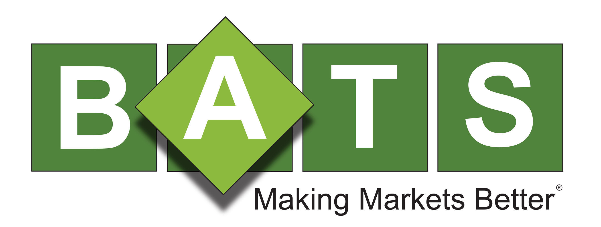

## Table of Contents

## What is BATS Exchange?

BATS Exchange is a stock market that lets people buy and sell stocks and other financial products. It started in 2005 and is now one of the biggest stock exchanges in the United States. BATS stands for "Better Alternative Trading System." The exchange was created to give traders another place to trade stocks, which could help lower the costs of trading.

In 2016, BATS Exchange was bought by Cboe Global Markets, which is another big company that runs financial markets. Now, it's called Cboe BZX Exchange and Cboe BYX Exchange. These exchanges still help people trade stocks and other things like exchange-traded funds (ETFs). They are important because they help make sure that trading is fair and that there are lots of choices for where to trade.

## Who founded BATS Exchange and when was it established?

BATS Exchange was founded by Dave Cummings and Bill O'Brien. They started it in June 2005. Dave and Bill wanted to create a new place for people to trade stocks because they thought it could be done better and cheaper than at the big exchanges.

At first, BATS was just a small company trying to make trading easier and less expensive. Over time, it grew a lot and became one of the biggest stock exchanges in the U.S. It helped change how stock trading works by giving people more choices and often lower costs.

## What types of financial instruments are traded on BATS Exchange?

BATS Exchange, now known as Cboe BZX Exchange and Cboe BYX Exchange, trades many different types of financial instruments. The main things people trade there are stocks, which are shares in companies. People buy and sell these stocks to try to make money as the value of the companies goes up or down. BATS also lets people trade exchange-traded funds (ETFs), which are like baskets of stocks or other assets that you can buy and sell like a single stock.

Besides stocks and ETFs, BATS Exchange also handles trading in options. Options are contracts that give you the right to buy or sell a stock at a certain price before a certain date. This can be a way for people to bet on what they think will happen to a stock's price without actually buying the stock itself. All these different financial instruments help make BATS a busy place where lots of trading happens every day.

## How does BATS Exchange differ from other stock exchanges?

BATS Exchange, now known as Cboe BZX Exchange and Cboe BYX Exchange, is different from other stock exchanges in a few ways. One big difference is that BATS started as a way to make trading cheaper and easier. They wanted to be a "Better Alternative Trading System," which is what BATS stands for. This means they tried to have lower fees and better technology to make trading faster and less expensive for people. Because of this, many traders and big investors liked using BATS because it saved them money.

Another way BATS Exchange is different is that it was one of the first exchanges to focus a lot on electronic trading. This means that instead of people shouting and waving their hands on a trading floor, everything happens on computers. This made trading faster and more efficient. BATS also became known for trading a lot of exchange-traded funds (ETFs), which are like baskets of stocks you can buy and sell. This focus on ETFs and electronic trading helped BATS grow quickly and become a big part of the stock market.

## What are the trading hours for BATS Exchange?

The BATS Exchange, now known as Cboe BZX Exchange and Cboe BYX Exchange, has regular trading hours from 9:30 AM to 4:00 PM Eastern Time, just like most other big stock exchanges in the U.S. This is when most people buy and sell stocks and other financial products like ETFs and options. During these hours, the market is open and lots of trading happens.

There are also times before and after the regular trading hours when you can trade on BATS Exchange. These are called pre-market and after-hours trading. Pre-market trading starts at 4:00 AM and goes until the regular market opens at 9:30 AM. After-hours trading happens from 4:00 PM until 8:00 PM. These extra hours let people trade when the main market is closed, but there might be less trading and more risk during these times.

## How can one start trading on BATS Exchange?

To start trading on BATS Exchange, which is now known as Cboe BZX Exchange and Cboe BYX Exchange, you need to open an account with a brokerage firm. A brokerage firm is a company that helps people buy and sell stocks and other financial products. You can choose a brokerage that lets you trade on BATS Exchange. Once you have picked a brokerage, you can sign up for an account on their website or app. You will need to give them some personal information and might need to put some money into your account to start trading.

After your account is set up and funded, you can start trading. You can use the brokerage's trading platform to buy and sell stocks, ETFs, and options that are listed on BATS Exchange. The trading platform is like a special computer program that lets you see prices and make trades. You can choose what you want to buy or sell, how much, and at what price. Once you place your order, the brokerage will send it to BATS Exchange to be filled. It's a good idea to learn about how trading works and maybe practice with a pretend account before you start trading with real money.

## What are the fees associated with trading on BATS Exchange?

When you trade on BATS Exchange, which is now called Cboe BZX Exchange and Cboe BYX Exchange, you might have to pay some fees. These fees can be different depending on the brokerage firm you use. Usually, there are two main types of fees: a commission, which is what you pay the brokerage for making the trade, and a fee from the exchange itself. The exchange fee can be different if you are adding liquidity to the market by placing an order that others can buy or sell against, or if you are taking liquidity by buying or selling against someone else's order. Adding liquidity often costs less than taking liquidity.

Some brokerages might offer free trades, which means they don't charge you a commission. But even if the commission is free, you might still have to pay the exchange fee. It's a good idea to check with your brokerage to see all the fees you might have to pay. The fees can add up, so understanding them can help you save money and make better trading decisions.

## What technological advantages does BATS Exchange offer?

BATS Exchange, now known as Cboe BZX Exchange and Cboe BYX Exchange, has some special technology that makes trading faster and easier. They use really fast computers and smart software to make sure that trades happen quickly. This is important because when people trade stocks, they often want to do it as fast as possible. BATS was one of the first exchanges to focus a lot on electronic trading, which means everything is done on computers instead of people shouting on a trading floor. This electronic way of trading helps make things smoother and more efficient.

Another big advantage of BATS Exchange's technology is that it can handle a lot of trades at the same time. This is important during busy trading times when lots of people want to buy and sell. BATS has strong systems that can keep working well even when there are millions of trades happening. This helps make sure that people can trade without waiting too long or having problems. Overall, the technology at BATS Exchange helps make trading quicker, cheaper, and more reliable for everyone who uses it.

## How has BATS Exchange impacted market competition?

BATS Exchange, now known as Cboe BZX Exchange and Cboe BYX Exchange, has changed the way stock trading works by making the market more competitive. When BATS started, it wanted to give traders another place to buy and sell stocks. This meant that big exchanges like the New York Stock Exchange and NASDAQ had to start thinking about how to keep their customers happy. BATS offered lower fees and used new technology to make trading faster and easier. This made other exchanges have to lower their fees and improve their technology too. So, BATS helped make trading cheaper and better for everyone.

Because of BATS, there are now more choices for where to trade. This is good for traders because they can pick the exchange that works best for them. BATS also made it easier for new kinds of financial products, like exchange-traded funds (ETFs), to be traded. This helped grow the market and gave people more ways to invest their money. Overall, BATS Exchange shook things up and made the stock market more competitive and fair.

## What are some major milestones in the history of BATS Exchange?

BATS Exchange started in June 2005, founded by Dave Cummings and Bill O'Brien. They wanted to create a new place for people to trade stocks because they thought it could be cheaper and better than the big exchanges. In 2008, BATS became the third-largest stock exchange in the U.S., showing how fast it was growing. That same year, BATS also started trading exchange-traded funds (ETFs), which helped them become even more popular.

In 2012, BATS tried to go public but had some problems with their technology on the first day, so they decided not to go through with it. But they kept growing and in 2014, BATS bought Direct Edge, another big trading platform, which made them even bigger. Then, in 2016, Cboe Global Markets bought BATS Exchange, and it became known as Cboe BZX Exchange and Cboe BYX Exchange. This was a big change, but BATS kept helping people trade stocks, ETFs, and options, making trading easier and cheaper for everyone.

## How does BATS Exchange handle market data and transparency?

BATS Exchange, now known as Cboe BZX Exchange and Cboe BYX Exchange, works hard to make sure trading is fair and open. They do this by sharing a lot of information about what is happening in the market. This information is called market data, and it includes things like the prices of stocks and how many stocks are being bought and sold. BATS makes this data available to everyone so that traders can see what's going on and make good choices. This helps keep the market honest because everyone can see the same information.

BATS also makes sure that the market stays transparent by following rules and using technology to watch for anything unusual. If something strange happens, like someone trying to cheat, BATS can spot it quickly. They use special computer systems to check all the trades and make sure everything is fair. By doing this, BATS helps make sure that people can trust the market and feel safe when they are trading.

## What future developments are anticipated for BATS Exchange?

BATS Exchange, now part of Cboe Global Markets and known as Cboe BZX Exchange and Cboe BYX Exchange, is always looking for ways to get better. One big thing they might do in the future is to keep making their technology even faster and more reliable. They want to make sure that trading stays quick and easy, no matter how many people are trading at once. They might also add new kinds of financial products that people can trade, like new types of ETFs or options. This would give traders more choices and could help the exchange grow even more.

Another thing that could happen is that BATS might work more with other exchanges around the world. This could make it easier for people to trade stocks and other things in different countries without having to use lots of different systems. BATS might also focus on making sure that their market data stays open and easy to use, so everyone can see what's happening in the market. By doing these things, BATS hopes to keep being a big and important part of the stock market, helping people trade in a fair and efficient way.

## References & Further Reading

[1]: Brad Bailey & Dan DeFrancesco. (2017). ["Cboe's $3.2 billion purchase of BATS highlights the latest trend in market consolidation."](https://en.wikipedia.org/wiki/Grammy_Award_for_Best_Jazz_Performance) Business Insider.

[2]: Vlastelica, Ryan. (2017). ["Why Cboe bought Bats Global Markets — and what it means"](https://cdn.cboe.com/resources/press_releases/CBOE-Holdings-Announces-Close-of-Acquisition-of-Bats-Global-Markets-FINAL-3-1-17.pdf) MarketWatch.

[3]: Bowman, John. (2011). ["Chi-X Europe and BATS to Combine to Form Largest Pan-European Equities Market."](https://www.comc.com/Players/Baseball/Chris_Carpenter_MLB_RHP_1997-12/c16207,sl,p4) Bloomberg.

[4]: Lopez de Prado, Marcos. (2018). ["Advances in Financial Machine Learning"](https://www.amazon.com/Advances-Financial-Machine-Learning-Marcos/dp/1119482089) Wiley.

[5]: Jansen, Stefan. (2020). ["Machine Learning for Algorithmic Trading"](https://github.com/stefan-jansen/machine-learning-for-trading) Packt Publishing.

[6]: Chan, Ernest P. (2009). ["Quantitative Trading: How to Build Your Own Algorithmic Trading Business"](https://github.com/ftvision/quant_trading_echan_book) Wiley.