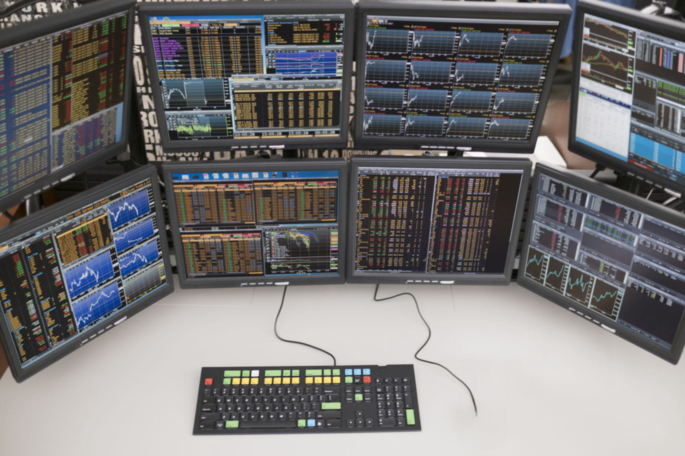

In the rapidly evolving landscape of global finance, market trading and financial exchanges have undergone significant transformations, largely influenced by technological advancements. One of the most notable developments in this arena has been the advent of algorithmic trading, commonly referred to as algo trading. This form of trading utilizes automated, pre-programmed instructions to execute stock market transactions at speeds and frequencies impossible for human traders. 

Algo trading has become a crucial tool in modern finance, enabling swift and efficient transaction processing while affecting market dynamics significantly. The core idea of algorithmic trading is to leverage computer algorithms to analyze and execute complex trading orders, which can incorporate variables such as price, timing, and volume. This technological advancement has been instrumental in increasing the speed and efficiency of trading, thereby reshaping how financial markets operate.



Simultaneously, companies like Bats Global Markets, now a part of Cboe Global Markets, have been pivotal in revolutionizing trading approaches. Bats Global Markets, once a major player in U.S. equity trading, is known for deploying cutting-edge technology to facilitate market transactions. Their efforts have contributed significantly to the transition from traditional trading floors to digital platforms, influencing the structure and functioning of financial exchanges globally.

This article will explore algorithmic trading's interplay with global finance and examine the impact of entities like Bats Global Markets in shaping modern trading practices. As technology continues to advance, such innovations will persist in driving the evolution of financial markets, presenting both opportunities and challenges to market participants.

## Table of Contents

## The Evolution of Global Financial Markets

Historically, financial exchanges largely depended on human traders operating within physical trading floors. This conventional model involved open outcry, a method where traders used verbal bids and offers to negotiate prices, leading to relatively slower transaction speeds. However, the advent of electronic systems in recent decades has transformed global financial markets.

The shift from traditional trading floors to digital exchanges began in the late 20th century, driven by the need for faster and more efficient trading methods. Electronic trading opened new avenues for market participants, enabling transactions to be executed in fractions of a second. This speed was unattainable with human-operated systems and has further led to the proliferation of algorithmic strategies. Algorithmic trading, or algo trading, leverages computational algorithms to automate trading processes, optimizing for variables such as timing, price, and volume. This automation reduces human error and enhances market efficiency.

Organizations like Bats Global Markets have been pivotal in this transformation. Founded in 2005, Bats introduced innovative approaches to electronic trading by prioritizing technology and cost-efficiency. The company quickly became a prominent player by offering a digital platform that supported high-frequency trading and other algorithmic strategies. By operating multiple exchanges, including equities and options, Bats Global Markets enabled vast swathes of transactions to occur seamlessly across its platforms, significantly enhancing [liquidity](/wiki/liquidity-risk-premium).

The incorporation of major electronic communication networks (ECNs) by firms like Bats offered traders rapid access to trading information, facilitating nearly instantaneous buy and sell decisions. This evolution has not only increased transaction speeds but has also democratized access to financial markets, allowing a wider array of participants to engage in trading activities globally.

The rise of electronic systems and the implementation of [algorithmic trading](/wiki/algorithmic-trading) strategies signify a fundamental shift in the operation of financial exchanges. This transition has underscored the importance of technological innovation in finance, reshaping market dynamics and necessitating continuous adaptation by financial institutions to maintain competitive edges.

## Understanding Algorithmic Trading

Algorithmic trading, often referred to as algo trading, employs automated, pre-programmed strategies to execute trades in financial markets. These strategies are intricately designed to account for various market variables such as price, timing, and [volume](/wiki/volume-trading-strategy). This automation is enabled by sophisticated software algorithms that leverage the superior computational power of computers, allowing trading decisions and executions to occur at speeds unattainable by human traders.

The primary advantage of algorithmic trading lies in its ability to rapidly assimilate and react to market data, making real-time trading decisions based on pre-defined criteria. This capability is particularly beneficial in volatile markets where speed and precision are critical. Algorithms can be programmed to identify trading opportunities and execute corresponding trades within milliseconds, a feat that dramatically enhances market efficiency.

Several strategies are predominant in algorithmic trading. High-frequency trading ([HFT](/wiki/high-frequency-trading-strategies)) is one such approach, characterized by executing a large number of orders at extremely fast speeds. HFT strategies often seek to capture minuscule price discrepancies across markets or time intervals, trading on a massive scale to realize profit.

Arbitrage is another common strategy, where traders exploit price differences of the same asset in different markets. For instance, if a stock is priced differently on two exchanges, an algorithm can simultaneously buy at the lower price and sell at the higher price, securing a risk-free profit.

Mean reversion strategies are based on the hypothesis that asset prices will tend to revert to their historical mean over time. Algorithms using this approach identify deviations from the mean and execute trades to profit from expected market corrections.

The development and utilization of these strategies heavily rely on mathematical models and statistical analysis. Simple algorithms may use straightforward statistical patterns or historical price data to make decisions, while more complex models might incorporate advanced [machine learning](/wiki/machine-learning) techniques, such as [deep learning](/wiki/deep-learning) and neural networks, to predict market movements.

In Python, a basic framework for an algorithmic trading strategy might involve libraries such as NumPy for numerical calculations, pandas for data manipulation, and scikit-learn for machine learning models. A simple moving average crossover strategy, for example, could be implemented using the following Python code snippet:

```python
import pandas as pd
import numpy as np

# Sample data: stock prices
data = {
    'price': [100, 102, 101, 105, 107, 110, 108, 109, 111, 112]
}
df = pd.DataFrame(data)

# Calculate moving averages
df['short_mavg'] = df['price'].rolling(window=3).mean()
df['long_mavg'] = df['price'].rolling(window=5).mean()

# Generate signals
df['signal'] = np.where(df['short_mavg'] > df['long_mavg'], 1.0, 0.0)

print(df)
```

This example calculates short and long moving averages and generates buy signals when the short moving average crosses above the long moving average. Such strategies form the foundation for more intricate algorithmic trading models that incorporate a wider array of data and machine learning insights to enhance predictive accuracy and trading performance.

Algorithmic trading, by fusing computational efficiency with strategic sophistication, continues to transform global financial markets. It remains a pivotal tool for traders and financial institutions striving to maintain a competitive edge in the ever-evolving landscape of market trading.

## Impact of Algorithmic Trading on Global Markets

Algorithmic trading, often referred to as algo trading, has brought significant advancements to global financial markets, primarily by enhancing market efficiency and liquidity. This type of trading leverages sophisticated algorithms to execute a higher volume of trades than traditional methods, achieving transactions in fractions of a second that surpass human capability. One of the key benefits of algo trading is its ability to provide better price discovery. Algorithms, operating with precise pre-programmed instructions, can react instantaneously to market data, adjusting orders to exploit pricing differentials and market inefficiencies. This constant activity helps in narrowing bid-ask spreads, ultimately leading to more competitive pricing and reduced transaction costs for all market participants.

Despite these advantages, algorithmic trading has also introduced several challenges, particularly concerning market [volatility](/wiki/volatility-trading-strategies). The ability of algorithms to operate at such high speeds can sometimes lead to unintended market reactions. For instance, the phenomenon of "flash crashes," where the market rapidly loses and regains a significant amount of value, is often attributed to algorithms executing a large number of trades in an extremely short period. These incidents have prompted increased regulatory scrutiny to ensure market stability. Regulators around the world are examining how to mitigate such occurrences without stifling the innovative potential of algorithmic trading.

Moreover, the rise of algo trading has necessitated enhancements in market infrastructure. Entities like Cboe Global Markets are continually advancing their technological capabilities to handle the sheer volume and complexity of contemporary trading activities. By investing in robust technological solutions, these organizations aim to minimize latency, improve order execution speeds, and fortify the security of trading platforms. Consequently, this not only supports the operational efficiency of algo trading but also its sustainability as a core component of modern financial markets.

In summary, while algo trading has significantly transformed global markets by boosting efficiency and liquidity, it also poses challenges that require careful management. The continued evolution of this technology will likely lead to further innovations and adaptations within the financial sector, signifying its integral role in shaping the future landscape of trading.

## Bats Global Markets: A Case Study

Bats Global Markets was established in 2005 and rapidly rose to prominence as a significant force in U.S. equity trading. Within a few years, Bats had captured a substantial share of the market, distinguishing itself through advanced technology and competitive pricing strategies designed to attract both retail and institutional investors. The firm's electronic communications network (ECN) was pivotal in facilitating high-frequency, low-latency trading, allowing for prompt execution of trades and minimal transaction costs.

In 2017, Bats Global Markets was acquired by CBOE Holdings, marking a pivotal moment in the evolution of global trading platforms. This acquisition integrated Bats’ technological infrastructure into Cboe Global Markets, enhancing the latter’s capabilities in electronic trading. By incorporating Bats' ECN, Cboe was able to expand its operational scope across multiple global exchanges, effectively handling both equities and options trading. This integration enabled Cboe to leverage Bats’ innovative technology to improve market connectivity and execution speeds, thereby solidifying its position as a leading global exchange operator.

The impact of this merger was significant, as it broadened Cboe's product offerings and facilitated access to a more diverse client base. Bats’ technology also allowed for the development of new trading products, including exchange-traded funds (ETFs) and foreign exchange markets. Furthermore, the union of these two entities enhanced market transparency and liquidity, providing market participants with improved price discovery and trading efficiency.

Overall, Bats Global Markets' innovative approach and robust technological infrastructure have been central to the operations and growth of Cboe Global Markets. Its successful integration has exemplified how strategic mergers can bolster market capabilities and offer competitive advantages in the fast-paced environment of global finance.

## Future Trends in Algorithmic Trading

As technology evolves, the landscape of algorithmic trading is expected to undergo significant changes, characterized by increasingly sophisticated models that leverage advanced computational techniques. One promising direction is the use of [artificial intelligence](/wiki/ai-artificial-intelligence) (AI) and machine learning (ML) to create dynamic algorithms that can adapt to market conditions in real time. These algorithms will likely integrate complex data analysis, sentiment analysis from news and social media, and pattern recognition to enhance predictive accuracy.

For instance, the integration of AI and ML could enable the development of predictive models based on historical data and current market flows. Neural networks and deep learning techniques can be employed to model non-linear relationships and capture intricate patterns that traditional algorithms might miss. Moreover, [reinforcement learning](/wiki/reinforcement-learning), a method where algorithms learn optimal trading strategies through trial and error, is expected to play a crucial role in devising effective trading solutions.

In addition to technological advancements, regulatory changes are anticipated to shape the future of algorithmic trading. Given the risks associated with high-frequency trading, such as market manipulation and flash crashes, regulators may impose tighter controls to uphold market integrity. This could involve the implementation of circuit breakers, enhanced monitoring of algorithmic trades, and increased transparency requirements for trading strategies.

Python, with its extensive libraries such as TensorFlow, Keras, and scikit-learn, is likely to remain a pivotal tool in developing and testing these sophisticated algorithms. For example, a simple reinforcement learning model in Python might initialize a Q-learning algorithm to adapt trading strategies based on continuous feedback:

```python
import numpy as np

# Initialize the Q-table with zeros
Q = np.zeros((state_space_size, action_space_size))

# Iterating over episodes
for episode in range(num_episodes):
    state = env.reset()
    done = False

    while not done:
        # Choose action based on an epsilon-greedy policy
        action = choose_action(Q, state, epsilon)

        # Perform action and observe the outcome
        next_state, reward, done, _ = env.step(action)

        # Update the Q-value
        best_next_action = np.argmax(Q[next_state])
        Q[state, action] = Q[state, action] + alpha * (reward + gamma * Q[next_state, best_next_action] - Q[state, action])

        state = next_state
```

Furthermore, increased computational capacity offered by cloud computing and quantum computing potential could drive forward more complex and computationally intensive models. As these technologies develop, the financial industry must balance leveraging cutting-edge advancements with maintaining robust safeguards to mitigate risks and ensure fair market practices. As a result, the next phase of algorithmic trading will likely be defined by more intelligent, dynamic strategies, underpinned by an evolving regulatory landscape aimed at safeguarding market stability.

## Conclusion

Algorithmic trading has fundamentally transformed financial markets, reshaping the landscape by enhancing both efficiency and complexity. By automating trading processes, algorithmic trading provides market participants the ability to execute trades with precision and speed, leading to new opportunities for capturing value. The use of algorithms allows for the processing of large volumes of data and execution of trades at a velocity that would be unattainable by human traders alone. This technological advancement opens avenues for strategies such as high-frequency trading, [arbitrage](/wiki/arbitrage), and [statistical arbitrage](/wiki/statistical-arbitrage), which were previously inconceivable on a manual trading floor.

Entities like Bats Global Markets have demonstrated the power of technological innovation in boosting market efficiencies. Established in 2005, Bats quickly became a leader in U.S. equity trading by adopting cutting-edge technology, automating trading systems, and reducing latency. Its innovative approach was instrumental in influencing trading dynamics, setting a benchmark for excellence and demonstrating the direct impact of technology on market share and operational effectiveness. Following its integration into Cboe Global Markets, Bats’ advanced systems laid the foundation for enhanced trading capabilities, enabling Cboe to operate multiple global exchanges efficiently.

As global finance continues to evolve, algorithmic trading is expected to play a pivotal role in the adaptation of markets to new dynamics. Continued advancements in technology, particularly in artificial intelligence and machine learning, promise to drive this evolution further by integrating sophisticated models into trading algorithms. These advancements will likely lead to more adaptive strategies that can respond to market changes almost instantaneously. Additionally, as regulatory bodies seek to maintain market stability, they may impose tighter regulations on algorithmic trading, aiming to mitigate risks such as market volatility and flash crashes.

In summary, algorithmic trading represents both a significant advancement in trading technology and a challenge for regulators and market participants alike. By exemplifying the potential of this innovation, entities like Bats Global Markets highlight the transformative impact of technology on market operations. As financial exchanges continue to advance, algorithmic trading will remain a central pillar, necessitating constant adaptation and strategic evolution to meet the ever-changing demands of global finance.

## References & Further Reading

[1]: Bergstra, J., Bardenet, R., Bengio, Y., & Kégl, B. (2011). ["Algorithms for Hyper-Parameter Optimization."](https://dl.acm.org/doi/10.5555/2986459.2986743) Advances in Neural Information Processing Systems 24.

[2]: ["Advances in Financial Machine Learning"](https://www.amazon.com/Advances-Financial-Machine-Learning-Marcos/dp/1119482089) by Marcos Lopez de Prado

[3]: ["Evidence-Based Technical Analysis: Applying the Scientific Method and Statistical Inference to Trading Signals"](https://www.amazon.com/Evidence-Based-Technical-Analysis-Scientific-Statistical/dp/0470008741) by David Aronson

[4]: ["Machine Learning for Algorithmic Trading"](https://github.com/stefan-jansen/machine-learning-for-trading) by Stefan Jansen

[5]: ["Quantitative Trading: How to Build Your Own Algorithmic Trading Business"](https://www.amazon.com/Quantitative-Trading-Build-Algorithmic-Business/dp/1119800064) by Ernest P. Chan