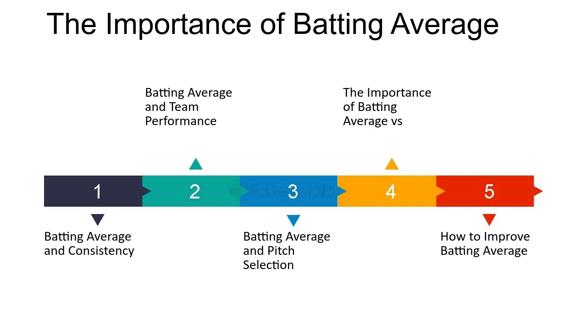

## Table of Contents

## What is batting average in baseball?

Batting average is a number that tells you how good a baseball player is at hitting the ball. It is found by dividing the number of hits a player gets by the number of times they try to hit the ball, which is called at-bats. The result is a number between 0 and 1, but it is usually written as a three-digit number. For example, a batting average of .300 means the player gets a hit 30% of the time they try.

This number is important because it shows how often a player can successfully hit the ball and reach a base. A higher batting average means the player is better at hitting. In baseball, a batting average of .300 or higher is considered very good. It is one of the main ways to measure how well a player is doing, along with other stats like home runs and runs batted in.

## How is batting average calculated?

Batting average is a simple way to see how good a baseball player is at hitting the ball. You find it by taking the total number of hits a player has and dividing it by the total number of times they have tried to hit the ball, which we call at-bats. So, if a player has 100 hits and 300 at-bats, their batting average would be 100 divided by 300, which equals 0.333. This number is usually shown as a three-digit decimal, like .333.

This number is important because it shows how often a player can hit the ball and get on base. A higher number means the player is better at hitting. In baseball, a batting average of .300 or more is thought of as very good. It's one of the main things people look at to see how well a player is doing, along with other numbers like home runs and runs batted in.

## Why is batting average important in baseball?

Batting average is important in baseball because it shows how good a player is at hitting the ball. It tells us how often a player gets a hit when they try to hit the ball. This is a big deal because hitting the ball and getting on base is one of the main ways a team can score runs and win games. A higher batting average means a player is better at hitting, which can help their team a lot.

Coaches, players, and fans all look at batting average to see how well a player is doing. If a player has a high batting average, like .300 or more, people think of them as a good hitter. This number is used along with other stats, like home runs and runs batted in, to understand a player's overall performance. Batting average is a simple but powerful way to measure how much a player helps their team score and win.

## What is considered a good batting average?

A good batting average in baseball is usually thought to be .300 or higher. This means the player gets a hit about 30% of the time they try to hit the ball. It's a big deal because it shows the player is really good at hitting, and that can help their team score runs and win games. Players who keep a batting average of .300 or more are often seen as some of the best hitters in the game.

But, what counts as a good batting average can change a bit depending on the league and the time period. In Major League Baseball today, a .300 average is still seen as very good, but it's not as common as it used to be. In other leagues, like minor leagues or college baseball, a good average might be a bit lower, maybe around .275 to .300. Still, no matter where you play, a higher batting average means you're a better hitter, and that's always important in baseball.

## How does batting average differ across various levels of baseball?

Batting average can be different at different levels of baseball. In Major League Baseball (MLB), a good batting average is usually around .300 or higher. This is because the pitching is really good, so it's hard to hit the ball. Players who can hit .300 in the MLB are seen as some of the best hitters in the game. But, because the pitching is so tough, not many players can keep their average that high.

In other levels of baseball, like the minor leagues or college baseball, a good batting average might be a bit lower. In the minor leagues, a good average might be around .275 to .300. In college baseball, it might be even lower, maybe around .250 to .300. This is because the pitching is not as good as in the MLB, so it's easier to hit the ball. Still, no matter what level you're playing at, a higher batting average means you're a better hitter, and that's always important in baseball.

## Can you explain the historical context of batting average?

Batting average has been a big part of baseball since the sport started. In the early days of baseball, around the late 1800s, it was one of the first stats people used to see how good a player was at hitting. Back then, it was a lot easier to get a hit because the pitching wasn't as good as it is now. So, it was common for players to have really high batting averages, sometimes even over .400. One famous player, Ty Cobb, had a career batting average of .366, which is the highest ever in MLB history.

Over time, as baseball changed, batting average became even more important. In the early 1900s, pitchers started to get better, and it became harder to hit the ball. Even so, some players could still keep a high batting average. For example, in 1941, Ted Williams hit .406, which was the last time anyone hit over .400 in a season. Today, with even better pitching, it's really hard to hit .300, but it's still seen as a sign of a great hitter. Batting average has stayed a key way to measure how well a player is doing, even as other stats like on-base percentage and slugging percentage have become more popular.

## How has the importance of batting average evolved over time?

In the early days of baseball, batting average was one of the first and most important stats people used to see how good a player was at hitting. Back then, in the late 1800s, it was easier to get a hit because the pitching wasn't as good as it is now. So, players often had really high batting averages, sometimes even over .400. It was a big deal to have a high batting average because it showed you were a great hitter. Famous players like Ty Cobb had career batting averages that are still the highest ever in MLB history.

Over time, as baseball changed, batting average stayed important but other stats started to matter more too. In the early 1900s, pitchers got better, and it became harder to hit the ball. Even so, some players like Ted Williams could still hit over .400 in a season, which was the last time anyone did that in 1941. Today, with even better pitching, hitting .300 is seen as a big achievement. But now, other stats like on-base percentage and slugging percentage are used more to see how well a player is doing. Still, batting average is a simple and clear way to show how good a player is at hitting, and it's still important in baseball.

## What are the limitations of using batting average as a performance metric?

Batting average is a simple way to see how often a player hits the ball, but it doesn't tell the whole story. It only counts hits and doesn't care about what kind of hits they are. For example, a single and a home run both count the same in batting average, even though a home run is way more helpful for the team. Also, batting average doesn't count walks, which are important because they help a player get on base without hitting the ball. So, a player who walks a lot might not have a high batting average, but they could still be really good at getting on base.

Another problem with batting average is that it doesn't show how a player does in big moments. A player might have a good batting average, but if they don't hit well when the game is close or in important situations, their batting average doesn't show that. Also, batting average can be affected by things like the ballpark and the team's lineup. Some ballparks are easier to hit in, and hitting in front of good hitters can make it easier to get hits. So, batting average alone can't tell you everything about how good a player is.

## How do advanced statistics complement or challenge the use of batting average?

Advanced statistics give a fuller picture of a baseball player's performance than just looking at their batting average. Stats like on-base percentage (OBP) and slugging percentage (SLG) tell us more about how a player helps their team. OBP counts not just hits, but also walks, which are important because they help a player get on base without hitting the ball. SLG gives more points for extra-base hits like doubles, triples, and home runs, which are more helpful for scoring runs than just singles. These stats show that a player who walks a lot or hits a lot of home runs might be more valuable than their batting average suggests.

These advanced stats can challenge the idea that batting average is the best way to measure a player's hitting. For example, a player with a high batting average but few walks and mostly singles might not be as helpful to their team as someone with a lower batting average but a high OBP and lots of extra-base hits. Stats like Wins Above Replacement (WAR) try to put all of a player's contributions into one number, showing how much better they are than a typical replacement player. So, while batting average is easy to understand and still important, advanced stats give a more complete view of a player's value to their team.

## What role does batting average play in player contracts and team strategies?

Batting average can be a big deal when teams decide how much to pay a player. If a player has a high batting average, like .300 or more, teams might think they're a good hitter and offer them a lot of money. Teams want players who can hit the ball well because it helps them score runs and win games. But, teams also look at other stats, like how often a player walks or hits home runs, to see if they're worth the money. So, while a high batting average can help a player get a better contract, it's not the only thing teams look at.

Teams also use batting average to help plan their strategies. If a team has a lot of players with high batting averages, they might try to play a style of baseball where they focus on getting a lot of hits and moving runners around the bases. But, if their players have lower batting averages but walk a lot or hit a lot of home runs, they might play a different style, focusing more on power and getting on base without hits. So, batting average is just one part of how teams decide what kind of baseball they want to play.

## How do situational factors affect a player's batting average?

Situational factors can really change a player's batting average. For example, if a player is hitting in a ballpark where it's easy to get hits, like one with a short distance to the fences, their batting average might go up. Also, if a player hits in front of good hitters, pitchers might be more careful and throw easier pitches, which can help the player get more hits. On the other hand, if a player hits in a tough ballpark or in front of weaker hitters, their batting average might go down because it's harder to get hits.

Another big situational [factor](/wiki/factor-investing) is the game situation. If a player is up to bat with runners on base and the game is close, they might feel more pressure, which can affect their hitting. Sometimes, they might try to hit the ball harder to drive in runs, and this can lead to more strikeouts or weaker hits, lowering their batting average. Also, the quality of the pitching they face matters a lot. If a player is facing really good pitchers, their batting average might be lower than when they face weaker pitchers. So, all these situational factors can make a big difference in a player's batting average.

## What are some notable records and anomalies related to batting average in professional baseball?

In baseball, Ty Cobb has the highest career batting average ever in Major League Baseball (MLB) with .366. He played from 1905 to 1928 and was really good at hitting. Another cool record is that Ted Williams was the last player to hit over .400 in a season. He did it in 1941 with a .406 average. It's really hard to hit .400 because pitchers are so good now, so this record is special. Also, in 2004, Ichiro Suzuki set a record for the most hits in a single season with 262 hits, which gave him a .372 batting average that year.

Sometimes, there are strange things that happen with batting averages. For example, in 2008, a player named Adam Dunn had a low batting average of .236, but he still hit 40 home runs and had a high on-base percentage because he walked a lot. This shows that a player can be really good even if their batting average isn't high. Another odd thing is that in 1995, Tony Fernandez hit .349 in the American League, but he didn't win the batting title because he didn't have enough at-bats. The rules say you need a certain number of at-bats to be eligible, so even though Fernandez had a great average, he didn't get the title.

## What are the key points to understanding baseball batting statistics?

Baseball has long been celebrated for its rich statistical landscape, with batting metrics being among the most scrutinized. Central to these statistics is the Batting Average (AVG), a fundamental measure of a player's hitting performance. The batting average is determined by dividing a player’s total hits by their total at-bats (AB), represented as:

$$
\text{Batting Average (AVG)} = \frac{\text{Hits}}{\text{At-bats}}
$$

While the batting average is an essential indicator of skill, it does not capture the full picture of a player's performance at the plate. This has led to the adoption of additional metrics like Slugging Percentage (SLG) and On-Base Percentage (OBP), which offer a more comprehensive view.

The Slugging Percentage is calculated by assessing the total bases a player earns per at-bat, emphasizing the power of a hitter as it considers extra-base hits:

$$
\text{Slugging Percentage (SLG)} = \frac{\text{Total Bases}}{\text{At-bats}}
$$

On-Base Percentage, on the other hand, measures how frequently a player reaches base, including via hits, walks, and being hit by pitches, making it a broader indicator of a player's ability to avoid getting out:

$$
\text{On-Base Percentage (OBP)} = \frac{\text{Hits} + \text{Walks} + \text{Hit by Pitch}}{\text{At-bats} + \text{Walks} + \text{Sacrifice Flies} + \text{Hit by Pitch}}
$$

With the increasing integration of data analytics in baseball, there has been a shift towards more sophisticated metrics like On-Base Plus Slugging (OPS), which combines OBP and SLG to provide a single measure of a player's offensive ability:

$$
\text{OPS} = \text{OBP} + \text{SLG}
$$

This evolution in statistical thinking highlights a move away from traditional, singular metrics toward those offering a multidimensional perspective. Baseball's extensive use of data analytics has turned these [statistics](/wiki/bayesian-statistics) into actionable insights, influencing strategies and player evaluations. The comprehensive nature of modern baseball analytics not only optimizes in-game decision-making but also enhances player development and scouting practices, by utilizing large datasets and predictive modeling techniques akin to those employed in [algorithmic trading](/wiki/algorithmic-trading) and other data-driven industries.

## References & Further Reading

[1]: ["Moneyball: The Art of Winning an Unfair Game"](https://www.amazon.com/Moneyball-Art-Winning-Unfair-Game/dp/0393324818) by Michael Lewis

[2]: Skinner, B. (2011). ["Scoring Runs and Winning Games: The Expected Impact of Baseball's Key Offensive Events"](https://www.betfirm.com/hitting-correlations-with-runs-scored/). 

[3]: Carlin, B. P., & Louis, T. A. (2008). ["Bayesian Methods for Data Analysis"](https://www.taylorfrancis.com/books/mono/10.1201/b14884/bayesian-methods-data-analysis-bradley-carlin-thomas-louis) by Chapman and Hall/CRC.

[4]: ["Advances in Financial Machine Learning"](https://www.amazon.com/Advances-Financial-Machine-Learning-Marcos/dp/1119482089) by Marcos Lopez de Prado

[5]: Silver, N. (2012). ["The Signal and the Noise: Why So Many Predictions Fail — but Some Don't"](https://www.academia.edu/11318064/The_Signal_and_the_Noise_Why_So_Many_Predictions_Fail_But_Some_Dont_by_NateSilver_New_York_Penguin_Press_2012) by Penguin Press.

[6]: Marchand, E. (2020). ["The Emergence of Algorithmic Trading in the Financial Markets"](https://www.researchgate.net/publication/378548435_Algorithmic_Trading_and_AI_A_Review_of_Strategies_and_Market_Impact).  

[7]: Puterman, M. L. (1994). ["Markov Decision Processes: Discrete Stochastic Dynamic Programming"](https://onlinelibrary.wiley.com/doi/book/10.1002/9780470316887) by John Wiley & Sons.

[8]: Priestley, M. B. (1981). ["Spectral Analysis and Time Series"](https://archive.org/details/spectralanalysis0000prie) by Academic Press.