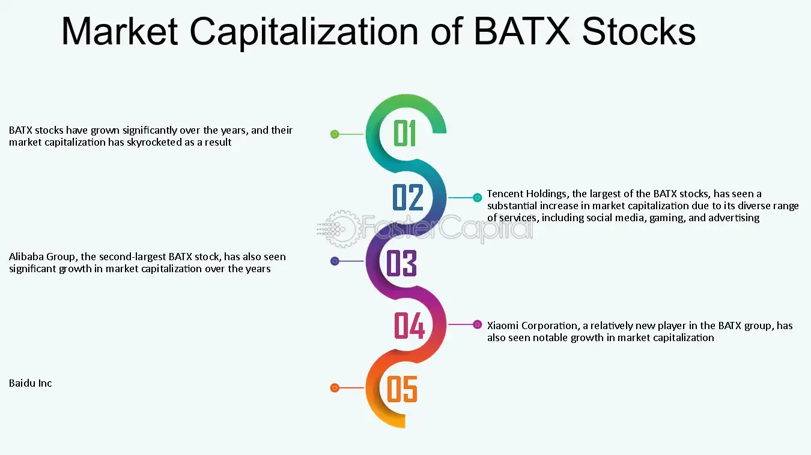

## Table of Contents

## What are BATX stocks?

BATX stocks refer to the stocks of four major Chinese technology companies: Baidu, Alibaba, Tencent, and Xiaomi. These companies are often compared to the American tech giants known as FAANG (Facebook, Apple, Amazon, Netflix, and Google). Just like FAANG, BATX companies have a big influence on the technology industry and the economy in China.

Baidu is known for its search engine, similar to Google. Alibaba is a huge online shopping platform, much like Amazon. Tencent is famous for its social media and gaming services, and it owns WeChat, which is like a mix of WhatsApp and Facebook. Xiaomi is known for making affordable smartphones and other electronic devices. Together, these companies play a big role in shaping technology and business in China.

## Which companies are included in the BATX group?

The BATX group includes four big Chinese tech companies: Baidu, Alibaba, Tencent, and Xiaomi. These companies are very important in China, just like some big American tech companies are important in the United States.

Baidu is like Google in China because it helps people search for things online. Alibaba is like Amazon because it's a big place where people can buy things on the internet. Tencent is known for WeChat, which is a popular app for chatting and playing games. Xiaomi makes phones and other gadgets that are not too expensive, so many people can afford them.

## Why are BATX stocks important in the global market?

BATX stocks are important in the global market because they represent some of the biggest and most influential tech companies in China. These companies, Baidu, Alibaba, Tencent, and Xiaomi, are leaders in their fields and have a huge impact on the Chinese economy. As China is one of the world's largest economies, what happens with these companies can affect the global market. Investors from all over the world watch BATX stocks closely because they can give clues about how the Chinese economy is doing.

Also, BATX companies are not just big in China; they are expanding to other countries too. This means they are becoming more and more important around the world. When these companies do well, it can make the global tech industry grow. On the other hand, if they have problems, it can affect tech companies everywhere. So, keeping an eye on BATX stocks helps people understand what might happen in the global market.

## How have BATX stocks performed historically?

Over the years, BATX stocks have had their ups and downs, just like any other stocks. In the early 2010s, these companies saw a lot of growth. Alibaba, for example, had a big jump in its stock price after it went public in 2014. Tencent also did well, especially with the success of WeChat. Baidu and Xiaomi also grew, but not as fast as Alibaba and Tencent. Overall, during this time, investors were excited about the potential of these Chinese tech giants.

However, in recent years, BATX stocks have faced more challenges. The Chinese government has put more rules and regulations on tech companies, which has made it harder for them to grow as quickly. Also, global economic issues, like trade wars between the U.S. and China, have affected their performance. Despite these challenges, BATX stocks are still seen as important investments because of the size and influence of these companies in China and around the world.

## What are the main industries that BATX companies operate in?

BATX companies work in different parts of the technology world. Baidu is big in internet search, just like Google. It helps people find things online. Alibaba is all about shopping on the internet, similar to Amazon. It runs big online stores where people buy things. Tencent is known for social media and gaming. It owns WeChat, which is a popular app for chatting and playing games. Xiaomi makes smartphones and other gadgets that are not too expensive, so a lot of people can afford them.

These companies also do other things. Baidu, for example, is working on self-driving cars. Alibaba has its own cloud computing services, which help businesses store and process data. Tencent makes money from games and also has a big part in the entertainment industry in China. Xiaomi not only makes phones but also sells home appliances and other smart devices. So, while each company has its main focus, they all have their hands in many different areas of technology and business.

## What are the key factors driving the growth of BATX stocks?

The growth of BATX stocks is driven by a few important things. First, the big population in China means there are a lot of people who can use the services of these companies. When more people use Baidu to search, shop on Alibaba, chat on Tencent's WeChat, or buy Xiaomi phones, it helps these companies grow. Also, these companies are always coming up with new things. For example, Baidu is working on self-driving cars, and Alibaba is doing a lot in cloud computing. This helps them stay ahead and make more money.

Another big factor is that these companies are not just staying in China; they are going to other countries too. When they expand to new places, they can reach even more customers and make more money. Plus, the Chinese government has been helping the tech industry grow, which is good for BATX companies. But sometimes, the government also puts new rules in place that can make things harder. Still, overall, the size of the Chinese market and the innovative ideas from these companies keep driving their growth.

## How do BATX companies compare to their American counterparts like FAANG?

BATX companies, which are Baidu, Alibaba, Tencent, and Xiaomi, are like the FAANG companies in the United States, which are Facebook, Apple, Amazon, Netflix, and Google. Both groups are big in technology and have a lot of power in their countries. BATX companies are the leaders in China, just like FAANG companies are leaders in the U.S. They both work in similar areas, like internet search, online shopping, social media, and making gadgets. But, they also have some differences because they are in different countries with different rules and cultures.

One big difference is that BATX companies have to follow the rules set by the Chinese government, which can be strict. For example, the government might tell them what they can and can't do on the internet. FAANG companies have more freedom in the U.S., but they still have to follow laws there. Also, BATX companies are trying to grow in other countries, just like FAANG companies do. But, because they started in China, they might have a harder time in places where people don't know them as well. Both groups are important to watch because they affect the global economy and technology world.

## What are the risks associated with investing in BATX stocks?

Investing in BATX stocks can be risky because of the rules set by the Chinese government. The government can change the rules anytime, which might make it harder for these companies to make money. For example, they might not be allowed to do certain things on the internet or might have to pay more taxes. This can make the stock prices go down. Also, there can be problems between countries, like trade wars, which can affect how well these companies do. If other countries don't want to buy things from China, it can hurt BATX companies.

Another risk is that these companies are trying to grow in other countries, but it's not always easy. People in other places might not know about them as much as they know about American companies like Apple or Amazon. This can make it hard for BATX companies to make money outside of China. Plus, the stock market can be unpredictable. Even if a company is doing well, its stock price can go up and down a lot. So, if you invest in BATX stocks, you need to be ready for some ups and downs.

## How do geopolitical tensions affect BATX stocks?

Geopolitical tensions, like fights between countries, can really affect BATX stocks. When countries like the U.S. and China don't get along, it can lead to things like trade wars. This means they might put extra taxes on goods coming from each other's countries. If the U.S. puts more taxes on things made by BATX companies, it can make it harder for them to sell their products in America. This can make their profits go down, and when profits go down, stock prices can go down too.

Also, when there are tensions between countries, it can make investors worried. If people think there might be more problems between China and other countries, they might not want to invest in Chinese companies like BATX. This can lead to less money going into these stocks, which can make their prices drop. So, keeping an eye on what's happening between countries is important if you're thinking about investing in BATX stocks.

## What are the latest expansion strategies of BATX companies?

BATX companies are trying to grow in other countries. Baidu is looking at places like Southeast Asia and the Middle East to expand its search engine and AI technology. They want to help people in these areas find things online and use smart technology. Alibaba is also going global, focusing on markets in Europe and Southeast Asia. They are opening more online stores in these places so people can buy things easily. Tencent is trying to grow its gaming and social media services outside of China. They are working with companies in other countries to make their games and apps available to more people.

Xiaomi is also expanding by selling more smartphones and gadgets in Europe, India, and other parts of Asia. They want to be known as a brand that offers good quality at a lower price. All these companies are trying to reach more customers around the world, but it's not easy. They have to deal with different languages, cultures, and rules in each country. Still, they are working hard to make their products and services popular in new places.

## How do BATX companies leverage technology for their expansion?

BATX companies use technology to grow in other countries. Baidu uses its AI and search technology to help people in places like Southeast Asia and the Middle East find things online. They want to make their search engine work well in different languages and cultures. Alibaba uses its online shopping platform to reach more people in Europe and Southeast Asia. They make it easy for people in these places to buy things from their stores on the internet. Tencent uses its gaming and social media technology to connect with people outside of China. They work with other companies to make their games and apps available in new markets.

Xiaomi uses technology to make and sell smartphones and gadgets that are not too expensive. They focus on places like Europe, India, and other parts of Asia where people want good quality at a lower price. By using technology, all these companies can offer their products and services to more people around the world. But, they have to make sure their technology works well in different countries with different rules and cultures.

## What future trends are expected to influence the growth of BATX stocks?

In the future, technology and new ideas will keep helping BATX stocks grow. Things like artificial intelligence, cloud computing, and 5G internet will be important. Baidu is working on self-driving cars and smart technology, which can make their business bigger. Alibaba is growing its cloud services, which help other businesses store and use data. Tencent is making more games and using AI to make their social media better. Xiaomi is coming up with new gadgets that use the latest technology. All these new things can help BATX companies make more money and grow.

But there are also some things that might make it harder for BATX stocks to grow. The Chinese government might put more rules on tech companies, which can slow them down. Also, if there are more problems between countries, like trade wars, it can hurt these companies. They are trying to grow in other countries, but it's not easy because they have to deal with different rules and cultures. Still, if they can keep coming up with new ideas and use technology well, BATX stocks can keep growing in the future.

## What is the Role of Algorithmic Trading in BATX Stocks?

Algorithmic trading plays a crucial role in handling BATX stocks, which are known for their [volatility](/wiki/volatility-trading-strategies) and widespread market presence. This trading method leverages advanced algorithms, big data, and artificial intelligence to analyze and trade these stocks efficiently. By doing so, it ensures competitiveness in a fast-paced market environment.

The core of [algorithmic trading](/wiki/algorithmic-trading) in BATX stocks is the use of data-driven strategies. Algorithms are designed to parse large sets of data, identify patterns, and execute trades without human intervention. This approach not only improves the speed and accuracy of transactions but also helps in making predictions based on historical data and current market trends. For instance, using [machine learning](/wiki/machine-learning) techniques such as regression analysis or neural networks, traders can develop predictive models that anticipate price movements.

Algorithmic trading systems are also adept at risk management. They can employ complex quantitative models to assess market conditions and adjust trading strategies dynamically. For example, an algorithm might utilize the Sharpe Ratio, a measure of risk-adjusted return, to optimize the balance between potential profit and risk exposure:

$$
\text{Sharpe Ratio} = \frac{E[R_i] - R_f}{\sigma_i}
$$

where $E[R_i]$ is the expected return of the investment, $R_f$ is the risk-free rate, and $\sigma_i$ is the standard deviation of the investment return.

Furthermore, these systems enable investors to automate their trading strategies, thereby minimizing the impact of human emotions on trading decisions. By automating strategies, investors can ensure consistency and discipline in their trading approach, which is particularly beneficial in volatile markets like those involving BATX stocks.

Python, widely used in algorithmic trading, provides libraries such as NumPy, pandas, and scikit-learn, which facilitate the development of sophisticated trading algorithms. Below is a simple example of a moving average crossover strategy implemented in Python:

```python
import pandas as pd

def moving_average_strategy(data, short_window, long_window):
    signals = pd.DataFrame(index=data.index)
    signals['price'] = data['price']
    signals['short_mavg'] = data['price'].rolling(window=short_window, min_periods=1).mean()
    signals['long_mavg'] = data['price'].rolling(window=long_window, min_periods=1).mean()
    signals['signal'] = 0.0
    signals['signal'][short_window:] = np.where(signals['short_mavg'][short_window:] > signals['long_mavg'][short_window:], 1.0, 0.0)
    signals['positions'] = signals['signal'].diff()
    return signals

# Example usage
data = pd.DataFrame({'price': [/* price data here */]})
signals = moving_average_strategy(data, short_window=40, long_window=100)
```

This strategy involves calculating short-term and long-term moving averages and generating buy/sell signals based on the crossover of these averages.

In summary, algorithmic trading offers a significant advantage in the management of BATX stocks, providing tools for improved decision-making, efficiency, and risk management. As technological innovations continue to evolve, the application of algorithms in trading is likely to become even more sophisticated, further enhancing the capability of investors to maximize returns while managing risks.

## References & Further Reading

[1]: Nadège, C. & Gaulthier, J. (2020). ["BATX: China's Tech Giants and the Global Tech Landscape."](https://www.sciencedirect.com/science/article/pii/S135961012030126X) Springer.

[2]: Harwit, E. (2017). ["China’s Telecommunications Revolution: Global Impacts of the Information and Communication Technology Superpower."](https://szakcikkadatbazis.hu/doc/1047013) Routledge.

[3]: Yang, P., & Liu, W. (2021). ["Algorithmic Trading in Chinese Tech Stocks: Challenges and Opportunities."](https://www.sciencedirect.com/science/article/pii/S0360319924052996) International Review of Financial Analysis.

[4]: McGregor, R. (2019). ["The Party: The Secret World of China’s Communist Rulers."](https://www.amazon.com/Party-Secret-Chinas-Communist-Rulers/dp/0061708763) Harper Collins Publishers.

[5]: DeLisle, J., & Goldstein, A. (Eds.). (2018). ["China’s Economic Future and Global Evolution."](https://www.tandfonline.com/doi/full/10.1080/03068374.2024.2434886) University of Pennsylvania Press.