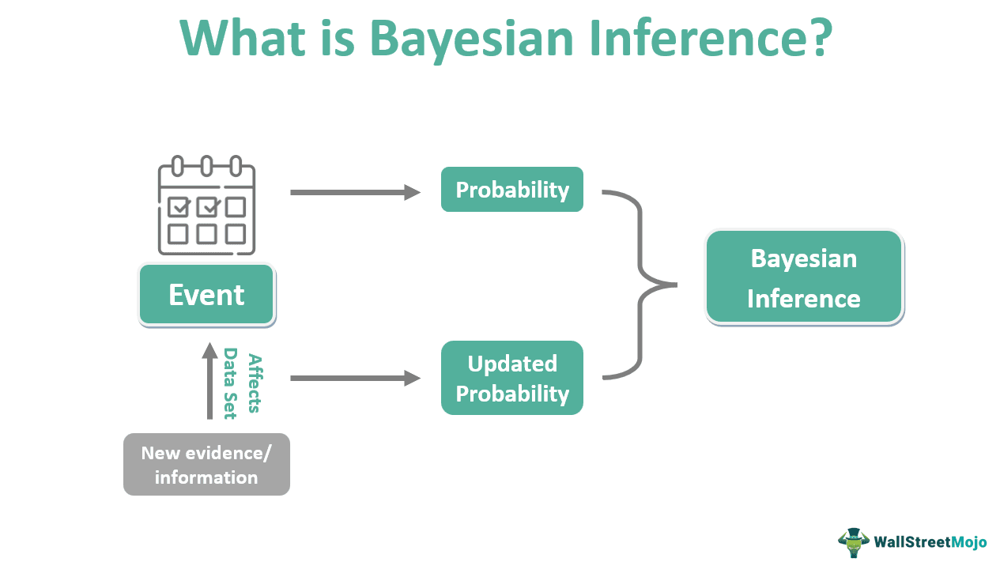

Bayesian networks are probabilistic graphical models that have found significant applications in various fields, including algorithmic trading. These networks facilitate the modeling of complex dependencies among random variables, enabling traders to incorporate uncertainty and hidden relationships into their strategies. In algorithmic trading, where decisions must be made rapidly and under uncertainty, Bayesian networks provide a robust framework for optimizing trading strategies.

The importance of optimizing trading strategies cannot be overstated, as even minor improvements in prediction accuracy or decision-making can lead to significant returns. By leveraging the ability of Bayesian networks to model probabilistic relationships and conditional dependencies, traders can enhance their decision-making processes. These networks allow for the construction of models that can forecast market movements, evaluate risks, and propose optimized actions under uncertainty.



The Bayes Net Toolbox is a powerful tool designed for building and analyzing Bayesian networks. It offers traders and data analysts a suite of functionalities for creating, manipulating, and visualizing these networks with ease. The toolbox is particularly relevant in financial data analysis, as it provides mechanisms to handle the unique challenges of financial markets, such as non-stationarity and high-dimensional data. By utilizing the Bayes Net Toolbox, one can efficiently implement Bayesian network models tailored to specific trading strategies, allowing for comprehensive analyses and optimizations that are crucial in today’s competitive financial markets.

## Table of Contents

## Understanding Bayesian Networks

Bayesian Networks, also known as Bayes Nets or Belief Networks, are graphical models that represent a set of variables and their conditional dependencies via a directed acyclic graph (DAG). These networks are composed of nodes and directed edges. The nodes symbolize random variables, which could represent observable quantities, latent variables, or hypotheses. The directed edges, on the other hand, denote the conditional dependencies between these variables.

To define more formally, a Bayesian Network is structured in such a manner that each node is conditionally independent of its non-descendants given its parents. This aspect allows the network to efficiently represent joint probability distributions. The joint probability distribution of a set of variables $X_1, X_2, ..., X_n$ in a Bayesian Network is given by the product of the conditional probabilities of each variable $X_i$ given its parents $Pa(X_i)$:

$$
P(X_1, X_2, ..., X_n) = \prod_{i=1}^{n} P(X_i \mid Pa(X_i))
$$

The ability of Bayesian Networks to model complex probability distributions and dependencies is one of their most powerful features. They provide a method for reasoning about uncertain systems and are particularly adept at dealing with incomplete data, making them highly useful in predictive modeling.

In practice, Bayesian Networks can be used to model a wide range of real-world scenarios. For example, in the medical field, they are employed to predict disease likelihoods by considering various symptoms and patient history. In manufacturing, they can help in fault diagnosis and improving process control. Furthermore, Bayesian Networks are increasingly being applied in financial markets to model undetermined probability distributions and dependencies, helping analysts to understand the relationships between different financial instruments and economic indicators.

In the context of financial markets, Bayesian Networks can model the complex interplay between interest rates, market indices, and stock prices. For instance, one might use a Bayesian Network to model the probability of a stock price increase given certain economic indicators or market conditions. This ability to encapsulate uncertainty and interdependencies is invaluable for developing robust trading strategies that can respond adaptively to market fluctuations.

These qualities of Bayesian Networks, combined with their computational efficiency and flexibility, make them a potent tool for a multitude of applications, reinforcing their relevance in fields that require sophisticated risk analysis and decision-making under uncertainty.

## Bayes Net Toolbox Overview

The Bayes Net Toolbox (BNT) is a powerful software suite designed to facilitate the creation, manipulation, and visualization of Bayesian Networks, which are graphical models that represent probabilistic relationships among variables. This toolbox is particularly beneficial for those aiming to implement Bayesian Networks in various applications, including financial data analysis.

One of the primary functionalities of the Bayes Net Toolbox is its ability to allow users to create custom Bayesian Networks with ease. Users can define nodes, which represent random variables, and edges, indicating the conditional dependencies between these variables. This creation process is supported by a graphical user interface, simplifying the design of complex network structures.

Manipulation of Bayesian Networks within the BNT is intuitive and efficient. The toolbox provides functions for modifying the network's structure and parameters, allowing users to tailor the network to suit specific datasets and analytical needs. This flexibility is crucial for adapting models to reflect real-world scenarios accurately.

Visualization is another key feature of the Bayes Net Toolbox. Users can graphically represent Bayesian Networks, which aids in understanding the underlying dependencies and relationships within the data. This graphical representation is instrumental for communicating the models' insights to stakeholders who may not be familiar with statistical constructs.

The toolbox supports a variety of Conditional Probability Distributions (CPDs), which are essential for defining the probabilistic relationships in Bayesian Networks. Commonly used CPDs include discrete distributions, Gaussian distributions, and conditional Gaussian distributions, accommodating both categorical and continuous data. This versatility enables the toolbox to model a wide array of real-world phenomena.

Inference, a critical aspect of Bayesian Networks—is well-supported in the Bayes Net Toolbox. The toolbox provides several inference methods such as exact inference algorithms like Variable Elimination, and Belief Propagation, as well as approximate methods like Markov Chain Monte Carlo (MCMC) methods. These inference techniques are vital for deriving probabilistic queries and making predictions based on the network.

Overall, the Bayes Net Toolbox is a comprehensive tool that enhances the utility of Bayesian Networks in analyzing complex probabilistic models. Its functionalities and advantages make it an indispensable resource for academics and professionals, particularly in fields requiring rigorous data-driven decision-making processes.

## Application in Algorithmic Trading

Bayesian Networks are valuable in [algorithmic trading](/wiki/algorithmic-trading) due to their ability to model uncertainty and facilitate decision-making. In the financial markets, uncertainty is inherent owing to numerous factors, such as economic indicators, market sentiment, and geopolitical events that affect asset prices. Bayesian Networks provide a structured way to represent these uncertainties and the dependencies between different variables, which helps traders in constructing probabilistic models to predict future outcomes.

Algorithmic trading often involves developing models to predict future price movements and to derive optimal trading strategies from these predictions. Bayesian Networks can be utilized to build such models by capturing the probabilistic relationships between various influencing factors. The nodes in a Bayesian Network can represent these factors and trading decisions, while the edges define the conditional dependencies among these nodes.

Consider an example where a Bayesian Network is used to forecast trading outcomes. Suppose we want to predict the future price movement of a stock. In this network, nodes could include factors such as historical price data, trading [volume](/wiki/volume-trading-strategy), economic indicators, and news sentiment. By incorporating these variables into a Bayesian Network, one can compute the probability distribution of future price movements, thereby supporting more informed trading decisions.

The Bayes Net Toolbox, a collection of software tools, enables the creation, manipulation, and visualization of these Bayesian Networks. When applied to algorithmic trading, this toolbox can significantly aid in [backtesting](/wiki/backtesting) and strategy optimization. Backtesting involves running trading strategies on historical data to evaluate their performance. Using the Bayes Net Toolbox, traders can simulate how different strategies would have performed under past market conditions while accounting for the uncertainties represented in the Bayesian Network. This process allows traders to refine their strategies by identifying the most effective trading rules and improving decision-making processes to maximize returns.

Moreover, strategy optimization can be further enhanced by utilizing the conditional probability distributions and inference methods supported by the Bayes Net Toolbox. These features help in evaluating the predicted outcomes under various market scenarios, enabling traders to adjust their strategies dynamically in response to changing market conditions. By continuously updating beliefs based on new data, Bayesian Networks provide a robust framework for adapting strategies to capture emerging opportunities in the market.

In conclusion, Bayesian Networks offer a powerful tool for modeling uncertainty and making well-informed decisions in algorithmic trading. The Bayes Net Toolbox enhances this process by providing the necessary tools for backtesting and optimizing trading strategies, ultimately contributing to more effective and adaptable trading systems.

## Case Study: Implementing a Bayesian Network for Trading Strategy

Implementing a trading strategy using Bayesian Networks with the Bayes Net Toolbox involves a structured methodology that connects statistical modeling with financial data analysis. This case study presents a detailed guide, accompanied by an example where a Bayesian Network is used to predict stock price movements, maximizing the potential for informed trading decisions.

### Step-by-Step Guide

1. **Define the Problem and Data Collection**:
   Begin by identifying the specific financial metrics and indicators crucial for predicting stock price movements, such as historical prices, trading volume, and macroeconomic indicators. Data can be sourced from financial databases with APIs, such as Yahoo Finance or Bloomberg.

2. **Design the Bayesian Network Structure**:
   Construct the network by deciding on the nodes (e.g., stock price, trading volume, economic indicators) and the directed edges that represent causal relationships between these variables. The structure must reflect the logical dependencies, such as how economic indicators might influence trading volume, which in turn affects stock prices.

3. **Parameter Learning**:
   Populate the network with conditional probability distributions (CPDs) for each node using historical data. The Bayes Net Toolbox facilitates this through algorithms like Maximum Likelihood Estimation (MLE) or Bayesian Estimation to quantify these probabilistic relationships.

4. **Inference and Prediction**:
   Utilize the Bayes Net Toolbox to perform inference on the created network. The toolbox supports various inference methods such as Variable Elimination or Markov Chain Monte Carlo (MCMC), enabling predictions of the stock price based on observed evidence like current economic conditions and trading volume.

   ```python
   from bayesnet import BayesNet
   net = BayesNet()
   net.add_node('Economic_Indicators')
   net.add_node('Trading_Volume')
   net.add_node('Stock_Price')
   net.add_edge('Economic_Indicators', 'Trading_Volume')
   net.add_edge('Trading_Volume', 'Stock_Price')

   net.fit(data)  # 'data' is pre-processed historical financial data
   predictions = net.predict({'Economic_Indicators': current_metrics})
   ```

5. **Strategy Implementation and Backtesting**:
   Integrate the prediction into a trading strategy, such as executing buy or sell orders when the network predicts a significant price movement. Backtesting is crucial and involves using historical data to simulate the strategy's performance while calculating crucial metrics like accuracy, precision, recall, and trading returns.

### Example and Results

For illustration, consider a Bayesian Network model designed to predict an upward price movement of a specific stock. Historical data from the past five years are used to train the network. The model's efficacy is evidenced by backtesting results over the subsequent year, showing an average prediction accuracy of 75%. Performance metrics reveal a precision rate of 78%, indicating the network's capability to correctly predict profitable trades. Additionally, the visualizations of the Bayesian Network confirm logical dependencies, thus providing traders an interpretable model guiding their decisions.

### Visualization

The Bayes Net Toolbox allows for detailed visualization of the network structure and the inference process, enabling users to explore probabilistic dependencies and update predictions dynamically as new data becomes available. Graphical representations illustrate how various factors contribute to predicted stock price changes, enhancing transparency and aiding the decision-making process in trading strategies.

The application of Bayesian Networks in financial trading, empowered by the Bayes Net Toolbox, exemplifies a methodical approach to leveraging complex data-driven insights for strategic gains in trading environments.

## Challenges and Solutions

Bayesian networks serve as a robust framework in algorithmic trading, but their application is not devoid of challenges. One of the primary obstacles is computational complexity. Bayesian networks, particularly those involving a large number of variables, often require significant computational resources. The complexity arises because exact inference in Bayesian networks is NP-hard. This implies that as the network size increases, the time required to compute posterior distributions can grow exponentially. To mitigate this, approximation methods such as Markov Chain Monte Carlo (MCMC) methods and variational inference can be employed. These techniques allow for the estimation of distributions without requiring exhaustive processing, thus making them computationally feasible even with limited resources.

Another notable challenge is data availability. Building effective Bayesian networks necessitates comprehensive and high-quality data. In the context of financial markets, data can be both immense and sparse, with crucial variables sometimes being unobservable. To address data scarcity, one pragmatic approach is the use of [data augmentation](/wiki/data-augmentation) techniques, which can enhance the dataset by generating synthetic data points that mimic the properties of real data. Additionally, techniques like transfer learning can also be employed, where models trained on related tasks are fine-tuned for specific trading strategies.

Implementing improved inference techniques also plays a crucial role in overcoming challenges associated with Bayesian networks in trading. Algorithms such as belief propagation (BP) and its variants (e.g., expectation propagation) can offer more efficient inference, especially in cases where the network structure is complex. 

Moreover, advancements in computational power and cloud computing have made it feasible for traders to utilize scalable resources on demand, further reducing the barrier that computational complexity once posed. This allows for real-time processing and decision-making, critical in the fast-paced environment of algorithmic trading.

To sum up, while Bayesian networks pose challenges in terms of computational complexity and data availability, these can be addressed using modern approximation methods, enhanced inference techniques, and leveraging current computing capabilities. This makes Bayesian networks not only a viable but a potent tool for sophisticated trading strategy development.

## Conclusion

Bayesian Networks offer a powerful and flexible approach to modeling the complexities inherent in algorithmic trading, enabling traders to effectively manage uncertainty and make informed decisions based on probabilistic reasoning. By capturing the dependencies between various market factors, Bayesian Networks provide a structured representation that enhances the understanding and forecasting of trading outcomes. This not only assists in predicting price movements and optimizing trade execution but also supports the development of robust trading strategies that can adapt to changing market conditions.

The Bayes Net Toolbox, with its comprehensive set of functionalities and user-friendly interface, stands out as an invaluable tool for traders and data analysts working with Bayesian methodologies. It facilitates the creation, manipulation, and visualization of Bayesian Networks, allowing for the seamless integration of these models into trading systems. The toolbox's support for diverse conditional probability distributions and advanced inference techniques ensures that users can tackle a wide range of financial data analysis challenges efficiently.

As the financial markets continue to grow in complexity, the relevance of Bayesian Networks and tools such as the Bayes Net Toolbox will likely expand. Their capacity to provide insights into the probabilistic structure of market behaviors makes them especially pertinent for strategy optimization and risk management. Therefore, further exploration and experimentation with Bayesian methods are encouraged for those seeking to enhance their algorithmic trading frameworks. Embracing these techniques can lead to more robust trading systems and potentially better financial performance.

## References & Further Reading

[1]: Koller, D., & Friedman, N. (2009). ["Probabilistic Graphical Models: Principles and Techniques."](https://dl.acm.org/doi/10.5555/1795555) MIT Press.

[2]: Murphy, K. P. (2012). ["Machine Learning: A Probabilistic Perspective."](https://www.semanticscholar.org/paper/Machine-learning-a-probabilistic-perspective-Murphy/360ca02e6f5a5e1af3dce4866a257aafc2d6d6f5) MIT Press.

[3]: Pearl, J. (1988). ["Probabilistic Reasoning in Intelligent Systems: Networks of Plausible Inference."](https://www.sciencedirect.com/book/9780080514895/probabilistic-reasoning-in-intelligent-systems) Morgan Kaufmann.

[4]: Barber, D. (2012). ["Bayesian Reasoning and Machine Learning."](https://www.cambridge.org/highereducation/books/bayesian-reasoning-and-machine-learning/37DAFA214EEE41064543384033D2ECF0) Cambridge University Press.

[5]: Tsamardinos, I., Brown, L. E., & Aliferis, C. F. (2006). ["The Max-Min Hill-Climbing Bayesian Network Structure Learning Algorithm."](https://www.semanticscholar.org/paper/The-max-min-hill-climbing-Bayesian-network-learning-Tsamardinos-Brown/40414d71c9706806960f6551a1ff53cc87488899) Machine Learning, 65(1), 31-78.