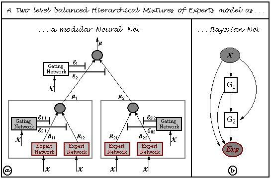

## Table of Contents

## What is a Bayes Net toolbox?

A Bayes Net toolbox is a software package that helps people work with Bayesian networks. Bayesian networks are a way to show how different things are connected and how they affect each other using math and graphs. The toolbox gives you tools to build these networks, change them, and use them to make predictions or decisions.

These toolboxes are useful for people in many fields like medicine, finance, and engineering. They help experts understand complicated situations by showing how different pieces of information fit together. With a Bayes Net toolbox, you can enter data and see how likely different outcomes are, which can help in planning and making choices.

## What are the basic components of a Bayes Net?

A Bayes Net, or Bayesian network, has two main parts: nodes and edges. Nodes are like boxes that stand for different things or events, like the weather or if someone is sick. Each node has a number that shows how likely that thing is to happen. Edges are lines that connect the nodes. They show how the things or events are related to each other. If there's an edge from one node to another, it means the first thing can affect the second thing.

For example, imagine a node for "Rain" and another for "Wet Ground." There would be an edge from "Rain" to "Wet Ground" because rain can make the ground wet. Each node also has a table called a Conditional Probability Table (CPT). This table tells you how likely the event is, given the states of the nodes it's connected to. So, the CPT for "Wet Ground" would show how likely the ground is to be wet if it rains or if it doesn't rain.

Putting it all together, a Bayes Net helps you see how different things are connected and how they affect each other. By using the nodes, edges, and CPTs, you can figure out how likely different outcomes are. This can be really helpful for making decisions or understanding complex situations.

## How does a Bayes Net toolbox help in modeling probabilistic relationships?

A Bayes Net toolbox helps in modeling probabilistic relationships by providing tools to create and manipulate Bayesian networks. These networks are like maps that show how different things are connected and how they affect each other. With the toolbox, you can draw nodes for different events or things, like the weather or if someone is sick, and connect them with edges to show how they relate. For example, you can connect a node for "Rain" to a node for "Wet Ground" because rain can make the ground wet. The toolbox makes it easy to set up these connections and change them as needed.

The toolbox also helps you add numbers to these connections, which are called probabilities. Each node in the network has a table, called a Conditional Probability Table (CPT), that shows how likely the event is, given the states of the nodes it's connected to. For instance, the CPT for "Wet Ground" would tell you how likely the ground is to be wet if it rains or if it doesn't rain. By using the toolbox, you can enter data and see how these probabilities change, which helps you understand how likely different outcomes are. This makes it easier to make decisions or predict what might happen in the future based on the connections and probabilities in the network.

## What are some common applications of Bayes Nets?

Bayes Nets are used in many areas because they help people understand how different things are connected and how they affect each other. In medicine, doctors use Bayes Nets to figure out what might be wrong with a patient. They can put in symptoms and test results as nodes, and the network will show how likely different diseases are, helping doctors make better decisions about treatment. In finance, Bayes Nets help with things like predicting stock prices or figuring out how likely it is that a customer will pay back a loan. Banks can use these networks to see how different factors, like a person's job or credit history, affect the chances of loan repayment.

Another big area where Bayes Nets are used is in engineering and technology. For example, in computer systems, Bayes Nets can help with things like figuring out why a system is not working right. Engineers can set up a network to show how different parts of the system are connected and how likely it is that each part is causing the problem. This helps them find and fix issues faster. In robotics, Bayes Nets are used to help robots understand and navigate the world around them. They can use these networks to figure out where they are, predict where things might be, and plan their next moves based on what they see and know.

## How do you install a Bayes Net toolbox?

Installing a Bayes Net toolbox depends on which one you want to use and what computer system you have. One popular toolbox is the Bayes Net Toolbox (BNT) for MATLAB. To install it, you first need to have MATLAB on your computer. Then, you can download the BNT files from the internet. After downloading, you unzip the files and put them in a folder where MATLAB can find them. Once that's done, you can start MATLAB and add the BNT folder to MATLAB's path. This lets you use the toolbox's functions in your MATLAB programs.

Another option is to use a Python-based toolbox like pgmpy. To install pgmpy, you need Python on your computer. You can then use a tool called pip, which comes with Python, to install pgmpy. Just open a command line or terminal and type "pip install pgmpy" and hit enter. The tool will download and set up pgmpy for you. After it's done, you can start using pgmpy in your Python programs to work with Bayes Nets.

## What are the key functions and tools provided by a Bayes Net toolbox?

A Bayes Net toolbox gives you many tools to help you work with Bayesian networks. You can use it to make new networks by drawing nodes for different things or events and connecting them with edges to show how they're related. The toolbox also lets you add numbers, called probabilities, to these connections. These numbers help you understand how likely different outcomes are based on the connections in the network. You can also change the network if you need to, like adding new nodes or edges, or changing the probabilities.

Another important part of a Bayes Net toolbox is how it helps you use the networks you've made. You can put in data and the toolbox will figure out how likely different outcomes are, which is really helpful for making decisions or predicting what might happen. It can also show you how changing one thing might affect other things in the network. This makes it easier to understand complex situations and plan what to do next. The toolbox often has ways to show the network visually, so you can see how everything is connected and how the probabilities work.

## How can you create and manipulate a Bayes Net using the toolbox?

To create a Bayes Net using the toolbox, you start by drawing nodes for different things or events you want to include in your network. Each node represents something like the weather or if someone is sick. You then connect these nodes with edges to show how they're related. For example, you might connect a node for "Rain" to a node for "Wet Ground" because rain can make the ground wet. After setting up the nodes and edges, you add numbers called probabilities to each node. These numbers show how likely the event is to happen, and they go in a table called a Conditional Probability Table (CPT). The toolbox makes it easy to draw the network and add these probabilities.

Once you have your Bayes Net set up, you can use the toolbox to change it if you need to. You might want to add new nodes or edges, or change the probabilities if you get new information. The toolbox lets you do all of this easily. You can also use the network to figure out how likely different outcomes are by putting in data. The toolbox will then show you the probabilities for different scenarios, which can help you make decisions or predict what might happen. It can also show you how changing one thing might affect other things in the network, making it easier to understand complex situations and plan what to do next.

## What are the differences between various Bayes Net toolboxes available?

Different Bayes Net toolboxes have their own special features and are made for different computer systems. For example, the Bayes Net Toolbox (BNT) is made for MATLAB, which is a special computer program used a lot in math and engineering. BNT has a lot of tools that help you make and change Bayes Nets, like drawing nodes and edges and adding numbers to show how likely things are. Another toolbox, pgmpy, is made for Python, which is a different computer language that many people use for all sorts of things. Pgmpy is good for working with Bayes Nets in Python and has tools that let you make, change, and use these networks in your Python programs.

The toolboxes also have different ways of showing you the Bayes Nets and helping you understand them. BNT, for example, can show you the network in a way that's easy to see and understand if you're using MATLAB. It's good for people who already use MATLAB for other things. Pgmpy, on the other hand, works well with other Python tools and libraries, so it's easier to use if you're already working in Python. Some toolboxes might have more advanced tools for things like figuring out how likely different outcomes are or showing you how changing one thing can affect others, while others might be simpler and easier to learn if you're new to Bayes Nets.

Choosing the right toolbox depends on what computer system you're using and what you need the toolbox to do. If you're already using MATLAB, BNT might be the best choice because it fits well with what you're already doing. If you're using Python, pgmpy is a good option because it works well with other Python tools. Each toolbox has its own strengths and might be better for different kinds of projects or for people with different levels of experience with Bayes Nets.

## How do you perform inference using a Bayes Net toolbox?

To perform inference using a Bayes Net toolbox, you start by putting in the information you have about different things or events into the network. For example, if you're using a network about the weather, you might tell it that it's raining. The toolbox then uses the connections and probabilities you've set up in the network to figure out how likely different outcomes are. It looks at the nodes and edges to see how the things are related and uses the numbers in the Conditional Probability Tables (CPTs) to calculate the probabilities.

Once the toolbox has all the information, it does the math to find out how likely different things are to happen. For instance, if you told the network it's raining, it might tell you how likely it is that the ground will be wet. The toolbox can also show you how changing one thing might affect other things in the network. This helps you understand complex situations and make better decisions or predictions. By using the toolbox, you can see how all the pieces fit together and what might happen next based on what you know now.

## What advanced features does a Bayes Net toolbox offer for complex modeling?

A Bayes Net toolbox has some advanced features that help with complex modeling. One of these is the ability to do something called "parameter learning." This means the toolbox can look at a lot of data and figure out the best numbers, or probabilities, to use in the network. It helps make the network more accurate because it uses real information to decide how likely things are to happen. Another advanced feature is "structure learning," which lets the toolbox figure out how the nodes should be connected based on the data. This is really helpful if you're not sure how things are related, and you want the toolbox to find the best way to show those connections.

The toolbox also has tools for "inference algorithms" that can handle really complicated networks with a lot of nodes and edges. These algorithms can quickly figure out how likely different outcomes are, even when there are a lot of things to consider. Some toolboxes also let you add special kinds of nodes, like "decision nodes" and "utility nodes," which help you make decisions and figure out what's best to do. These features make the toolbox really powerful for understanding and working with complex situations, helping you make better predictions and choices based on a lot of information.

## How can you optimize and validate models created with a Bayes Net toolbox?

To optimize models created with a Bayes Net toolbox, you can use a process called parameter learning. This means you give the toolbox a lot of data, and it figures out the best numbers, or probabilities, to use in the network. This makes the model more accurate because it's based on real information. Another way to optimize is by doing structure learning, where the toolbox finds the best way to connect the nodes based on the data. This helps make sure the model shows the right relationships between things. You can also try different ways to set up the network and see which one works best, like changing how the nodes are connected or using different kinds of nodes.

To validate models, you need to check if they're doing a good job at predicting things. One way to do this is by using something called cross-validation. You split your data into different parts, use some of it to build the model, and then see how well the model predicts the rest of the data. If it does well, that's a good sign that the model is working right. Another way is to compare the model's predictions to what actually happens in real life. If the model's guesses are close to what really happens, you know it's a good model. By optimizing and validating your models, you can make sure they're as helpful and accurate as possible when you use them to understand complex situations and make decisions.

## What are the current research trends and future directions for Bayes Net toolboxes?

Current research trends in Bayes Net toolboxes focus on making them easier to use and more powerful. One big trend is improving how these toolboxes learn from data. Researchers are working on better ways for the toolboxes to figure out the best numbers, or probabilities, to use in the networks. They're also trying to make the toolboxes better at figuring out how the nodes should be connected based on the data. Another trend is making the toolboxes work faster and handle bigger, more complicated networks. This means they can be used for more things, like understanding really complex situations in medicine or finance.

Future directions for Bayes Net toolboxes include making them work well with other kinds of computer models. For example, researchers are looking at ways to combine Bayes Nets with other tools like [machine learning](/wiki/machine-learning) models. This could make the toolboxes even better at predicting things and understanding how different pieces of information fit together. Another future direction is making the toolboxes easier for more people to use, even if they're not experts in math or computers. By making them more user-friendly, more people can use Bayes Nets to help with their work and make better decisions.

## What is the understanding of Bayesian Networks?

Bayesian Networks, also known as Bayes Nets or Belief Networks, are graphical models that represent a set of variables and their conditional dependencies via a directed acyclic graph (DAG). These networks are composed of nodes and directed edges. The nodes symbolize random variables, which could represent observable quantities, latent variables, or hypotheses. The directed edges, on the other hand, denote the conditional dependencies between these variables.

To define more formally, a Bayesian Network is structured in such a manner that each node is conditionally independent of its non-descendants given its parents. This aspect allows the network to efficiently represent joint probability distributions. The joint probability distribution of a set of variables $X_1, X_2, ..., X_n$ in a Bayesian Network is given by the product of the conditional probabilities of each variable $X_i$ given its parents $Pa(X_i)$:

$$
P(X_1, X_2, ..., X_n) = \prod_{i=1}^{n} P(X_i \mid Pa(X_i))
$$

The ability of Bayesian Networks to model complex probability distributions and dependencies is one of their most powerful features. They provide a method for reasoning about uncertain systems and are particularly adept at dealing with incomplete data, making them highly useful in predictive modeling.

In practice, Bayesian Networks can be used to model a wide range of real-world scenarios. For example, in the medical field, they are employed to predict disease likelihoods by considering various symptoms and patient history. In manufacturing, they can help in fault diagnosis and improving process control. Furthermore, Bayesian Networks are increasingly being applied in financial markets to model undetermined probability distributions and dependencies, helping analysts to understand the relationships between different financial instruments and economic indicators.

In the context of financial markets, Bayesian Networks can model the complex interplay between interest rates, market indices, and stock prices. For instance, one might use a Bayesian Network to model the probability of a stock price increase given certain economic indicators or market conditions. This ability to encapsulate uncertainty and interdependencies is invaluable for developing robust trading strategies that can respond adaptively to market fluctuations.

These qualities of Bayesian Networks, combined with their computational efficiency and flexibility, make them a potent tool for a multitude of applications, reinforcing their relevance in fields that require sophisticated risk analysis and decision-making under uncertainty.

## References & Further Reading

[1]: Koller, D., & Friedman, N. (2009). ["Probabilistic Graphical Models: Principles and Techniques."](https://dl.acm.org/doi/10.5555/1795555) MIT Press.

[2]: Murphy, K. P. (2012). ["Machine Learning: A Probabilistic Perspective."](https://www.semanticscholar.org/paper/Machine-learning-a-probabilistic-perspective-Murphy/360ca02e6f5a5e1af3dce4866a257aafc2d6d6f5) MIT Press.

[3]: Pearl, J. (1988). ["Probabilistic Reasoning in Intelligent Systems: Networks of Plausible Inference."](https://www.sciencedirect.com/book/9780080514895/probabilistic-reasoning-in-intelligent-systems) Morgan Kaufmann.

[4]: Barber, D. (2012). ["Bayesian Reasoning and Machine Learning."](https://www.cambridge.org/highereducation/books/bayesian-reasoning-and-machine-learning/37DAFA214EEE41064543384033D2ECF0) Cambridge University Press.

[5]: Tsamardinos, I., Brown, L. E., & Aliferis, C. F. (2006). ["The Max-Min Hill-Climbing Bayesian Network Structure Learning Algorithm."](https://www.semanticscholar.org/paper/The-max-min-hill-climbing-Bayesian-network-learning-Tsamardinos-Brown/40414d71c9706806960f6551a1ff53cc87488899) Machine Learning, 65(1), 31-78.