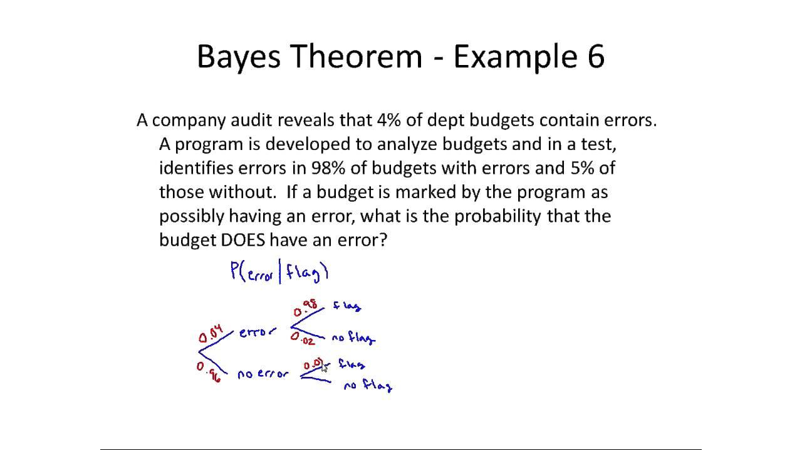

## Table of Contents

## What is Bayes' Theorem?

Bayes' Theorem is a way to figure out how likely something is, given some new information. Imagine you want to know the chance that it will rain today. You might start with a guess based on the weather forecast. But then, if you see dark clouds in the sky, you can use Bayes' Theorem to update your guess and get a better idea of the chance of rain.

This theorem is really helpful because it lets us update our beliefs as we get new evidence. It's used in lots of places, like medicine, where doctors might use it to figure out the chance a patient has a certain disease based on their symptoms and test results. By starting with what we already know and then adding new information, Bayes' Theorem helps us make smarter decisions.

## Who was Thomas Bayes?

Thomas Bayes was a minister and mathematician from England who lived a long time ago, from around 1701 to 1761. He is famous for coming up with something called Bayes' Theorem, which helps us figure out how likely something is based on new information. Even though he worked on this idea, he didn't share it with others while he was alive. It was only after he passed away that his friend found his work and decided to publish it.

Bayes was interested in understanding how we can update our guesses when we learn new things. His theorem is now used in many areas, like science, medicine, and even in computers to help them make decisions. Even though Thomas Bayes didn't see how important his work would become, people today still use his ideas to solve problems and make better choices.

## What is the formula for Bayes' Theorem?

Bayes' Theorem is a way to update what we think is likely when we get new information. The formula for Bayes' Theorem is: P(A|B) = [P(B|A) * P(A)] / P(B). Here, P(A|B) means the probability of event A happening given that event B has happened. P(B|A) is the probability of event B happening given that event A has happened. P(A) is the initial probability of event A happening, and P(B) is the probability of event B happening.

Let's break it down with an example. Imagine you want to know the chance it will rain today (event A) given that you see dark clouds (event B). P(A|B) is what you want to find out - the chance of rain given the dark clouds. P(B|A) is the chance of seeing dark clouds if it's going to rain. P(A) is your initial guess about the chance of rain, and P(B) is the overall chance of seeing dark clouds, rain or no rain. By plugging these into the formula, you can update your guess about the chance of rain based on the new information of seeing dark clouds.

## How do you interpret the components of Bayes' Theorem?

The first part of Bayes' Theorem, P(A|B), is what we want to figure out. It's the chance that something we're interested in (event A) will happen, given that something else (event B) has already happened. For example, if A is "it will rain" and B is "there are dark clouds," P(A|B) is the chance it will rain given that we see dark clouds. This is what we're trying to update our guess about.

The other parts help us do this update. P(B|A) is the chance that the thing we've seen (event B) would happen if our event of interest (event A) were true. In our example, it's the chance of seeing dark clouds if it's going to rain. P(A) is our starting guess about how likely event A is, without considering the new information. In our example, it's our initial guess about the chance of rain. P(B) is the overall chance of seeing the thing we've seen (event B), whether or not event A happens. In our example, it's the chance of seeing dark clouds, rain or no rain. By using these parts in the formula, we can update our guess about the chance of rain based on seeing dark clouds.

## Can you provide a simple example of Bayes' Theorem in action?

Imagine you're trying to figure out if it's going to rain today. You start by thinking there's a 30% chance of rain (P(A) = 0.30). Now, you look outside and see dark clouds. You know that if it's going to rain, there's an 80% chance you'll see dark clouds (P(B|A) = 0.80). But dark clouds can also appear even if it's not going to rain, and you estimate there's a 20% chance of seeing dark clouds on a non-rainy day. Overall, you figure there's a 34% chance of seeing dark clouds any day (P(B) = 0.34).

Using Bayes' Theorem, you can update your guess about the chance of rain given the dark clouds. The formula is P(A|B) = [P(B|A) * P(A)] / P(B). Plugging in the numbers, you get P(A|B) = [0.80 * 0.30] / 0.34 = 0.7059. So, after seeing the dark clouds, your updated guess is that there's about a 71% chance it will rain today. This shows how Bayes' Theorem helps you make a better guess by considering new information.

## What are the practical applications of Bayes' Theorem?

Bayes' Theorem is used a lot in medicine to help doctors figure out how likely it is that a patient has a certain disease. Imagine a patient comes in with a fever. The doctor starts with a guess about the chance of the patient having the flu based on what's going around. Then, they do a test. The test might not be perfect, but it gives more information. Using Bayes' Theorem, the doctor can update their guess about the flu, taking into account both the test results and what they knew before. This helps them make better decisions about treatment and further tests.

Another place where Bayes' Theorem is really helpful is in spam filters for emails. When you get an email, the filter starts with a guess about whether it's spam or not. Then, it looks at words in the email. Some words, like "free" or "click here," are more common in spam. The filter uses Bayes' Theorem to update its guess about the email being spam based on these words. Over time, as it learns from more emails, the filter gets better at sorting spam from regular mail, making your inbox cleaner and safer.

Bayes' Theorem is also used in machine learning and artificial intelligence. For example, in self-driving cars, the system might start with a guess about what an object on the road is. As it gets more information from sensors and cameras, it updates its guess using Bayes' Theorem. This helps the car make safer and smarter decisions about how to navigate the road. By constantly updating guesses with new information, these systems can learn and improve over time.

## How does Bayes' Theorem relate to conditional probability?

Bayes' Theorem is all about updating what we think is likely when we get new information. It's like having a first guess and then making it better with new clues. The theorem uses something called conditional probability, which is the chance that one thing happens given that another thing has already happened. In Bayes' Theorem, we see this in P(A|B), which is the chance of event A happening given that event B has happened. So, Bayes' Theorem helps us figure out this conditional probability by mixing our first guess with the new information.

For example, imagine you're trying to guess if it will rain today. You start with a guess about the chance of rain, but then you see dark clouds. The chance of rain given the dark clouds is a conditional probability. Bayes' Theorem takes your first guess about rain, adds in how likely it is to see dark clouds if it's going to rain, and then updates your guess to make it more accurate. By using conditional probability in this way, Bayes' Theorem helps us make better guesses and decisions based on the latest information we have.

## What is the difference between Bayesian and frequentist statistics?

Bayesian and frequentist statistics are two different ways to look at data and make guesses about the world. In frequentist statistics, you start by thinking about how likely it is to get the data you have if a certain thing is true. You do this without changing your first guess about the thing you're interested in. It's like rolling a die and figuring out if it's fair by seeing how often you get certain numbers. Frequentists focus on the data and use it to test if their guesses are right, but they don't update their guesses as they get more data.

On the other hand, Bayesian statistics is all about updating your guesses as you get new information. If you start with a guess about something, like the chance it will rain, you can change that guess when you see dark clouds. Bayesians use something called Bayes' Theorem to mix their first guess with new data, making their guesses better over time. It's like learning from experience and getting smarter as you go. While frequentists stick to their first guesses and test them against data, Bayesians keep updating their guesses to make them as accurate as possible.

## How can Bayes' Theorem be used in machine learning?

Bayes' Theorem is really helpful in machine learning because it helps computers learn from new information and make better guesses. Imagine a computer trying to figure out if an email is spam or not. It starts with a guess about whether the email is spam based on what it knows so far. Then, it looks at words in the email. Some words, like "free" or "click here," are more common in spam. The computer uses Bayes' Theorem to update its guess about the email being spam based on these words. Over time, as it sees more emails, it gets better at sorting spam from regular mail, making your inbox cleaner and safer.

Another way Bayes' Theorem is used in machine learning is in things like self-driving cars. The car's computer might start with a guess about what an object on the road is. As it gets more information from sensors and cameras, it updates its guess using Bayes' Theorem. This helps the car make safer and smarter decisions about how to navigate the road. By constantly updating guesses with new information, these systems can learn and improve over time, making them better at their jobs.

## What are some common misconceptions about Bayes' Theorem?

One common misconception about Bayes' Theorem is that it's only for math experts or scientists. But really, it's a way to update our guesses with new information that anyone can use. Imagine you're guessing if it will rain. You start with a guess, then see dark clouds and update your guess. That's Bayes' Theorem in action! It's not just for complicated math problems; it's a simple way to make better decisions based on what we learn.

Another misconception is that Bayes' Theorem gives us the final answer. But it's more like a tool to help us keep learning and adjusting our guesses. As we get more information, we use Bayes' Theorem to update what we think is likely. It's not about getting the perfect answer right away, but about getting better over time as we learn more. So, it's a way to keep improving our guesses, not a one-time solution.

## How do you handle continuous variables in Bayes' Theorem?

When you're working with continuous variables in Bayes' Theorem, things get a bit trickier than with simple yes-or-no events. Continuous variables are things like height, weight, or temperature, which can have any value within a range. To use Bayes' Theorem with these, you need to use something called probability density functions (PDFs). A PDF tells you how likely it is to get a certain value of a continuous variable. Instead of using simple probabilities like P(A), you use these PDFs to figure out the chance of getting a specific value or range of values.

For example, imagine you're trying to guess someone's height based on their shoe size. You start with a guess about their height, which you can show with a PDF. Then, you learn their shoe size, which also has its own PDF. Using Bayes' Theorem, you can update your guess about their height by mixing your first guess with the new information about their shoe size. This involves some math with the PDFs, but the idea is the same: you're updating your guess with new information. By doing this, you can make a better guess about someone's height, even though both height and shoe size are continuous variables.

## Can you explain a complex real-world application of Bayes' Theorem?

Imagine you're a doctor trying to figure out if a patient has a rare disease. This disease only affects 1 in every 10,000 people, but you have a test that can help. The test is pretty good, catching the disease 99% of the time when someone has it. But it's not perfect and can give a false positive 5% of the time. So, if a patient tests positive, how sure can you be that they actually have the disease? This is where Bayes' Theorem comes in. You start with the low chance of the disease (1 in 10,000), then factor in the test results. Even with a positive test, the chance the patient has the disease is still only about 2%, because false positives are more common than true cases of the disease. Bayes' Theorem helps you weigh the test results against the rarity of the disease to make a more informed guess.

Now think about how this applies to something like self-driving cars. These cars use lots of sensors and cameras to see the world around them. They have to make quick decisions, like whether an object on the road is a person or just a bag of trash. The car starts with a guess about what the object might be, based on its shape and movement. As it gets more information from its sensors, it updates its guess using Bayes' Theorem. For example, if the object starts moving in a way that people usually move, the car might increase its guess that it's a person. By constantly updating its guesses with new information, the car can make safer and smarter decisions about how to drive. This is a complex real-world use of Bayes' Theorem, where the car keeps learning and adjusting its understanding of the world to navigate safely.

## What is Bayes' Theorem and how can it be understood?

Bayes' Theorem, formulated by the 18th-century mathematician Thomas Bayes, is a fundamental concept in the field of probability and statistics. It provides a systematic method to update the probability estimate for a hypothesis as additional evidence is acquired. Mathematically, Bayes' Theorem is expressed as:

$$
P(A|B) = \frac{P(B|A) \cdot P(A)}{P(B)}
$$

where:
- $P(A|B)$ is the posterior probability, or the probability of hypothesis $A$ being true given the data $B$.
- $P(B|A)$ is the likelihood, or the probability of observing data $B$ given that the hypothesis $A$ is true.
- $P(A)$ is the prior probability, or the initial estimate of the probability of hypothesis $A$.
- $P(B)$ is the marginal likelihood, or the probability of observing the data under all possible hypotheses.

Bayes' Theorem has diverse applications across various domains, particularly in situations that require probability adjustment with the arrival of new data. In finance, it aids in the continuous evaluation of risk and the forecasting of asset prices, making it an essential tool for modern trading algorithms. By recalibrating predictions with new market data, financial models become more robust and versatile in rapidly changing environments.

In medicine, Bayes' Theorem is employed in diagnostic procedures to calculate the likelihood of a condition given specific test results, thereby sharpening the precision of diagnostic tools. The theorem's ability to update probabilities with empirical evidence makes it exceptionally valuable in disciplines where prior knowledge and current observations need to be synthesized continuously.

Incorporating Bayes' Theorem into trading algorithms yields a mathematically rigorous approach to refining predictions and assessing risk. Trading environments are often characterized by high [volatility](/wiki/volatility-trading-strategies) and uncertainty, necessitating methods that can adapt to spontaneous shifts in market dynamics. By harnessing Bayesian inference, traders can construct models that not only predict trends with greater accuracy but also manage uncertainty more effectively, opening avenues for optimized decision-making and risk management.

## What is the role of Bayesian Probability in Statistical Analysis?

Bayesian probability employs the principles of Bayesian inference to continually update the probability of hypotheses as new evidence becomes available. This statistical method effectively contrasts with traditional frequentist approaches, which typically rely on fixed datasets and do not accommodate the evolving nature of data. In Bayesian theory, probabilities are treated as degrees of belief or prior knowledge that can be adjusted when new data surfaces. This adaptability makes Bayesian methods particularly well-suited for volatile environments like financial markets, where conditions and data are constantly changing.

One of the key features of Bayesian probability is its allowance for subjective beliefs to be incorporated into the statistical model. This is achieved through the concept of a prior probability, which reflects the initial degree of belief in a hypothesis before new evidence is considered. As new information is gathered, Bayes' Theorem is applied to update this belief, calculated as the posterior probability:

$$
P(H|E) = \frac{P(E|H) \cdot P(H)}{P(E)}
$$

where $P(H|E)$ is the posterior probability of hypothesis $H$ given the evidence $E$, $P(E|H)$ is the likelihood of observing evidence $E$ under the hypothesis $H$, $P(H)$ is the prior probability of the hypothesis, and $P(E)$ is the marginal likelihood of the evidence.

In financial markets, where data is dynamic and conditions fluctuate rapidly, Bayesian probability offers a substantial advantage by integrating prior information with new data. This ongoing revision process enables more accurate and adaptive predictions. Moreover, the flexible nature of Bayesian [statistics](/wiki/bayesian-statistics) permits integration with other complex models and frameworks, such as [machine learning](/wiki/machine-learning), to further enhance predictive capabilities and decision-making processes.

The ability to update beliefs with new evidence in real-time enables Bayesian methods to provide a robust framework for handling uncertainty and making informed predictions. This continuous learning mechanism not only improves model accuracy but also aids in risk management, as it equips traders with the tools to respond promptly and effectively to market developments.

## References & Further Reading

[1]: Pearl, J. (1988). ["Probabilistic Reasoning in Intelligent Systems: Networks of Plausible Inference."](https://www.sciencedirect.com/book/9780080514895/probabilistic-reasoning-in-intelligent-systems) Morgan Kaufmann.

[2]: [Bayesian Data Analysis](http://www.stat.columbia.edu/~gelman/book/) by Andrew Gelman, John B. Carlin, Hal S. Stern, David B. Dunson, Aki Vehtari, and Donald B. Rubin.

[3]: Barber, D. (2012). ["Bayesian Reasoning and Machine Learning"](https://www.cambridge.org/highereducation/books/bayesian-reasoning-and-machine-learning/37DAFA214EEE41064543384033D2ECF0) Cambridge University Press.

[4]: Koller, D. & Friedman, N. (2009). ["Probabilistic Graphical Models: Principles and Techniques."](http://mcb111.org/w06/KollerFriedman.pdf) MIT Press.

[5]: Murphy, K P. (2012). ["Machine Learning: A Probabilistic Perspective."](https://www.semanticscholar.org/paper/Machine-learning-a-probabilistic-perspective-Murphy/360ca02e6f5a5e1af3dce4866a257aafc2d6d6f5) MIT Press.