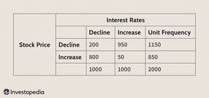

## Table of Contents

## What is Bayesian financial forecasting?

Bayesian financial forecasting is a way to predict future financial trends using a special kind of math called Bayesian statistics. This method starts with what you already know or believe about the financial market, which is called the "prior" knowledge. Then, as new financial data comes in, you update your beliefs to make them more accurate. This updating process helps create a more reliable forecast because it takes into account both old and new information.

In simple terms, imagine you're trying to guess if it will rain tomorrow. You start with what you know about the weather today and in the past. As new weather reports come in, you adjust your guess. Bayesian financial forecasting works the same way but with financial data like stock prices or economic indicators. By constantly updating your predictions with the latest data, you can make better financial decisions, like when to buy or sell stocks.

## How does Bayesian forecasting differ from traditional forecasting methods?

Bayesian forecasting and traditional forecasting methods have different ways of making predictions. Traditional methods often use past data to make future predictions without changing their basic assumptions. For example, they might use a simple average of past stock prices to predict future prices. These methods don't usually update their starting assumptions as new data comes in. They stick to what they know at the beginning and use that to make their forecasts.

On the other hand, Bayesian forecasting is more flexible. It starts with what you already know, called the "prior," but it doesn't stop there. As new data comes in, Bayesian methods update these priors to make them more accurate. This means that if something unexpected happens in the market, like a sudden drop in stock prices, Bayesian forecasting can quickly adjust its predictions to reflect this new information. This makes it better at handling uncertainty and changing conditions in the financial world.

In summary, while traditional methods rely on fixed assumptions and historical data, Bayesian forecasting continuously learns and adapts. This ability to update predictions with new information can lead to more accurate forecasts, especially in the ever-changing world of finance.

## What are the basic principles of Bayesian statistics?

Bayesian statistics is a way of thinking about probability that starts with what you already know or believe. This starting point is called the "prior" belief. For example, if you want to know if it will rain tomorrow, you might start with what you know about the weather today and in the past. This prior belief helps you make a first guess about the future.

As new information comes in, Bayesian statistics lets you update your beliefs. This updating process is done using something called Bayes' theorem. If it suddenly starts to get cloudy, you can use this new information to change your guess about rain. By constantly updating your beliefs with new data, Bayesian statistics helps you make better predictions because it takes into account both what you knew before and what you're learning now.

This way of updating beliefs is very useful in many fields, like medicine, finance, and even everyday decision-making. It helps you deal with uncertainty and make decisions based on the best available information at any given time. By being flexible and always learning, Bayesian statistics can lead to more accurate and reliable results.

## Can you explain the concept of prior and posterior distributions in Bayesian forecasting?

In Bayesian forecasting, the "prior" distribution is like your starting guess about what might happen in the future. It's based on what you already know or believe before you see any new data. For example, if you're trying to predict stock prices, your prior might be based on past stock prices and your general understanding of the market. This prior is important because it sets the stage for your predictions.

As new data comes in, like daily stock prices or economic reports, you use it to update your guess. This updated guess is called the "posterior" distribution. The posterior takes into account both your original prior and the new information. It's like refining your prediction to make it more accurate. By constantly updating your prior with new data to form the posterior, Bayesian forecasting helps you make better and more reliable predictions over time.

## What types of financial data are commonly used in Bayesian forecasting?

In Bayesian forecasting, people often use different types of financial data to make their predictions. This can include things like stock prices, which are the prices at which stocks are bought and sold. They also look at economic indicators, which are numbers that tell us about the health of the economy, like unemployment rates or inflation rates. Another type of data is interest rates, which are what banks charge for loans or what they pay on savings. All these pieces of information help in making better guesses about what might happen in the financial world.

Another important set of data used in Bayesian forecasting is company financials. This includes things like earnings reports, which tell us how much money a company made or lost in a certain period. People also look at balance sheets, which show a company's assets and liabilities, and cash flow statements, which show how money moves in and out of a company. By using all this data, Bayesian forecasting can adapt and refine its predictions as new information comes in, helping to make more accurate financial forecasts.

## How do you select an appropriate prior distribution for financial forecasting?

Choosing the right prior distribution for financial forecasting is important because it sets the starting point for your predictions. You want to pick a prior that reflects what you already know about the financial market. For example, if you're forecasting stock prices, you might start with a prior based on past stock prices and your general understanding of how the market works. Sometimes, if you don't have a lot of specific information, you might use a "non-informative" prior, which doesn't influence your predictions too much and lets the new data do most of the work.

Once you have a sense of what you know, you can choose a type of distribution that fits this knowledge. Common choices include normal distributions, which are good for data that tends to cluster around an average, or uniform distributions, which are useful when you think all outcomes are equally likely. The key is to make sure your prior makes sense with what you know and doesn't lead your predictions in the wrong direction. As new data comes in, you'll update this prior to form your posterior, so starting with a good prior helps make your overall forecasts more accurate.

## What are some common Bayesian models used in financial forecasting?

In financial forecasting, one common Bayesian model is the Bayesian Vector Autoregression (BVAR) model. This model looks at how different financial variables, like stock prices and interest rates, affect each other over time. It starts with a prior belief about these relationships and then updates this belief as new data comes in. This makes the BVAR model good at predicting how changes in one part of the economy might affect other parts, like how a change in interest rates might influence stock prices.

Another popular model is the Bayesian Dynamic Linear Model (DLM). This model is great for forecasting time series data, like daily stock prices or monthly economic indicators. It uses a prior distribution to start and then updates this prior with new data to make predictions. The DLM is flexible and can handle changes in the data over time, making it useful for predicting things like stock market trends or economic growth.

A third model often used is the Bayesian Stochastic Volatility (SV) model. This model focuses on predicting the volatility, or how much prices might go up and down, in financial markets. It starts with a prior about how volatile the market might be and then updates this with new data. The SV model is especially useful for traders and investors who need to understand and predict how risky their investments might be.

## How can Bayesian methods help in managing financial risk?

Bayesian methods can help manage financial risk by updating predictions as new information comes in. Imagine you're trying to guess if it's safe to invest in a stock. You start with what you know about the stock's past performance and the overall market. As new data comes in, like daily stock prices or economic reports, you use Bayesian methods to update your guess. This means you can quickly adjust your view on how risky the stock is based on the latest information. By constantly refining your predictions, you can make better decisions about whether to buy, sell, or hold onto your investments.

Another way Bayesian methods help is by dealing with uncertainty. Financial markets can be unpredictable, and traditional methods might not handle this well. But Bayesian methods are good at working with uncertainty because they start with a "prior" belief and then update it as new data arrives. This helps you see a range of possible outcomes and how likely they are. For example, if there's a sudden change in the market, Bayesian methods can show you how this might affect your investments and help you decide if you need to take action to reduce your risk. By understanding the uncertainty better, you can manage your financial risk more effectively.

## What are the computational challenges in implementing Bayesian financial forecasting?

Implementing Bayesian financial forecasting can be tricky because it requires a lot of computing power. When you use Bayesian methods, you need to update your predictions every time new data comes in. This means running lots of calculations, especially if you're dealing with big sets of financial data like stock prices or economic indicators. Computers need to work hard to do these updates quickly and accurately, which can be a challenge, especially if you're using complex models like Bayesian Vector Autoregression or Stochastic Volatility models.

Another challenge is dealing with something called "Markov Chain Monte Carlo" (MCMC) methods. These are often used in Bayesian forecasting to figure out the best predictions. MCMC methods involve running many simulations to see all the possible outcomes and how likely they are. This can take a long time and needs a lot of computer memory. If you don't have powerful enough computers, it can slow down your forecasting and make it harder to get quick, reliable results. So, having the right technology is really important for making Bayesian financial forecasting work well.

## How do you validate and test the accuracy of Bayesian financial forecasts?

To check if Bayesian financial forecasts are accurate, you can use something called "backtesting." This means you take your forecasting model and use it to predict what would have happened in the past. You compare these predictions to what actually happened. If your model's guesses are close to the real results, then it's probably good at forecasting. Another way to test the model is to split your data into two parts: one part for training the model and the other part for testing it. You train your model on the first part and then see how well it predicts the second part. This helps you see if the model can work well with new data it hasn't seen before.

Another important way to validate Bayesian financial forecasts is by looking at how well they handle uncertainty. Bayesian methods give you not just a single prediction but a range of possible outcomes and how likely each one is. You can check if this range covers the actual results most of the time. If it does, it means your model is good at understanding and dealing with uncertainty in the financial markets. By using these methods, you can feel more confident that your Bayesian financial forecasts are reliable and useful for making decisions.

## Can you discuss a case study where Bayesian forecasting significantly improved financial decision-making?

One great example of Bayesian forecasting helping with financial decisions happened at a big investment bank. The bank wanted to predict how stock prices would move in the future. They used a Bayesian Vector Autoregression (BVAR) model, which looks at how different financial things, like stock prices and interest rates, affect each other. The bank started with what they already knew about the market and then updated their predictions every day with new data. This helped them make better guesses about which stocks would go up or down. Because the model kept learning from new information, the bank was able to make smarter investment choices and ended up making more money than they would have with older methods.

Another case study involves a hedge fund that used Bayesian methods to manage risk. The fund was interested in predicting how risky their investments were, especially in the stock market. They used a Bayesian Stochastic Volatility (SV) model, which focuses on how much stock prices might go up and down. By starting with their initial beliefs about market volatility and then updating these beliefs with new data, the fund could see a range of possible outcomes and how likely each one was. This helped them understand the risks better and make decisions about when to buy or sell stocks. As a result, the hedge fund was able to reduce their losses during market downturns and improve their overall performance.

## What are the future trends and developments in Bayesian financial forecasting?

In the future, Bayesian financial forecasting is likely to become even more important as technology gets better. Computers are getting faster and can handle more data, which means Bayesian methods can be used more easily. This is good because Bayesian forecasting needs a lot of computing power to keep updating predictions with new information. Also, more and more financial data is becoming available, like real-time stock prices and social media sentiment. This means Bayesian models can use even more information to make better predictions. As a result, more businesses and investors might start using Bayesian methods to make smarter financial decisions.

Another trend is the use of machine learning with Bayesian forecasting. Machine learning can help find patterns in big sets of financial data, and when combined with Bayesian methods, it can make forecasts even more accurate. For example, machine learning can help choose the best starting guesses, or "priors," for Bayesian models. This makes the models better at predicting things like stock prices or economic trends. As machine learning and Bayesian methods work together more, we might see new tools and software that make it easier for everyone to use these advanced forecasting techniques.

## What is Bayesian Analysis: A Brief Overview?

Bayesian analysis is fundamentally based on Bayes' Theorem, a principle that allows for updating the probability estimate for a hypothesis as additional evidence or information becomes available. Mathematically, Bayes' Theorem is expressed as:

$$
P(A|B) = \frac{P(B|A) \cdot P(A)}{P(B)}
$$

where $P(A|B)$ is the posterior probability, representing the updated belief about hypothesis $A$ after considering new evidence $B$. $P(B|A)$ is the likelihood, which is the probability of observing the evidence given that the hypothesis is true. $P(A)$ is the prior probability, representing the initial belief before observing the new data, and $P(B)$ is the marginal likelihood or the probability of observing the evidence under all possible hypotheses.

Bayesian methods differ from classical statistical approaches by treating model parameters as random variables rather than fixed quantities. This characteristic allows Bayesian analysis to model uncertainty more accurately, offering a distinct advantage in situations where data conditions are limited or subject to change. In Bayesian analysis, all parameters come with distributions, enabling a deeper understanding of the problem where parameter uncertainty is explicitly considered.

A cornerstone of Bayesian analysis is the utilization of prior and posterior probabilities. The prior distribution reflects existing knowledge or beliefs about a parameter before new data is introduced. As new data becomes available, the prior is updated to the posterior distribution, incorporating new evidence through the likelihood. This dynamic process of updating beliefs makes Bayesian analysis particularly adept in real-world environments where data may evolve over time.

By embracing the variability inherent in most data, Bayesian analysis provides a flexible framework for decision-making under uncertainty—one that adapts as the landscape of information changes. This flexibility is crucial in fields like finance, where data scarcity and rapidly changing conditions are common challenges. Furthermore, Bayesian approaches facilitate probabilistic interpretations, allowing for richer, more nuanced analysis and predictions.

## What is the relationship between Algorithmic Trading and Bayesian Methods?

Algorithmic trading uses computational tools and algorithms to identify and exploit market inefficiencies, executing trades with precision and speed. Bayesian methods, with their capacity to update predictions continuously as new data emerges, play a vital role in enhancing the effectiveness of algorithmic strategies.

Bayesian approaches incorporate new information dynamically, allowing traders to adapt their strategies in real-time based on current market trends. This adaptability is critical in financial markets, where conditions can change rapidly. By employing Bayesian models, traders can evaluate the probability of various market scenarios and adjust their trading algorithms accordingly.

The strength of Bayesian models in [algorithmic trading](/wiki/algorithmic-trading) lies in their ability to quantify the confidence in prediction outcomes. This probabilistic approach provides a framework for assessing the likelihood of future market movements, enabling traders to refine their strategies by evaluating the uncertainty associated with their predictions. For instance, if a Bayesian model indicates a high probability of a stock price increase, traders might allocate more resources to buying that stock.

In high-frequency trading ([HFT](/wiki/high-frequency-trading-strategies)) environments, where decisions must be made in milliseconds, the flexibility of Bayesian methods is particularly beneficial. Bayesian models can rapidly assimilate new data, thus maintaining robust predictive capabilities even as markets fluctuate. The mathematical foundation of Bayesian inference allows for the continuous update of probability distributions, which is expressed as:

$$
P(\theta | X) = \frac{P(X | \theta) \cdot P(\theta)}{P(X)}
$$

Where $P(\theta | X)$ is the posterior probability of the model parameters $\theta$ given the data $X$, $P(X | \theta)$ is the likelihood of the data under parameter $\theta$, $P(\theta)$ is the prior probability of the parameters, and $P(X)$ is the marginal likelihood of the data.

Bayesian inference techniques can be implemented using programming languages like Python. Libraries such as PyMC3 are particularly helpful in constructing complex models and performing Bayesian inference. Below is a simple example of how a Bayesian model could be constructed to predict the direction of a stock price movement:

```python
import pymc3 as pm
import numpy as np

# Sample data: observed market movement (-1 for down, 1 for up)
observed_data = np.array([1, -1, 1, 1, -1, 1, -1])

with pm.Model() as model:
    # Define a prior for the probability of upward movement
    p = pm.Beta('p', alpha=1, beta=1)

    # Likelihood: Using a Bernoulli likelihood for the observed data
    observations = pm.Bernoulli('obs', p=p, observed=(observed_data == 1))

    # Inference
    trace = pm.sample(1000, return_inferencedata=False)

# Visualization of the posterior distribution
pm.plot_posterior(trace, var_names=['p'])
```

This model evaluates the probability of upward market movement and updates its beliefs as new data becomes available. By utilizing such models, traders can enhance their predictive accuracy and decision-making speed, thus gaining an edge in competitive markets.

## What are some case studies and practical applications?

Bayesian analysis has been utilized effectively in financial forecasting and trading, providing insights into market dynamics through the incorporation of probabilistic reasoning. 

One exemplary application is the use of Bayesian probability to predict stock market shifts. In this context, Bayesian models help in forecasting by updating predictions with new market data continuously. Suppose $P(\text{Market Rise}|\text{Data})$, the probability that the market will rise given some data, needs to be predicted. By using Bayes' theorem, this probability can be updated as new data arrives:

$$
P(\text{Market Rise}|\text{New Data}) = \frac{P(\text{New Data}|\text{Market Rise}) \cdot P(\text{Market Rise})}{P(\text{New Data})}
$$

Here, $P(\text{New Data}|\text{Market Rise})$ is the likelihood of observing the new data assuming the market will rise, and $P(\text{Market Rise})$ is the prior probability of a market rise.

Another practical application is Bayesian variance models for estimating financial risk. These models provide a framework for capturing uncertainty in volatile markets, complementing traditional risk management techniques. By treating volatility as a random variable, Bayesian approaches offer dynamic assessments that adjust with incoming data.

Python, particularly with the PyMC3 library, facilitates the implementation of these Bayesian models. Below is a Python code snippet demonstrating a simple Bayesian linear regression model using PyMC3, which could be adapted for predicting stock prices or other financial metrics:

```python
import pymc3 as pm
import numpy as np
import matplotlib.pyplot as plt

# Simulated data
np.random.seed(42)
X = np.random.randn(100)
Y = 2.5 * X + np.random.randn(100)

# Model
with pm.Model() as model:
    # Priors
    alpha = pm.Normal('alpha', mu=0, sigma=10)
    beta = pm.Normal('beta', mu=0, sigma=10)
    sigma = pm.HalfNormal('sigma', sigma=1)

    # Likelihood
    mu = alpha + beta * X
    Y_obs = pm.Normal('Y_obs', mu=mu, sigma=sigma, observed=Y)

    # Posterior sampling
    trace = pm.sample(2000, tune=1000, return_inferencedata=False)

# Plotting the results
pm.plot_trace(trace)
plt.show()
```

This code establishes priors for the linear model parameters and incorporates observed data into the likelihood function, sampling from the posterior distribution to estimate the model parameters. The ease of integrating PyMC3 into existing frameworks allows traders and analysts to utilize Bayesian models effectively for real-world applications.

Such practical implementations of Bayesian analysis underscore its potential in enhancing decision-making processes in financial markets. As the financial environment becomes increasingly complex, the ability to adapt models based on new data proves invaluable. Through case studies demonstrating stock market predictions and risk assessment, it is clear that Bayesian methods offer significant advantages by providing continuous updates and probabilistic interpretations.

## References & Further Reading

[1]: Gelman, A., Carlin, J. B., Stern, H. S., Dunson, D. B., Vehtari, A., & Rubin, D. B. (2013). ["Bayesian Data Analysis"](https://www.taylorfrancis.com/books/mono/10.1201/b16018/bayesian-data-analysis-david-dunson-donald-rubin-john-carlin-andrew-gelman-hal-stern-aki-vehtari). CRC Press.

[2]: Koller, D., & Friedman, N. (2009). ["Probabilistic Graphical Models: Principles and Techniques"](http://mcb111.org/w06/KollerFriedman.pdf). MIT Press.

[3]: Murphy, K. P. (2012). ["Machine Learning: A Probabilistic Perspective"](https://www.cs.ubc.ca/~murphyk/MLbook/pml-toc-1may12.pdf). The MIT Press.

[4]: McElreath, R. (2020). ["Statistical Rethinking: A Bayesian Course with Examples in R and Stan"](https://www.taylorfrancis.com/books/mono/10.1201/9780429029608/statistical-rethinking-richard-mcelreath). CRC Press.

[5]: Lambert, B. (2018). ["A Student’s Guide to Bayesian Statistics"](https://ben-lambert.com/a-students-guide-to-bayesian-statistics/). SAGE Publications Ltd.