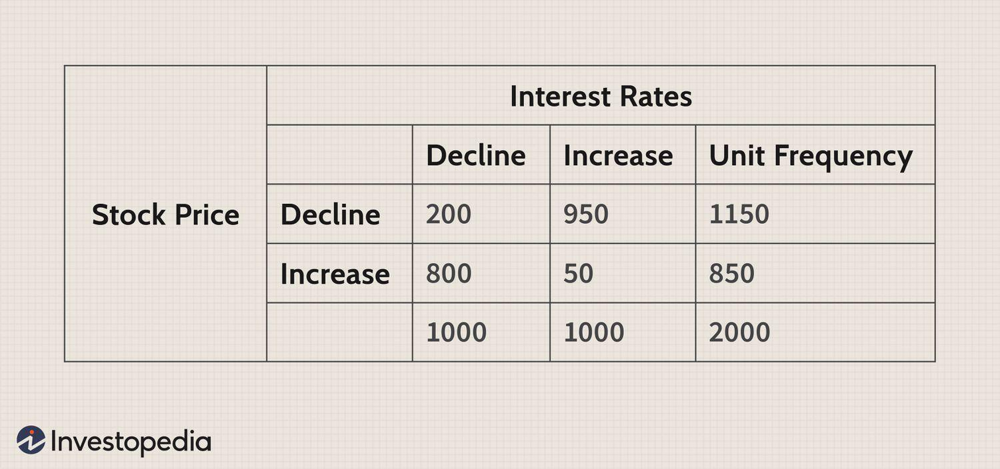

## Table of Contents

## What is Bayesian inference and how does it apply to financial markets?

Bayesian inference is a way of updating our beliefs based on new evidence. It's like how you might change your mind about the weather after looking outside. In Bayesian inference, you start with an initial belief, called a prior. Then, when you get new information, you use a special formula to update that belief into a new belief, called a posterior. This method is useful because it lets us make better decisions by considering both what we already know and what we learn.

In financial markets, Bayesian inference can help investors make smarter choices. For example, an investor might start with a belief about how a stock will perform based on past data. When new information comes in, like a company's earnings report, the investor can use Bayesian inference to update their belief about the stock's future performance. This can lead to better investment decisions because it takes into account both the old data and the new information. By constantly updating their beliefs, investors can adapt to changing market conditions and potentially improve their returns.

## How does Bayesian inference differ from frequentist methods in financial analysis?

Bayesian inference and frequentist methods are two different ways to analyze data in finance. Bayesian inference starts with a belief, called a prior, about how things might turn out. When new data comes in, like stock prices or economic reports, you update this belief to get a new belief, called a posterior. This method is flexible because it lets you include what you already know and what you learn. In finance, this means you can keep updating your ideas about investments as new information comes in, which can help you make better decisions.

On the other hand, frequentist methods don't start with a belief. Instead, they focus on the data itself and use it to make predictions or test ideas. For example, they might look at how often something happens in a large set of data to make a guess about the future. In finance, frequentist methods might be used to calculate the probability of a stock going up or down based on historical data. While this approach can be useful, it doesn't easily let you update your predictions as new data comes in, which can be a limitation in the fast-changing world of financial markets.

In summary, the key difference is that Bayesian inference allows you to update your beliefs with new information, making it more adaptable to changes in financial markets. Frequentist methods, while good for making predictions based on large datasets, don't offer the same flexibility in updating predictions as new data becomes available. Both approaches have their place in financial analysis, but Bayesian methods might be more useful for investors who need to adapt quickly to new information.

## What are the basic components of a Bayesian model used in financial markets?

A Bayesian model used in financial markets has a few key parts that help investors make better decisions. The first part is the prior, which is like a starting guess about how a stock or the market might behave. This guess can come from past data or an investor's own beliefs. The second part is the likelihood, which is how well the new data fits with the starting guess. For example, if a company's earnings report is better than expected, the likelihood helps figure out how this new information changes the starting guess.

The third part is the posterior, which is the updated guess after considering the new data. This is what investors use to make their decisions. The last part is the model itself, which is a set of rules that show how the prior, likelihood, and posterior work together. In financial markets, this model helps investors adjust their beliefs about stocks or the market as new information comes in, making their investment choices more informed and potentially more profitable.

## Can you explain the concept of prior and posterior distributions in the context of financial decision-making?

In financial decision-making, the prior distribution is like your starting guess about how a stock or the market might behave. Imagine you're trying to predict if a company's stock will go up or down. You might start with a guess based on what you know about the company's past performance, the economy, or even your own feelings about the stock. This starting guess is your prior distribution. It's important because it sets the stage for how you'll interpret new information.

When new information comes in, like a company's earnings report or a change in interest rates, you use it to update your starting guess. This updated guess is called the posterior distribution. It's like taking your original idea and tweaking it based on what you've just learned. In finance, this means you can make better decisions because your new guess takes into account both what you knew before and what you know now. By constantly updating your guesses with new information, you can make smarter investment choices.

## How can Bayesian inference be used to improve investment strategies?

Bayesian inference can help improve investment strategies by allowing investors to update their beliefs about stocks or the market as new information comes in. Imagine you have a guess about how a stock will do based on what you know now. That's your starting point, or prior. When new information arrives, like a company's earnings report or a change in interest rates, you can use Bayesian inference to adjust your guess. This updated guess, called the posterior, helps you make better decisions because it takes into account both your original idea and the new information. By constantly updating your beliefs, you can adapt to changes in the market and potentially make smarter investment choices.

For example, if you believe a stock will go up based on past performance, but then the company releases a disappointing earnings report, Bayesian inference lets you adjust your belief. Instead of sticking with your original guess, you can use the new information to lower your expectations for the stock's future performance. This flexibility can lead to better investment strategies because it helps you respond to new data quickly. Over time, using Bayesian inference can help you fine-tune your investments, making your portfolio more responsive to the ever-changing financial landscape.

## What are some common Bayesian models applied in financial risk management?

In financial risk management, one common Bayesian model is the Bayesian Value-at-Risk (VaR) model. This model helps banks and investors understand the potential loss in value of their investments over a certain time period. It starts with a guess about how risky an investment might be, based on past data. When new information comes in, like changes in the market or new economic reports, the model updates this guess. This way, the bank or investor can better predict how much they might lose and take steps to manage that risk.

Another model often used is the Bayesian Credit Risk Model. This model helps banks figure out the chance that a borrower won't be able to pay back a loan. It begins with a starting guess about the borrower's creditworthiness, based on things like their credit history and financial situation. As new information comes in, like changes in the borrower's income or the economy, the model updates this guess. This helps the bank make better decisions about whether to give out loans and how to manage the risk of those loans.

Both of these models use Bayesian inference to update beliefs as new information becomes available. This makes them very useful in the fast-changing world of finance, where being able to adapt quickly to new data can help manage risk more effectively.

## How does one update beliefs in a financial market using new data with Bayesian methods?

Updating beliefs in a financial market using Bayesian methods is like changing your mind based on new information. Imagine you have a guess about how a stock will do, based on what you know now. This guess is your prior belief. When new information comes in, like a company's earnings report or a change in interest rates, you use a special formula to adjust your guess. This formula takes into account both your original guess and the new information, helping you come up with a new guess, called the posterior belief. By doing this, you can make better decisions because your new guess is more up-to-date and accurate.

For example, let's say you think a company's stock will go up because it has been doing well in the past. That's your prior belief. Then, the company releases a disappointing earnings report. With Bayesian methods, you can use this new information to update your belief. Instead of sticking with your original guess, you might now think the stock is less likely to go up. This updated belief helps you decide whether to keep, buy, or sell the stock. By constantly updating your beliefs with new data, you can adapt to changes in the market and potentially make smarter investment choices.

## What are the challenges of implementing Bayesian inference in high-frequency trading?

Implementing Bayesian inference in high-frequency trading can be really tough because it needs to happen super fast. High-frequency trading is all about making quick decisions based on tiny changes in the market. But updating beliefs with Bayesian methods takes time, especially when you have to deal with a lot of data coming in all at once. This means that even though Bayesian inference can help you make better guesses about the market, it might be too slow to use in a world where every second counts.

Another challenge is that high-frequency trading often deals with a lot of noise and sudden changes. This makes it hard to figure out what's really happening in the market. Bayesian methods need good data to work well, but in high-frequency trading, the data can be messy and hard to trust. This can make it tricky to update your beliefs accurately and quickly enough to stay ahead in the game. So, while Bayesian inference can be a powerful tool, using it in high-frequency trading comes with some big challenges.

## Can you discuss a case study where Bayesian inference significantly impacted financial market outcomes?

One interesting case where Bayesian inference made a big difference in financial markets is with a [hedge fund](/wiki/hedge-fund-trading-strategies) called Renaissance Technologies. They used Bayesian methods to update their guesses about the market all the time. By doing this, they could make better decisions about which stocks to buy or sell. Their main fund, called the Medallion Fund, did really well because of this. It made huge profits, much more than other funds, showing how powerful Bayesian inference can be in finance.

In another case, a big bank used Bayesian inference to manage the risk of their loans. They started with a guess about how likely it was for people to pay back their loans. When new information came in, like changes in the economy or a borrower's job situation, they updated their guess. This helped them decide who to lend money to and how much risk to take. By using Bayesian methods, the bank was able to lower the number of loans that went bad, saving them a lot of money and making their lending safer.

## How do Bayesian methods handle model uncertainty in financial forecasting?

Bayesian methods are really good at dealing with model uncertainty in financial forecasting. Imagine you have a few different guesses about how the market might behave. Each guess is like a different model. Bayesian methods let you start with a belief about how likely each model is to be right. This is called the prior. When new information comes in, like stock prices or economic reports, you can update your belief about which model is the best one. This way, you're not stuck with just one guess; you can keep adjusting your ideas as you learn more.

By using Bayesian methods, you can also figure out how much to trust each model. Instead of [picking](/wiki/asset-class-picking) just one and hoping it's right, you can use all your models together, giving more weight to the ones that seem to fit the new data better. This helps you make better predictions because you're considering all the possibilities and updating them as the market changes. In the end, this approach can lead to more accurate financial forecasts because it takes into account the uncertainty and keeps learning from new information.

## What advanced Bayesian techniques are used for portfolio optimization?

In portfolio optimization, one advanced Bayesian technique is called Bayesian Portfolio Optimization. This method helps investors figure out the best way to spread their money across different investments. It starts with a guess about how each investment might do, based on past data and what the investor believes. When new information comes in, like changes in the market or new economic reports, the method updates this guess. By doing this, it can find the best mix of investments that balances risk and reward. This way, investors can make smarter choices about where to put their money, making their portfolio more likely to do well over time.

Another technique is called Markov Chain Monte Carlo (MCMC) methods. These are used to explore all the different ways you could put your money into investments. Imagine trying to find the best path through a maze. MCMC methods help you try out lots of different paths, updating your guesses about which path is best as you go along. In portfolio optimization, this means you can look at many different ways to spread your money and see which one gives you the best chance of making money while keeping risk low. By using these methods, investors can fine-tune their portfolios to be as good as possible, even when the market is always changing.

## How can Bayesian inference be integrated with machine learning to predict market trends?

Bayesian inference can be combined with [machine learning](/wiki/machine-learning) to make better guesses about where the market is headed. Imagine you have a computer program that learns from data, like stock prices or economic reports. This program can start with a guess about how the market might behave, which is called a prior. When new information comes in, the program uses Bayesian methods to update this guess, turning it into a new guess called a posterior. By doing this over and over, the program can keep learning and making better predictions about market trends.

For example, a machine learning model might use past stock data to predict future prices. With Bayesian inference, the model can start with a belief about how the stock might do based on what it knows now. When new data comes in, like a company's earnings report, the model updates its belief. This way, the model can adapt to changes in the market quickly and make more accurate predictions. By combining Bayesian inference with machine learning, investors can get a powerful tool that keeps learning and improving its guesses about where the market is going.

## What is Understanding Bayesian Statistics?

Bayesian statistics is a powerful methodology centered on the continuous updating of the probability of a hypothesis as new evidence is obtained, fundamentally through the application of Bayes' Theorem. This theorem is paramount in calculating conditional probabilities and can be mathematically represented as:

$$
P(H \mid E) = \frac{P(E \mid H) \cdot P(H)}{P(E)}
$$

where:
- $P(H \mid E)$ is the posterior probability, or the updated probability of the hypothesis $H$ given the evidence $E$.
- $P(E \mid H)$ is the likelihood, or the probability of observing the evidence given that hypothesis $H$ is true.
- $P(H)$ is the prior probability, representing the initial belief about the hypothesis before considering the evidence.
- $P(E)$ is the probability of the evidence under all possible hypotheses.

At the core of Bayesian [statistics](/wiki/bayesian-statistics) are key concepts such as prior probability, likelihood, and posterior probability. The prior probability reflects the initial beliefs about a hypothesis. As new data or evidence becomes accessible, the likelihood quantifies how well this evidence supports a given hypothesis. Consequently, the posterior probability is computed, using this evidence, to update and refine beliefs, continually enhancing predictive accuracy.

Bayesian inference is notably iterative, making it highly adaptable, particularly in dynamic and rapidly changing contexts such as [algorithmic trading](/wiki/algorithmic-trading). In these environments, continuous data inflow allows Bayesian methods to iteratively refine hypotheses and predictions, thus seamlessly integrating new information into existing models. This approach not only supports more informed decision-making but also ensures models remain relevant and reflective of current conditions.

The structure inherent in Bayesian methods permits a rigorous and flexible incorporation of new evidence. This is instrumental in decision-making processes and hypothesis evaluation, as it allows models to evolve and adapt with changing data landscapes. The flexibility of Bayesian statistics is particularly advantageous for managing the inherent [volatility](/wiki/volatility-trading-strategies) and uncertainty present in financial markets, where conditions can shift unpredictably.

In summary, the mathematical rigor and adaptive nature of Bayesian methods provide significant advantages in scenarios requiring continual reassessment and integration of new data, thereby making them an invaluable tool in fields such as algorithmic trading.

## What is the role of Bayesian Optimization in Hyperparameter Tuning?

Bayesian optimization represents a significant advancement in hyperparameter tuning methodologies, demonstrating superior performance compared to traditional grid and random search techniques. This advanced technique constructs a surrogate model, typically a Gaussian Process, to effectively identify promising hyperparameters by leveraging information from prior evaluations. The Gaussian Process model offers a probabilistic approach to accounting for uncertainty in the objective function, making it particularly well-suited for optimization tasks where evaluations are expensive or time-consuming.

The primary strength of Bayesian optimization is its ability to efficiently balance exploration and exploitation. It utilizes acquisition functions such as Expected Improvement (EI) to guide the selection of hyperparameters. The EI function helps estimate the potential improvement over the current best-known result, thereby directing the search towards regions in the hyperparameter space with higher probability of yielding better outcomes.

Mathematically, the Expected Improvement can be expressed as:

$$

EI(x) = \mathbb{E}[\max(0, f(x) - f(x^+))] 
$$

where $x$ denotes a potential hyperparameter set, $f(x)$ is the objective function, and $f(x^+)$ is the best observed objective value so far. The expectation is typically calculated using the predictive distribution of the Gaussian Process model.

This method streamlines model development by systematically reducing the number of required evaluations, while simultaneously enhancing forecasting performance. Such efficiency is crucial in dynamic financial environments, where rapid and precise model tuning can provide a significant competitive edge. The ability to adaptively learn and update the model based on new information ensures that strategies remain robust and accurate without unnecessary resource expenditure.

The integration of Bayesian optimization facilitates the optimization of model accuracy, providing a nuanced approach to hyperparameter tuning that traditionally static methods lack. This adaptability not only improves the design of trading strategies but also reduces computational costs, allowing for more frequent updates and refinements in rapidly changing markets. By optimizing hyperparameters with such precision, traders can achieve a balance of resource efficiency and strategic effectiveness.

## How can Bayesian methods improve trading strategies according to the case study?

Bayesian inference plays a significant role in enhancing [momentum](/wiki/momentum)-based stock trading strategies, providing a dynamic framework for decision-making under uncertainty. By employing Bayesian networks, traders can systematically adapt their buy and sell decisions according to real-time market conditions. This adaptability is achieved by continuously updating beliefs with new data, which refines predictions and allows traders to respond promptly to market changes.

In a practical implementation, Bayesian networks can be constructed to model dependencies between market variables, such as stock prices, trading volumes, and market sentiment indicators. These networks enable the assessment of market conditions and predict future price movements. The inference process involves calculating posterior probabilities for different market states, using the equation:

$$
P(\text{Hypothesis | Evidence}) = \frac{P(\text{Evidence | Hypothesis}) \cdot P(\text{Hypothesis})}{P(\text{Evidence})}
$$

Here, the hypotheses could represent specific trading states or signals (e.g., strong buy, hold, strong sell), while the evidence comprises current market data. Bayesian inference thus allows the network to update its parameters iteratively as new information becomes available, ensuring the trading strategy remains robust and adaptable.

A Python implementation can effectively demonstrate this process. Utilizing libraries such as PyMC3 or scikit-learn, traders can develop Bayesian network models to simulate and test trading strategies. Sample code for setting up a simple Bayesian network could look like this:

```python
import pymc3 as pm

# Define a simple Bayesian model
model = pm.Model()

with model:
    # Prior distribution for market direction (e.g., -1 for down, 1 for up)
    market_direction = pm.Normal('market_direction', mu=0, sigma=1)

    # Likelihood function based on observed stock returns
    observed_returns = pm.Normal('observed_returns', mu=market_direction, sigma=0.1, observed=[0.05, 0.03, -0.02, ...])

    # Posterior calculations
    trace = pm.sample(1000)

# Analyze the results
pm.traceplot(trace)
```

This Python script illustrates the initialization of a Bayesian model, with a prior defined for market direction and a likelihood function based on observed stock returns. The `pm.sample()` function performs the posterior inference, allowing traders to interpret posterior distributions and update their strategies accordingly.

Through Bayesian inference in momentum-based trading, decision-making accuracy is significantly improved. The method aligns trading strategies with evolving market scenarios, ensuring they are responsive to new information. This continuous model adjustment helps traders optimize strategy robustness, minimize risks, and potentially enhance returns, offering a strategic advantage in volatile market environments.

## What are the challenges and considerations?

Bayesian methods in trading, while advantageous, come with notable challenges such as computational complexity and the necessity for a high level of statistical expertise. The iterative nature of Bayesian inference inherently demands a robust understanding of mathematical principles, particularly related to prior and posterior probabilities. The calculation of these probabilities, based on Bayes' Theorem, requires intricate mathematical operations that can become computationally intensive, especially in high-frequency trading environments where decisions must be made rapidly.

$$
P(H|E) = \frac{P(E|H) \cdot P(H)}{P(E)}
$$

In this formula, $P(H|E)$ represents the posterior probability, $P(E|H)$ the likelihood, $P(H)$ the prior probability, and $P(E)$ the marginal likelihood. Handling these components accurately necessitates precision in statistical modeling and numerical computation.

A significant challenge lies in the selection of appropriate prior distributions. Priors represent initial beliefs about the parameters before observing the data, and their choice is crucial because they heavily influence posterior distributions. Inappropriately chosen priors can lead to skewed inferences and misestimated risks, making it imperative to consider both historical data and expert knowledge when defining them.

Despite these challenges, Bayesian techniques provide valuable flexibility, allowing for the dynamic adaptation of models as new information becomes available. This adaptability enhances the integration of uncertainty into decision-making models, improving predictive capabilities in volatile financial markets. This is particularly useful in algorithmic trading, where market conditions can change rapidly and unpredictably.

Continuous advances in computational tools and frameworks, such as parallel processing and efficient sampling methods, are gradually mitigating these challenges. Open-source libraries like TensorFlow Probability and PyMC3 facilitate complex Bayesian computations, making these methods more accessible to traders without extensive statistical backgrounds. As a result, the adoption of Bayesian techniques in trading is likely to broaden, with the potential to enhance the robustness and adaptability of algorithmic strategies amid evolving market conditions.

## References & Further Reading

[1]: Broderson, K. H., Gallusser, F., Koehler, J., Remy, N., & Scott, S. L. (2015). ["Inferring causal impact using Bayesian structural time-series models."](https://arxiv.org/abs/1506.00356) The Annals of Applied Statistics.

[2]: Murphy, K. P. (2012). ["Machine Learning: A Probabilistic Perspective."](https://www.cs.ubc.ca/~murphyk/MLbook/pml-toc-1may12.pdf) MIT Press.

[3]: Robert, C. P., & Casella, G. (2010). ["Introducing Monte Carlo Methods with R."](https://link.springer.com/book/10.1007/978-1-4419-1576-4) Springer.

[4]: ["Bayesian Statistics and Marketing."](https://onlinelibrary.wiley.com/doi/book/10.1002/0470863692) by Austen Kambara (University of Southern California).

[5]: Gelman, A., Carlin, J. B., Stern, H. S., Dunson, D. B., Vehtari, A., & Rubin, D. B. (2013). ["Bayesian Data Analysis."](https://www.taylorfrancis.com/books/mono/10.1201/b16018/bayesian-data-analysis-david-dunson-donald-rubin-john-carlin-andrew-gelman-hal-stern-aki-vehtari) CRC Press.

[6]: Bishop, C. M. (2006). ["Pattern Recognition and Machine Learning."](https://link.springer.com/book/9780387310732) Springer.

[7]: Barber, D. (2012). ["Bayesian Reasoning and Machine Learning."](https://assets.cambridge.org/97805215/18147/frontmatter/9780521518147_frontmatter.pdf) Cambridge University Press.

[8]: Rasmussen, C. E., & Williams, C. K. (2006). ["Gaussian Processes for Machine Learning."](https://direct.mit.edu/books/monograph/2320/Gaussian-Processes-for-Machine-Learning) MIT Press.

[9]: Algorithmic Trading & DMA: An introduction to direct access trading strategies by Barry Johnson.