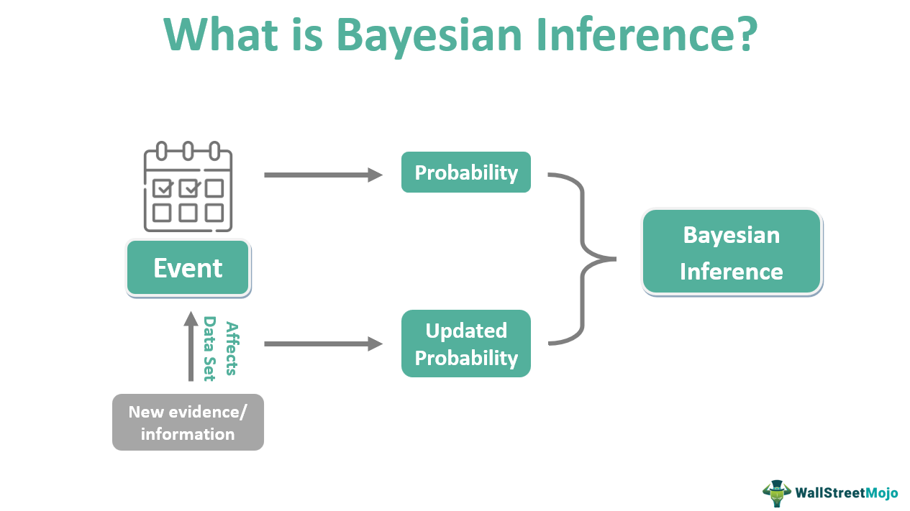

Bayesian inference provides a versatile framework for systematically updating beliefs in light of new data, making it invaluable in environments characterized by uncertainty, such as financial markets. In the domain of algorithmic trading—where decisions must be made swiftly and frequently under conditions of incomplete information—Bayesian methods significantly enhance decision-making processes by integrating new market data in real-time. This adaptability enables traders to refine their strategies and improve forecasting accuracy dynamically.

The application of Bayesian statistics within financial markets, and particularly in algorithmic trading, offers distinct advantages in areas such as strategy refinement and financial forecasting. By applying Bayesian principles, traders can systematically incorporate data as it becomes available, continuously fine-tuning their models to reflect the current market conditions. This evolutionary capability allows for more precise prediction, optimization of trade execution, and more effective risk management.



The analysis presented in this article will delve into foundational Bayesian concepts, elucidating their contrast with Frequentist approaches. It will also demonstrate practical applications within trading algorithms, underscoring the transformative impact of Bayesian models. Such models facilitate improvements in prediction accuracy, making them indispensable tools in the strategy toolbox of algorithmic traders.

By harnessing the power of Bayesian models, traders are equipped to understand and anticipate market movements more accurately, optimizing their trading performance. The capability to continuously adapt and update models in response to evolving market data ensures traders can navigate financial markets with greater confidence and precision. Consequently, integrating Bayesian inference into trading strategies enhances robustness and responsiveness, providing traders with a significant edge in the dynamic landscape of financial markets.

## Table of Contents

## Understanding Bayesian Statistics

Bayesian statistics is a powerful methodology centered on the continuous updating of the probability of a hypothesis as new evidence is obtained, fundamentally through the application of Bayes' Theorem. This theorem is paramount in calculating conditional probabilities and can be mathematically represented as:

$$
P(H \mid E) = \frac{P(E \mid H) \cdot P(H)}{P(E)}
$$

where:
- $P(H \mid E)$ is the posterior probability, or the updated probability of the hypothesis $H$ given the evidence $E$.
- $P(E \mid H)$ is the likelihood, or the probability of observing the evidence given that hypothesis $H$ is true.
- $P(H)$ is the prior probability, representing the initial belief about the hypothesis before considering the evidence.
- $P(E)$ is the probability of the evidence under all possible hypotheses.

At the core of Bayesian [statistics](/wiki/bayesian-statistics) are key concepts such as prior probability, likelihood, and posterior probability. The prior probability reflects the initial beliefs about a hypothesis. As new data or evidence becomes accessible, the likelihood quantifies how well this evidence supports a given hypothesis. Consequently, the posterior probability is computed, using this evidence, to update and refine beliefs, continually enhancing predictive accuracy.

Bayesian inference is notably iterative, making it highly adaptable, particularly in dynamic and rapidly changing contexts such as [algorithmic trading](/wiki/algorithmic-trading). In these environments, continuous data inflow allows Bayesian methods to iteratively refine hypotheses and predictions, thus seamlessly integrating new information into existing models. This approach not only supports more informed decision-making but also ensures models remain relevant and reflective of current conditions.

The structure inherent in Bayesian methods permits a rigorous and flexible incorporation of new evidence. This is instrumental in decision-making processes and hypothesis evaluation, as it allows models to evolve and adapt with changing data landscapes. The flexibility of Bayesian statistics is particularly advantageous for managing the inherent [volatility](/wiki/volatility-trading-strategies) and uncertainty present in financial markets, where conditions can shift unpredictably.

In summary, the mathematical rigor and adaptive nature of Bayesian methods provide significant advantages in scenarios requiring continual reassessment and integration of new data, thereby making them an invaluable tool in fields such as algorithmic trading.

## Differences Between Bayesian and Frequentist Methods

Bayesian and Frequentist statistics represent two foundational approaches to statistical inference, each with its distinct methodologies and philosophical underpinnings. Bayesian statistics leverages Bayes' Theorem to update the probability estimate for a hypothesis as new evidence is introduced. A critical component of this method is the incorporation of prior probability, which represents the initial belief about the hypothesis before encountering current data. This prior is updated with the likelihood—the probability of observing the data given the hypothesis—to yield the posterior probability, which is a revised belief after considering the new evidence.

In contrast, Frequentist methods approach probability and inference without incorporating prior beliefs. Instead, these methods rely wholly on the frequency or proportion of data outcomes from repeated samples or trials. This is epitomized by classical hypothesis testing frameworks, where the objective is to assess the probability of the observed data under the null hypothesis. Frequentism emphasizes long-run properties of estimators, with concepts like confidence intervals and significance tests being central.

The dichotomy between Bayesian and Frequentist approaches manifests in various applications, notably in algorithmic trading. Bayesian methods offer a distinct advantage through their adaptability; as new market data streams are integrated, Bayesian models enable the dynamic updating of model parameters, thus providing a mechanism to incorporate real-time changes into trading strategies. This continual adaptation can be crucial in financial markets characterized by volatility and uncertainty.

Frequentist approaches in algorithmic trading, on the other hand, deliver consistency and objectivity via fixed hypothesis testing frameworks. These methods rely on predetermined thresholds or benchmarks, eschewing prior distributions to ensure that inference is solely data-driven based on the sample at hand. This can be advantageous when the primary goal is to maintain a consistent trading strategy without the influence of subjective prior inputs.

The decision to adopt either a Bayesian or Frequentist approach in algorithmic trading is contingent upon the specific requirements of the trading strategy. Bayesian methods are preferable when there is a need for flexibility and continuous learning from new data, whereas Frequentist techniques might be favored for their objectivity and simplicity in settings where assumptions are predefined or data is plentiful.

Understanding these differences between Bayesian and Frequentist statistics is critical for optimizing trading strategies. It involves recognizing the implications of prior information, the structure of market data, and the nature of the trading environment. As algorithmic trading continues to evolve, the strategic choice between these statistical paradigms will profoundly influence the adaptability, precision, and effectiveness of trading decisions.

## Bayesian Models in Algorithmic Trading

Bayesian models play a pivotal role in algorithmic trading by effectively managing uncertainty and enabling continuous updates to predictions with the influx of new market data. These models provide a framework for dynamically adjusting to market changes, ensuring that trading strategies remain robust and adaptable.

Popular Bayesian approaches in algorithmic trading include Hidden Markov Models (HMMs) and Bayesian Networks. HMMs are particularly useful for modeling market regimes, capturing the hidden states of market conditions which traders can exploit to predict future trends. For instance, HMMs estimate the probability of shifting between different states of a market, such as bull and bear phases, based on historical data. By doing so, traders can anticipate potential market reversals or continuations. 

Bayesian Networks, on the other hand, model the dependencies between various market variables. They represent these dependencies through a directed acyclic graph, allowing traders to understand how different market factors influence each other. Such networks enable the updating of probabilities for various scenarios as new evidence comes to light, assisting traders in refining their strategies continuously.

The practical implementation of Bayesian models in algorithmic trading is facilitated by Python libraries such as `pomegranate`. This library supports the creation and manipulation of probabilistic models, including HMMs and Bayesian Networks, providing robust tools for traders to model complex market dynamics and dependencies. An example of initializing and fitting a Hidden Markov Model using `pomegranate` might look like this:

```python
from pomegranate import HiddenMarkovModel, NormalDistribution

# Define two states with normal distributions
state_1 = NormalDistribution(0, 1)
state_2 = NormalDistribution(5, 1)

# Initialize the HMM with the defined states
model = HiddenMarkovModel.from_samples([state_1, state_2], n_components=2, X=training_data)

# Fit the model with market data
model.fit(training_data)
```

The strength of Bayesian models lies in their continuous adaptation and learning capabilities, granting them a strategic advantage over static models. As market data changes, these models update their predictions, maintaining accuracy and relevance. This characteristic is invaluable in financial markets, where conditions are constantly evolving, necessitating strategies that can promptly adjust. By leveraging Bayesian models, traders can significantly enhance their decision-making processes, ultimately optimizing trade execution and risk management in volatile markets.

## Bayesian Optimization in Hyperparameter Tuning

Bayesian optimization represents a significant advancement in hyperparameter tuning methodologies, demonstrating superior performance compared to traditional grid and random search techniques. This advanced technique constructs a surrogate model, typically a Gaussian Process, to effectively identify promising hyperparameters by leveraging information from prior evaluations. The Gaussian Process model offers a probabilistic approach to accounting for uncertainty in the objective function, making it particularly well-suited for optimization tasks where evaluations are expensive or time-consuming.

The primary strength of Bayesian optimization is its ability to efficiently balance exploration and exploitation. It utilizes acquisition functions such as Expected Improvement (EI) to guide the selection of hyperparameters. The EI function helps estimate the potential improvement over the current best-known result, thereby directing the search towards regions in the hyperparameter space with higher probability of yielding better outcomes.

Mathematically, the Expected Improvement can be expressed as:

$$

EI(x) = \mathbb{E}[\max(0, f(x) - f(x^+))] 
$$

where $x$ denotes a potential hyperparameter set, $f(x)$ is the objective function, and $f(x^+)$ is the best observed objective value so far. The expectation is typically calculated using the predictive distribution of the Gaussian Process model.

This method streamlines model development by systematically reducing the number of required evaluations, while simultaneously enhancing forecasting performance. Such efficiency is crucial in dynamic financial environments, where rapid and precise model tuning can provide a significant competitive edge. The ability to adaptively learn and update the model based on new information ensures that strategies remain robust and accurate without unnecessary resource expenditure.

The integration of Bayesian optimization facilitates the optimization of model accuracy, providing a nuanced approach to hyperparameter tuning that traditionally static methods lack. This adaptability not only improves the design of trading strategies but also reduces computational costs, allowing for more frequent updates and refinements in rapidly changing markets. By optimizing hyperparameters with such precision, traders can achieve a balance of resource efficiency and strategic effectiveness.

## Case Study: Bayesian Improvement in Trading Strategies

Bayesian inference plays a significant role in enhancing [momentum](/wiki/momentum)-based stock trading strategies, providing a dynamic framework for decision-making under uncertainty. By employing Bayesian networks, traders can systematically adapt their buy and sell decisions according to real-time market conditions. This adaptability is achieved by continuously updating beliefs with new data, which refines predictions and allows traders to respond promptly to market changes.

In a practical implementation, Bayesian networks can be constructed to model dependencies between market variables, such as stock prices, trading volumes, and market sentiment indicators. These networks enable the assessment of market conditions and predict future price movements. The inference process involves calculating posterior probabilities for different market states, using the equation:

$$
P(\text{Hypothesis | Evidence}) = \frac{P(\text{Evidence | Hypothesis}) \cdot P(\text{Hypothesis})}{P(\text{Evidence})}
$$

Here, the hypotheses could represent specific trading states or signals (e.g., strong buy, hold, strong sell), while the evidence comprises current market data. Bayesian inference thus allows the network to update its parameters iteratively as new information becomes available, ensuring the trading strategy remains robust and adaptable.

A Python implementation can effectively demonstrate this process. Utilizing libraries such as PyMC3 or scikit-learn, traders can develop Bayesian network models to simulate and test trading strategies. Sample code for setting up a simple Bayesian network could look like this:

```python
import pymc3 as pm

# Define a simple Bayesian model
model = pm.Model()

with model:
    # Prior distribution for market direction (e.g., -1 for down, 1 for up)
    market_direction = pm.Normal('market_direction', mu=0, sigma=1)

    # Likelihood function based on observed stock returns
    observed_returns = pm.Normal('observed_returns', mu=market_direction, sigma=0.1, observed=[0.05, 0.03, -0.02, ...])

    # Posterior calculations
    trace = pm.sample(1000)

# Analyze the results
pm.traceplot(trace)
```

This Python script illustrates the initialization of a Bayesian model, with a prior defined for market direction and a likelihood function based on observed stock returns. The `pm.sample()` function performs the posterior inference, allowing traders to interpret posterior distributions and update their strategies accordingly.

Through Bayesian inference in momentum-based trading, decision-making accuracy is significantly improved. The method aligns trading strategies with evolving market scenarios, ensuring they are responsive to new information. This continuous model adjustment helps traders optimize strategy robustness, minimize risks, and potentially enhance returns, offering a strategic advantage in volatile market environments.

## Challenges and Considerations

Bayesian methods in trading, while advantageous, come with notable challenges such as computational complexity and the necessity for a high level of statistical expertise. The iterative nature of Bayesian inference inherently demands a robust understanding of mathematical principles, particularly related to prior and posterior probabilities. The calculation of these probabilities, based on Bayes' Theorem, requires intricate mathematical operations that can become computationally intensive, especially in high-frequency trading environments where decisions must be made rapidly.

$$
P(H|E) = \frac{P(E|H) \cdot P(H)}{P(E)}
$$

In this formula, $P(H|E)$ represents the posterior probability, $P(E|H)$ the likelihood, $P(H)$ the prior probability, and $P(E)$ the marginal likelihood. Handling these components accurately necessitates precision in statistical modeling and numerical computation.

A significant challenge lies in the selection of appropriate prior distributions. Priors represent initial beliefs about the parameters before observing the data, and their choice is crucial because they heavily influence posterior distributions. Inappropriately chosen priors can lead to skewed inferences and misestimated risks, making it imperative to consider both historical data and expert knowledge when defining them.

Despite these challenges, Bayesian techniques provide valuable flexibility, allowing for the dynamic adaptation of models as new information becomes available. This adaptability enhances the integration of uncertainty into decision-making models, improving predictive capabilities in volatile financial markets. This is particularly useful in algorithmic trading, where market conditions can change rapidly and unpredictably.

Continuous advances in computational tools and frameworks, such as parallel processing and efficient sampling methods, are gradually mitigating these challenges. Open-source libraries like TensorFlow Probability and PyMC3 facilitate complex Bayesian computations, making these methods more accessible to traders without extensive statistical backgrounds. As a result, the adoption of Bayesian techniques in trading is likely to broaden, with the potential to enhance the robustness and adaptability of algorithmic strategies amid evolving market conditions.

## Conclusion

Bayesian statistics provide a robust framework for algorithmic trading by facilitating responsive decision-making in uncertain environments. This statistical approach's core strength lies in its ability to update beliefs dynamically as new data becomes available, offering continuous refinement of trading models. Such adaptability is essential in optimizing models to accommodate rapid market changes and volatility, ensuring that trading strategies remain relevant and effective.

Advancements in computational tools have significantly increased the feasibility of implementing Bayesian methods in trading systems. These technological developments result in enhanced model precision and execution efficiency, allowing traders to better harness the power of Bayesian inference. The integration of Bayesian methods in trading environments is poised for considerable growth, offering improved adaptability and robustness. This capacity to adapt swiftly to incoming data strengthens decision-making processes, giving traders a marked advantage in volatile and fast-paced financial markets.

The continuous nature of Bayesian updating, denoted mathematically by Bayes' Theorem, $P(H|E) = \frac{P(E|H) \cdot P(H)}{P(E)}$, enables traders to incorporate real-time market information, refining hypotheses and predictions. Consequently, the future of trading strategies increasingly hinges upon the effective application of Bayesian inference, as its potency in enhancing strategic adaptability and robustness becomes more pronounced. This approach supports more precise decision-making, thereby offering a significant competitive edge in the challenging landscape of financial markets.

## Further Reading and Resources

Books such as "Advanced Algorithmic Trading" by Kevin Davey provide comprehensive insights into the application of Bayesian statistics in trading strategies. These works discuss how traders can utilize Bayesian methods to enhance decision-making and refine trading strategies in dynamic markets.

Online platforms and communities, such as QuantStart and Stack Exchange, serve as valuable resources for traders and researchers interested in Bayesian methods in finance. These platforms offer practical insights, coding examples, and community-driven discussions that support learning and implementation. By participating in these forums, practitioners can gain varied perspectives and solutions to specific challenges in Bayesian modeling.

Academic journals remain instrumental in publishing ongoing research related to Bayesian methods in finance. These publications highlight the latest trends, innovations, and applications, keeping professionals informed on advancements and fostering a deeper understanding of theoretical underpinnings.

Open-source libraries, such as PyMC3 and Stan, facilitate the implementation of Bayesian models. PyMC3, leveraging a probabilistic programming approach, allows users to define and execute complex Bayesian models efficiently. Similarly, Stan provides a platform for statistical modeling and high-performance statistical computation. Both libraries are supported by extensive community documentation and forums, which can guide users in building and executing models.

Engaging with these resources is crucial for traders and researchers aiming to expand their understanding and technical skills in Bayesian modeling. These materials not only provide foundational knowledge but also equip practitioners with the tools necessary for applying Bayesian statistics to real-world financial scenarios, driving innovation and accuracy in trading strategies.

## References & Further Reading

[1]: Broderson, K. H., Gallusser, F., Koehler, J., Remy, N., & Scott, S. L. (2015). ["Inferring causal impact using Bayesian structural time-series models."](https://arxiv.org/abs/1506.00356) The Annals of Applied Statistics.

[2]: Murphy, K. P. (2012). ["Machine Learning: A Probabilistic Perspective."](https://www.cs.ubc.ca/~murphyk/MLbook/pml-toc-1may12.pdf) MIT Press.

[3]: Robert, C. P., & Casella, G. (2010). ["Introducing Monte Carlo Methods with R."](https://link.springer.com/book/10.1007/978-1-4419-1576-4) Springer.

[4]: ["Bayesian Statistics and Marketing."](https://onlinelibrary.wiley.com/doi/book/10.1002/0470863692) by Austen Kambara (University of Southern California).

[5]: Gelman, A., Carlin, J. B., Stern, H. S., Dunson, D. B., Vehtari, A., & Rubin, D. B. (2013). ["Bayesian Data Analysis."](https://www.taylorfrancis.com/books/mono/10.1201/b16018/bayesian-data-analysis-david-dunson-donald-rubin-john-carlin-andrew-gelman-hal-stern-aki-vehtari) CRC Press.

[6]: Bishop, C. M. (2006). ["Pattern Recognition and Machine Learning."](https://link.springer.com/book/9780387310732) Springer.

[7]: Barber, D. (2012). ["Bayesian Reasoning and Machine Learning."](https://assets.cambridge.org/97805215/18147/frontmatter/9780521518147_frontmatter.pdf) Cambridge University Press.

[8]: Rasmussen, C. E., & Williams, C. K. (2006). ["Gaussian Processes for Machine Learning."](https://direct.mit.edu/books/monograph/2320/Gaussian-Processes-for-Machine-Learning) MIT Press.

[9]: Algorithmic Trading & DMA: An introduction to direct access trading strategies by Barry Johnson.