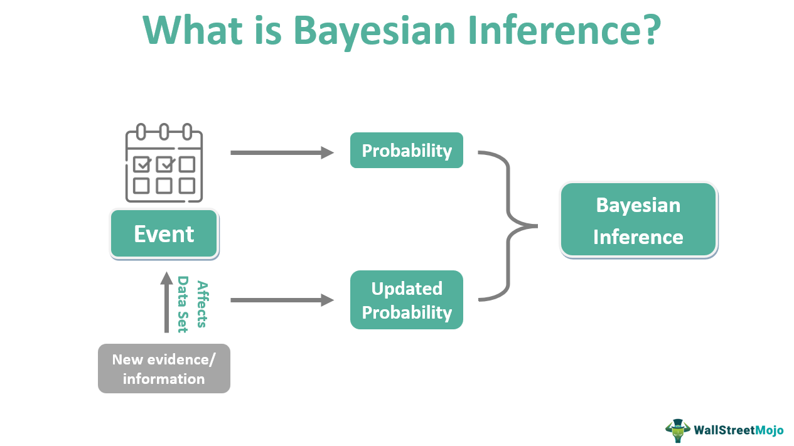

Bayesian inference, a significant statistical method, transforms our approach to uncertainty and probability by incorporating prior knowledge and evidence to update beliefs. Rooted in Bayes' theorem, which mathematically expresses the probability of an event based on prior knowledge of related conditions, Bayesian inference has become indispensable. This method contrasts with frequentist approaches that emphasize long-run frequency properties and instead allows for a dynamic updating process essential in many contemporary applications.

Algorithmic trading, which relies heavily on data analysis and predictive modeling, increasingly adopts Bayesian inference. This preference arises due to the method's robust mechanism to assimilate new data, refine predictions, and make informed decisions under uncertainty. As financial markets are inherently volatile, employing Bayesian techniques allows for adaptive strategies that can revise probability estimates in real time as new information is received – a capability that enhances both market predictions and risk assessments.



The primary objective of using Bayesian inference in trading is to enhance decision-making through the integration of pre-existing market knowledge (prior probability) and emerging market signals (likelihood). By updating beliefs with each new piece of evidence, traders can build more refined models that offer a potential edge over those who rely on static models. This dynamic adaptability facilitates better trend analysis, risk management, and overall strategy optimization, making Bayesian inference a transformative tool in the field of algorithmic trading.

## Table of Contents

## Understanding Bayesian Inference

Bayesian inference is a method of statistical inference that utilizes Bayes' theorem to update the probability estimate for a hypothesis as more evidence or information becomes available. The framework is rooted in the fundamental principle that the probability of a hypothesis can be revised when new data is introduced, combining prior knowledge and new evidence to form a comprehensive posterior probability.

The core principles of Bayesian inference revolve around the concepts of prior probability, likelihood, posterior probability, and Bayes' theorem. The **prior probability** represents the initial degree of belief in a hypothesis before considering current evidence. It reflects the information or beliefs held prior to a new data observation. The **likelihood** is the probability of observing the given data under various hypotheses. It quantifies how well each hypothesis explains the data. The **posterior probability** is derived using Bayes' theorem and represents the updated probability of a hypothesis after the new evidence is accounted for. This posterior probability is the core of Bayesian inference, providing a revised belief based on new data.

Bayes' theorem, which serves as the mathematical foundation of Bayesian inference, is expressed as:

$$
P(H|D) = \frac{P(D|H) \cdot P(H)}{P(D)}
$$

Where:
- $P(H|D)$ is the posterior probability of hypothesis $H$ given data $D$.
- $P(D|H)$ is the likelihood of observing data $D$ given hypothesis $H$.
- $P(H)$ is the prior probability of hypothesis $H$.
- $P(D)$ is the marginal likelihood of observing data $D$.

This formula succinctly encapsulates the process of updating the probability of a hypothesis based on new data.

One of the primary distinctions between Bayesian inference and traditional statistical approaches, such as frequentist inference, lies in their treatment of probability and uncertainty. Traditional frequentist [statistics](/wiki/bayesian-statistics) approach probability as the long-term frequency of events, focusing primarily on the data at hand without incorporating prior beliefs. Bayesian inference, on the other hand, treats probability more broadly as a measure of uncertainty or belief, allowing for the integration of prior information and its continual updating in light of new data. This flexibility makes Bayesian methods particularly powerful and applicable in contexts where prior knowledge is available and must be considered, or where data is sequentially observed.

By assimilating both prior insights and new evidence, Bayesian inference offers a robust framework for making informed decisions and predictions, especially in uncertain and dynamic environments.

## Application of Bayesian Inference in Trading

Bayesian inference is increasingly utilized in financial markets due to its robust framework for incorporating prior knowledge and continuously updating beliefs in the presence of new data. This statistical approach is particularly advantageous in conditions characterized by uncertainty and helps traders to make more informed decisions.

In trading, Bayesian inference can be particularly beneficial in several areas:

1. **Trend Prediction**: Bayesian models are adept at processing and integrating vast amounts of data to predict future market trends. By updating predictions as new data becomes available, Bayesian approaches help in modeling the underlying stochastic processes driving asset prices. One common technique employs a Bayesian approach to time series analysis, where the aim is to infer the underlying market dynamics and forecast future trends. For instance, Bayesian state-space models can capture the evolving nature of financial time series data, allowing traders to update their predictions about price trends as new information is obtained.

2. **Risk Management**: Bayesian inference provides a framework for more flexible risk assessment by quantifying uncertainty and allowing for the incorporation of prior knowledge into the analysis. For example, Bayesian networks, which are graphical models representing the probabilistic relationships among variables, facilitate the identification of risk factors and the estimation of their impact on portfolio performance. This can lead to more accurate estimates of Value at Risk (VaR) and Conditional Value at Risk (CVaR), essential metrics for strategizing risk mitigation.

3. **Portfolio Optimization**: Traditional portfolio optimization techniques like the Markowitz model can be enhanced using Bayesian methods by incorporating parameter uncertainty into the optimization process. Bayesian approaches can adjust expected returns and covariances, taking into account the uncertainty surrounding these estimates, leading to potentially more robust portfolio allocations. Through methods such as the Black-Litterman model, which integrates subjective views with market equilibrium returns within a Bayesian framework, traders can derive efficient portfolios that better reflect both market conditions and investor outlooks.

Several specific Bayesian models have been effectively applied in trading:

- **Bayesian Networks**: These probabilistic models structure and depict dependencies among different financial variables. They are beneficial in scenarios like failure prediction in credit risk analysis and scenario analysis for investment strategies.

- **Dynamic Linear Models (DLMs)**: DLMs are a subset of state-space models that are particularly powerful in time series analysis under a Bayesian framework. They allow for the inclusion of model parameters that evolve over time, reflecting the changing dynamics of financial markets. DLMs are particularly useful in adaptive asset allocation and tactical trading strategies, where the goal is to respond dynamically to market conditions.

Incorporating Bayesian inference into trading methodologies allows traders to enhance adaptability and precision in decision-making by systematically updating models to reflect new market realities.

## Benefits of Using Bayesian Inference in Algo Trading

Bayesian inference presents several compelling advantages when integrated into [algorithmic trading](/wiki/algorithmic-trading) strategies. By leveraging its probabilistic framework, traders can utilize prior knowledge and dynamically incorporate new information, enhancing their ability to adapt to volatile market conditions and make informed decisions.

One significant benefit of Bayesian inference in trading is its capacity to update beliefs in the light of new data, allowing models to reflect current market conditions more accurately. Bayes' theorem, which forms the foundation of Bayesian inference, enables the revision of existing predictions by combining prior probabilities with the likelihood of new evidence. This is mathematically represented by the equation:

$$
P(\Theta | D) = \frac{P(D | \Theta) P(\Theta)}{P(D)}
$$

where $P(\Theta | D)$ is the posterior probability, $P(D | \Theta)$ is the likelihood, $P(\Theta)$ is the prior probability, and $P(D)$ is the evidence or marginal likelihood.

Incorporating Bayesian models within trading algorithms allows for real-time updates, providing traders the ability to adjust their strategies as new economic indicators, market sentiments, or geopolitical events arise. For example, in Python, updating a Bayesian model with incoming data could involve recalculating posterior distributions as demonstrated in the simplified code snippet below:

```python
from scipy.stats import norm

# Define prior and likelihood parameters
prior_mean = 0
prior_std = 1
likelihood_mean = observed_data.mean()
likelihood_std = observed_data.std()

# Calculate posterior parameters
posterior_mean = (prior_mean / prior_std**2 + likelihood_mean / likelihood_std**2) / (1 / prior_std**2 + 1 / likelihood_std**2)
posterior_std = 1 / ((1 / prior_std**2) + (1 / likelihood_std**2))

# Posterior distribution
posterior = norm(posterior_mean, posterior_std)
```

Another advantage of Bayesian inference is the improved accuracy in risk assessment and decision-making. Traditional models might rely heavily on fixed parameters or historical data, which can be inadequate during rapid market shifts. Bayesian approaches, however, incorporate uncertainty directly into their models, accounting for unexpected market behavior and reducing the potential for false confidence in predictions. Such adaptability ensures that traders are better equipped to manage risks and capitalize on opportunities swiftly.

Moreover, by continuously refining predictions with incoming data, Bayesian methods reduce the chance of model overfitting. This reduction in overfitting enhances the reliability of trading strategies over time, as models remain robust across various market scenarios rather than optimized for past conditions alone.

In summary, the application of Bayesian inference in algorithmic trading manifests in its dynamic adaptation to new information, refining predictions to align closely with present market circumstances. This adaptability facilitates enhanced risk management and decision-making accuracy, fostering a trading environment that is more responsive and resilient to the inherent uncertainties of financial markets.

## Challenges and Considerations

Implementing Bayesian inference in trading systems presents several significant challenges. One primary concern is the computational complexity associated with Bayesian methods. Bayesian inference often requires sampling from posterior distributions, which can be computationally expensive, especially when dealing with high-dimensional models or large datasets typical in trading scenarios. Techniques like Markov Chain Monte Carlo (MCMC) can alleviate some of the computational burden, but they demand considerable computational resources and time, making real-time implementation challenging.

Another critical aspect is the necessity for accurate prior information. In Bayesian statistics, the prior probability reflects our beliefs about a parameter before observing data, and its specification can significantly influence the posterior distribution. In trading, where markets are highly dynamic and influenced by numerous unpredictable factors, defining an accurate and reliable prior can be difficult. Incorrect priors can skew results, leading to suboptimal decision-making.

The importance of model validation cannot be overstated in the context of Bayesian inference. Given the probabilistic nature of Bayesian models, ensuring their accuracy and reliability through rigorous validation is essential. This involves using techniques such as posterior predictive checks and cross-validation to assess how well the models predict unseen data. Without proper validation, the models' outputs may not reflect the true market conditions, potentially leading to financial losses.

Overfitting is another significant risk when implementing Bayesian models. This occurs when a model performs well on training data but fails to generalize to new, unseen data. In the Bayesian framework, overfitting can result from overly complex models or inappropriate prior specifications. Regularization techniques can mitigate overfitting, but they require careful balancing to maintain predictive accuracy while avoiding excessive complexity.

In summary, while Bayesian inference offers robust tools for improving decision-making processes in trading, the challenges of computational demands, prior specification, model validation, and overfitting necessitate careful consideration and balancing. Success hinges on employing sophisticated computational techniques, establishing credible priors, rigorously validating models, and ensuring they remain adaptable to market changes.

## Case Studies and Examples

In recent years, Bayesian inference has found practical applications in algorithmic trading, offering innovative solutions to traditional trading challenges. Several case studies highlight its successful implementation, demonstrating the advantages it provides in dynamically adjusting trading strategies with new information.

One notable example is the use of Bayesian inference in trend prediction. In a study examining currency exchange rates, Bayesian hierarchical models were employed to predict market trends. By incorporating prior knowledge and continuously updating it with real-time market data, the models improved forecasting accuracy. The approach relied on setting initial beliefs (prior probabilities) about market direction, which were updated as new data (evidence) became available. This iterative process resulted in more accurate trend predictions, allowing traders to make informed decisions with timely entry and [exit](/wiki/exit-strategy) from positions.

Another example is in risk management, where Bayesian inference aids in assessing the likelihood of extreme market events. A large financial institution utilized Bayesian networks to estimate the probability of adverse market movements impacting their portfolios. This method allowed them to account for market uncertainties and dependencies between various financial instruments. In comparison to traditional methods, the Bayesian approach provided a more flexible model of market dynamics, enhancing the accuracy of risk assessments and informing better hedging strategies.

Portfolio optimization also benefits from Bayesian techniques. A case study involving a [hedge fund](/wiki/hedge-fund-trading-strategies) demonstrated the application of dynamic linear models to manage asset allocation effectively. By integrating Bayesian inference, the fund optimized its portfolio against evolving market conditions, yielding higher returns with reduced [volatility](/wiki/volatility-trading-strategies). This adaptive method allowed for continuous learning from market patterns, adapting the portfolio in response to shifts in asset performance.

In terms of model application, a blend of theoretical models and computational tools such as Python was used to implement Bayesian models. Bayesian updating was executed via Markov Chain Monte Carlo (MCMC) methods, facilitating the estimation of posterior distributions when direct computation was infeasible. An example code snippet for Bayesian updating in Python could look like this:

```python
import pymc3 as pm

# Sample data
observations = [data_points]

# Model definition
with pm.Model() as model:
    # Prior distribution
    prior = pm.Normal('prior', mu=0, sigma=1)

    # Likelihood
    likelihood = pm.Normal('likelihood', mu=prior, sigma=1, observed=observations)

    # Posterior sampling
    trace = pm.sample(1000)
```

The outcomes of these Bayesian applications underscore their efficacy in refining trading strategies. By dynamically incorporating new market information, these models have enabled traders to adapt to changing conditions, thereby improving risk management and trading performance. Overall, Bayesian inference offers a robust framework for developing trading systems capable of learning and evolving with market behavior.

## Future Trends in Bayesian Inference for Trading

Future developments in the application of Bayesian inference in trading are closely tied to advancements in computing power and data availability. Bayesian inference, known for effectively assimilating prior knowledge with new evidence, stands to gain significantly from these technological improvements.

One key trend is the increasing capacity to process vast amounts of data at unprecedented speeds. As computing power continues to escalate, executing complex Bayesian models becomes more feasible, allowing traders to employ sophisticated techniques such as Markov Chain Monte Carlo (MCMC) simulations in real-time trading scenarios. These simulations, which were once computationally prohibitive, are now more accessible and enable deeper exploration of probability distributions related to market movements.

The exponential growth in data availability further complements Bayesian methods. With the proliferation of data sources, including social media sentiment, economic indicators, and high-frequency market fluctuations, Bayesian models can integrate a broader array of signals to produce more robust predictions. The ability to harness diverse data types enriches the prior distributions and enhances the accuracy of posterior probabilities, thus facilitating superior decision-making in trading.

Advancements in [machine learning](/wiki/machine-learning) algorithms also promise to refine Bayesian inference in trading. Techniques such as Bayesian neural networks are increasingly being adopted to model complex, nonlinear relationships within financial markets. These networks utilize Bayesian methods to quantify uncertainty, offering an advantage in assessing risks and optimizing portfolios under uncertainty.

Incorporating automated parallel computing and cloud-based solutions reduces the latency of Bayesian computations, rendering the approach even more viable for high-frequency and algorithmic trading. This improvement addresses previous challenges related to computational complexity, allowing for seamless integration of Bayesian models in live trading environments.

Furthermore, Bayesian inference stands to benefit from innovations in quantum computing. Quantum algorithms hold the potential to exponentially speed up inference processes, potentially transforming the efficiency and scope of Bayesian applications in trading.

In conclusion, as computing capabilities and data access continue to advance, Bayesian inference in trading is poised for significant innovations. These improvements promise to enhance the adaptability and performance of algorithmic trading strategies, underscoring the ongoing importance of Bayesian methods in financial markets.

## Conclusion

In this article, we explored the foundational role that Bayesian inference plays in modern algorithmic trading. By providing a framework to incorporate prior knowledge with new evidence, Bayesian inference offers a substantial enhancement to trading strategies. The flexibility and adaptability of Bayesian models are particularly important in dynamic financial markets, where conditions and data inputs frequently change. This adaptability allows traders to update their strategies in response to new information effectively, potentially leading to more accurate decision-making and improved risk management.

The advantages of Bayesian inference highlight its growing importance in financial optimization, such as trend prediction and portfolio management, where the integration of probabilistic reasoning helps refine trading decisions. As the computational resources improve and more data becomes available, the precision and application of Bayesian methods in trading are likely to expand, offering traders the potential for even greater innovation and effectiveness.

To capitalize on these benefits, ongoing research and development are critical. Continuous innovation in algorithms and computational techniques can further harness the power of Bayesian inference, enhancing its implementation in trading systems. Thus, the exploration of new models and validation techniques is vital for evolving trading strategies and ensuring their robustness against market volatility. Encouraging this research could sharpen competitive edges in algorithmic trading and lead to more sophisticated and resilient financial systems.

## References & Further Reading

[1]: Bishop, C. M. (2006). ["Pattern Recognition and Machine Learning"](https://link.springer.com/book/9780387310732). Springer.

[2]: Koller, D., & Friedman, N. (2009). ["Probabilistic Graphical Models: Principles and Techniques"](https://dl.acm.org/doi/10.5555/1795555). MIT Press.

[3]: Gelman, A., Carlin, J. B., Stern, H. S., Dunson, D. B., Vehtari, A., & Rubin, D. B. (2013). ["Bayesian Data Analysis, Third Edition"](https://www.taylorfrancis.com/books/mono/10.1201/b16018/bayesian-data-analysis-david-dunson-donald-rubin-john-carlin-andrew-gelman-hal-stern-aki-vehtari). CRC Press.

[4]: Mackay, D. J. (2003). ["Information Theory, Inference, and Learning Algorithms"](https://assets.cambridge.org/97805216/42989/frontmatter/9780521642989_frontmatter.pdf). Cambridge University Press.

[5]: Robert, C. P., & Casella, G. (2010). ["Introducing Monte Carlo Methods with R"](https://link.springer.com/book/10.1007/978-1-4419-1576-4). Springer.

[6]: Murphy, K. P. (2012). ["Machine Learning: A Probabilistic Perspective"](https://www.cs.ubc.ca/~murphyk/MLbook/pml-toc-1may12.pdf). MIT Press.

[7]: "Advances in Financial Machine Learning" by Marcos Lopez de Prado. 

[8]: Eraker, B., Johannes, M., & Polson, N. G. (2003). ["The Impact of Jumps in Volatility and Returns"](https://www.jstor.org/stable/pdf/3094580.pdf). Journal of Finance, 58(3), 1269-1300.

[9]: Carlin, B. P., & Louis, T. A. (2009). ["Bayesian Methods for Data Analysis"](https://api.pageplace.de/preview/DT0400.9781584886983_A37993766/preview-9781584886983_A37993766.pdf). Chapman & Hall/CRC.